# A Design System That Enables Humans and Machines to Co-Create Production-Ready UI -- at Scale

**Speakers**: Victoria Tholérus -- Web Engineer, Spotify (Encore team) AND Aleksander Djordjevic -- Senior Product Designer, Spotify (Encore team)
**Conference**: Into Design Systems AI Conference 2026 | 19 min

---

## Encore: Spotify's Golden Technology

Victoria Tholérus and Aleksander Djordjevic open their talk from Spotify's own Stockholm office -- a venue they joke is usually much emptier thanks to the company's work-from-anywhere policy. They are both members of **Encore**, Spotify's design system, and they have come to share how the team is rethinking its role in a world where AI is rapidly becoming every employee's default collaborator.

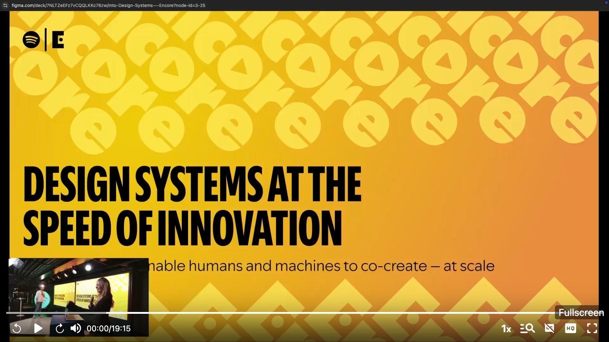

Encore's mission has always been to balance consistency with flexibility so that product teams can move fast. The system provides a shared set of tokens, components, and guidelines across every platform Spotify runs on -- iOS, Android, web, but also TVs, watches, car dashboards, and even fridges. If Spotify runs there, Encore supports it.

The numbers tell a compelling story. Encore's shared styles have been used over **220,000 times**, representing more than 50% year-over-year growth. Components are referenced in **86,000 places** and still climbing. Developer satisfaction sits at **93%**, one of the highest scores among all of Spotify's so-called **golden technologies** -- the standardized, recommended tools that every team building at Spotify is guided to use from the start.

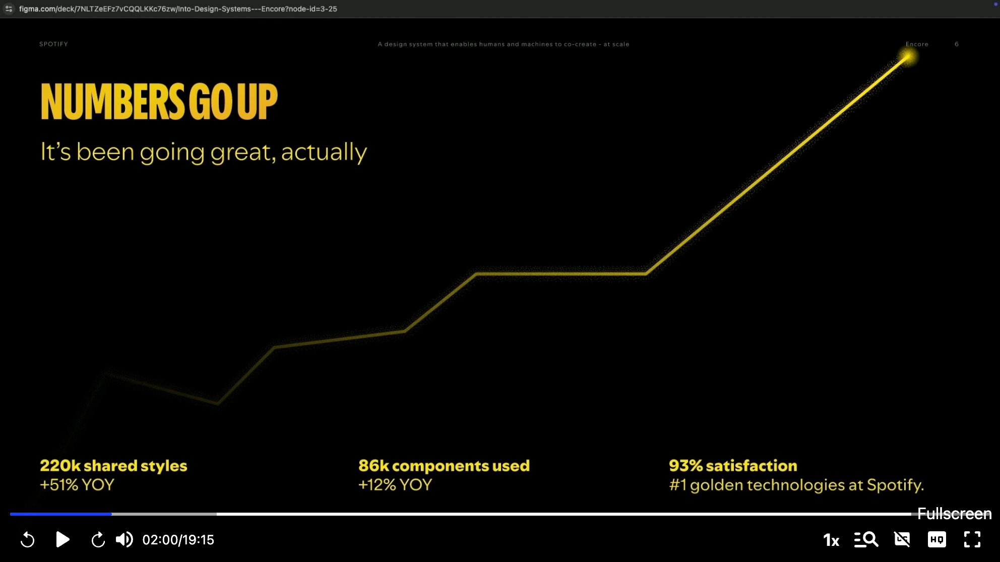

---

## The AI Challenge: What Happens When You're Bypassed?

Up until now, Encore has thrived in a world where humans come to the design system for help. The established flow is clear: engineers and designers work in their tools, consult the documentation site or ask questions in Slack, and get pointed toward the correct components and patterns. Encore owns and controls that entire communication path.

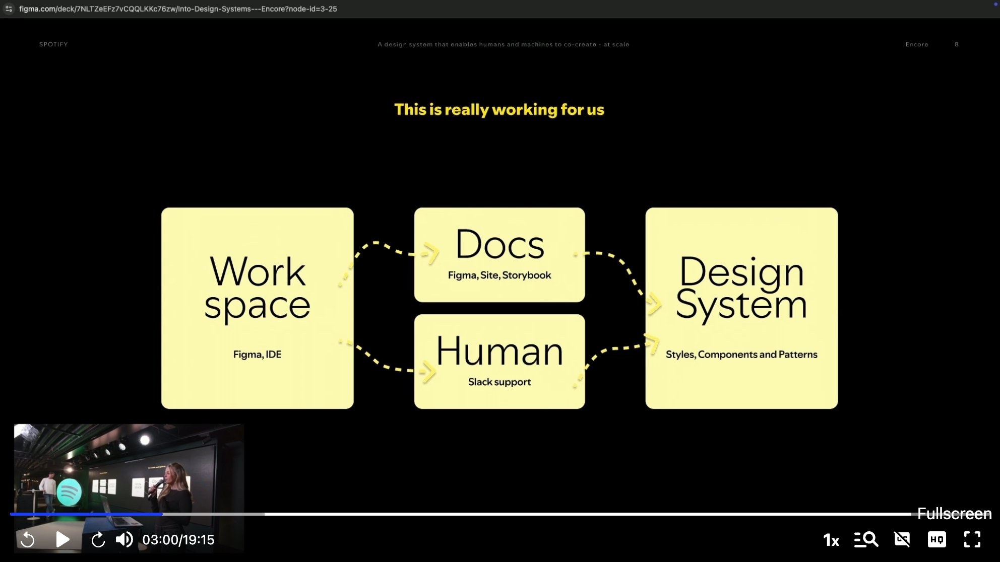

But AI is not new to Spotify. Features like Discover Weekly and Daylist have long been powered by machine learning. Two years ago, the Encore team even tried building a GPT to handle support questions in Slack. Victoria shows a screenshot of the results -- the bot confidently responding "Sorry, I don't know" -- and the audience laughs. The early experiments produced mixed results at best.

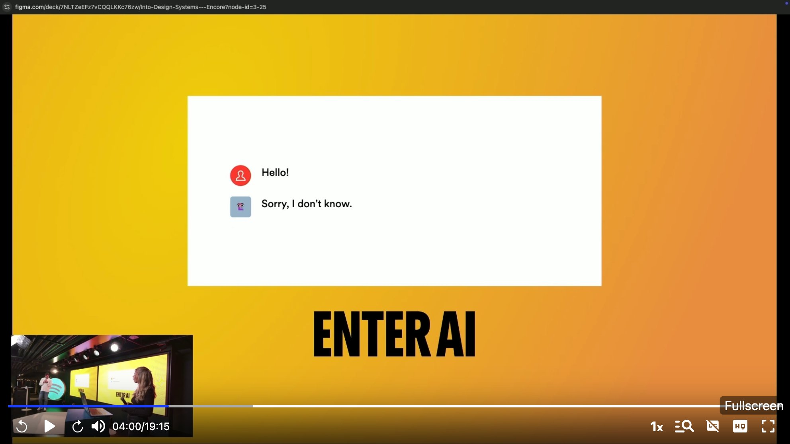

What has changed is that AI is no longer confined to ML engineers. Everyone at Spotify -- designers, engineers, product managers, even marketers -- is now using AI agents to produce prototypes and sometimes production-ready code. Djordjevic frames the central question bluntly, echoing a provocation from fellow speaker Jacob Stajberski: what happens when AI becomes the go-to teammate instead of your human colleagues? For Encore specifically, what happens to the design system when developers stop consulting the documentation and start asking Cursor instead?

The risk is concrete. If AI agents are not aware of Encore's standards, they will generate code that drifts away from the system. Users end up on a different path -- one the design system team neither controls nor can correct. Encore does not just lose adoption; it loses relevance.

---

## The Response: Two Working Tracks

Victoria summarizes the stakes. Encore powers Spotify at massive scale, supporting thousands of devices and dozens of teams. It drives speed, accessibility, and consistency across products. But if the team does not adapt, the system will be bypassed and forgotten.

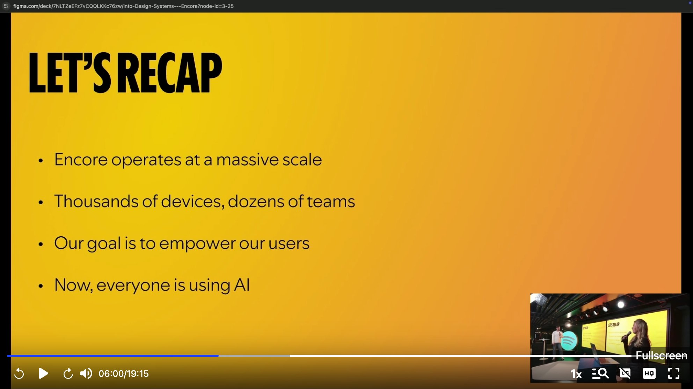

Their response is organized into two parallel working tracks. The first asks: how do we **embed Encore into AI**, so that when agents write code or answer questions, the output is grounded in Encore's standards? The second asks: how do we **rethink the component architecture** so it works better for both humans and machines?

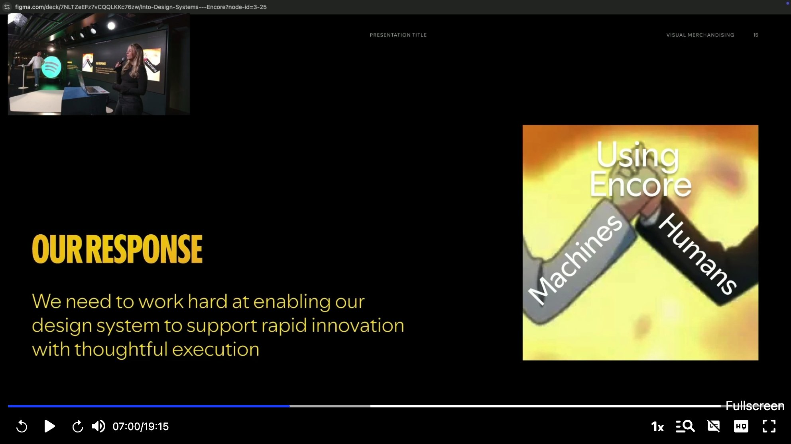

---

## Track 1: Building the Encore MCP

Victoria takes the lead on the first track. Since developers and designers are increasingly turning to AI agents like Cursor for code solutions, it is crucial that the design system becomes part of that workflow rather than an afterthought. The team's answer is building their own **Encore MCP** -- a service built on the **Model Context Protocol** standard that makes Encore's documentation, component APIs, and design tokens available to any connected AI agent.

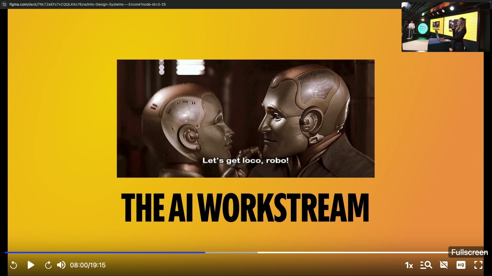

The architecture is straightforward. The Encore MCP sits between the LLM and Encore's component and token data. When a user prompts an agent -- say, "build a checkout flow" -- the model reaches through the MCP to access Encore's guidelines and generates output that follows the system's standards.

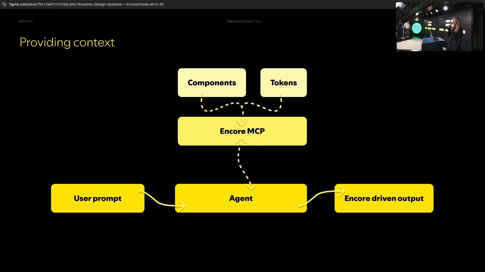

But shipping an MCP and hoping for the best is not enough. The team has built a dedicated **testing framework** to evaluate how different large language models respond to a given set of prompts. The evaluation pipeline sends the same prompt -- such as "build a checkout flow" -- to multiple models (Gemini 2.5 Pro, Gemini 2.0 Flash, Claude Sonnet 4, Claude 3.7 Sonnet) and then assesses the output against Encore's own components. It checks for lint errors, measures similarity scores, and compares the generated code against the canonical implementation.

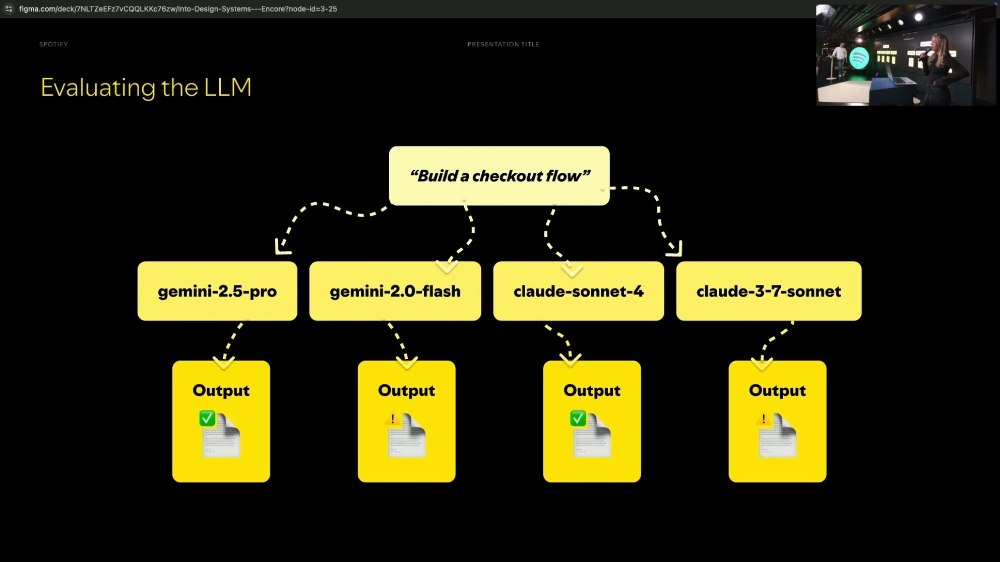

Victoria emphasizes that code correctness is only half the picture. Spotify operates through rapid prototyping, which means the visual output matters just as much as the underlying code. The team has therefore also built a **visual testing tool** that renders the AI-generated UIs and evaluates their visual fidelity against Encore's standards. On top of that, they compare different **MCP tool configurations** against each other -- for instance, Encore MCP alone versus Encore MCP combined with other tools, versus a Figma MCP -- to determine which setup delivers the most value to users.

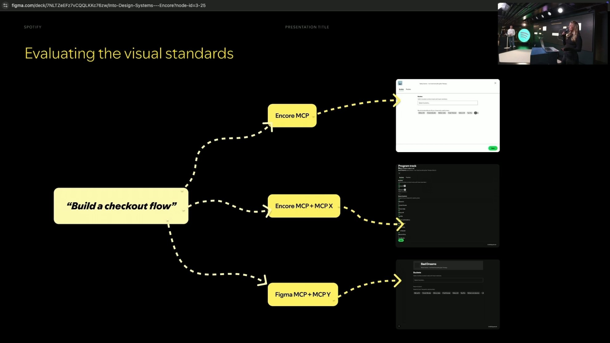

---

## Track 2: The Layered Architecture

Djordjevic takes over for the second track. He argues that making AI understand Encore's documentation is only one part of the challenge. The other part is that the component system itself is not as flexible as it could be -- a limitation that affects human users and AI agents alike.

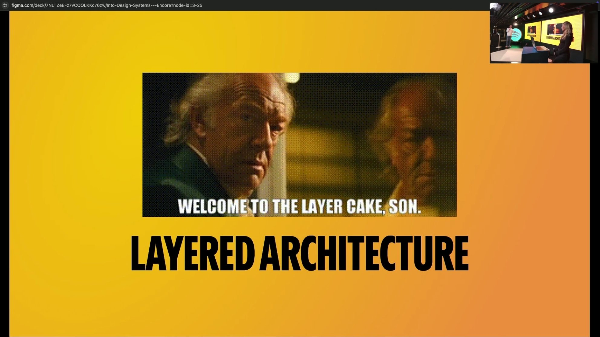

He starts by showing how Encore's current component system works, a structure most design system practitioners will recognize. Components are **bundles of behavior and styles**, all rooted in a shared foundation of tokens for color, spacing, layout, borders, and typography. This is a proven model. It creates easily reusable components -- anyone can pick up a button and use it anywhere -- and the design system team retains full control over border radius, font size, and API structure.

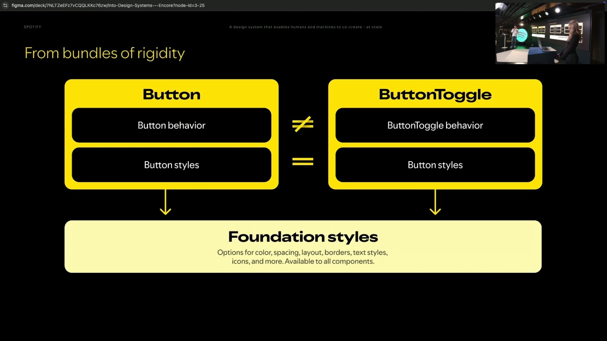

The problem is rigidity. For any minor variation -- say, adding toggle behavior to a button -- a user has three options: wait for the Encore team to prioritize and build it, build it themselves and submit a PR for approval, or hack around it. Given Spotify's rapid pace of innovation, the hack almost always wins. That is bad for the design system because people move outside it, and bad for users because they end up building on unstable ground.

The solution is what the team calls the **layered architecture**. Instead of monolithic component bundles, every component is separated into three distinct layers: a **foundation layer** (tokens and shared styles), a **component style layer** (the visual identity of a specific component), and a **component behavior layer** (interaction logic, state management, keyboard handling). Users can consume a full component as before, or they can reach for just the style layer and wire up their own behavior, or take the standard component and swap in a different behavior module.

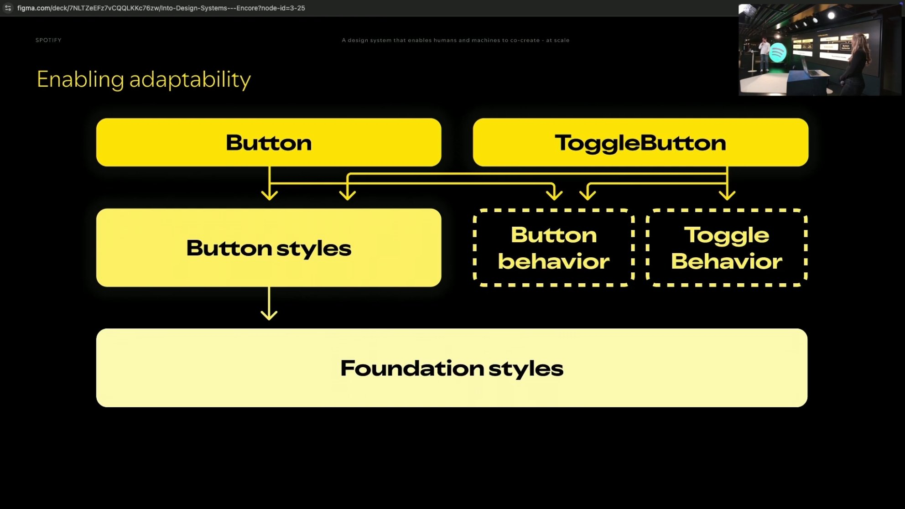

A crucial enabler is that the behavior layer is built on top of **headless component systems** like React ARIA and Base UI. These libraries provide keyboard interactions, accessibility handling, toggle states, and other interaction primitives out of the box. This lets the Encore team offload interaction plumbing to well-maintained open-source projects while focusing on what they truly care about: making everything look, feel, and act the way Spotify should.

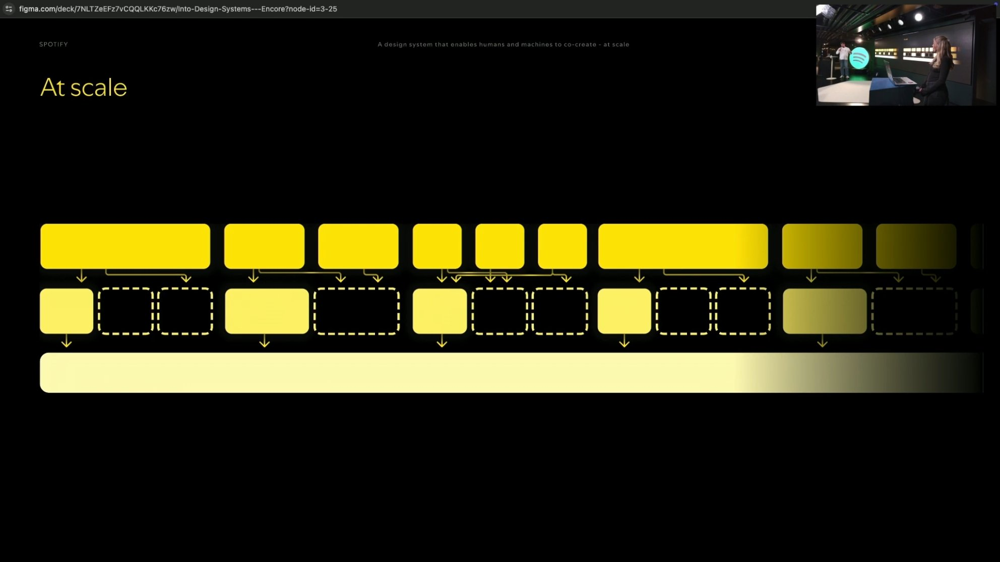

The benefits cascade in multiple directions. For human users, the layered model lets them work at the speed of innovation -- they no longer need to wait for the design system team to build every variant. For AI agents, it means **smaller context bubbles**: the model can understand foundation tokens independently, understand a component's style independently, and already has headless systems like React ARIA in its training data. The architecture removes hurdles for machines without sacrificing anything for humans. And for the Encore team itself, building on React ARIA and Base UI allows them to grow and extend component coverage more rapidly, to focus on the Spotify-specific layer of visual identity, and to create a clearer contribution model where contributors know exactly which layer they are adding to.

---

## The Vision: Encore Everywhere

Djordjevic pulls the talk toward its closing with a reflection on what these two tracks mean for Encore's future. AI is not going away. In some form, anyone building at Spotify is going to use it. That means the design system's user base has suddenly expanded beyond designers and engineers to include product managers, marketers, and anyone with an idea and access to an AI agent.

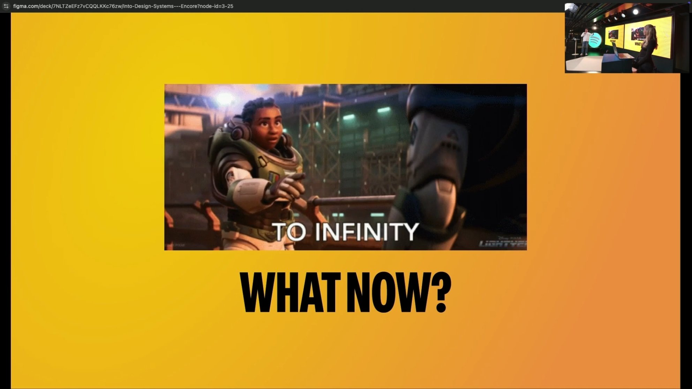

This realization led the team to a broader ambition: Encore cannot just be another system of systems that people visit. It needs to be **embedded wherever its users already are**. That means a Slack AI helper that can answer support questions so the team spends less time on FAQ duty -- hopefully better than the first GPT attempt. It means a prototyping tool that lets anyone go from zero to one as fast as possible. It means a Figma agent where not just designers but engineers, product managers, or anyone else can build something with Encore components. The goal is to embed the design system into every part of the user's workflow, regardless of which tool they happen to be working in.

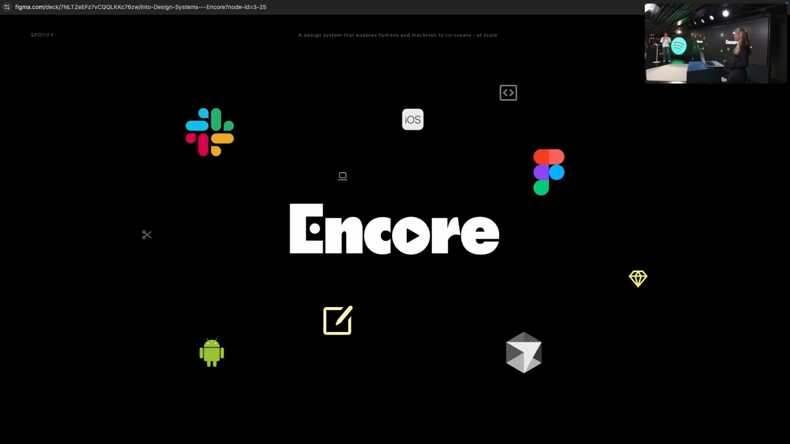

Victoria and Djordjevic close with their thesis statement for the future of Encore: a design system that enables humans and machines to co-create production-ready UI, faster than ever, at scale.

---

## Key Insights & Takeaways

**The bypass threat is real — and measurable.** Spotify's 93% satisfaction score means nothing if developers stop consulting the design system entirely. The moment AI agents become the first stop for code questions, any design system without an MCP or similar integration becomes invisible. If your team tracks adoption metrics, start tracking how many queries go to AI tools vs. your docs — that delta is your urgency signal.

**Test AI output the way you test components.** Spotify doesn't just ship an MCP and hope. They built a multi-model evaluation pipeline that tests the same prompt across Claude, Gemini, and others, scoring lint errors, similarity, and visual fidelity. This is a replicable pattern: define 20-30 canonical prompts ("build a checkout flow", "create a settings page"), run them against your MCP, and track quality over time. Treat it like a CI suite for your AI integration.

**Headless + style layers = AI-friendly architecture.** The layered architecture isn't just about flexibility for humans — it fundamentally changes how AI consumes your system. A monolithic Button component forces the model to understand everything at once. Separating foundation / style / behavior means the AI can reason about each layer independently, and headless libraries like React ARIA are already in training data. If you're planning a component refactor, this decomposition pattern pays double dividends.

**Your new users don't read docs.** The most provocative insight: Spotify's design system user base expanded overnight to include PMs, marketers, and "anyone with an idea." These people will never read component documentation. They will prompt an AI. If your system isn't embedded in the tools they already use (Slack, Figma, Cursor), it doesn't exist for them.

**Start with the MCP, not the architecture.** Both tracks matter, but the MCP is the quick win. You can ship a basic MCP that serves your existing component docs in days. The layered architecture is a multi-quarter effort. Don't let the perfect component model delay your AI integration — your users are already prompting without you.
