# Prototyping for the Unknown

**Speaker**: Nate Baldwin -- Sr Staff Experience Designer, Adobe's Spectrum Design System (enterprise design systems, 10+ years)
**Conference**: Into Design Systems AI Conference 2026 | 40 min

---

## Complex Systems Are Uncharted Terrain

Nate Baldwin opens with a metaphor that frames the entire talk. **Complex systems are like uncharted terrain** -- from a distance, the landscape looks deceptively simple. Subtle shifts, clear paths, predictable flows. Reaching a destination seems as easy as walking over a gentle hill.

But as you move closer, the perception breaks down. That hill is actually a mountain. Hidden valleys and dead ends appear where you expected a straight path. Teams do what teams always do under pressure: they **pick a route and start building**, telling themselves they can change course later. They pour concrete over the first stretch -- APIs harden, processes set, complexity multiplies. The further they go, the fewer places they can turn. What felt like progress becomes a pattern they cannot escape, a **path of no return** that will never bring them to their final destination.

The problem, he argues, is not a lack of effort but **a lack of sight**. When teams are under pressure, they validate the first reasonable idea and move on. But **validation only works when you already understand the problem**. With complex systems, what you need first is discovery. If you start designing and coding before you understand the landscape, you lock yourself into choices that will not stretch when the system grows -- choices that disable progress over time and inevitably lead to costly failures that erode consumer trust.

---

## The Breaking Point at Adobe Spectrum

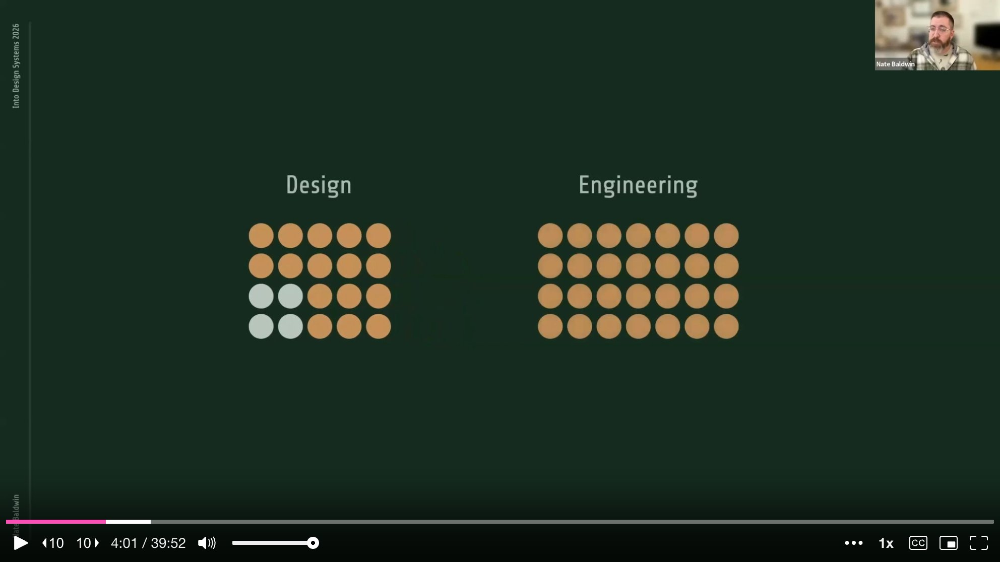

Baldwin has worked on enterprise-level design systems for over a decade, tackling challenges like **theming frameworks**, **token systems**, and defining algorithms for **adaptive spacing and color**. Over the past three to four years, his team at Adobe grew rapidly from four designers to over twenty, with engineering support spanning **web, iOS, Android, and internal tooling**. This rapid growth put their **design token system** to the test -- and eventually it hit a breaking point.

They had **thousands of design tokens**, most of which were component-specific. This made contribution, usage, and management incredibly difficult. The token system was managed by just two people -- one designer and one engineer -- and under this growth, resourcing became a major bottleneck. The simple workflow they started with could not scale. Token names were codified by hand-typing a name in a Figma file and handing it off to the token team and platform engineers as specs. New platforms could not extend or customize the token systems, so they built their own with separate pipelines. Primitive tokens were copy-pasted into entirely separate libraries, and unification devolved into conversations and handshakes just to stay in sync.

On top of all this, the foundational design team was refining the system with **sophisticated algorithmic design** and addressing complex system-level issues like **multi-dimensionality**. They were not just finding the right token names -- they were changing the entire shape of the system, and the architecture could not support it. None of these were isolated issues. A solution to any one could break or block another.

---

## Knowing the Direction but Not the Destination

The team knew the general direction they wanted to go, but the final destination and the path to get there remained murky and unknown. They knew they needed **standards-enforced token authoring** with a clear taxonomy system, so tokens could be classified and names generated based on rules, ensuring consistency and simplifying the process for designers. They knew they needed to **decentralize and democratize token authorship**, so teams could extend foundational tokens into platform-specific sets they owned themselves. They knew they needed to address where and how **algorithmic design** fit into the token ecosystem. And they needed to address **multi-dimensionality** in a practical and agnostic way -- the combinatoric conditions that instruct a token's value can be extraordinarily complex.

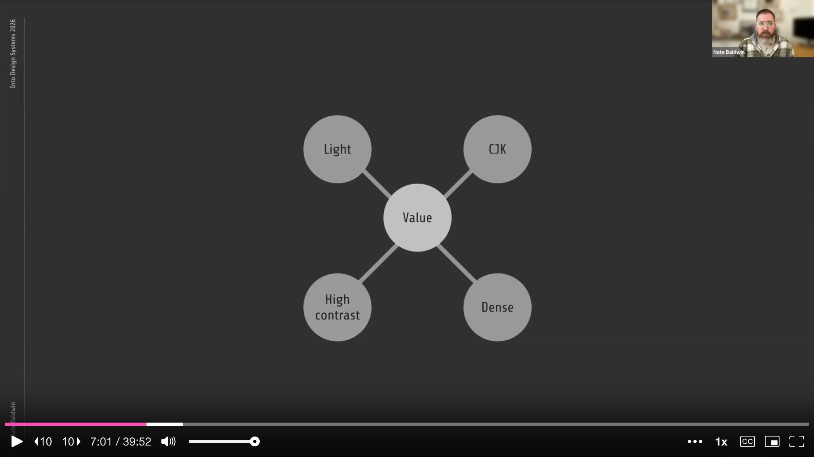

These were not just features or questions of which pre-existing tool to adopt. This was about the need to **innovate**. And in order to do that, above all else, they needed a **unified vision** -- a way to see the full terrain at ground level and from above, to understand how they might build a truly systematic, scalable, and flexible system of systems. That meant seeing the potential solution in action, which would have been a monumental and costly effort. And that is where Baldwin turned to **AI prototyping**.

---

## Starting Small with AI-Assisted Exploration

He started wondering whether **exploratory prototyping with AI** could help find an appropriate path. After all, they did not have the time or budget to experiment on a system of this magnitude by hand. It would have been too risky to build the actual solution while still trying to figure it out -- and that approach was exactly what had created the situation they were now trying to escape.

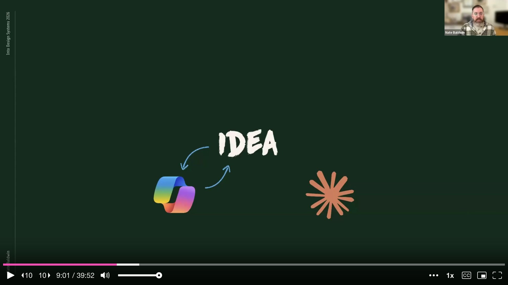

So Baldwin started small. He focused first on the **data model** for their token system, believing this was the core issue that needed solving before anything else. The data needed to be modeled in a way that aligned with their needs. Existing models -- both their own and others in the industry -- were fragile, inflexible, and incomplete. If the token data model was not stable, flexible, and complete, it would not be useful for any of their needs.

He began by chatting with **Copilot and Claude** to get objective, critical feedback on his ideas. He fed them sample data written by hand in the structures he believed would work, and both tools helped formalize it into an official **JSON schema**. Each tool provided unique feedback on strengths and weaknesses, so he iterated between the two. This **cross-referential evaluation** helped refine the schema further. He even had them compare his schema with the **W3C spec**, other design system schemas, and **Figma's variable schema**. The key difference was that he was trying to define a schema focused on an **authoring environment**, not an exchange format -- one that was flexible, scalable, and stable for token authoring and management.

---

## From Schema to Web Application -- and the Frustration of SLOP

After gaining confidence in the schema, Baldwin had **Cursor** help set up a project with schema validation and basic testing, so he could verify whether the schema supported all the nuanced use cases he had in mind. Then things got interesting. He had Cursor scaffold the schema validation project into a **web application**, using basic prompts but including as much detail as he could think of.

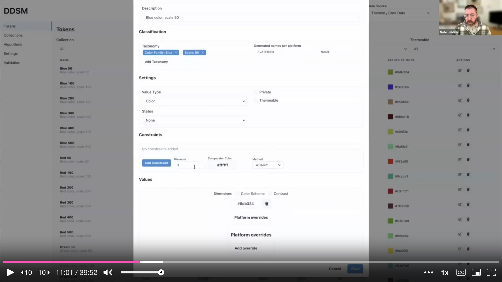

He is candid about his experience: he had very little **vibe coding** experience at this point and was not sure how to approach it. Initially the interface was just a way to see if data was being handled properly and to ask questions about what the experience might need to look like. For the early iterations, he set up **project rules** clearly specifying that the JSON schema was the ultimate source of truth, telling Cursor that any features or functionality must align with and use the schema.

At the beginning, things looked good. The UI was ugly but it worked and it supported the schema. Then **progress stalled**. Claude would start creating things he did not ask for. It would try to fix things that already worked. Sometimes he would get caught in a logical loop and have to close the chat and revert all changes. Sometimes things looked like they were working, only for testing to reveal the opposite -- like spacing values of "NaN pixels." He was constantly frustrated that nothing actually worked as expected. His prompts were vague for the features he was unsure about, and as a result, the output was basically **SLOP**.

---

## The Hidden Value of Failure

But as frustrated as he was, Baldwin started to realize something else was happening. Even though the outputs were not working, he was **learning more about the problem and the potential solutions** through the conversations themselves. He was not walking away with usable code, but he was walking away with **requirements he did not know he had**. He was also learning what he should be telling the AI agent and how he should be saying it.

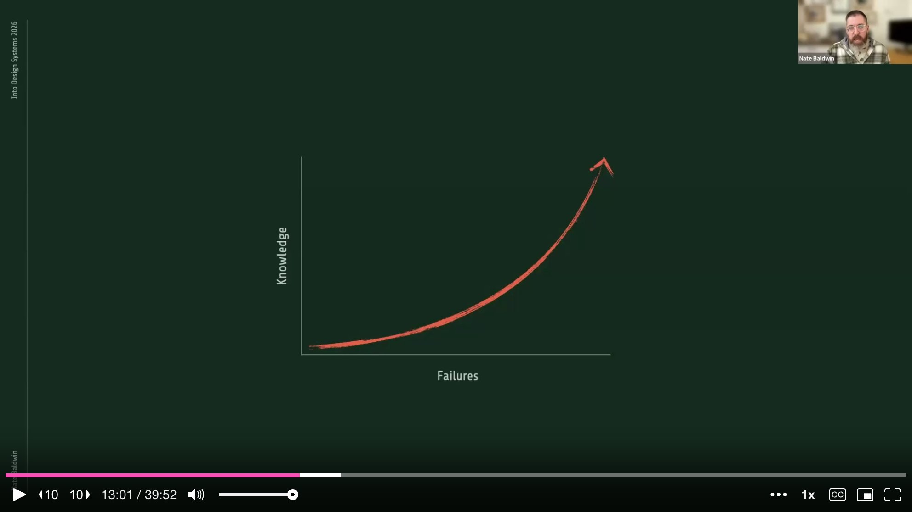

The problem was that he could not predict when the output would be SLOP and when it would be valuable. Sometimes the SLOP would break existing features or override enhancements he had just finished making. He wanted to learn through exploration without completely destroying his project in the process. So he leaned into **version control best practices**, because he did not need clean output yet. What he needed was to learn -- about edge cases, constraints, and some signal about how difficult a feature might actually be.

---

## Method One: Branch and Burn

This led Baldwin to the first method he shares: **branching and burning**. Branching is a common development practice that segments chunks of work. **Branch and burn** takes this further: you create new branches for intentionally sloppy AI explorations with the sole purpose of gaining insight, then throw away the code.

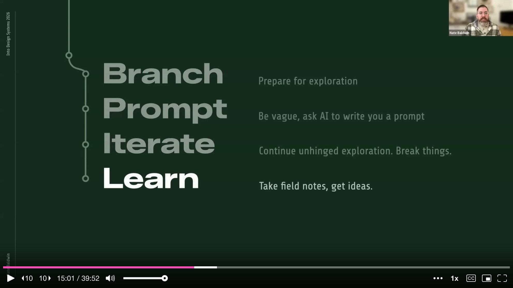

The process works like this. As soon as you encounter a feature you are unfamiliar with, create a **new branch purely for exploration**. Start with a vague prompt -- or if you want a better starting point, ask a chat agent like Claude to help write the prompt, being sure to mention it is for an AI agent to generate code. Then use this prompt in Cursor and let it run. Continue iterating and experimenting as much as needed. Sometimes things will work out and you can potentially keep the code, but other times not so much.

That is fine, because this is about **information gathering**, not code quality. What matters is the quality of insight you gain and the improved understanding of the solution space. **AI cannot solve problems without human intervention**, so you can use AI's unconstrained ideas as a way to learn more about the challenges and potential solutions. This makes you a more informed human who can later instruct the AI agent with a proper set of instructions.

After you have learned what you need, **delete the branch and keep only the insights**. This process helps form hypotheses and uncover technical considerations for a more appropriate solution. Baldwin calls this learning to **embrace productive failure** -- protecting your prototype from AI-induced chaos through disposable exploration.

---

## Method Two: Four-Step Structured Prompting

After gathering insights through branching and burning, Baldwin still had to implement the actual features. Through his explorations, he would realize requirements like "we need to support **fallback hierarchy across dimensions**" or "we should not derive IDs from names." But these features needed to conform with the rest of the project, reusing existing functions, components, and standards. Each feature needed to feel like **production quality**.

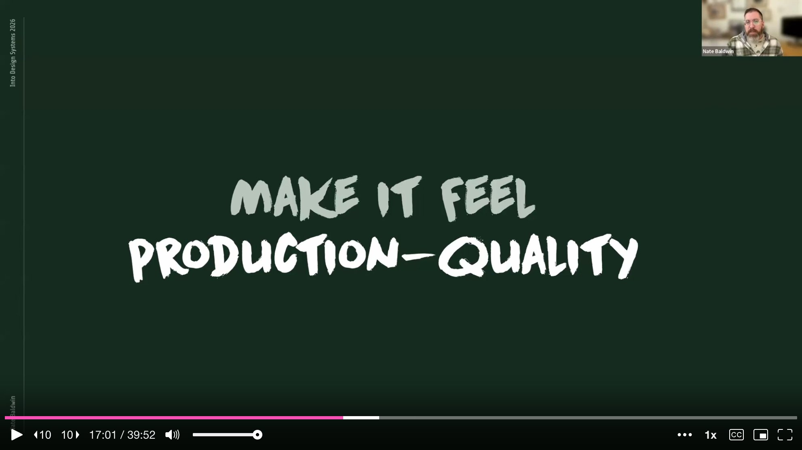

He argues this is the tricky part. A prototype can be wrong, but **it should not be fragile**. The purpose of experimental prototyping is to find out what can be made, so technical feasibility is critical. Knowing the wrong solution well is still valuable. But if the prototype is fragile, your team will not learn -- they will dismiss. A bug-ridden prototype loses trust and fails at identifying the functional viability of any solution.

This led to his **four-step method for structured prompting**: context priming, detailed planning, plan refinement, and implementation.

**Step one is context priming.** Have the agent perform a thorough, investigative analysis of the project, focusing on existing features, components, and integration points for the feature you are introducing. Then ask the agent to perform three to five separate analyses from different perspectives. Have it perform a **meta-analysis** of those results, followed by another holistic evaluation of the project's features. This layered analysis gives the agent a fuller picture of the system -- otherwise it will miss details and make assumptions. Finally, tell the agent to use this as context for future prompts, and be explicit: **no code changes yet**.

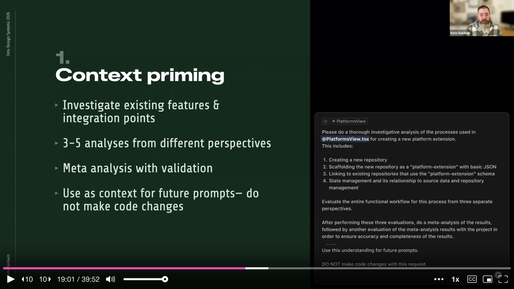

**Step two is detailed planning.** State your intent for the agent to create a comprehensive implementation plan. Include details from your experimentation and tell the agent to reference its earlier analyses. If you have hunches about details but are not confident, include them anyway -- phrasing them as "I believe this has to do with X" or "I think this could be solved by Y." The **Claude Sonnet models**, he notes, are particularly good at identifying this language as optional direction rather than explicit instruction. Then tell the agent to **format the plan as prompts for an AI agent to follow**. It turns out AI is exceptionally good at writing prompts for other AI. Be explicit about reusing existing functions and components -- without this instruction, there is almost a guarantee the agent will recreate them, even if project rules say otherwise. Incorporate tests in each phase. End with the same guardrail: no code changes yet.

**Step three is plan refinement.** The agent will include clarifying questions. Answer them as clearly as possible. If you are unsure what it is asking, ask it to clarify. This interaction is a **critical element of collaborative coding with AI**. Once questions are answered, the agent refines the plan. Read through it thoroughly -- make sure it does not include unnecessary tasks and does not omit important details. Sometimes asking questions about the plan causes the agent to identify issues on its own. Once satisfied, tell the agent to **save the plan to your project** for future reference.

**Step four is implementation** -- and paradoxically, this is the easy part. Since the plan is already formatted as prompts, tell the agent to implement it phase by phase. Reinforce the guardrails: preserve existing design and functionality, adhere to project rules. The result is a **well-informed execution** that, while not guaranteed to be bug-free, will be at a much higher quality than any previous exploration.

---

## What They Built in Eight Weeks

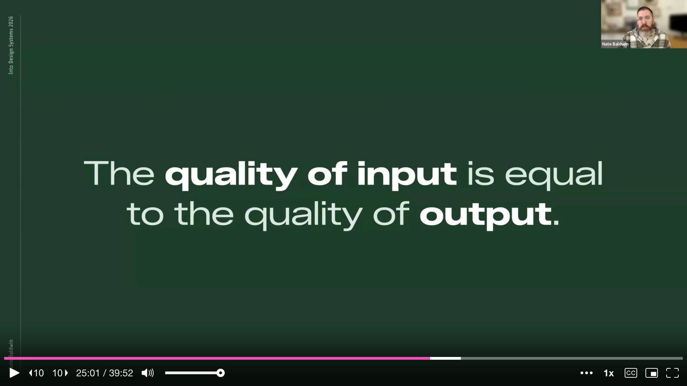

By combining **branch and burn** with **four-step structured prompting**, Baldwin and his team built far more than a web application. They built an **ecosystem for data management** -- a platform for extensibility and governance of design tokens unlike anything available at the time. The ecosystem used schemas that created contracts and defined rules and relationships between data sources, leveraging existing APIs between **GitHub and Figma** to create an end-to-end pipeline for design. The prototype confirmed something simple but easy to underestimate: **the quality of what you put in directly determines the quality of what comes out**.

They accomplished this in roughly **eight weeks** -- eight weeks of learning fast enough to make real decisions. Among the breakthroughs was a dramatically improved **token naming experience**. Instead of hand-typing names, they created an actual **taxonomy system** -- a bank of terms that can be independently managed and documented for clarity. Terms can be scoped to different token types for additional clarity and UX improvements. Tokens are classified by selecting taxonomy terms, not by typing a name, ensuring no typos or inconsistencies. The system uses a **system-wide taxonomy ordering rule** combined with platform-specific formatting to generate token string names for platforms that rely on them. Data in the authoring system would never break when taxonomy terms are changed at the root, and would never break when a referenced token is renamed or reclassified.

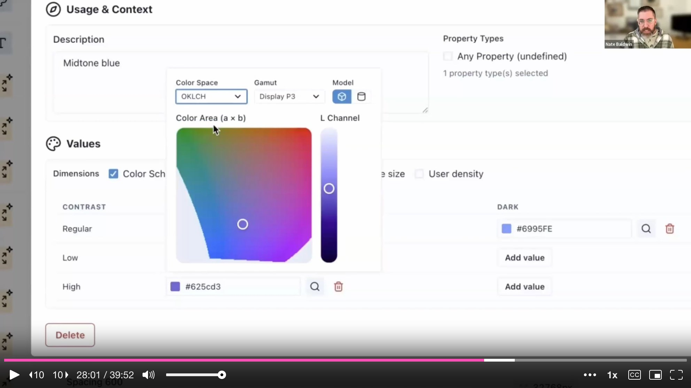

They also built an **extensibility framework** leveraging GitHub. Schemas supported contracts between data sources, so within the UI, teams could use GitHub's API to link existing repositories or create entirely new ones. New repos would be scaffolded with basic JSON templates for either a platform or a theme. Every platform and theme -- whether defined in the central repository or external ones -- had its data merged in the UI. Platform and theme owners could see a filtered view of just their data, while the core team had a **holistic view of the entire token ecosystem**, including customization and analytics. This demonstrated that they could leverage GitHub for the most complicated elements: **multi-source, multi-tenancy, and permissions**. They could reinforce best practices by protecting main branches and requiring commit messages, which created pull requests to the edited source repository.

---

## Multi-Dimensionality and the Figma Pipeline

The prototype also tackled **multi-dimensional token values** through a simple interface. The system has default fallbacks for each dimension, so values only need to be defined for the combinations that actually need them -- a solution that avoids the pitfalls of **combinatoric explosion**. They built a **wide-gamut color picker** that defaults to the platform data's predefined color space or format. By properly modeling data with flexibility and scalability in mind, they built a solution that sidesteps the pitfalls that stop other tooling authors in their tracks.

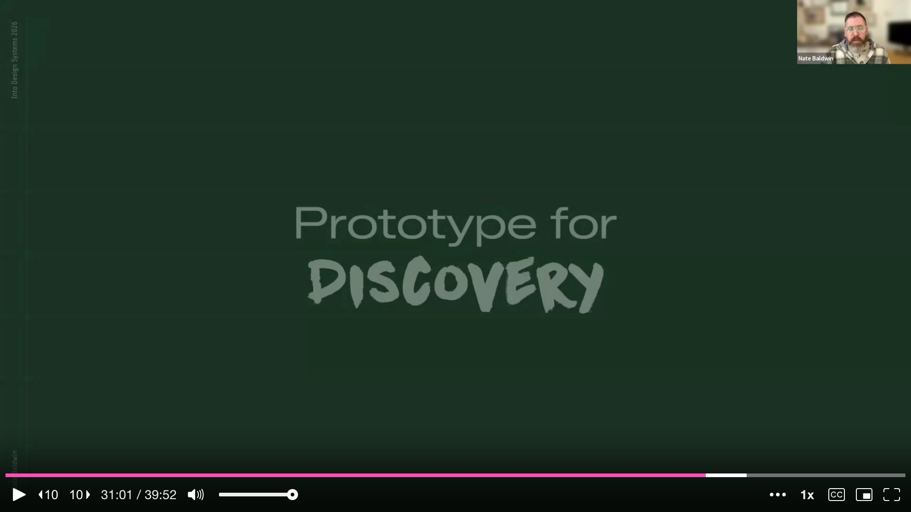

They also demonstrated how **well-structured data can be transformed and mapped cleanly to their complex Figma variables architecture**. In their system, every collection in Figma represents a dimension containing only the modes that dimension supports. When a token's value changes by only color scheme -- light and dark -- it has a single variable in the color scheme collection. But when a token's value changes across multiple dimensions, intermediary variables exist in each collection. They use a custom method of **daisy-chaining aliases** through each collection in a specific sequence, allowing them to publish customer-facing variables aligned with token names while simultaneously exposing user-friendly controls for changing multiple combinatoric modes in Figma.

As **Dan Halik** has said, you should build your own tools to solve your own problems. This transformation from design tokens to Figma variables was a self-imposed problem -- only they could solve it for themselves. But demonstrating solutions to these team-specific problems helped ground the prototype in the reality of their needs.

---

## The Prototype as a Team Compass

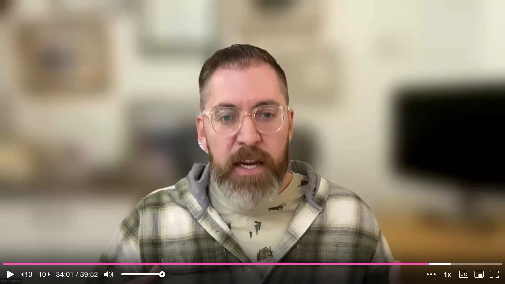

Ultimately, exploratory prototyping helped Baldwin take his team on a journey. After building and sharing the prototype, they had a **clear understanding of the problems** they needed to solve, the intricacies of each issue, how they were related, and the hidden challenges they would face. They had the clarity needed to start planning a path forward. They knew the path they needed to pave before pouring an ounce of concrete.

Baldwin emphasizes that the prototype is not meant to become the production system. When asked about long-term maintenance, he is candid: the best approach is to use prototypes as **exploration, demonstration, and communication** alone. His team used the prototype as a reference -- like competitive analysis -- as they move on to build the actual thing. There are assumptions in any prototype that might not work for the final result. But the prototype got them in the right direction and showed ideas for solving problems in ways that made sense. Now his team, with deeper knowledge of the specifics, can make their own informed decisions.

---

## Three Lessons for Prototyping the Unknown

Baldwin closes with the three overarching lessons from this journey. First, **embrace productive failure**. Failures are learning opportunities, and the more you fail, the more you learn. The branch and burn method gives you a safe way to let AI fail freely without destroying your project.

Second, **create informed prompts**. It is this informed structure -- the layered analysis, the detailed planning, the explicit guardrails -- that unlocks AI's potential and dramatically improves the quality of output. Standard and explicit instructions create guardrails that help ensure AI agents deliver quality results.

Third, **prototyping helps you take your team on a journey** through storytelling and demonstrations that give everyone a better understanding of what to do next. A working prototype creates shared context and aligned conversations in a way that no slide deck or spec document ever could.

By following these methods, **vibe coding becomes a tool for discovery** -- finding hidden obstacles and preparing for flexibility, growth, and stability. The next time you face a complex systems challenge, Baldwin urges, do not start implementing blindly. Use AI as a mapping tool to explore, to reveal hidden obstacles and constraints, and to provide your team with an option for the best path forward.

---

## Key Insights & Takeaways

**Use "branch and burn" to learn from AI without risking your project.** When you hit a feature you do not understand, create a throwaway Git branch, let the AI explore freely with vague prompts, and then delete the branch -- keeping only the insights. This separates information-gathering from code-quality concerns and gives you requirements you did not know you had. Make this a routine practice whenever your team faces unfamiliar territory in a complex system.

**Failed AI output is still valuable if you treat it as discovery.** Baldwin's early iterations were full of SLOP -- broken UIs, NaN pixel values, features he never asked for. But those failures taught him hidden requirements, edge cases, and constraints. Stop evaluating AI output solely on whether the code works. Evaluate it on whether the conversation revealed something new about the problem space.

**Structure your prompts in four phases: context priming, detailed planning, plan refinement, then implementation.** Baldwin's four-step method -- layered analysis from multiple perspectives, explicit plan formatting as AI-agent prompts, a refinement round with clarifying questions, and phased implementation -- dramatically improved output quality. The key detail: tell the agent to format the plan as prompts for another AI agent. AI is exceptionally good at writing prompts for other AI.

**Prototypes are communication tools, not production candidates.** The token ecosystem Baldwin built in eight weeks was never intended to become the production system. Its purpose was to create shared understanding across the team -- showing what the problems were, how they related, and what solutions might look like. Use prototypes as reference material (like competitive analysis) when building the real thing, not as a codebase to extend.

**AI prototyping lets you explore systems-of-systems problems that were previously too expensive to investigate.** Baldwin's team needed to solve token naming, multi-dimensionality, extensibility, and Figma variable mapping simultaneously -- problems too intertwined to tackle one at a time and too risky to build without validation. Eight weeks of AI-assisted prototyping produced an ecosystem prototype that would have taken months of traditional engineering. If your design system has interconnected scaling problems, exploratory AI prototyping is the fastest way to see the full terrain.
