# WhatsApp Web: Reclaiming UI Excellence through Vibe Coding

**Speaker**: Sebastian Rousseau -- Senior Product Designer, Design Systems, WhatsApp
**Conference**: Into Design Systems AI Conference 2026 | 45 min

---

## A Product Is What Your Code Says It Is

Sebastian Rousseau opens with a reframe borrowed from branding. The famous Marty Neumeier line -- "a brand is not what you say it is, it's what they say it is" -- shifted branding from intention to perception. He argues the same rethinking is now happening in product design.

**A design system is not what your guidelines say it is -- it's what your code says it is.** Or put more broadly: a product is not what your Figma file says it is, it's what your code says it is. One shows intent, the other shows what users actually experience. On paper this sounds obvious, but in practice designers have never had the tools to truly work on code at the level they can now. AI coding, he argues, is the shift that closes that gap.

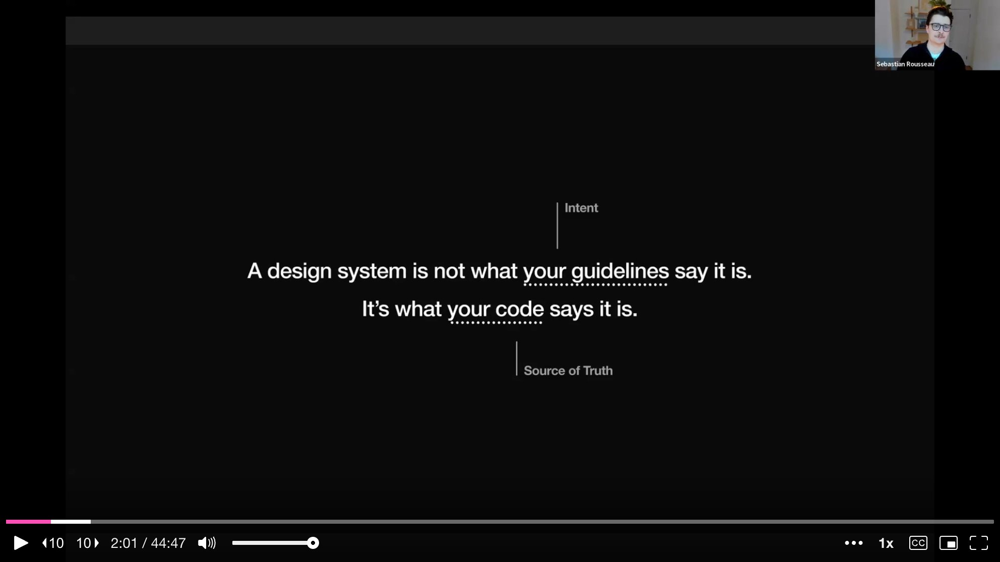

---

## The Challenge: 400 Million Users, One Engineer, One Designer

When Sebastian joined **WhatsApp** in 2024, his job was to bring the design system to web. The **WhatsApp Design System (WDS)** already existed for Android and iOS, serving roughly 3 billion users. But web -- used by **400 million monthly active users** -- was running a ten-year-old experience that was visually disconnected from the mobile apps.

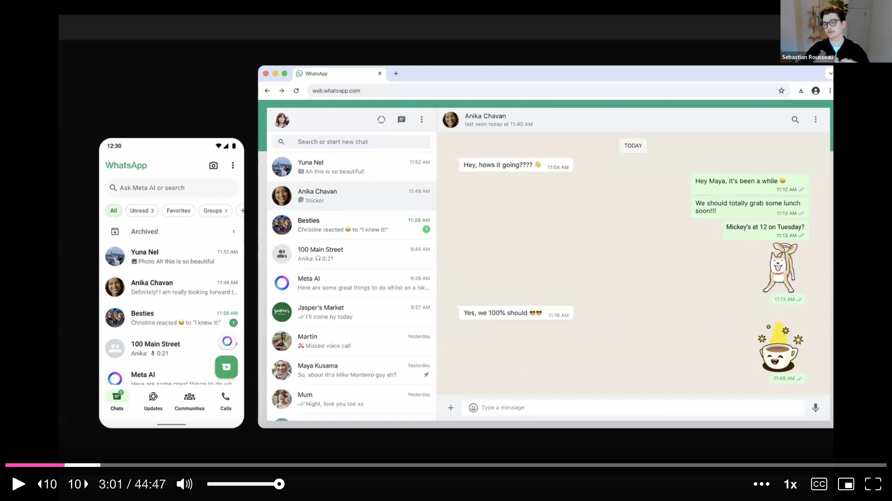

The team had concepts for a redesign based on the Android app, plus a hard deadline for **European Accessibility Act (EAA)** compliance within six months. The constraint that forced everything: the web design system team consisted of **one engineer and Sebastian himself** as the designer. He had to fundamentally rethink how to lead a design system with that kind of staffing.

A year later, WhatsApp Web shipped **13 components**, achieving **64% parity with mobile**, and brought icons, illustrations, and tokens from mobile to web while ensuring **WCAG 2.2 compliance**. The team added missing paradigms like proper focus management and keyboard navigation that the mobile-centric design system had never needed.

---

## Three Pillars: Consolidate, Collaborate, Enable AI

Sebastian's approach rested on three strategies, revealed progressively during the talk.

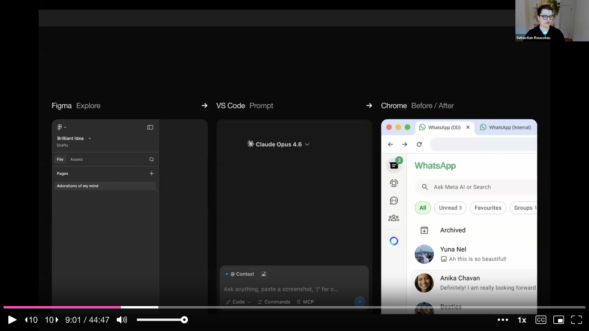

The first was to **consolidate** toward a cross-platform design system. WhatsApp's design philosophy is deeply rooted in platform nativeness -- iOS should feel like iOS, Android like Android. But Sebastian removed as much duplication as possible, consolidating assets so that one person could manage them. This alone saved an estimated **450 hours per year** of maintenance. More importantly for AI adoption, a cleaner codebase means **quality in, quality out** -- fewer conflicting sources of truth and outdated assets for AI agents to reproduce.

The second pillar was to **collaborate** cross-org. He established a contribution model where he created a backlog of design specs that engineers from other teams could pick up. This approach quadrupled their output: of the 13 shipped components, **10 came from cross-org contributions**. At this stage, engineers were using AI to speed themselves up, not the other way around.

The third was to **enable AI** by ensuring all assets and documentation were in **machine-readable formats** with proper **MCP connections**. This allowed the team to adopt AI tools from the start -- not just for engineers, but for product designers, content designers changing strings, and even PMs illustrating feature ideas more quickly.

---

## The Designer's Tech Stack

Sebastian walks through his daily workflow, which revolves around three tools connected in a pipeline.

**Figma** remains his sandbox for visual exploration -- trying color combinations, sketching layouts -- but he never goes as far as building a full prototype or complete screen anymore. He describes his Figma work as creating a **"visual prompt"**: just enough fidelity to articulate the direction.

**VS Code** with **Claude Code** is where the real work happens. He feeds his Figma draft as context alongside a text description of what he wants, sometimes dictated via Whisper for speed. From there, he iterates entirely in code.

**Chrome** with two tabs open -- the internal build and his working branch -- lets him instantly compare before and after states. An internal browser plugin he built ties this all together, which he demonstrates live later in the talk.

---

## Use Case 1: Auditing the Codebase Before Designing

The first and perhaps most surprising use case is not about creating anything -- it is about **understanding the existing product** before touching a design.

Previously, understanding the problem space meant reading documentation, searching Figma, asking engineers, and taking screenshots of the app to map what was intended versus what actually shipped. Now, Sebastian simply asks **Claude Code** questions like: "Find all edit icon instances and tell me where they get displayed," or "What is currently used in code for the profile photo component, what properties does it support, and where is it used in the app?"

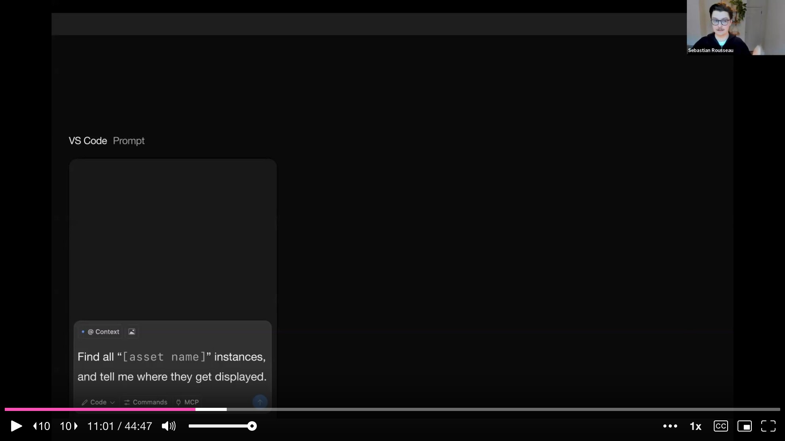

The output gives him the **file name** (surfacing legacy naming conventions that engineers use internally), the **properties** the component supports (ID, size, type, shape), and **where the component appears** in the app with step-by-step navigation instructions. He calls this a vital tool for answering increasingly abstract questions about the product before attempting to design for them, catching issues and concerns before they occur.

An unexpected benefit: working in the codebase breaks down the **translation barrier** between designers and engineers. When a feature was renamed years ago but the code was never updated, designers who only work in Figma never discover these discrepancies. AI-assisted auditing exposes them naturally.

---

## Use Case 2: Exploring Designs in Code, Not Figma

The second use case addresses a core limitation of design tools. Figma is excellent for freeform visual exploration, but it is **impossible to get a real feel** for sizes, proportions, and especially how **muscle memory changes** play out day to day.

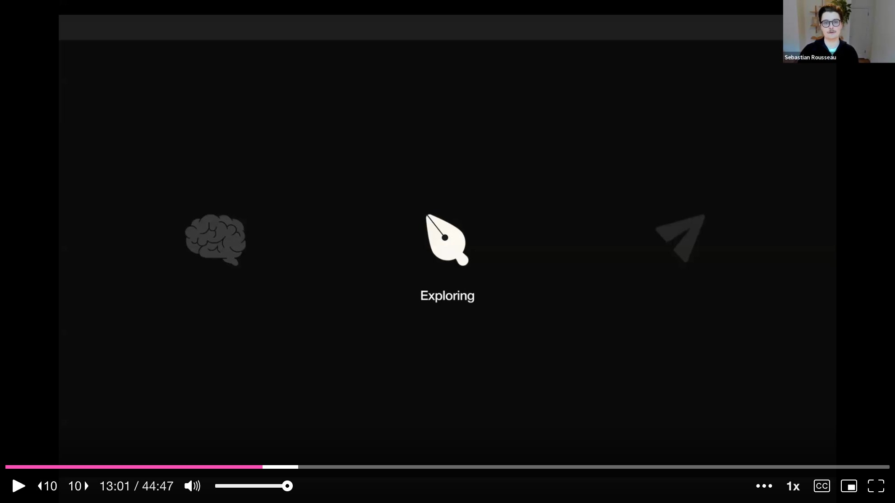

Sebastian gives a concrete example. His team was implementing the **WDS Menu component**, and he wanted to replace a dialog with a more lightweight sub-menu for notification muting options. In the old workflow, he would have prototyped this in Figma, then handed specs to an engineer. Instead, he prompted Claude Code directly.

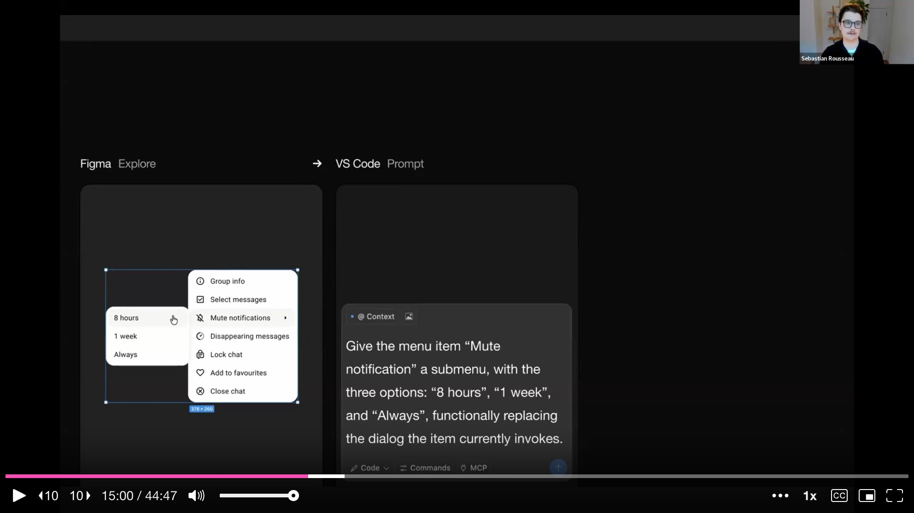

Within minutes he had a **fully functioning implementation** that he could stress-test against real scenarios: Does the toast appear when clicking an option? What happens when a status is already set? How does the unmute flow feel? He tested responsiveness, animation, and keyboard navigation -- interactions that are essentially impossible to evaluate in a static prototype.

Most importantly, he was able to **set this implementation as his default for several days** and simply live with it. This "sitting with the design" phase is where critical muscle-memory judgments happen: Does this button repositioning actually feel right after three days of use? He ended up shipping this change himself, with engineers serving as reviewers rather than implementers.

---

## Use Case 3: Shipping Code as a Designer

The third use case is the most provocative: **designers directly shipping code** to production. Sebastian frames the entry point carefully -- not features, but fixes.

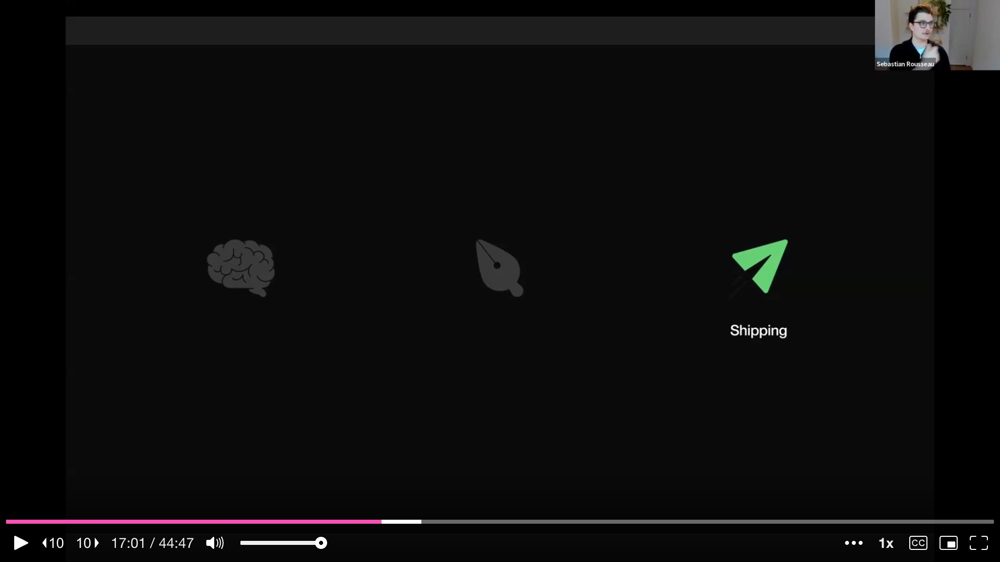

The easy starting points are **color token corrections**, **icon swaps**, and **component migrations**. These are the kind of small visual inconsistencies that are nearly impossible to justify as standalone engineering tasks. A slightly off color here, a wrong icon there -- each one is a paper cut. But accumulated across a product, they erode the perceived quality of the experience. Sebastian calls this **"death by a thousand cuts."**

He then transitions to a live demo of WhatsApp Web, revealing the internal tool that makes this practical at scale.

---

## Live Demo: The Visual Prompting Plugin

For the demo, Sebastian has his internal development build of WhatsApp Web open in Chrome alongside VS Code with Claude Code. But the key piece is a **custom browser plugin** his team built internally.

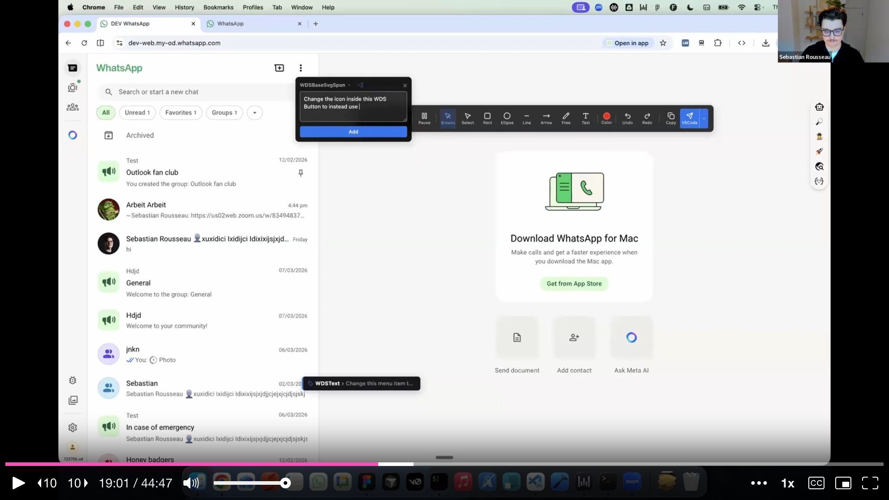

The plugin lets anyone **hover over any UI element** and fire a prompt with the full **React component context** automatically attached. He demonstrates two fixes: changing a menu item to use a destructive (red) style for the "Block" action, and swapping an icon on a button. Each action sends a prompt to VS Code with the React node context and his instructions, and Claude Code begins implementing the changes in the background.

While waiting for the AI to process, he shows a case study from the **WhatsApp Web status view**. The old experience had small, poorly spaced elements, inaccessible hover states, and outdated typography. Step by step, he migrated buttons to the design system, added tooltips, fixed spacing, created a slimmer progress bar, and updated the typography -- then submitted the changes for review.

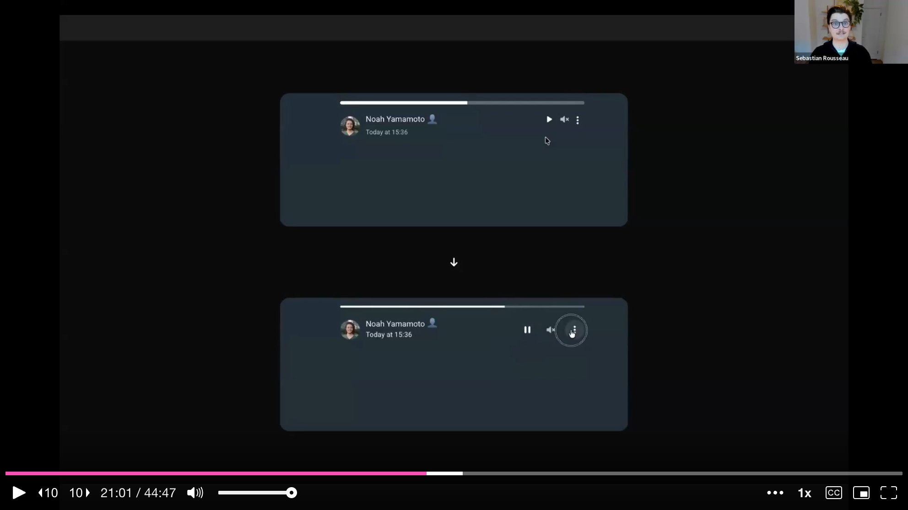

Over the preceding months, he shipped **over 100 of these seemingly small fixes** by himself. With the old process, each fix would have required a design spec, an engineer finding time, and the task competing with feature work in a backlog. Now, as more team members adopt the workflow, the **cumulative velocity of polish** is accelerating across the entire product.

---

## Things to Be Mindful Of

Sebastian is careful to balance the enthusiasm with pragmatism, offering three cautions illustrated with WhatsApp's own animated stickers.

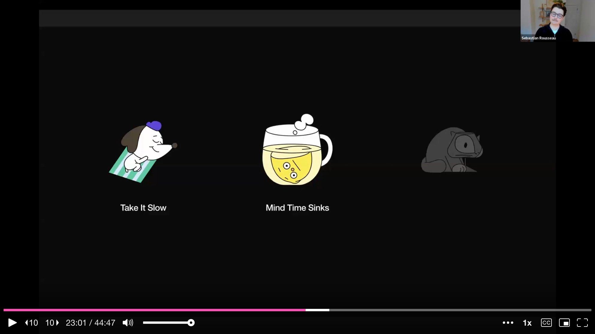

**Take it slow.** At enterprise scale, the startup mentality of "go wild" does not apply. He advises starting with color changes, then icons, then component migrations, then features. Stability for users matters more than speed, especially when onboarding a team to new workflows.

**Mind time sinks.** Non-engineers are not always aware of how something that looks simple to fix can cascade into unexpected bugs. Sebastian admits he abandoned significant amounts of code early on when he stretched too far. AI is not a magic bullet -- it is a powerful tool that still requires judgment about scope.

**Review everything.** Every code change goes through multiple layers: Sebastian pre-checks the output himself, automated linters flag issues like hard-coded values that should be tokens, and a **human engineer approves** every diff before it ships. He also insists on maintaining **design reviews** even when the designer is the one writing the code. The temptation to skip review when you can ship directly is real, but alignment matters.

He uses a memorable metaphor for the reading-versus-writing distinction: **you can understand a language you cannot yet speak.** Designers do not need to have written the code themselves, but they must be able to read and comprehend what the AI produced before submitting it for review.

---

## The Expanding Designer Role

Sebastian closes by reflecting on what this shift means for the design profession and team dynamics.

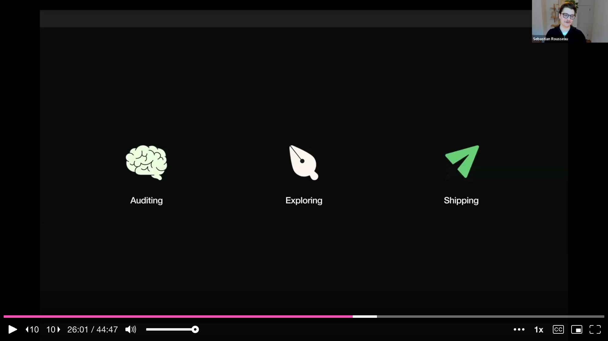

**The designer's role expands** to cover more parts of the process. Per feature, a designer may spend somewhat more time, because they are now involved in implementation. But the organization as a whole moves **much faster**, because engineers are no longer blocked waiting on specs and handoffs, and designers are no longer blocked waiting for implementation capacity.

The question of **where design decisions live** is shifting too. Design files go stale and are expensive to keep in sync. Sebastian's personal conviction: **code is becoming the source of truth.** If you make a design decision, add a comment in the code. The closer you treat code as the authoritative record of design choices, the better it serves every role on the team.

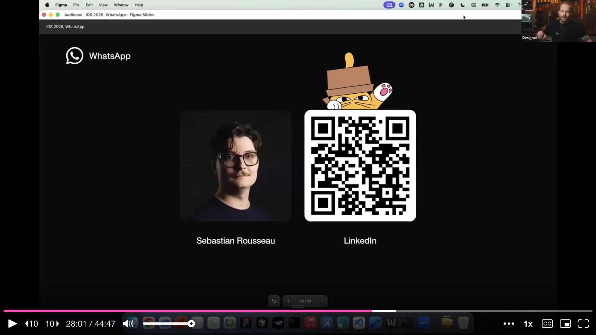

---

## Q&A Highlights

**On the internal plugin**: The visual prompting tool is an internal WhatsApp build and not publicly available. It works by letting anyone hover over a UI element in Chrome and auto-attaching the React component context to a prompt sent to Claude Code in VS Code.

**On connecting Figma to VS Code**: Sebastian runs Claude Code in the terminal with an **MCP connection to Figma**. He treats the AI like an intern -- he prompts, it executes, he reviews and corrects, and over time it builds up **markdown skill files** that improve its output. A "second brain" of accumulated context.

**On auditing as a design tool**: Beyond creating prototypes, AI-assisted codebase exploration is invaluable for understanding component properties, usage patterns, and ripple effects before designing. Claude Code generates **ASCII property trees** and maps of how a component behaves, which Sebastian reviews before moving to any visual work.

**On quality safeguards**: Multiple layers protect against AI-generated regressions -- automated linters checking for token usage, human engineer review of every diff, and continued design reviews. The design system itself acts as a guardrail: components and tokens make the **path of least resistance** the path of consistency.

**On whether designers should learn to code**: Sebastian is biased toward yes, having started as a web designer himself. But the bar is lower than it sounds -- you need to be able to **read the language, not speak it.** Get a rough understanding of what you are producing, and the tools will handle the rest.

---

## Key Insights & Takeaways

**Start shipping code by fixing paper cuts, not building features.** Sebastian shipped over 100 small fixes himself -- color token corrections, icon swaps, component migrations -- the kind of polish work that never survives a backlog prioritization meeting. These individually tiny changes compound into a dramatically better product experience. Identify the visual inconsistencies in your product that engineers will never prioritize, and start fixing them yourself with AI coding tools.

**Use AI to audit the codebase before designing.** Before touching a design, Sebastian asks Claude Code questions like "find all instances of this icon and tell me where they appear" or "what properties does this component support?" This surfaces legacy naming, undocumented states, and design-code discrepancies that Figma-only workflows would never reveal. Make codebase auditing a standard step in your design process -- it catches issues before they become handoff surprises.

**Consolidate assets to make AI effective -- quality in, quality out.** Sebastian saved an estimated 450 hours per year by consolidating WhatsApp's cross-platform design assets so one person could manage them. A cleaner, more unified codebase means fewer conflicting sources of truth for AI to reproduce. Before investing in AI tooling, invest in reducing duplication and removing outdated assets from your system.

**Treat Figma as a visual prompt, not a final deliverable.** Sebastian never builds full prototypes in Figma anymore. He creates just enough visual fidelity to articulate direction, then moves to code where he can stress-test responsiveness, animation, keyboard navigation, and muscle memory over days of actual use. If you are still producing high-fidelity Figma prototypes, consider whether that time would be better spent exploring in code.

**Layer multiple review gates even when designers ship code directly.** Every change Sebastian ships goes through self-review, automated linters checking for hard-coded values, and human engineer approval. He also maintains design reviews even when he is the one writing the code. The temptation to skip review when you can ship directly is real, but enterprise-scale products need stability over speed.
