# Product Primitives: The New Material of Design Systems

**Speaker**: Yesenia Perez-Cruz -- Design Systems Consultant, Expressive Design Systems (ex-Shopify Polaris lead, 5 years)
**Conference**: Into Design Systems AI Conference 2026 | 47 min

---

## The Problem: Design Systems Answer the Wrong Question

Yesenia opens with a provocation: today's design systems answer "what's the best component to display this data?" -- but never "what's the best experience for *this user* in *this moment*?"

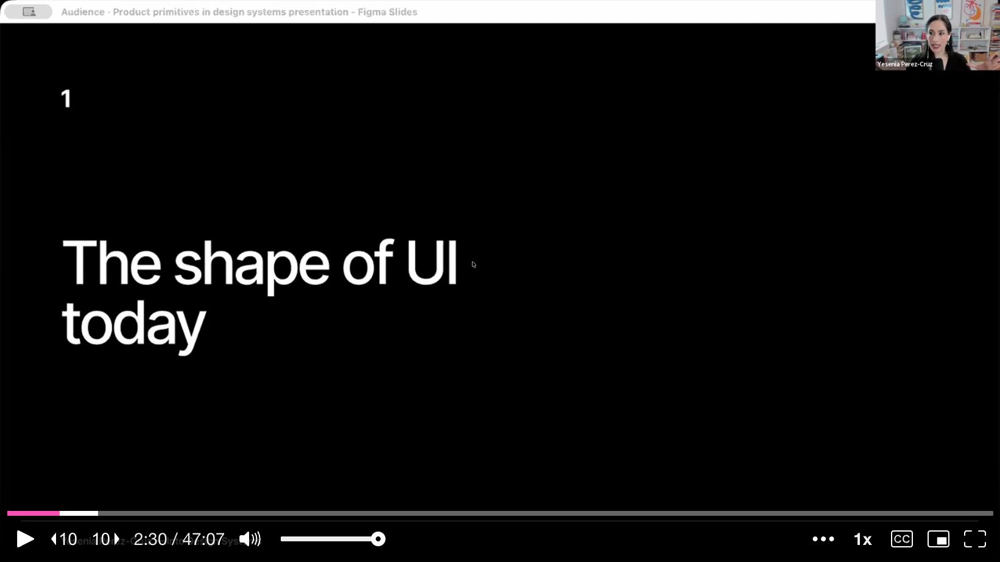

She uses Shopify's discount creation form as the example she knows best. Her team spent years iterating on whether the discount type should be a choice list, a select dropdown, or a modal. But that was never the question users cared about.

The real problem: **user needs vary enormously, but everyone gets the same middle-ground form.** A day-one user needs guidance and exploration. A day-100 user needs shortcuts and power tools. A shop owner creates one discount; an enterprise user bulk-extends 30 at once. Without the ability to adapt, the form is simultaneously too complex for beginners and too inefficient for power users.

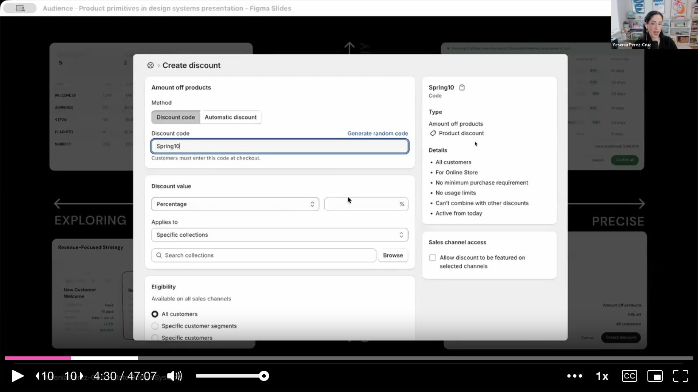

---

## Intent-Based UI: What If the Interface Adapted to the Task?

AI makes intent-based adaptation possible. Yesenia shows examples already live in Claude: ask for a recipe and you get a recipe card with food photography and a timer. Ask to prioritize tasks and you get a sortable ranking list. Ask to draft an email and you get an embedded compose box. The UI shape adapts to the *intent*, not a fixed template.

She then applies this to Shopify. Today, creating a 10% discount for a product requires navigating away, filling out a long form, finding the product in a list, and navigating back. What if you could just say "create a 10% off discount code for this product" and get a compact confirmation view right where you are?

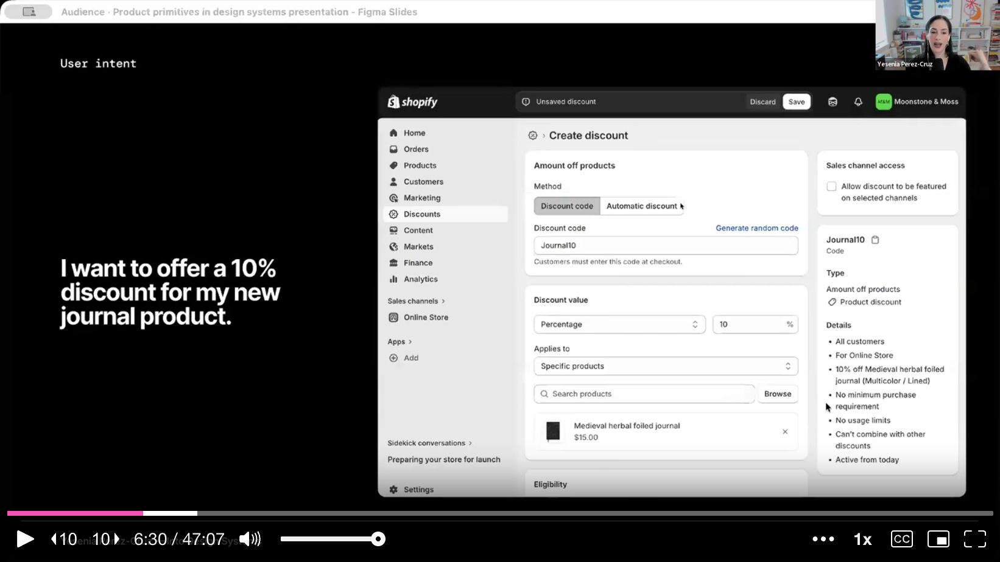

Or extending 30 discount expiration dates: today that's 30 individual click-through flows. With intent-based UI, you'd say "extend all June discounts to July 1st" and get a bulk editing surface with a highlighted column showing the changed dates.

---

## The Shift: From Directive UI to Intent-Driven UI

This is the core thesis slide. Today's design systems give you building blocks for **directive UI** -- users navigate to pages, fill out fields, click buttons. Design systems provide the components to build those pages.

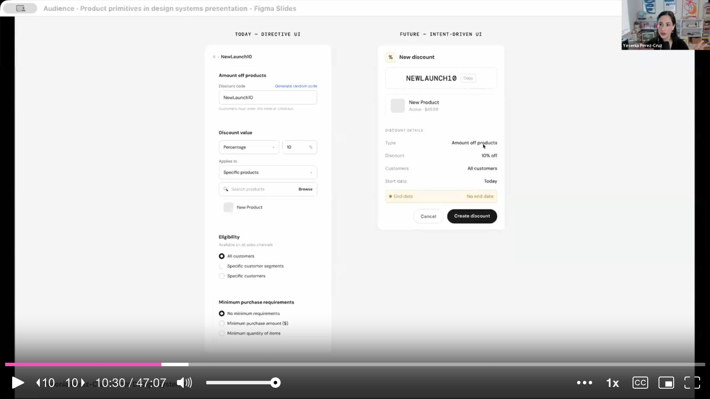

Future design systems need to provide building blocks for **intent-driven UI**, where a user states a goal and AI composes the right surface. The critical difference: intent-driven UI is centered around **the objects users manipulate** (discounts, orders, tasks), not the components they click. The output becomes the defining material, not the input.

---

## The "Before" Demo: AI Without Product Context

To prove the point, Yesenia gives Claude Code access to the Polaris component library (via MCP) and asks it to build two UIs:

1. "Build a UI for confirming changes to a discount code"
2. "Build a UI for extending expiration dates on 30 discount codes"

**Result: both come out as the same resource-detail page layout.** The association between "discount" and "page with cards" is so strong that Claude can't break out of it. It just lists components it used: warning banner, index table, checkbox, sidebar, modal, status badges.

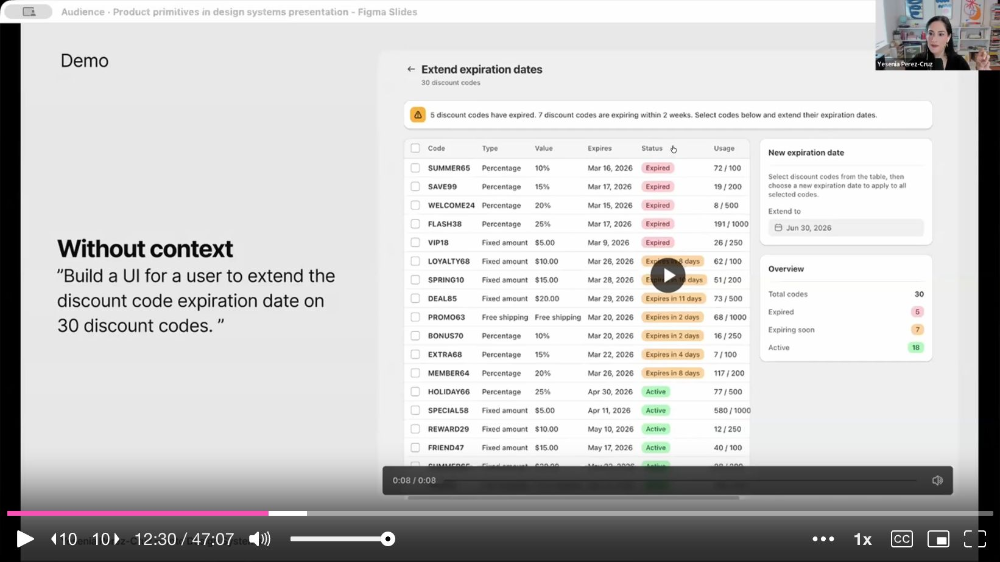

---

## The Framework: Product Primitives + Surfaces + Intent Signals

The missing context has three layers:

### 1. Product Primitives

The objects users create and manipulate: discounts, orders, tasks, events, customers, products, collections. Each needs a defined anatomy, lifecycle states, relationships, and rules for how it appears across surfaces.

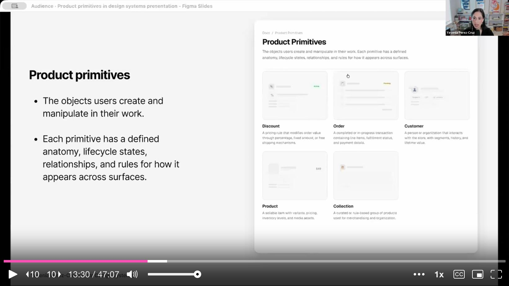

Yesenia zooms into a discount primitive's documentation:

- **Anatomy**: Visual signifier (icon + color), title, discount type, value, code, conditions, schedule, usage limits, performance metrics
- **States & Transitions**: Draft, Scheduled, Active, Paused, Expired -- with rules for which transitions are allowed
- **Relationships**: Which objects are upstream/downstream? A discount targets products; a task relates to a project and an owner

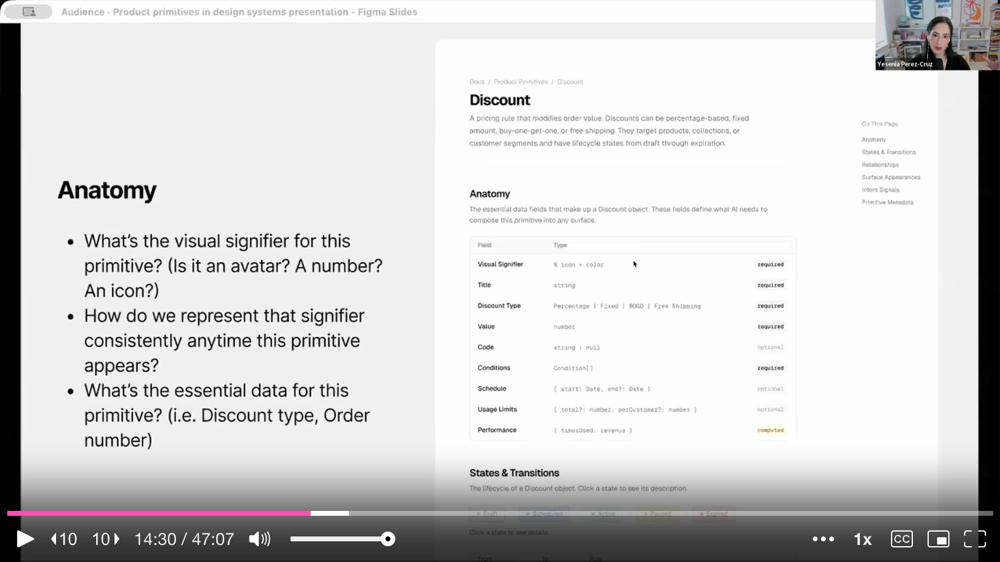

She highlights that relationships are an untapped opportunity. Today's flat navigation puts collections and products at the same hierarchy level, even though collections sit "above" products. Intent-driven UI could visualize these relationships much more clearly.

### 2. Surfaces

Context-aware containers that adapt how a primitive appears based on intent. Not static page layouts. Examples:

- **Canvas**: Fully editable, high-fidelity view for composing/exploring
- **Confirmation**: Review changes before committing, with diff views and impact statements
- **Batch**: Spreadsheet-style bulk editing
- **Summary**: Compact read-only overview

Each surface has documented anatomy, rules, and compatible primitives.

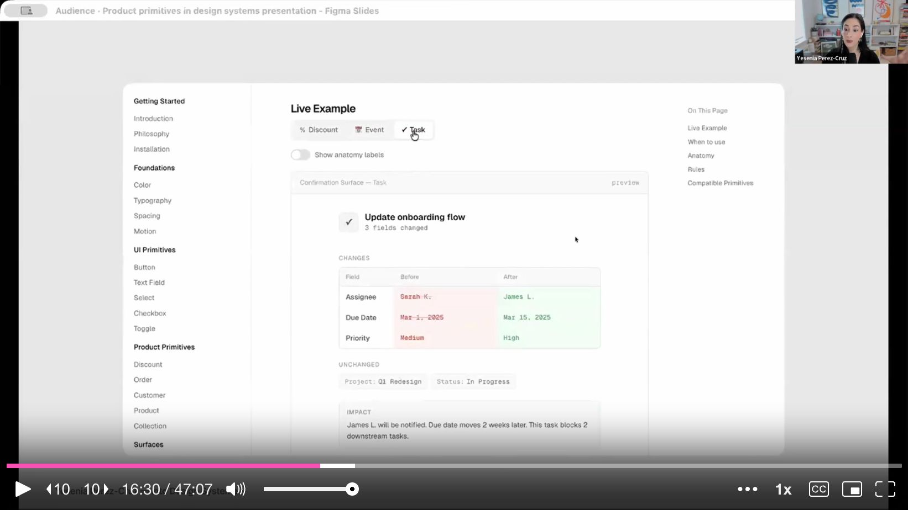

### 3. Intent Signals

How AI decides which surface to compose. Signals include:

- **Account age + first visit** to discounts = learning intent = canvas surface for guided exploration
- **"Extend all June discounts to July"** = bulk editing intent = batch surface
- **Number of existing discounts** = experience level signal
- **Scope of the request** = scale signal

---

## The "After" Demo: AI With Product Context

Same Polaris component library, same prompts -- but now with markdown context pages describing primitives, surfaces, and intent signals.

**Prompt 1: "Build a UI for confirming changes to a discount code"**

With context, Claude builds a compact modal (not a full page!) with the discount signifier, a diff view showing changed values in red/green, unchanged fields, and an impact summary. It correctly identified that a confirmation task doesn't need a full page of empty real estate.

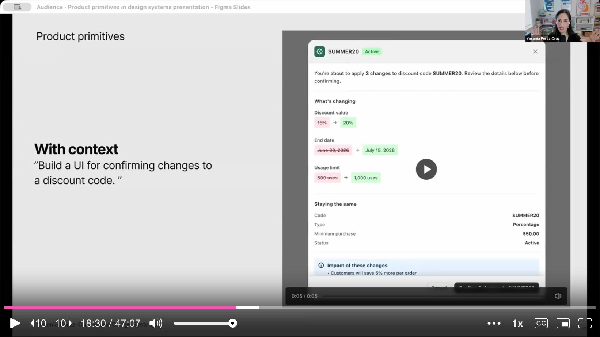

**Prompt 2: "Build a UI for extending expiration dates on 30 discount codes"**

Claude builds a proper batch editing surface with a highlighted column for the new end dates. But the most interesting part: **it invented a bulk date picker component that didn't exist anywhere** in the documentation. It had enough context about the task to compose a new, appropriate control -- a "select all + apply date" interaction pattern.

The key difference in Claude's own reasoning: without context, it just listed components. With context, it detected a "batch intent," chose a "batch surface," and made strategic decisions about density, layout, and interaction patterns.

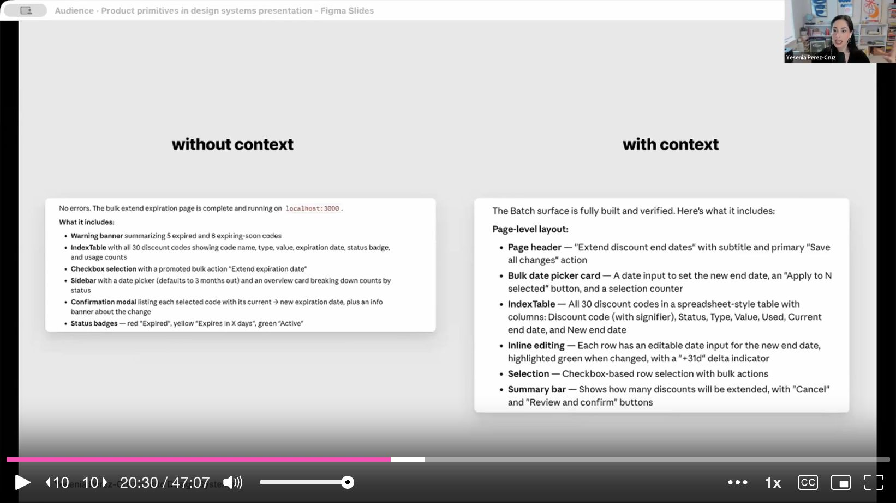

---

## New Roles: Grammar vs. Vocabulary

This redefines who does what in a design system organization:

**Design system team defines the Grammar:**
- Surface types (canvas, confirmation, batch, discovery)
- Surface anatomy (what a confirmation surface needs: signifier, diff view, impact summary)
- Required metadata schema for all primitives
- Interaction patterns (diff views, inline editing, bulk selection)
- Composition rules (how primitives nest, relate, and co-appear)

**Domain teams supply the Vocabulary:**
- Their specific product primitives (discount types, order fields, customer segments)
- Business rules and state machines
- Relationship mappings (discount targets product, task belongs to project)

When you combine grammar and vocabulary, **AI can compose sentences**: a confirmation surface + a discount primitive = a diff view showing changed values. A batch surface + an order primitive = a spreadsheet of orders with bulk fulfillment actions.

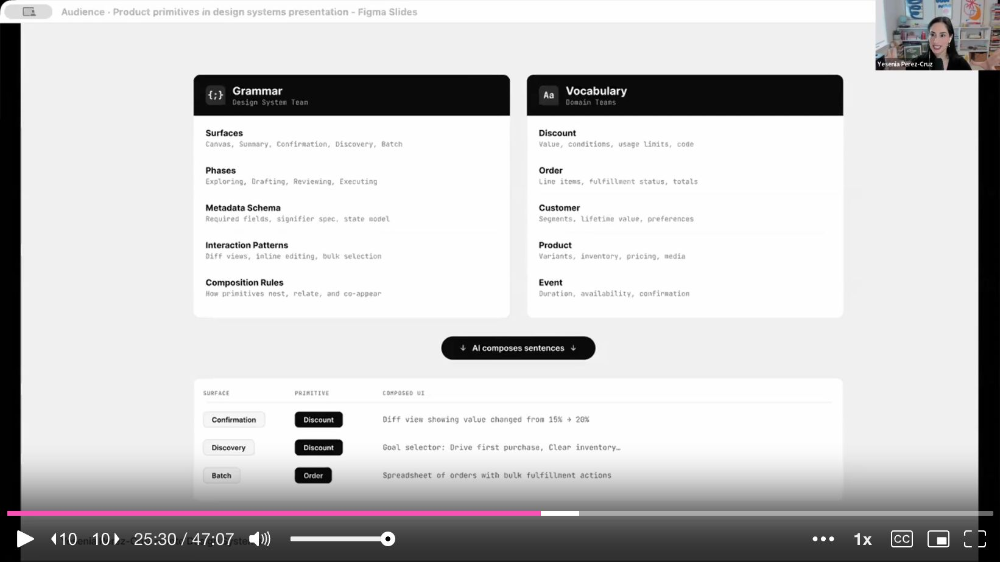

---

## How to Start

Yesenia closes with practical starting points:

1. **Identify your core product primitives** -- every product has a handful that define what it is
2. **Map their relationships** -- what's upstream, what's downstream, what nests inside what
3. **Establish visual signifiers** -- you can do this today without any AI wiring. Just think about how to make your core objects visually recognizable at a glance
4. **Find where layouts fail users** -- where does flat navigation hide important relationships? Where are power-user layouts too complex for new users?
5. **Start small** -- she's currently working with a client starting with just 3 primitives and a surface system that imagines the existing pages don't change, but you can pull up a "portable" version of an object from another context

The big reframe: **design systems have always taught you how to pick components, but never how to tailor an experience for a specific user need.** Product primitives are the missing layer that makes that possible.

---

## Q&A Highlights

**On tooling**: Yesenia started by prototyping ideal solutions, then worked backwards to break them into primitives and surfaces. She built documentation pages first (her "safe place"), then asked Claude to convert them to markdown that AI could consume.

**On starting without AI**: The mindset shift is the precursor, not the technology. You can start thinking about "portable objects" and "surfaces" today. Shopify started de-emphasizing back buttons in favor of object signifiers before any AI was involved.

**On accessibility**: The biggest risk is changing things on users who've built muscle memory. Intent-driven UI should be a *response* to user actions, not unsolicited rearrangement. If default surfaces are tailored to permissions and experience level, they should be stable -- not shifting on every visit.

**On scaling across teams**: Use templates with required metadata schemas so domain teams can fill in their primitives consistently. Start with a narrow scope (3 primitives, a few surfaces) and iterate based on how well AI handles the context.
