# The Path to an AI-Enabled Design System: Our Approach and Lessons Learned

**Speakers**: Andressa Lombardo -- Design Systems Lead, Miro & Eddie Machado -- Systems Designer, Miro
**Conference**: Into Design Systems AI Conference 2026 | 50 min

---

## The Threat That Came From Within

Andressa Lombardo opens with a question that lands hard: how many people in the audience have sat in a meeting where a senior leader asked "can't we just use AI for this?" -- and the thing they wanted to replace was the design system team itself. At Miro, that question was not hypothetical.

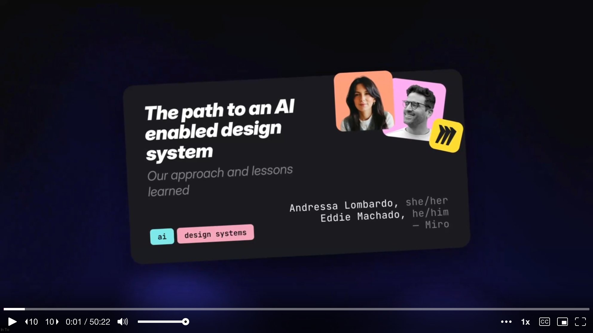

The Miro design system team is not the large, well-resourced operation people might assume. Andressa introduces the roster: herself as design system lead, Eddie as design engineer (and birthday boy -- the talk falls on his birthday), one engineering manager, and three engineers. That is the entire team, serving **48 product teams**. Small, but mighty -- and very much figuring things out as they go.

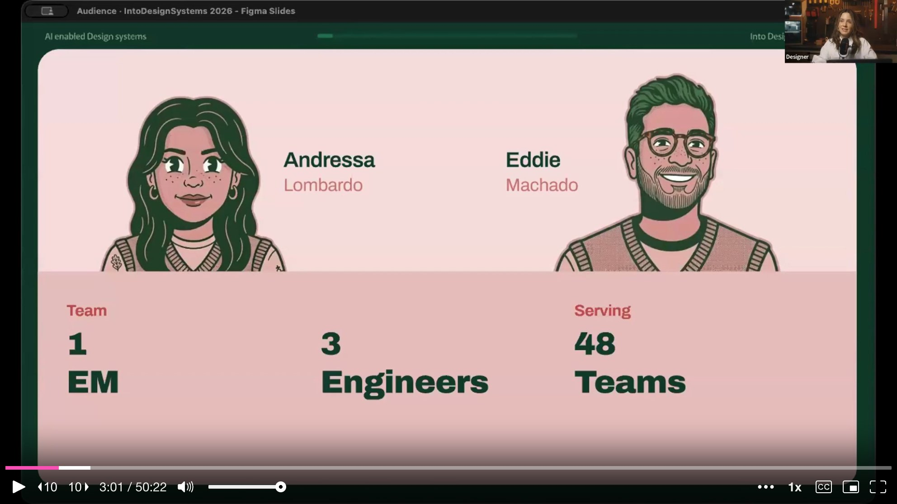

Miro is a **canvas-based product**, which means it is not a typical web application. It runs on two tech stacks: React for the standard web UI, and **Surface SDK**, Miro's proprietary on-canvas technology. The Surface SDK was, until recently, almost entirely undocumented from a design systems perspective. This matters, because when AI tools started proliferating across the company, nobody was coming to the design system team to ask how to integrate them.

---

## "The Incident"

Eddie takes over to describe the moment that changed everything. He calls it **"The Incident."** It happened on Andressa's very first day at Miro, during a team offsite in Berlin. At the same time, the leadership team was also in Berlin, discussing plans for a new feature that would let teams upload brand guidelines to prototype inside Miro.

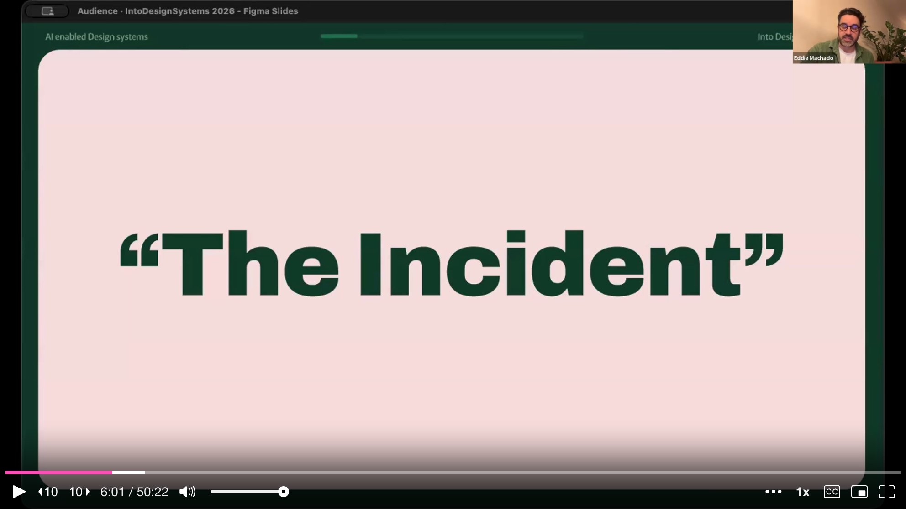

The question floating around leadership was whether they could use AI to **auto-generate a design system** inside of Miro -- just point AI at someone's brand guidelines and have it spit out components. The problem was not the idea itself. The problem was that **they never consulted the internal design system team**. They went directly to AI to see if it was possible. The implication was clear: if the design system team did not figure out how to make AI work within their system, someone else was going to do it without them.

---

## AI as a New Hire

That realization drove everything that followed. Andressa and Eddie kept coming back to one question: **what does an AI-enabled design system look like?** The answer came through a reframe. AI was not a tool to be plugged in. It was a **new team member that needed to be onboarded** -- one who was extremely enthusiastic, very capable, extremely literal, and knew absolutely nothing about Miro's conventions. They gave her a name: **Aura**.

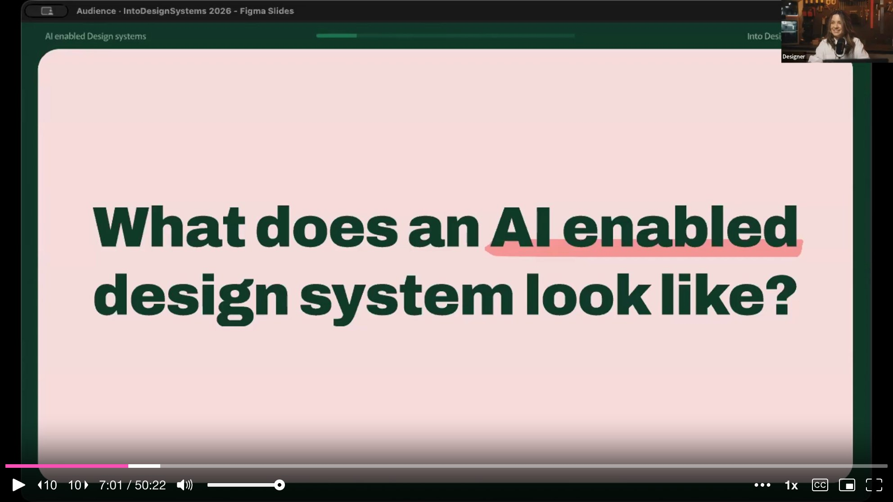

Aura is not a single agent or a single tool. She is what the team started calling their **AI practice** -- a collection of integration scripts, documentation, and workflows built over the past year. She got her own illustrated personality in the slides, and the talk follows her onboarding journey as a narrative device. But the underlying point is serious: Aura is eager and will attempt anything you throw at her, but she knows nothing about the team's decisions, their icon conventions, or their token architecture. And at Miro, onboarding has historically meant throwing people into the deep end.

The root cause of that problem is **lack of documentation**. Everything lived in people's heads -- design decisions, infrastructure knowledge, best practices, linting processes, contribution models. Every new hire (human or AI) would ask the same questions over and over. Before writing anything down, the team stepped back and established three onboarding principles.

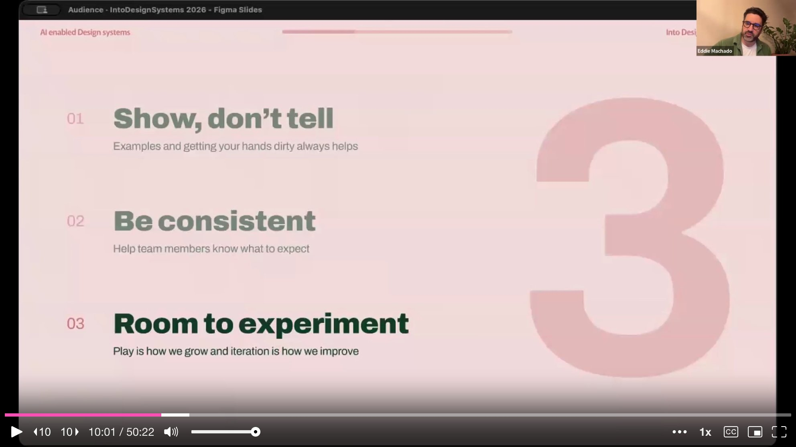

**Show, don't tell**: explain not just why, but also why not. **Be consistent**: mixed messages break reasoning for humans and machines alike. **Room to experiment**: the best learning comes from having space to try, fail, and self-correct.

---

## The Icon Problem: Confidently Wrong

With principles in hand, they gave Aura her first task: build a simple toolbar with four common actions (text styles, text alignment, text color, highlight color) and an overflow menu. Aura was confident. She chose icons, picked tokens, selected the right components. On first glance, the team was impressed. But on closer inspection, **she was wrong** -- and not randomly wrong, but confidently wrong.

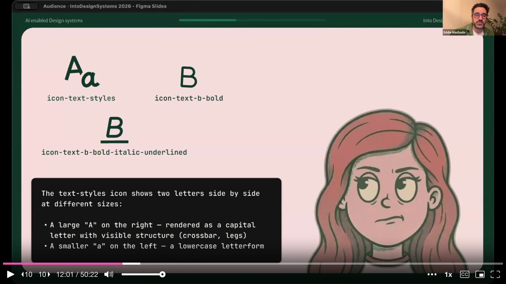

The icon she picked for "text styles" was actually named `icon-text-styles` in the library, which sounds right. But at Miro, that icon is used for **font styles** (serif vs. sans-serif), not text styling actions. The actual icon for text styles was `text-b-bold-italic-underlined`. This distinction was obvious to Andressa and Eddie, who had inherited and internalized the naming conventions, but to any newcomer it was impenetrable.

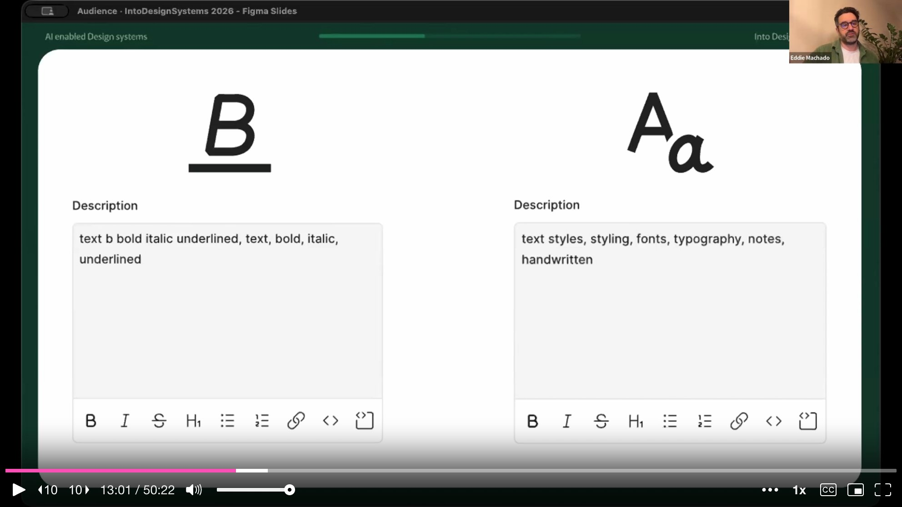

The fix was not to blame Aura. It was to **enrich the icon metadata**. They added visual descriptions, use cases, and explicit "do not use for" guidance. The description for the font styles icon now reads: "represents font style like serif or sans-serif, do not use to represent text style like bold, italic, underline." When they translated this to the JSON files powering the icon library, Aura nailed the task on the next attempt.

---

## The Token Problem: Two Shades of White

Icons were not the only issue. Even when Aura got the icons right, she picked a **deprecated background token**. The token had been recently replaced, and she had no way to know that.

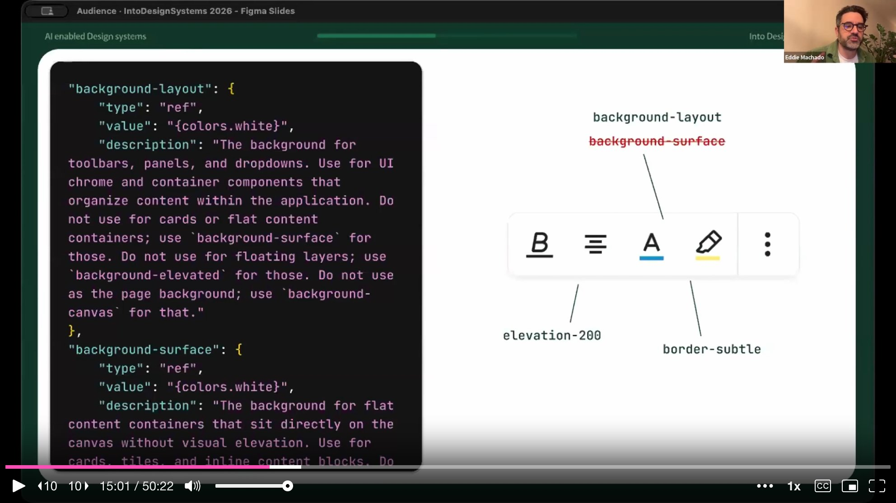

Eddie shows the data Aura was working with: two tokens, both with the value "white," both with completely ambiguous usage descriptions. The fix followed the same pattern as the icons -- add clear descriptions stating that `background-layout` is "the background for toolbars, panels, and dropdowns; do not use for cards or flat content; use background-surface instead." The token architecture itself was inherited and imperfect, but **adding context was faster than refactoring the entire token system**.

After these enrichments, Aura got the full toolbar right. The team's takeaway was not that AI had a problem. It was that **they** had a documentation problem. The technical work of adding metadata was hard and time-consuming, but the harder work was everything that preceded it -- the unglamorous auditing, writing, and enrichment of information that had never been written down.

---

## Prove the Concept First, Explain It Second

Andressa shares a candid moment. Every two weeks, Miro runs a show-and-tell for all product teams. Other teams were shipping flashy AI features. The design system team was writing icon descriptions and adding component metadata. It did not make senior leadership's eyes sparkle.

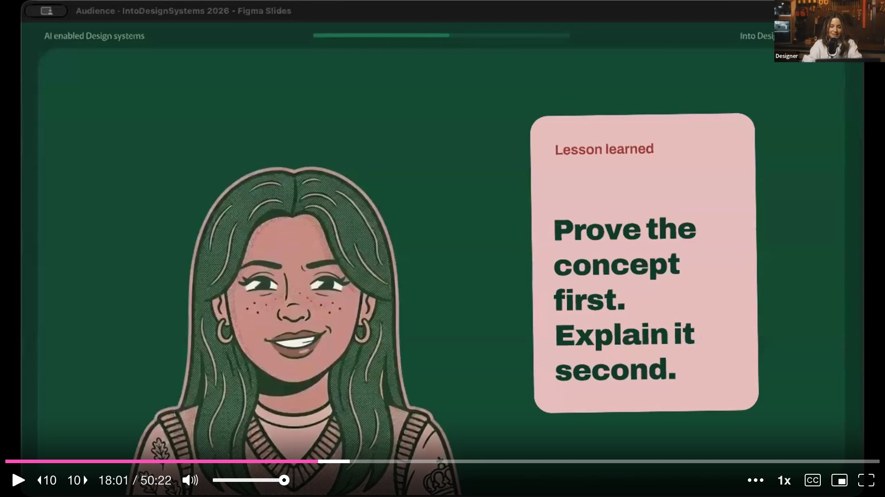

She was told directly by senior leadership that **there was no value in documentation**, that nobody reads it, and that if this was the best the team could do, they deserved a 4 out of 10 for impact. The lesson she draws: sometimes you have to **ask for forgiveness rather than permission**. They kept going because they knew the MCP they were building would only be as good as what Aura could read. Without written documentation, no AI integration would produce good results.

---

## Building the MCP: Control Output When You Cannot Control Input

Eddie transitions into the technical work. The core insight: **humans prompt unpredictably**. One person writes detailed instructions, another (Eddie admits he falls in this camp) prompts like a sixth grader. If you cannot control the input, you have to control the output. The answer was to build a **custom MCP server** for the design system.

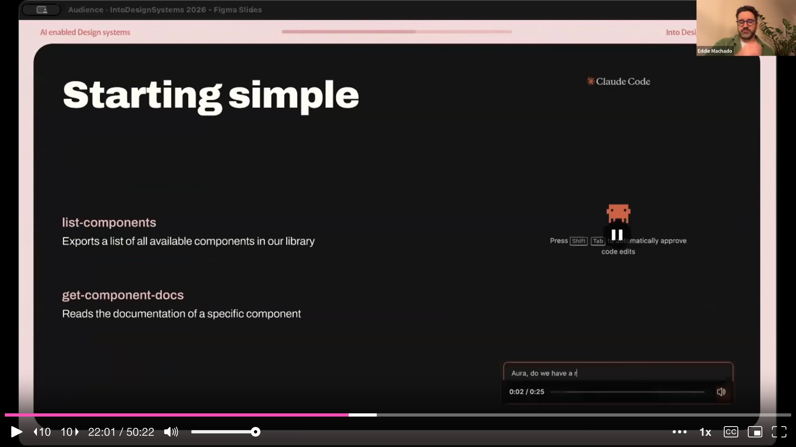

They started with just two tools: **list-components** (returns a simple list of available components) and **get-component-docs** (finds and returns the documentation file for a specific component). That was it. They wanted to start simple and see where optimization was needed. They added instructions to their team's root CLAUDE.md file so that when anyone addressed Aura, she would call the design system MCP directly. This single integration **dropped support questions in their Slack channel by 70-80%**.

But the initial metadata still was not enough. Aura struggled to find the icon and token libraries because documentation links were embedded in React components, not in markdown that an LLM could read. She would end up in loops, eventually finding answers by randomly searching the codebase -- which is exactly how hallucinations happen.

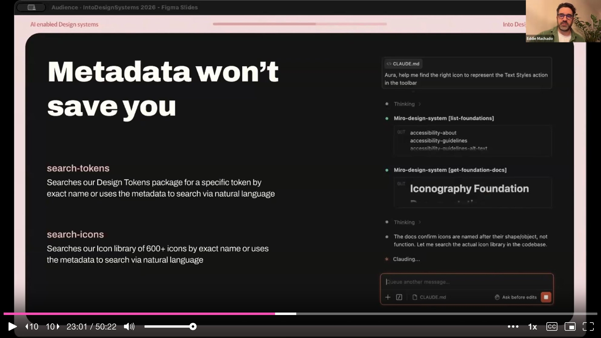

So they built two more tools: **search-icons** and **search-tokens**. But instead of building MCP tools directly, Eddie built them as **Claude Code skills** first. Skills are simpler to create, faster to iterate on, and compressible. Using Claude's `/simplify` command, he got one skill from **33,000 tokens down to 410 tokens** -- a 98% reduction. These are the kinds of metrics that leadership actually responds to.

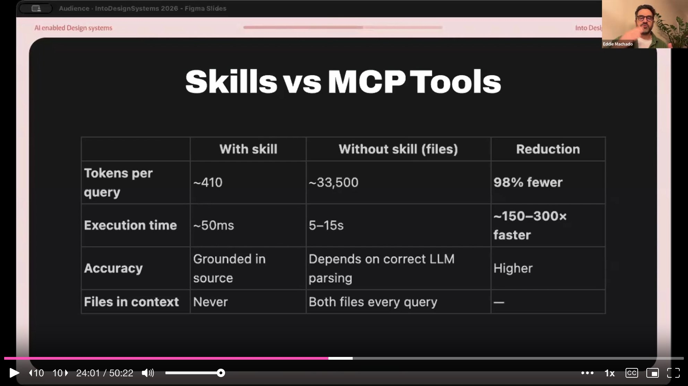

---

## The Wrap-Up Skill: Standardizing Contributions

Another skill the team built is called **wrap-up**. Before submitting a PR, the wrap-up skill runs the linter, checks code quality against a checklist, verifies accessibility and localization, writes a description for each commit, and structures the PR based on a template. Creating PRs is, as Eddie puts it, "the worst part of vibe coding." The wrap-up skill removes that friction entirely, and the team has seen **more contributions** coming in because the barrier to submit is lower.

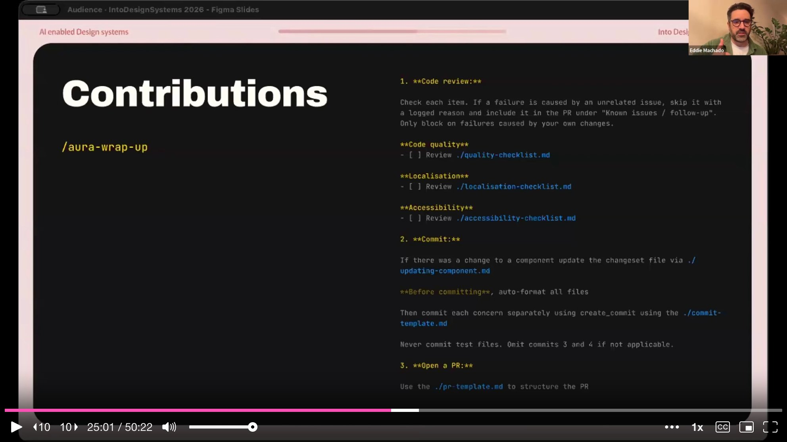

They test all new scripts and skills internally for one to two weeks before rolling them out. A rogue script that introduces even one unexpected line into a CLAUDE.md file can diverge Aura's guidelines. Internal testing is how they catch those issues.

---

## Aura's First Day on Bug Duty: 17 PRs in One Hour

With the foundation in place, the team started tagging Jira tickets as **"Aura ready."** Aura scans tagged tickets, reads the Jira description, does the work, runs the wrap-up skill, and submits a PR. On her first day working on bugs, she created **17 PRs in one hour**.

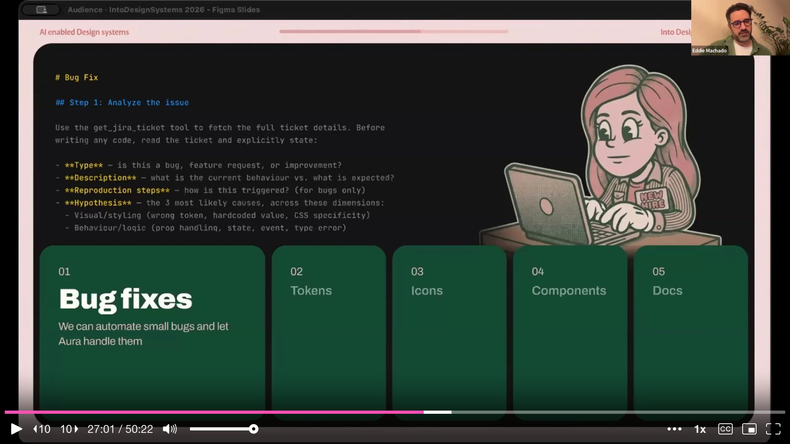

The roadmap extends beyond bug fixes. Aura is being prepared to handle **token renaming** (the inherited naming structure is outdated, and doing it manually would take months), **icon cleanup** (who better to fix the naming that confused her?), and eventually **component replacement** -- though components are trickier because they carry logic. They have also explored **component generation from specs**, asking Claude to analyze existing components, extract a "recipe" of patterns and standards, and use that recipe to generate new components that meet the same quality bar.

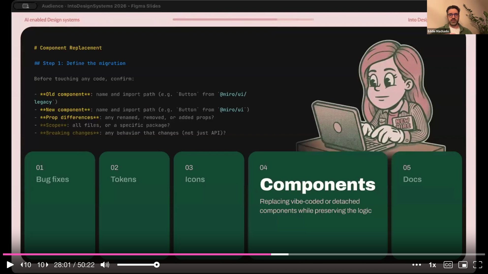

The best part, Eddie notes, is that when changes are made, Aura can keep documentation up to date automatically. A script similar to wrap-up detects component changes, finds the related documentation file, and updates it. This closes the loop that has historically broken every design system: **documentation drift**.

---

## The Visibility Paradox

Andressa returns to a problem that might sound counterintuitive: when the MCP became frictionless, they **lost visibility**. Aura was working silently in the background -- which meant adoption was high, but the team could not easily measure how many calls were being made. The lesson: **any figure is better than no figure**. Even approximate numbers, qualitative testimonials from engineers about time saved, or before-and-after quality comparisons help build the case. You want to build from what you have, not wait for perfect analytics.

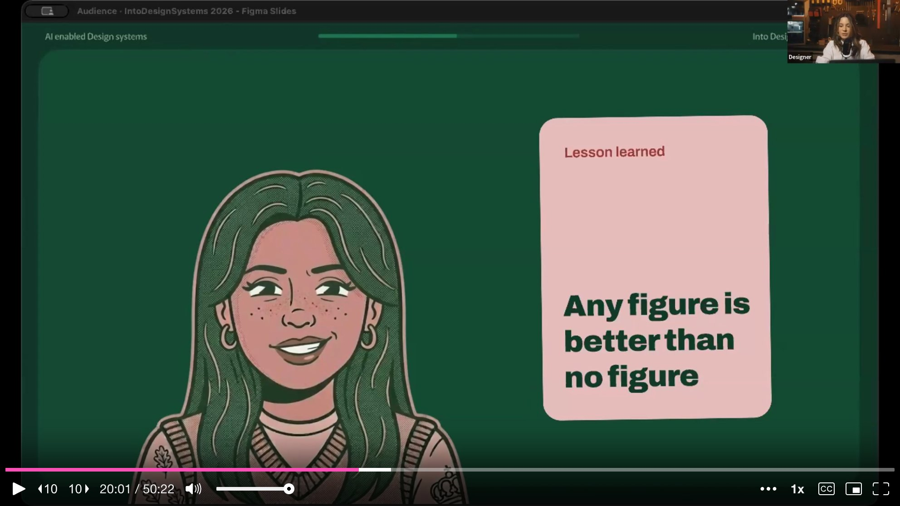

---

## Lessons Learned: You Don't Need a Perfect System

Andressa closes the talk with a final lesson that encapsulates the entire journey. There is no need to resist AI, and there is no need to panic about it. The answer is to **be the person who onboards the new team member**. That person is you, because you wrote the rules. Someone has to know how the system works and be able to teach it. That has always been the design system team's job -- to document, to govern, to guide. AI does not change that. It makes it more urgent.

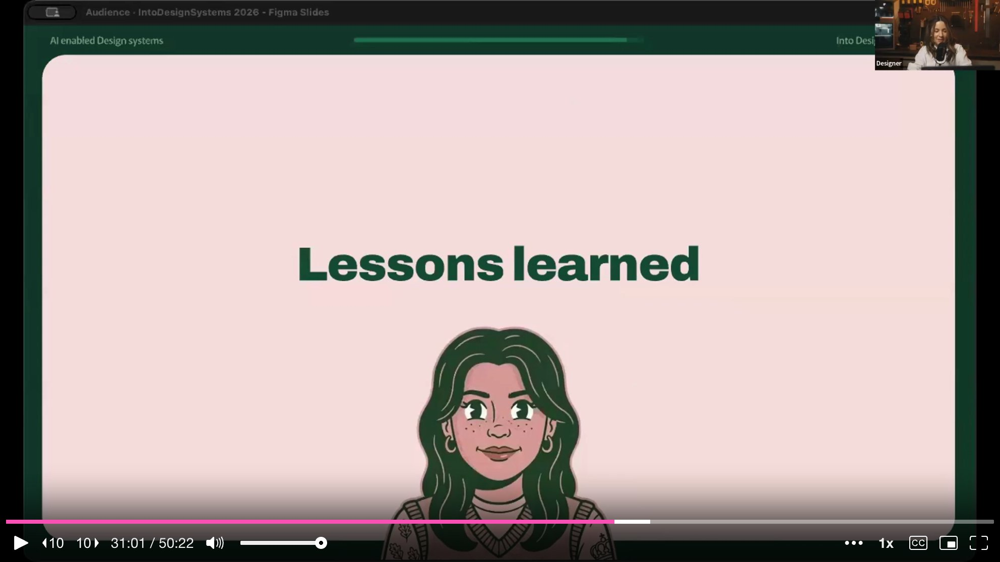

And if you take nothing else from the talk: **you don't need a perfect system. You need a system that is legible enough to teach.** Even if it is not glamorous work, invest in metadata, documentation, and extracting everything that lives in your heads into files. That is the foundation everything else is built on.

---

## Q&A Highlights

**On building skills**: Eddie recommends starting with Claude's skill creator skill, which can generate and test a skill end-to-end. He describes his own process as iterative: explain the problem, generate the skill, test it repeatedly, and after each run ask "what can we improve?" Over time the skill slowly improves itself until results become consistent.

**On getting engineers on board**: The team initially faced resistance from their own engineers, who argued that AI-generated code was not production-ready and created more review work. They found **one ally** on the engineering team who influenced the others. Two of their engineers are now in the top 10 of token usage across the entire company.

**On designer contributions**: Designers across Miro were already experimenting with Claude Code, Cursor, Replit, and Lovable, producing prototypes that engineers did not know what to do with. The team built a script that takes those assets, maps them to the design system's tokens, and produces a strict markdown file with all property mappings -- so AI can work from that instead of the raw prototype output.

**On dark mode**: The reason Miro does not have dark mode yet is not a design system limitation -- it is a canvas problem. If Andressa turns on dark mode, what does her collaborator see? That shared-canvas interaction model has to be solved before dark mode can ship.

---

## Key Insights & Takeaways

**Treat AI as a new team member that needs onboarding, not a tool that needs configuration.** Miro's team reframed AI adoption by asking "how would we onboard a new hire who knows nothing about our conventions?" This led them to surface all the tribal knowledge -- icon naming rationale, token usage rules, contribution processes -- that had never been written down. Apply the same test: if a smart new hire could not figure out your system from documentation alone, your AI agent cannot either.

**Enrich metadata before building MCP tools.** Miro's AI ("Aura") confidently picked the wrong icons and deprecated tokens because the metadata lacked context. Adding visual descriptions, use cases, and explicit "do not use for" guidance to icon and token definitions fixed the problem. This unglamorous audit-and-enrich work is the prerequisite that makes every downstream AI integration work. Budget time for it even when leadership does not see the sparkle.

**Build Claude Code skills first, then graduate to MCP tools.** Eddie built search-icons and search-tokens as Claude Code skills before converting them to MCP endpoints. Skills are simpler to create, faster to iterate on, and dramatically more token-efficient -- one skill went from 33,000 tokens down to 410 (98% reduction). Start with skills for rapid iteration, and only move to MCP when you need shared, managed access across teams.

**Automate the PR submission process to increase contributions.** Miro's "wrap-up" skill runs the linter, checks code quality, verifies accessibility and localization, writes commit descriptions, and structures the PR from a template. This removed the most tedious part of contributing to the design system and directly increased the number of incoming contributions. If your contribution rate is low, look at whether submission friction -- not willingness -- is the bottleneck.

**Track adoption metrics even when they are imperfect.** When Miro's MCP became frictionless, the team lost visibility into how much it was being used. Andressa's lesson: any figure is better than no figure. Collect approximate usage numbers, qualitative testimonials, before-and-after quality comparisons -- whatever you can get. Waiting for perfect analytics means you have no story to tell leadership when budget decisions arrive.
