# Agentic Design Systems

**Speaker**: Romina Kavcic -- Design System Lead, The Design System Guide
**Conference**: Into Design Systems AI Conference 2026 | 54 min

---

## Design Systems Are Infrastructure

Romina Kavcic opens with a framing that cuts through the usual "should we invest in a design system?" debate: **design systems are infrastructure**, no different from a database or a deployment pipeline. She argues that if you still need to justify a design system to leadership, frame it as the API that allows AI to build your product safely. The same way no one questions whether a company needs a database, no one should question the system that governs what users actually see and interact with.

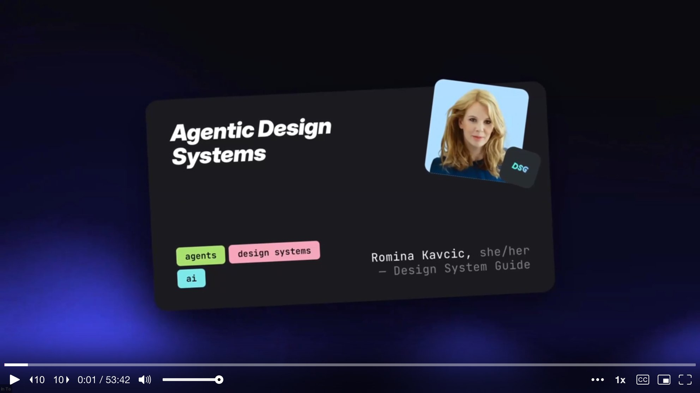

She sets the stage with a rapid overview of what has changed since the previous Into Design Systems conference nine months earlier. Twenty-eight frontier models released by six labs. Over $226 billion in AI investment -- nearly double the prior year. The MCP ecosystem exploding from 100,000 downloads to over 8 million. Gartner predicting 40% of enterprise apps will embed AI agents by end of 2026. And perhaps most telling: **41% of all new code written in 2025 was AI-generated**.

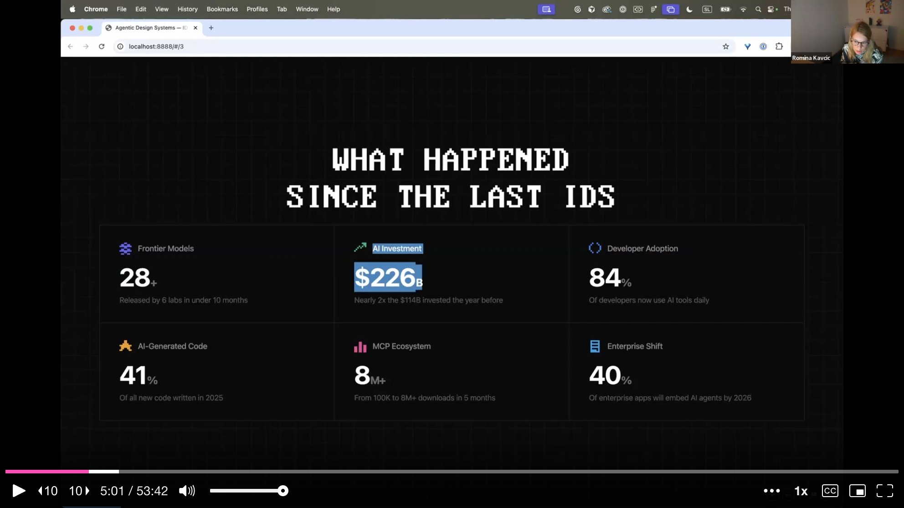

The implication is stark. AI generates code at scale, but **design systems generate understanding**. Without a strong system governing what gets generated, AI-produced code creates inconsistency at scale. The risk of not having a solid design system just got dramatically higher.

---

## From Synthetic to Semantic

Romina highlights an underappreciated shift in how developers work with AI. When developers use AI tools, they actually spend **less time writing code**, not more. The shift is from **synthetic to semantic** -- from "how do I write this?" to "what should this component do and why?" Developers now spend their time on intent, naming, and reasoning rather than syntax.

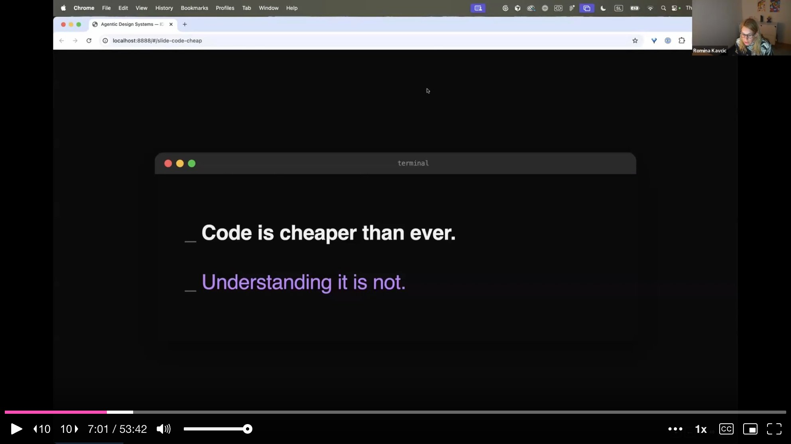

She argues this is exactly the shift design systems need to make. A developer needs to understand what the design system **encodes** -- tokens, naming conventions, component intents, usage guidelines, combination rules. These are the real assets. When people ask whether AI will replace design systems, Romina's answer is clear: **AI makes design systems more critical than ever**, because generating code is cheap but generating coherent, governed understanding is not.

---

## How an AI Agent Actually Works

Before diving into tooling, Romina walks through the basic anatomy of an AI agent interacting with a design system. The agent **reads context** -- pulling in your component index, token structure, and usage guidelines. Then it **thinks** -- reasoning that a dialog needs two buttons, one of which has a destructive variant, and that an alert has a warning slot. Then it **plans** the composition: dialog plus alert plus two buttons. Then it **acts**, generating the output.

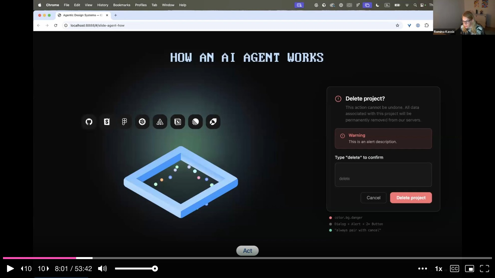

The key distinction she draws is between a **chatbot** and an **agent**. A chatbot is ping-pong: you prompt, it responds, you prompt again. An agent has a **goal** and works autonomously until that goal is reached, using tools and feedback loops along the way. What makes something agentic is three things: **autonomy, tool usage, and feedback loops**. But none of this works unless the agent has something meaningful to read. Without context, it halluccinates. With well-structured context -- component descriptions with intent, token taxonomies, relationship maps, combination rules -- it can reason effectively.

---

## CLI vs. MCP: Different Tools for Different Jobs

Romina draws a clear line between two modes of AI-assisted work. **CLI** (connecting Claude Code or Cursor directly to Figma) is for direct, low-context, single-tool tasks: generate dark theme colors, resize images, quick experiments. It runs locally, burns fewer tokens, and requires no infrastructure.

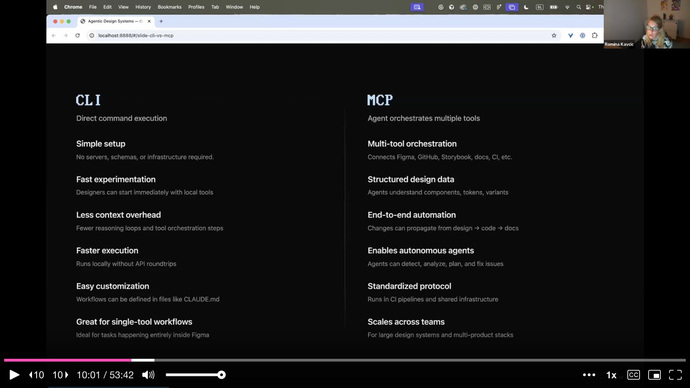

**MCP** (Model Context Protocol) is for **multi-agent orchestration** where structured data from multiple tools needs to be combined and acted on. She lists the MCPs she uses regularly: Figma for design data, Granola for meeting notes, Mintlify for documentation, Playwright for website audits and screenshots. MCP enables end-to-end automation where changes can propagate from design to code to documentation. It scales across teams and enables autonomous agents. The takeaway is practical: use the right tool for the right job, and do not overcomplicate simple tasks with full orchestration.

---

## Plant Seeds, Not Trees

This is the slide Romina calls the most important in the entire talk. She shows two illustrations side by side: on the left, someone carefully planting seeds and watering them. On the right, someone grabbing a full-grown tree and dropping it into their garden.

Everyone wants the tree -- a fully autonomous agent that comes in and fixes everything. But **that is not how it works**. You have to build the foundations first: naming conventions, token structure, component descriptions with intent. The automation is built on top of that groundwork. She introduces her proposed architecture for an agentic design system: a loop of **watching, analyzing, executing, and observing**, with Claude Code (or any AI coding tool) at the center. She experimented with multiple models and tools -- the specific model matters less than the loop itself.

---

## The Agent Roles

Romina introduces five specialized agent roles she has built and experimented with. The **Observer** watches system state, detecting drift, naming violations, and token misuse in real time. The **Orchestrator** routes tasks between agents, coordinating detect-fix-learn cycles across tools. The **Auditor** scores health across naming, tokens, accessibility, and other categories, generating actionable reports. The **Documenter** generates component descriptions, usage guidelines, and specs from live Figma data. The **Composer** assembles UI patterns from natural language -- picking the right components, variants, and tokens.

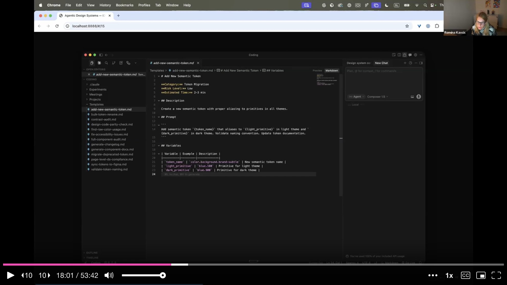

These are not theoretical roles. She demonstrates each one through tooling she has built, starting with her custom Figma plugin called **Tidy**.

---

## The Tidy Plugin: Auditing and Composing in Figma

Romina demonstrates Tidy, a Figma plugin that serves as the bridge between the design system and the agentic layer. On the **audit side**, it can scan every layer of a Figma file for token naming violations, detect raw hex codes used instead of design tokens, score design system health across six categories, and validate new variables against established naming conventions. If someone adds a token that breaks the naming rules, Tidy flags it immediately.

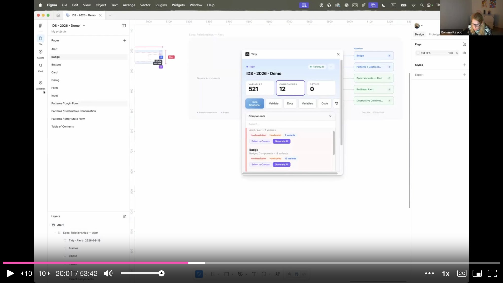

On the **agent integration side**, Tidy exposes 66 MCP tools for tokens, components, and health scoring. This means Claude Code can query and act on everything Tidy knows. She demonstrates generating a table of contents for a design file, navigating directly to components, creating visual variable snapshots (so you can see all your primitives and theme tokens laid out on pages instead of buried in Figma's cramped variable panel), and generating relationship maps that show how components connect.

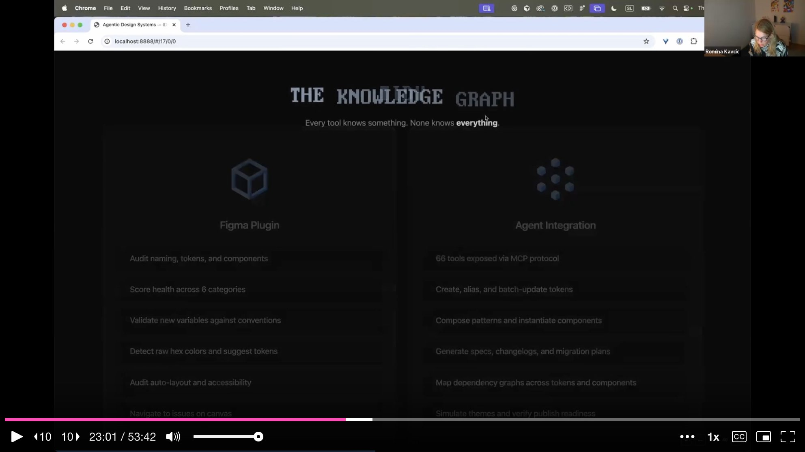

---

## Machine-Readable Components and Markdown Skills

A recurring frustration Romina describes is that most design system components **lack machine-readable context**. Figma descriptions were empty. Documentation lived in Storybook. Specs sat in Figma. Nothing was combined into a format an agent could consume. Her first step was adding **intent descriptions** to every component -- not just for humans, but written so AI could understand what a component does and how it should be combined with others.

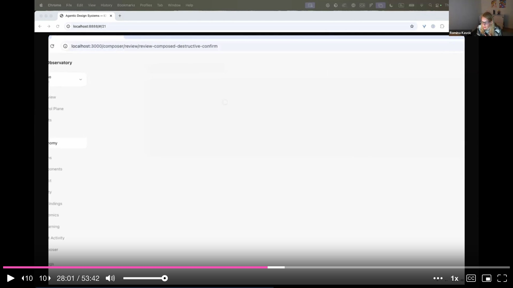

She then built a system of **markdown skill files** -- structured prompts that encode specific tasks like "add new semantic token," "bulk token rename," "control audit," or "generate component docs." Each skill file includes a category, risk level, estimated time, description, prompt template, and variables. These live in the IDE alongside the codebase and can be triggered by agents. She connects this to Mintlify for automated documentation: a script watches for Figma changes and pushes updated documentation automatically, either on a schedule or on every change.

---

## The Observatory Dashboard

One of the problems Romina encountered was **visibility**. When you run agents from a terminal, you have no idea what happened, what succeeded, what broke, or who is using which skills. So she built the **Observatory** -- a vibe-coded dashboard that visualizes the entire agentic design system.

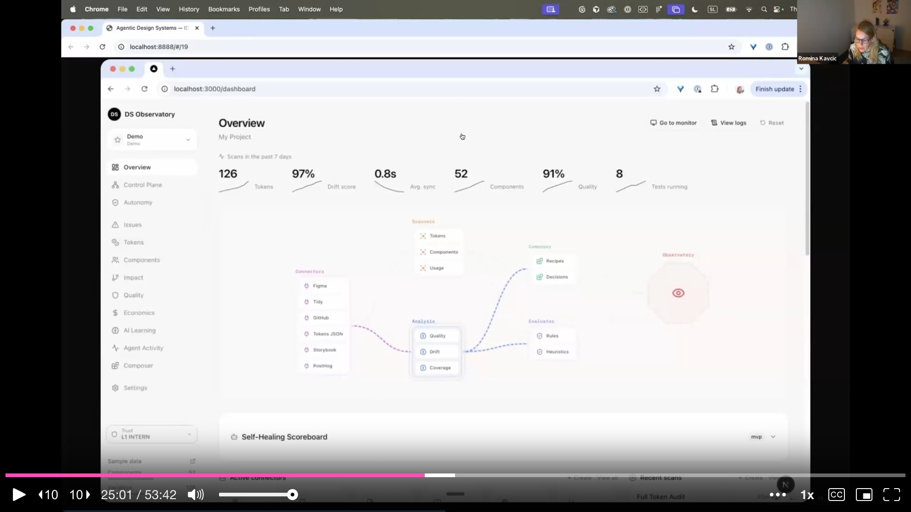

The dashboard shows token counts, drift scores, average sync times, component counts, quality ratings, and running tests. It maps all **connectors** -- which tools (Figma, GitHub, Storybook, PostHog, Tokens JSON, Playwright) feed into which analysis pipelines (quality, drift, coverage) and which execution paths (rules, decisions, heuristics). She can click any connector to see its status, view and edit markdown files directly, and monitor agent activity. The **Self-Healing Scoreboard** at the bottom tracks the health flywheel in real time.

---

## The Self-Healing Loop: Monitor, Analyze, Plan, Execute

Romina maps her approach onto **IBM's MAPE framework** -- Monitor, Analyze, Plan, Execute -- originally published in 2003 for network infrastructure self-management. She applies the same logic to design systems.

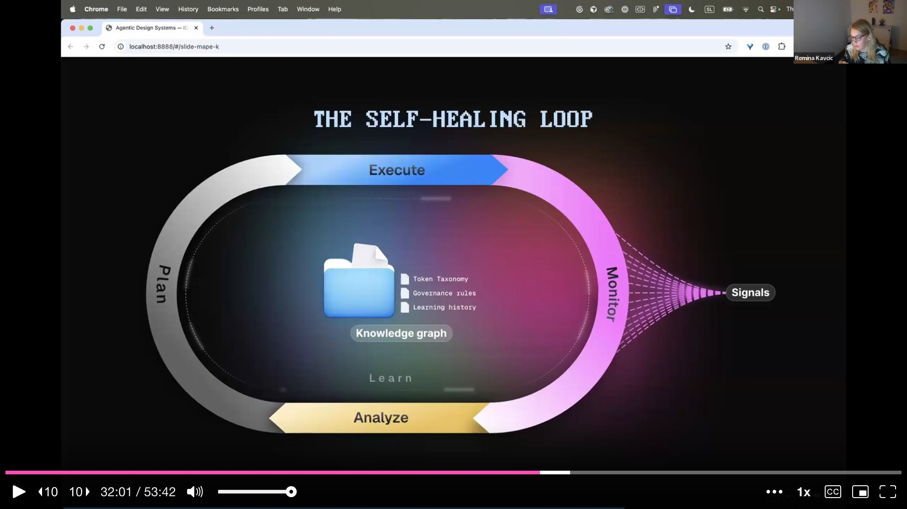

**Monitoring** means treating every change as a signal: Figma API events, CI hooks on every push, usage analytics from PostHog. **Analysis** runs a drift scoring engine -- if someone applies a wrong token or uses a hex code instead of a design token, the system detects it. **Planning** decides what to do: should the agent auto-fix, create a PR, or just flag the issue? **Execution** depends on trust levels. At the center of the loop sits the **knowledge graph** -- not just static rules and token taxonomies, but a living record of what is happening daily, constantly updated by agent activity and human feedback.

She shows the practical flow: token drift is detected, health score drops, the agent renames the offending tokens, and the score rises back. The Observatory inbox surfaces issues needing human attention, each linked to a PR ticket where the human can review and approve or reject the proposed fix.

---

## Pattern Composition

One of the most compelling demos is **pattern composition** -- giving an agent a natural language instruction and watching it assemble a complete UI pattern from design system components.

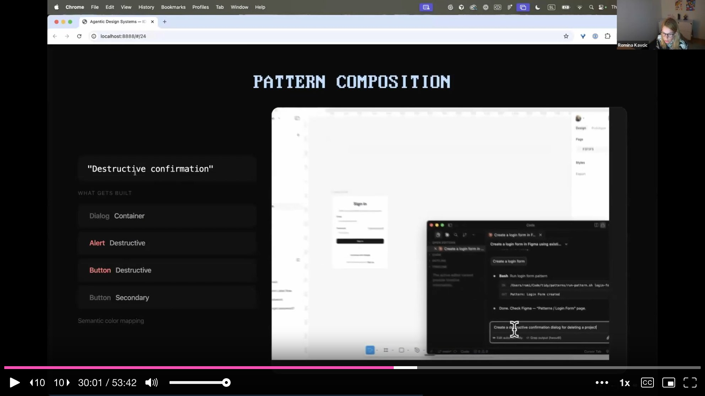

She shows three examples. Asking for a "login form" produces the right input fields and call-to-action button with correct design tokens applied. Asking for a "destructive confirmation" produces a dialog container, alert component, destructive button, and secondary cancel button -- with semantic color mapping (color.bg.danger) and the composition rule "always pair with cancel" encoded. Asking for an "error state form" produces a form with a global error alert and a confirmation button. Each composition is not just layout but **semantically aware**: the agent knows which tokens to apply, which variants to use, and which components pair together.

---

## Trust Levels: Agents as Career Progression

Romina frames agent autonomy as **career progression**. Every time you hand decision-making to an agent, you give up a bit of control. The agent must earn trust incrementally, just like a new hire.

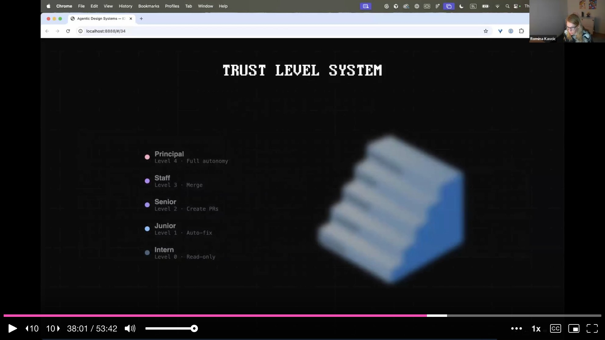

She defines five levels. **Intern** (Level 0) is read-only -- the agent can observe and suggest, but every action requires approval. **Junior** (Level 1) can auto-fix minimal, mechanical issues like renaming a misspelled token. **Senior** (Level 2) can create pull requests. **Staff** (Level 3) can merge approved changes. **Principal** (Level 4) has full autonomy. The decision matrix considers both **risk** and **confidence**: a low-risk, high-confidence fix can be auto-merged, but a low-risk, low-confidence suggestion should be drafted as a PR with a human review request. She emphasizes that some decisions will never go past Level 3 -- there will always be places where **human judgment is irreplaceable**.

---

## Automated Documentation

Romina addresses what she considers the **biggest maintenance burden** in design systems: keeping documentation current. Her solution uses Mintlify (with Astro Starlight as a free alternative) connected via MCP. A script watches for changes in Figma design files. When a component is updated, the documentation site is automatically regenerated.

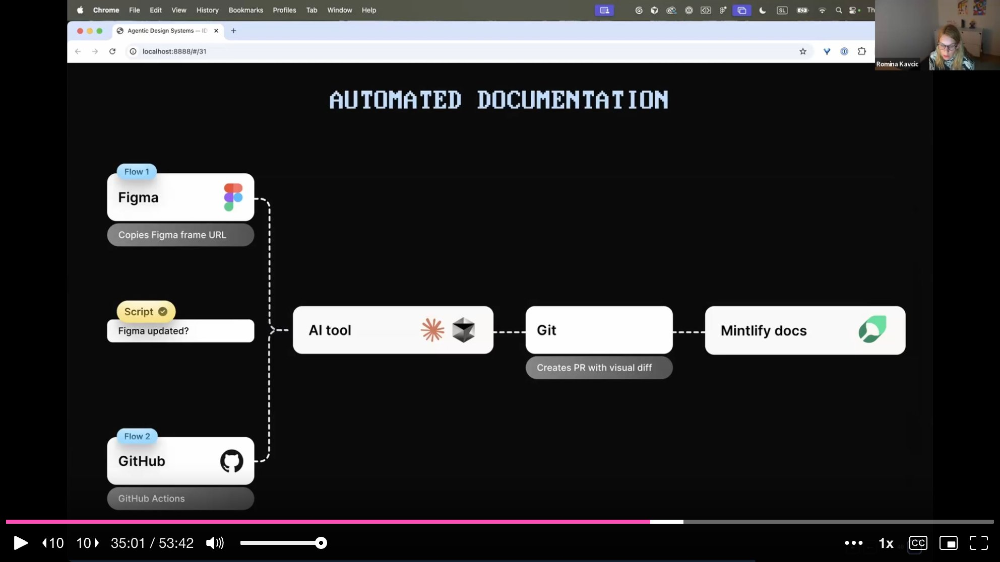

The flow works in two directions. Flow 1: a Figma frame URL is copied, the AI tool processes the change, creates a PR with a visual diff in Git, and pushes to Mintlify. Flow 2: GitHub Actions trigger on code changes, propagating updates back to documentation. She shows the live documentation site with component lists, insertion counts, and variant details -- all generated and maintained automatically. The key insight is that **documentation should be a byproduct of the system, not a manual chore**.

---

## What You Can Do on Monday

Romina closes with deliberately modest advice. She does not suggest standing up a full agentic infrastructure overnight. Instead: **give the agent something to enforce**. Start with something simple. Feed and document your naming conventions. Add descriptions to your top five or ten components. Connect two MCPs -- Figma and GitHub, or whatever you use for code. Start playing.

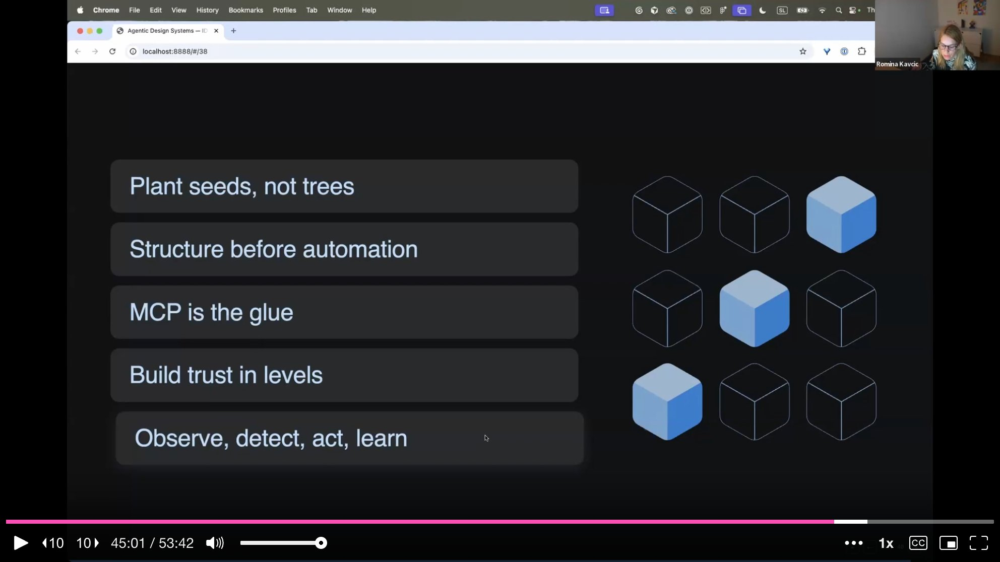

Her five principles are direct. **Plant seeds, not trees** -- foundations before automation. **Structure before automation** -- naming conventions and component intent must come before any agent can act on them. **MCP is the glue** -- it connects tools and enables orchestration. **Build trust in levels** -- start agents as interns and promote them as they prove reliable. **Observe, detect, act, and learn** -- iterate daily, keep the feedback loop alive, and wake up excited to make the system better.

---

## Q&A Highlights

**On the Tidy plugin**: Romina has not yet published Tidy publicly but is considering it after strong audience interest. The plugin started as a personal tool for token validation and grew into the full audit-and-compose system she demonstrated.

**On the Observatory dashboard**: The dashboard was built entirely through vibe coding, motivated by Romina's need as a visual person to see what was happening across agent activity, errors, and usage patterns. It started with a simple overview and expanded iteratively as she discovered what she needed to monitor.

**On tool agnosticism**: She tests every new model against the same prompts and maintains personal notes on which models excel at which tasks. She found that Codex without a plan performs poorly, but Codex with a well-defined task list can outperform Cursor. The framework and loop matter more than the specific tool.

**On rebuilding from scratch**: If starting a design system today with AI and agents in mind, she would spend the time saved on AI execution on **better design craft and deeper brand alignment**. She would also pair with a developer daily rather than meeting once a week, because the different perspectives accelerate quality dramatically.

**On the fertilizer for seeds**: Her answer is immediate -- your team. Patient, trusting teammates who believe in the incremental approach rather than demanding instant results are what make the foundation-first strategy work.

---

## Key Insights & Takeaways

**Plant seeds, not trees -- build foundations before automation.** Everyone wants the fully autonomous agent that fixes everything overnight, but Romina showed that naming conventions, token structure, and component descriptions with intent must come first. The automation is built on top of that groundwork. Start with your top 5-10 components: add intent descriptions, document combination rules, and establish naming conventions. That is the soil everything else grows in.

**Assign trust levels to agents like career progression.** Romina's five-level framework -- from Intern (read-only, every action needs approval) to Principal (full autonomy) -- gives you a practical model for rolling out agent capabilities safely. Start your agents at Level 0 and promote them as they prove reliable. A low-risk, high-confidence fix can be auto-merged; a low-risk, low-confidence suggestion gets a PR with human review. Some decisions will never go past Level 3.

**Build a self-healing loop using the MAPE framework: Monitor, Analyze, Plan, Execute.** Treat every Figma API event, CI hook, and usage analytics signal as input to a continuous health monitoring system. When drift is detected (wrong token applied, hex code instead of design token), the system scores the health drop, plans a fix, and either auto-fixes or flags it for human review. The knowledge graph at the center constantly updates from both agent activity and human feedback.

**Make documentation a byproduct, not a manual chore.** Romina connected Mintlify via MCP so documentation regenerates automatically when Figma components change. A script watches for changes, the AI processes them, creates a PR with a visual diff, and pushes to the documentation site. If your team is spending hours keeping docs current, wire up a pipeline that makes documentation an automatic output of the system rather than a separate workstream.

**Use an Observatory dashboard to make agent activity visible.** When agents run from terminals, you have no idea what happened, what broke, or who used which skills. Romina built a vibe-coded dashboard showing token counts, drift scores, connector status, quality ratings, and a self-healing scoreboard. If you are running agents in your design system, invest in visibility tooling -- even a simple one -- so you can measure, debug, and demonstrate impact.
