# I'm Not an Engineer but I Ship Code: How Designers Can Ship Production Code and Work Like an Engineer

**Speaker**: Freya Stockman -- Product Designer, Relevance AI
**Conference**: Into Design Systems AI Conference 2026 | 52 min

---

## The Double Diamond Is Expanding

Freya Stockman opens with a bold claim: **2026 is the tipping point for designer-engineers.** The traditional double diamond of problem definition and UX solutioning is no longer the whole picture. Designers are now handling **technical scoping**, doing product management, writing tickets for engineers to break work into bite-sized chunks, and in some cases owning **full front-end implementation and pull requests**.

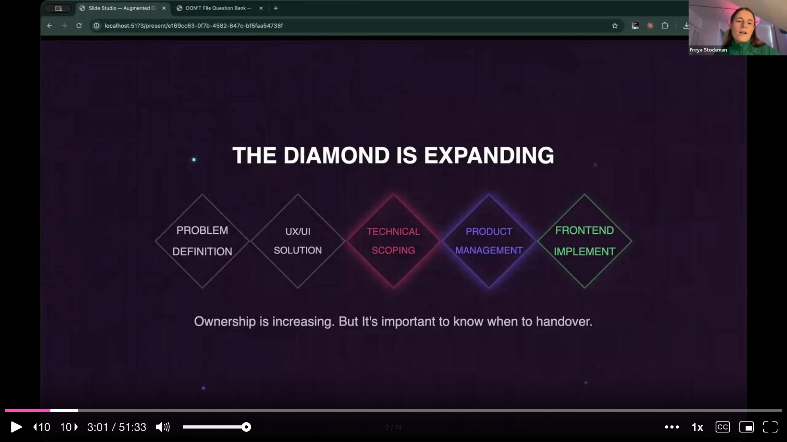

She is careful to frame this not as designers becoming engineers and stretching themselves thin, but as designers gaining **more ownership** when they need to build their own apps or products. Designers understand the customer deeply, and AI is now at a point where those skills can be combined with technical execution. The talk covers three pillars: developing an **engineer mindset**, a practical framework for **shipping front-end code**, and knowing **when to hand over versus when to ship**.

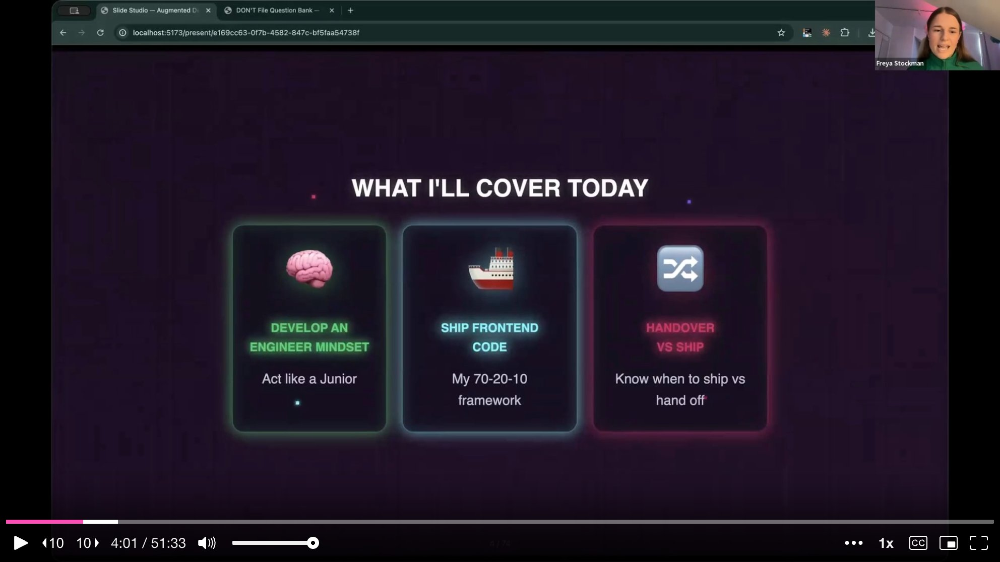

---

## Sink or Swim: The Billboard Story

Freya takes the audience back to where her journey began -- a **sink-or-swim moment**. The stakes were real: a billboard in San Francisco was launching in seven days, none of the resources had been prepared, and she was the one assigned to deliver.

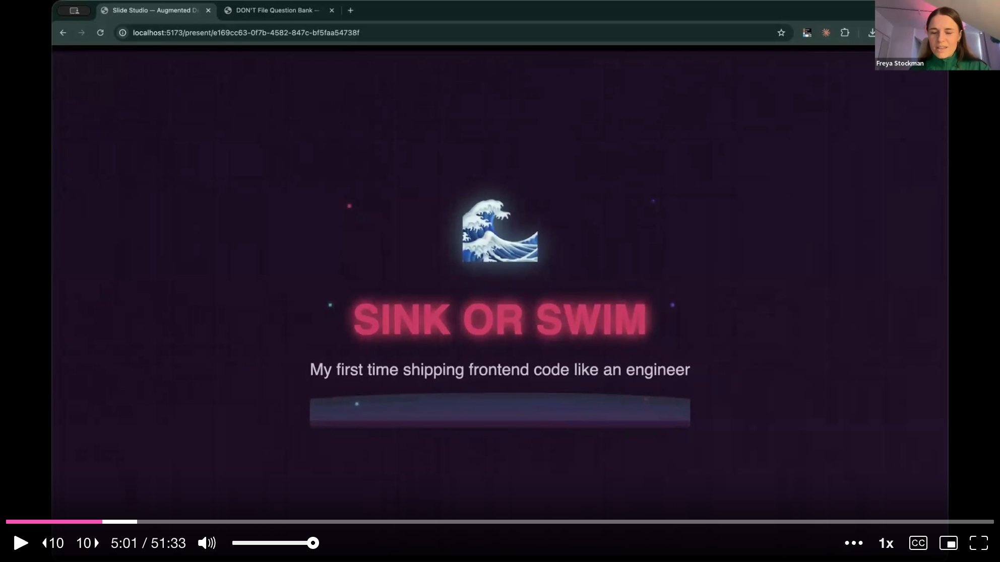

The task required her to **design and vibe-code a desktop and mobile responsive onboarding flow** for two different user types. She is a product designer with zero engineering background. The Relevance AI app is built on two separate codebases, and she had to stitch them together through the authentication flow and a chat application. One user journey served billboard visitors arriving via a specific URL, promoting a feature called Vibe Slides. The other was a general sign-up experience with standard onboarding. Both paths required conditional logic, working back-end integrations, and production-quality front-end code -- because this was the authentication flow, and it could not fail.

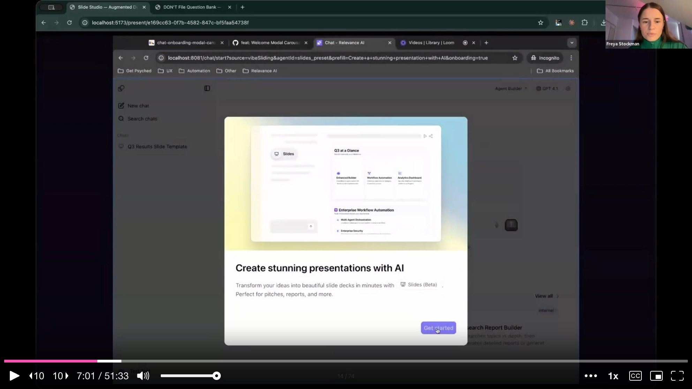

She pulled it off. Since that moment in July of the previous year, she has made **39 pull request contributions** to the production codebases at work. Her recent work includes adding a minimize button to a complex side menu, building a feature for navigating agent escalations, and creating an onboarding flow with a holographic license card animation and confetti -- all implemented through React packages discovered and wired up via AI coding tools.

---

## Everything on the Internet Is Just Text Files

Before diving into practical skills, Freya gives the audience a **crash course in the engineering mindset**. She introduces the core tools: **Cursor** as a command center for coding, **Claude Code** for terminal-based multi-agent work, **local markdown files** for documentation, and **GitHub** for version control and collaboration.

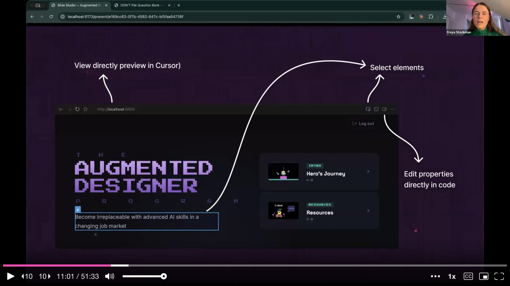

She explains **APIs and MCPs** by comparing them to a post office -- bridges between the designer and the platforms they already use. Every platform has an API key, and AI tools can talk directly to Notion, Linear, or anything else without ever switching apps. The designer just works from their command center.

The single biggest takeaway she wants the audience to internalize is deceptively simple: **all code, everything on the internet, everything on a mobile phone, is just text files.** This reframe was her biggest unlock. She does not know how to technically code, but she knows how to write prompts and documentation. AI reads and writes text files. Text files become websites, apps, APIs, and automations. Without text files, websites are broken. By understanding this, she started **working with text files intensely** -- and that changed everything.

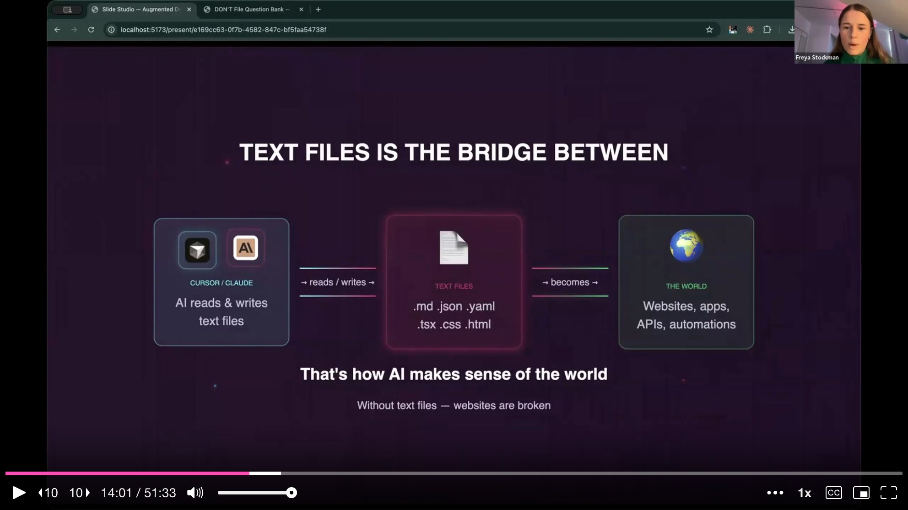

---

## GitHub Is Dropbox for Code

Freya demystifies **GitHub** with a series of plain-language analogies. A **branch** is a draft. A **commit** is a save point. A **push** uploads your branch to GitHub. A **pull request** means "pull my code and review it" -- literally proofreading for engineers. An engineer reviews, leaves comments, and the designer implements the feedback. Once approved, the code goes through end-to-end testing and gets merged for deployment.

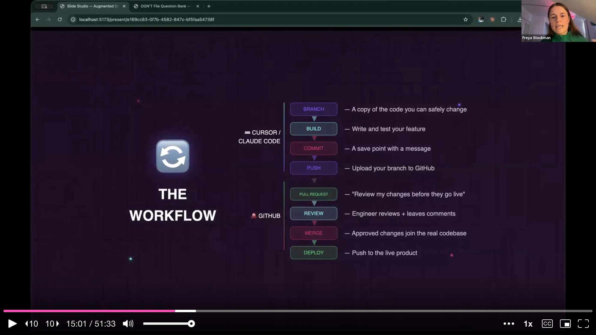

She shows the essential Git commands but immediately reassures the audience: **you do not need to memorize these.** You can just say "commit my changes" or "push my changes" in Cursor or Claude Code and the tool handles the rest. Understanding the process is enough.

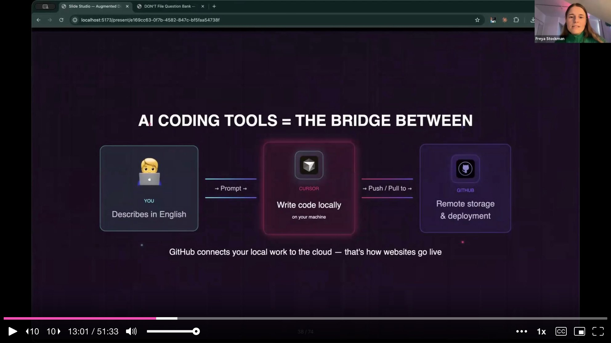

---

## The 70/20/10 Framework: Plan First, Build Later

This is the core methodology Freya uses to ship at engineering quality. The **70/20/10 rule** allocates **70% of time to planning and documentation**, 20% to implementation, and 10% to polish. The heavy upfront investment in understanding the codebase prevents the bugs and failed builds that plague less disciplined vibe coding.

Every new project -- whether a small feature uplift or a major feature -- becomes **a folder on the computer**, filled with markdown files that serve as the AI's context system. She exports Figma frames as images, adds voice-to-text narration explaining each step of the flow, and then asks the AI to write it all into a structured markdown file. This gives AI rich, persistent context it can reference at any time.

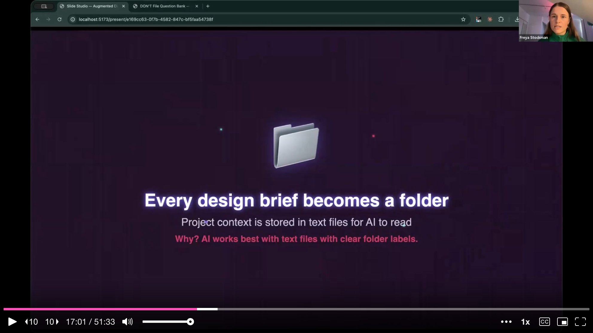

The markdown files do double duty. When AI writes back its interpretation of the flow, it starts thinking in engineering terms -- URLs, redirects, data dependencies. The designer reads this back and catches discrepancies. She describes this as **thinking like a solution architect**: mapping current components, identifying risks, understanding downstream impacts, and documenting back-end dependencies that must be tested.

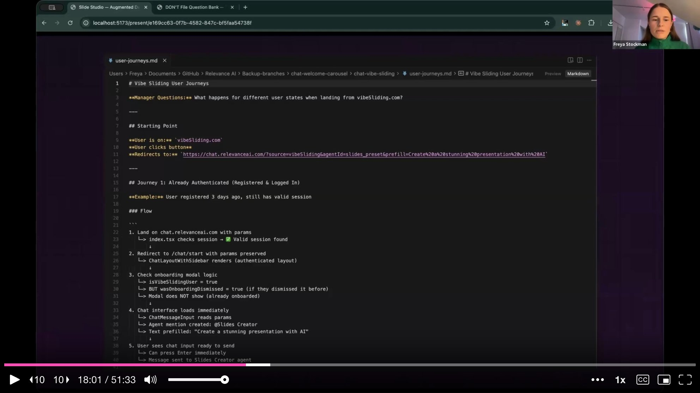

She then has **different AI models review each other's plans**. By switching models inside Cursor, she gets fresh perspectives on the phased implementation plan. Before building anything, she runs tests to verify that back-end dependencies work, API connections are live, and the flow makes sense end to end. She shows a test summary markdown file with pass/fail results for each critical integration point.

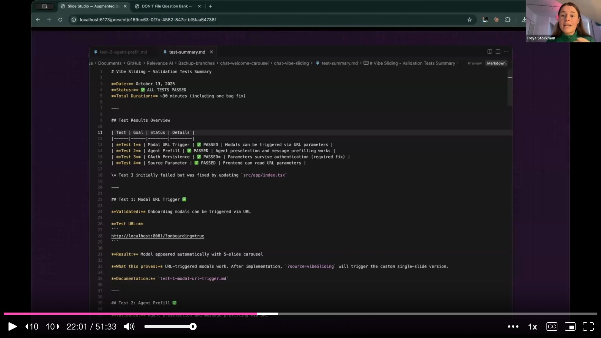

---

## Build in Stages, Tag the Don't File

Implementation follows the plan **phase by phase** in bite-sized chunks. Each stage is small enough that when something goes wrong, the problem is easy to diagnose. If you try to one-shot something complex, AI goes in circles trying to fix issues it cannot isolate.

She highlights a critical insight about AI context: **each new terminal is like a baby respawning.** AI gets progressively dumber the longer a conversation runs. By starting fresh chats and tagging the markdown documentation files, the new agent immediately has full context about what has been done, what passed, and what to do next. The upfront planning pays off precisely because it makes context-switching fast.

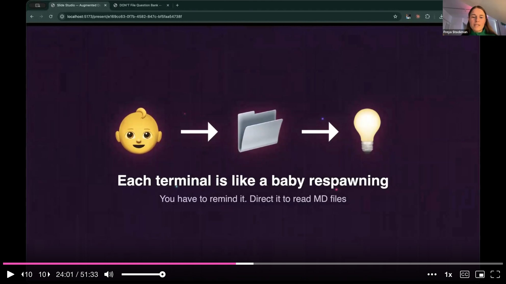

Freya then reveals what she calls **the secret sauce for shipping at engineering quality**: the "don't file." This is a large text file listing everything the AI should not do -- bad coding habits, shortcuts that engineers will reject, patterns that introduce technical debt. No matter what model is used, AI always tries to take the fastest route, and the fastest route usually means bad coding practices. Before pushing to GitHub, she references the don't file and asks the AI to audit its own work. Almost every time, it catches something it should not have done.

Beyond the don't file, her engineering team has created **custom commands and skills** -- `/create-plan`, `/research-codebase`, `/implement-plan`, `/validate-plan`, `/debug` -- that encode high-quality engineering workflows into reusable prompts. These sit on top of the built-in plan, agent, and debug modes that Cursor and Claude Code already offer.

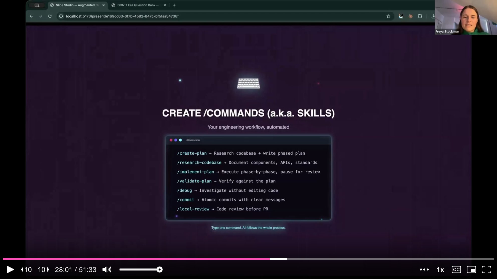

---

## Know When to Ship and When to Hand Over

Freya is emphatic that having these skills does not mean designers should do everything. The decisive question is simple: **does this need back-end work?** If the answer is yes -- new APIs, database changes, anything that does not already exist -- the designer should prototype, write it up in tickets with milestones, and hand it to an engineer. If the work is purely front-end and can leverage existing APIs and data, the designer can and should own it.

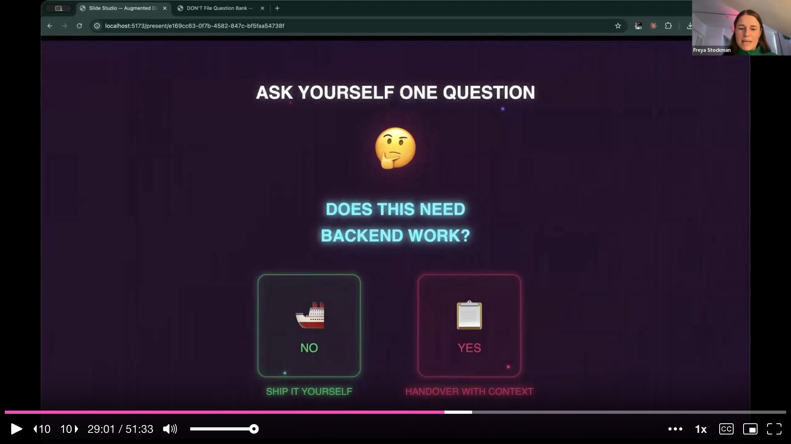

She shows an advanced prototype she built in Cursor for an analytics dashboard at Relevance AI. The dashboard has real data, dozens of interactions, and complex visualizations -- but it is a prototype because the back-end work required is far beyond what she can tackle. An engineer is now building it out from the tickets and milestones she created. Even when handing over, the prototyping skills make the handoff dramatically smoother and more precise than static designs ever could.

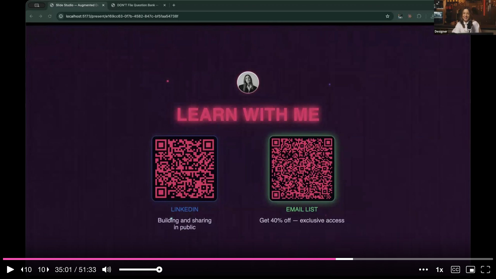

---

## The Limit Does Not Exist

Freya closes by surveying the landscape of what becomes possible once a designer develops these skills. Beyond shipping features, she has been doing **API connections, running A/B experiments from Claude Code, analyzing technical architecture**, and using the codebase to write better copy for complex enterprise features. She even built her own custom slide presentation tool -- the very slides the audience is watching run on a locally hosted app she created herself.

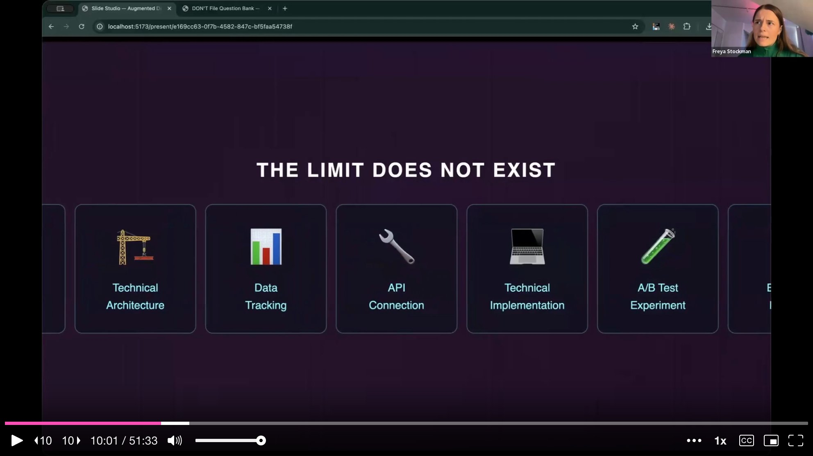

Her key takeaways are direct. First, **stop prompting alone** -- AI's first language is code and its second language is text files, so build rich context systems for every project. Second, use the codebase and Cursor to **understand the infrastructure** and make better UX decisions. Third, **plan in depth** -- thorough upfront planning reduces the risk of bugs when shipping production code.

She announces a web app she has built called **Augmented Designer**, a course platform covering everything from getting started with AI coding tools to shipping at engineering quality and building autonomous workflows. The platform itself, naturally, was built using the exact skills she just taught.

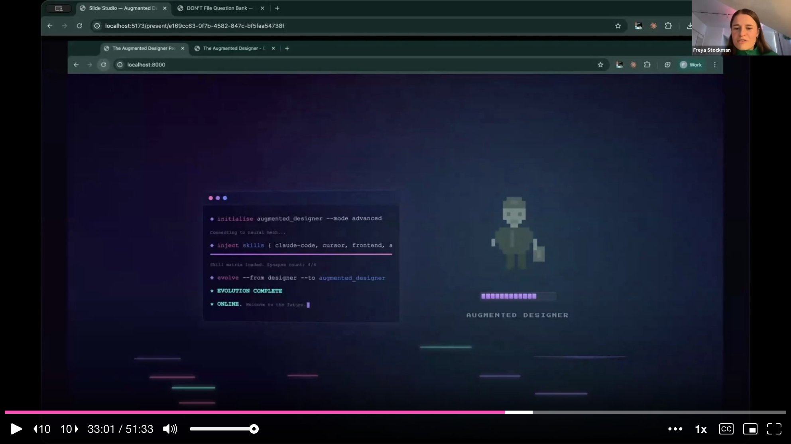

---

## Q&A Highlights

**On design exploration**: Freya still uses **Figma for high-level flows, ideation, and stakeholder communication**. She does not jump straight into Cursor. She interviews stakeholders, generates questions to untangle ambiguity, and creates scrappy happy-path mockups in Figma first. Only then does she move to Cursor for prototyping complex interactions. She stresses that designers should not stop documenting flows in Figma just because they can now ship code -- documentation tells the story that a pull request alone cannot.

**On translating Figma flows to markdown**: She exports Figma frames as images, then uses **voice-to-text dictation** to narrate the user journey over each screen. The combination of images and spoken context gets fed to AI, which writes a structured markdown file. She then reads the AI's interpretation back and corrects any misunderstandings -- a feedback loop that replaces the traditional design review but with AI as an additional participant.

**On the engineering review process**: She slots into the **same pull request review workflow** as engineers. She pushes code to GitHub, an engineer reviews it and leaves comments, and she implements the feedback. When the comments are technical and she does not fully understand them, she copies them into Cursor and asks it to fix the issues. The cycle repeats until the PR is approved and merged.

**On the don't file**: She offered to share a PDF flyer with the audience, generated live in Cursor during the Q&A, containing template questions designers can ask their engineering teams to help set up a don't file tailored to their codebase.

---

## Key Insights & Takeaways

**Spend 70% of your time planning, 20% building, 10% polishing.** Freya's 70/20/10 framework flips the typical vibe coding approach. Every project starts as a folder of markdown files: exported Figma frames, voice-to-text narration of the user journey, API dependencies, test scenarios. This heavy upfront investment prevents the bugs and failed builds that plague less disciplined AI-assisted coding. If your AI-generated code keeps breaking, you are probably under-investing in planning.

**Create a "don't file" to prevent AI from taking shortcuts.** This large text file lists every bad coding practice the AI should avoid -- patterns that introduce technical debt, shortcuts engineers will reject, habits that break production. Before pushing to GitHub, ask the AI to audit its own work against the don't file. Almost every time, it catches something it should not have done. Ask your engineering team what the top 20 anti-patterns in your codebase are and start there.

**Each new AI terminal is a blank slate -- use markdown files as persistent memory.** AI gets progressively worse the longer a conversation runs. Freya starts fresh chats frequently and points each new agent to the markdown documentation files that contain full context about what has been done, what passed, and what to do next. The upfront planning pays off precisely because it makes context-switching fast and lossless.

**Ask one question before deciding to ship or hand over: does this need back-end work?** If the task requires new APIs, database changes, or anything that does not already exist, prototype it, write it up in tickets with milestones, and hand it to an engineer. If the work is purely front-end and can leverage existing APIs and data, own it yourself. This simple heuristic keeps designers productive without overstepping into risky territory.

**Use different AI models to cross-review each other's plans.** By switching models inside Cursor, Freya gets fresh perspectives on her implementation plans before writing any code. One model might catch dependencies another missed. This cross-referential approach mirrors Baldwin's technique from the prototyping talk and consistently produces more robust plans than relying on a single model.
