# Context > Probability: Design Systems as AI Infrastructure

**Jesse Gardner** -- Director of Accessibility and Design Systems, New York State Office of Information Technology Services | Into Design Systems AI Conference 2026 | 54 min

---

## Two Demos That Set the Stage

Jesse Gardner opens with action, not theory. He introduces himself as the person who oversees both the central accessibility team and the New York State Design System -- both relatively new -- and immediately dives into two live demos of what AI can do when it has proper design system context.

**Demo one: PDF to web application.** He takes a publicly available five-page foster-adoptive parent application from New York State's Office of Children and Family Services and feeds it into Claude Code along with access to the NY State Design System MCP server. The prompt asks Claude to read the PDF, create a product requirements document, and build a multi-step front-end application using Vite and TypeScript. Claude asks some clarifying questions -- how to break up pages, how to handle multi-answer questions, whether to use local storage for save-and-continue functionality -- then queries the design system MCP server in eight steps, pulling in components, validation patterns, tokens, and layout utility classes.

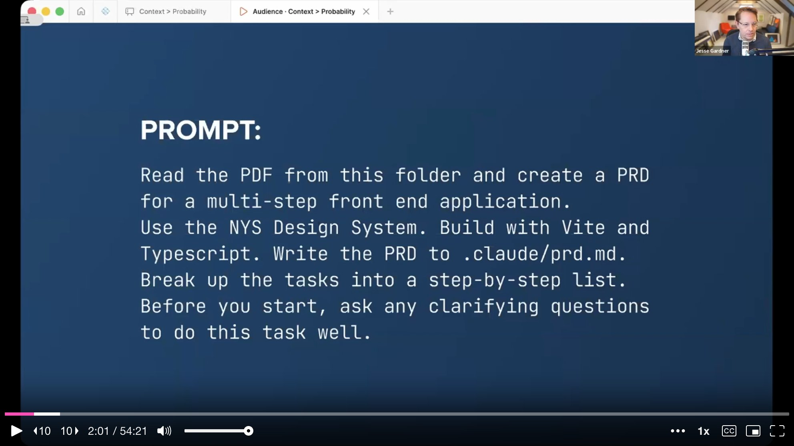

The result is a working multi-step form built in about **13 minutes**. The layout is not quite right -- Jesse discovers that the documentation for the stepper component's layout was not clear enough -- but it is a functional application that would normally take days or weeks to build.

**Demo two: interaction patterns at scale.** Having just passed the one-year anniversary of the design system launch, Jesse's team declared this the "year of patterns." He asks Claude to generate a list of the 40 most common service and interaction patterns for New York State websites, then build them all out using existing design system components, tokens, and utility classes. Where no component exists, Claude creates new ones using the appropriate design tokens. He also asks for a **gap analysis** documenting everything new that was created.

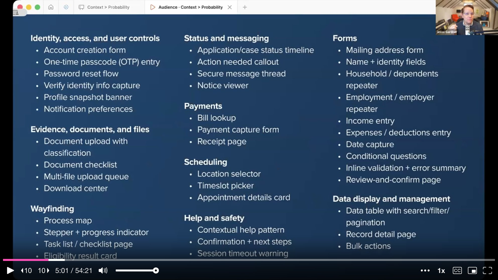

The output includes patterns like a household member repeater, OTP entry, document upload with classification, and dozens more. Jesse then uses Playwright to screenshot each pattern at both desktop and mobile sizes and drops them all into a FigJam board for his team to swarm, review, and prioritize.

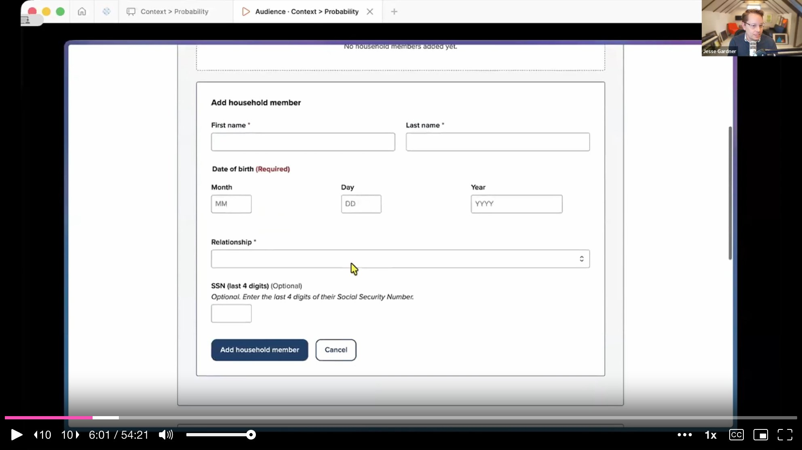

The gap analysis is immediately useful. Running components side by side at scale exposed mismatches that are invisible in isolation -- for instance, the select element's height did not match the input field's height. That kind of **design debt** only surfaces when you see things together.

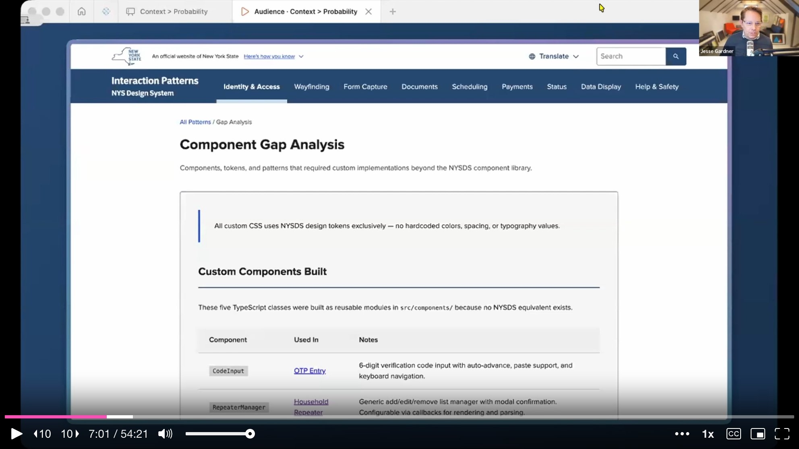

---

## "Is This Good?"

Then Jesse pauses. He steps back from the impressive demos and asks the audience a pointed question: **is this good?**

He works for New York State. His job is to make sure every resident can access the digital services they are entitled to. "Cool" is not enough. How do we know the output is accessible? How do we know those patterns are the ones residents actually need? How do we know AI produced the *correct* answer instead of the *most probable* one?

This pivot is the heart of the talk. The demos are deliberately impressive -- and deliberately incomplete. They set up the central argument that follows.

---

## The Fragmentation Problem -- Now Amplified

Jesse shows a slide of dozens of New York State websites, each with different buttons, fonts, colors, styles, and behaviors. Anyone who has worked at a large organization recognizes this immediately. **Fragmentation** happens when different teams solve the same problems in isolation, constrained by their own budgets, timelines, and expertise. Each button took time to design, code, and test. Multiply that across every form element, every agency, every digital service, and the waste is staggering.

Now add AI to the mix. He draws an analogy: every time you spin up a new AI chat, think of it as **hiring a new contractor with no brief**. Without context, the contractor will produce whatever is most probable -- the average of the internet. Ask AI to build a web application and you will most likely get Tailwind and React. Not inherently wrong, but not necessarily right for your organization either.

AI does not fix the fragmentation problem. Jesse argues it **compounds it in two ways**. The first is **speed**: AI generates vast amounts of code, fast, and if it lacks appropriate context, that output is hard to keep up with. The second is **access**: vibe coding empowers people who previously could not ship code to now bypass design and engineering review entirely.

He references a LinkedIn post by Chris Haas from ServiceNow about PMs vibe-coding ideas that bypass design and get approved by leadership -- a real struggle in many tech companies right now. The same empowerment that makes vibe coding exciting creates organizational challenges when standards matter.

---

## Context > Probability: The Core Thesis

The question is not whether AI can generate interfaces. It can. The question is **what infrastructure makes that output trustworthy and repeatable**. This is where the talk's title becomes a framework.

Without context, AI output collapses toward probability -- the statistical average of its training data. With structured context -- tokens, components, usage guidelines, accessibility standards -- the output shifts toward **correctness for your specific organization**. Design systems are not just consistency tools. They are the structured context layer that makes AI output reliable.

---

## The New York State Design System as AI Infrastructure

Jesse walks through how the NY State Design System serves as that infrastructure layer. It is a **collection of connected tools**: a code component library built on LIT and TypeScript, a Figma prototyping library with prop and token parity to the code, and a documentation reference site. The three pillars work together.

He highlights three benefits that become critical in an AI context. First, **consistency** -- not just visual consistency, but consistency in engineering approach, accessibility standards, and layout. When a vendor leaves and nobody understands the custom code they built, the organization is stuck. A design system with clear documentation and standards prevents that.

Second, **connectedness**. When AI generates custom code from scratch, that code is frozen the moment it ships. If the organization rolls out dark mode six months later, or fixes an accessibility issue, every custom-built page needs manual retrofitting. When AI builds using design system components, every product stays connected to the source. A token change, an accessibility fix, a code mod migration -- it all flows everywhere automatically.

Third, **accessibility**. Jesse's team tests components with native screen reader users -- not as a checkbox exercise, but to understand what a *great* experience looks like for someone using assistive technology. They bake accessibility into components at a fundamental level. For example, the most common accessibility issue they find across nearly 2,000 pages tested is input fields not connected to their labels. So they built label association directly into the input component, handling it under the hood.

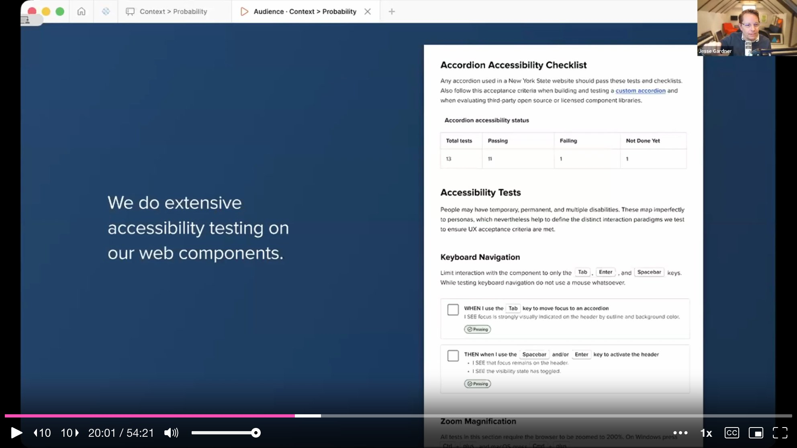

---

## Two Paths to Context: Figma MCP and the Design System MCP

Jesse presents the architecture for how context flows to AI through two complementary paths. On the **design side**, the team uses Figma's Code Connect feature to map every Figma component prop to its code counterpart. When a designer creates a comp in Figma, engineers can point to the Figma MCP server and get back actual working code snippets -- not AI guesses. He describes it as a **mail merge**: developers set up the fields, designers enter the data, and Figma runs the merge.

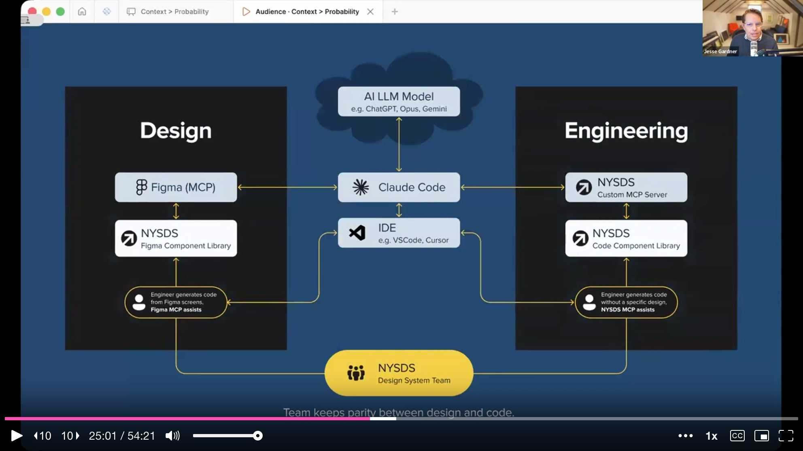

On the **engineering side**, the team built a custom NY State Design System MCP server. When a developer prompts Claude Code, the agent queries the MCP server's tools -- like `get_components` or `get_tokens` -- and receives structured documentation back. Claude then knows which components are available, what attributes each supports, and how to use them correctly.

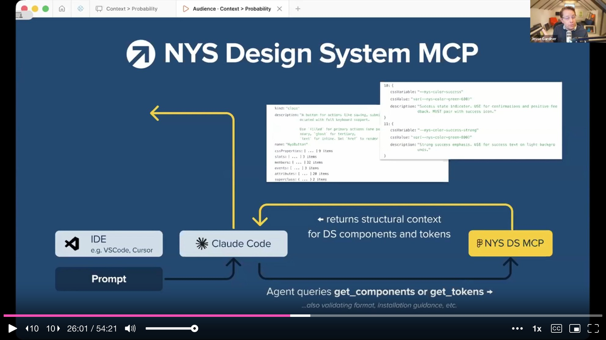

The secret sauce is what lives inside that documentation. Jesse shows the JSDoc annotations in their component source code. Every component includes not just API information but **design usage guidance**: use the "filled" variant for primary actions (one per section), "outline" for secondary, "ghost" for tertiary. That guidance was authored by the design team and helps both human engineers and AI make correct decisions.

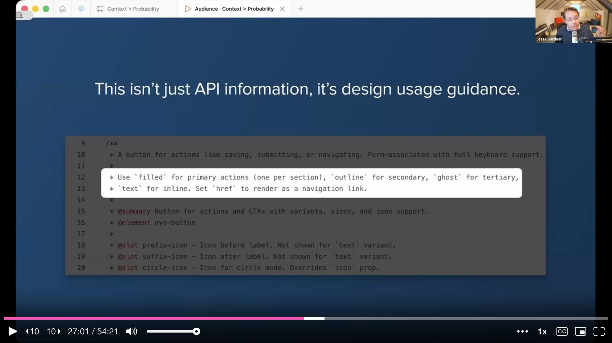

The same approach applies to tokens. When the DTCG design token standard came out, they used Claude Code to convert their CSS variables and added usage guidance alongside each token. A color is not just a hex value -- it carries semantic meaning and usage rules.

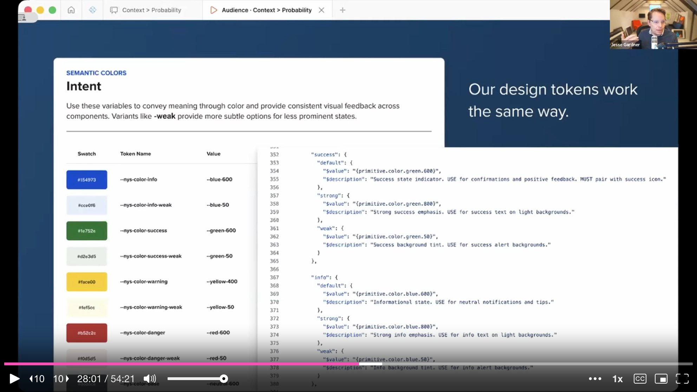

One practical detail: pointing AI directly at the raw codebase would consume 50,000 to 80,000 tokens, quickly filling up the context window. The MCP server drastically reduces that by serving only the structured documentation an agent needs for a given query.

---

## Looking Back: Where the Hard Work Still Lives

Jesse returns to his two opening demos and examines them more critically. The foster parent application looks impressive, but look closer: the form references other documents -- a medical report, a safety review form. Do those need to be incorporated? Linked? Built into one unified flow? **The policy requirements and business logic are not evident in the PDF.** They live as institutional knowledge in the heads of the teams who administer the program. AI can assemble the interface, but the human work of understanding policy, meeting with domain experts, and encoding business rules is what determines whether the form actually works for people in production.

The interaction pattern grid is equally instructive. The gap analysis was valuable, but the question remains: are these 40 patterns *good*? Can users make sense of them? Are they accessible? Without designers reviewing and standardizing around proven patterns, the project risks recreating the exact fragmentation it set out to solve -- just 40 different ways this time. **Variety is not governance.**

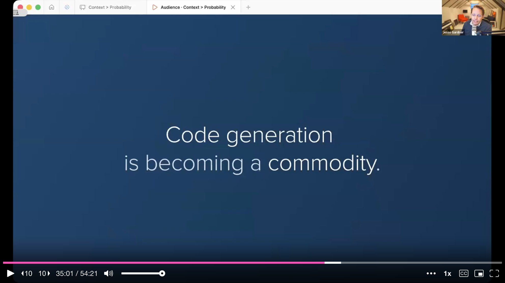

---

## The Pattern Engine and the Design System Flywheel

Jesse introduces the concept of a **pattern engine**: design guidance feeding into the design system MCP, which in turn constrains and informs AI output. Designers and engineers define how components should work. They capture those decisions into a structured, queryable system. AI generates output using that guidance. Teams review what AI produced, catch gaps and edge cases, and that feedback sharpens the guidance -- which gets encoded right back into the system.

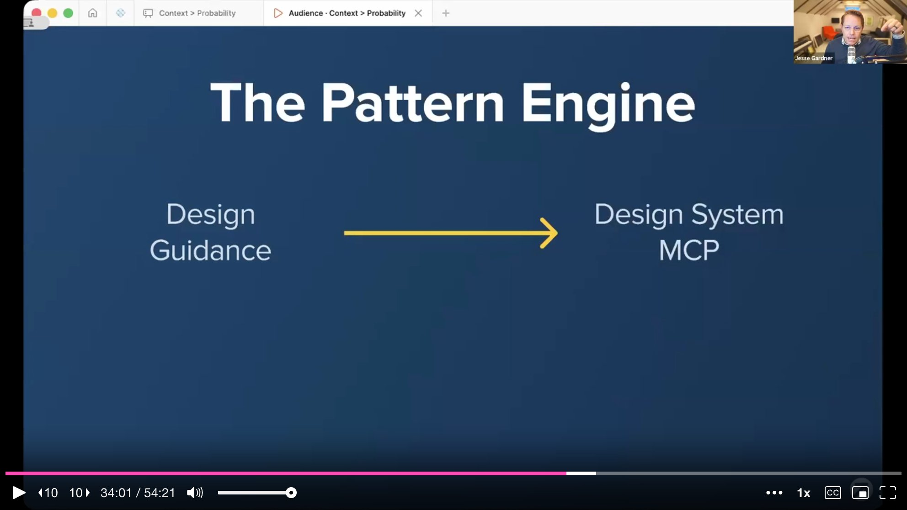

This is not a one-time setup. It is a **flywheel**. The contractor's handbook gets better every sprint. The design system is a living product that should be changing, evolving, and improving continuously.

---

## Code Generation Is a Commodity. Trustworthy Implementation Is Not.

Jesse arrives at the talk's sharpest claim. **Code generation is becoming a commodity.** What is not becoming a commodity is trustworthy implementation. That gap is where design systems matter most.

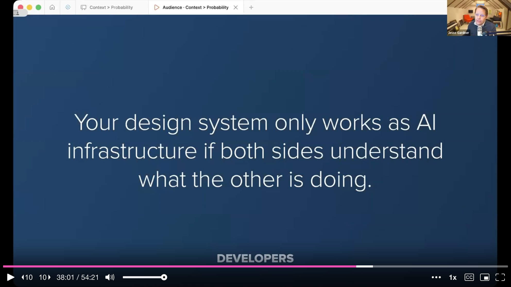

Designers, engineers, and accessibility specialists have a pivotal opportunity to influence the materials AI builds with. Governance, accessibility testing, and component decisions can become the constraints that make AI reliable. If they do not, people will simply move ahead without them -- and organizations will spend the next decade remediating instead of leading.

---

## Takeaways by Role

**For designers**: the work that matters going forward is being clear about **intent**. Figma is one way to articulate intent, but how that intent gets translated into well-structured, machine-readable code is the context AI will rely on. Designers do not necessarily need to write code, but understanding code helps them design better.

**For developers**: the design system only works as AI infrastructure if both sides understand what the other is doing. Jesse encourages engineers to pair with designers and help them understand the code side. The gap between design and code is what needs closing -- not the gap between prompts and outputs.

**For leadership**: investing in a design system is investing in core AI infrastructure. That structured context improves not just the design system team's output but everyone's across the organization. The way to get speed at scale is not to skip governance -- it is to encode governance into infrastructure.

**For AI skeptics**: healthy skepticism is valid and important, especially in the public sector. Privacy, accessibility, and governance are not checkboxes. The 30% accessibility pass rate on AI-generated pages is a real problem. But there are grounded, practical ways to leverage AI effectively when the right guardrails are in place.

---

## Reflection as Infrastructure

Jesse closes with an image of Rodin's Thinker and a simple observation: **AI makes things wicked fast, and when things move fast, reflection is the first thing to go.**

The hardest and most important work -- deciding what should be standardized, understanding what a good experience looks like for a screen reader user, determining whether a pattern is right or just fast -- requires slowing down. It requires human judgment that cannot be rushed. The design system is where that judgment lives. When AI builds from the place where teams have been reflective and intentional, it inherits that reflection. When it does not, it just goes fast -- and nobody benefits.

---

## Key Insights & Takeaways

**Context beats probability -- your design system is the structured context layer that makes AI output reliable.** Without context, AI collapses toward the statistical average of its training data (you will get Tailwind and React whether you wanted them or not). With structured context -- tokens, components, usage guidelines, accessibility standards -- output shifts toward correctness for your specific organization. Frame your design system to leadership as core AI infrastructure, not just a consistency tool.

**Embed design usage guidance directly in component source code.** Jesse's team writes JSDoc annotations that include not just API information but design decisions: "use filled variant for primary actions (one per section), outline for secondary, ghost for tertiary." This guidance is authored by the design team and consumed by both human engineers and AI agents via the MCP. If your design guidance lives only in Figma or a wiki, it is invisible to the agents writing your code.

**Build two complementary context paths: Figma MCP for designers, Design System MCP for engineers.** Jesse's architecture uses Figma Code Connect to map every design prop to its code counterpart (giving engineers working code snippets from designer comps) and a custom MCP server that serves structured documentation to coding agents. The MCP server drastically reduces token consumption compared to pointing AI at the raw codebase (50,000-80,000 tokens down to targeted queries).

**Use AI to generate interaction patterns at scale, then swarm-review them with your team.** Jesse had Claude generate 40 common service patterns using design system components, then used Playwright to screenshot each at desktop and mobile sizes and dropped them into a FigJam board for team review. The gap analysis alone -- exposing mismatches like select element height not matching input field height -- was immediately valuable. This is a repeatable technique for any team entering a "year of patterns."

**Reflection is the counterweight to speed -- do not let AI make you skip the hard thinking.** Jesse's most pointed insight: AI makes things wicked fast, and when things move fast, reflection is the first thing to go. The hardest work -- deciding what should be standardized, understanding what a great screen reader experience looks like, determining whether a pattern is right or just fast -- requires slowing down. Build reflection checkpoints into your AI-assisted workflows.
