# Encoding Governance on Agentic Design Systems

**Speaker**: Cristian Morales Achiardi -- Design Engineer, Enara Health
**Conference**: Into Design Systems AI Conference 2026 | 38 min

---

## The Core Value: Cognitive Reallocation

Cristian opens with a foundational claim: the real value of a design system is not in its components. It is in **cognitive reallocation** -- the ability to remove solved problems from every consumer's mental load. Spacing, color, typography, component behavior -- these are decisions that should never require attention twice. When a design system works, it frees teams to redirect that attention toward the problems that actually matter.

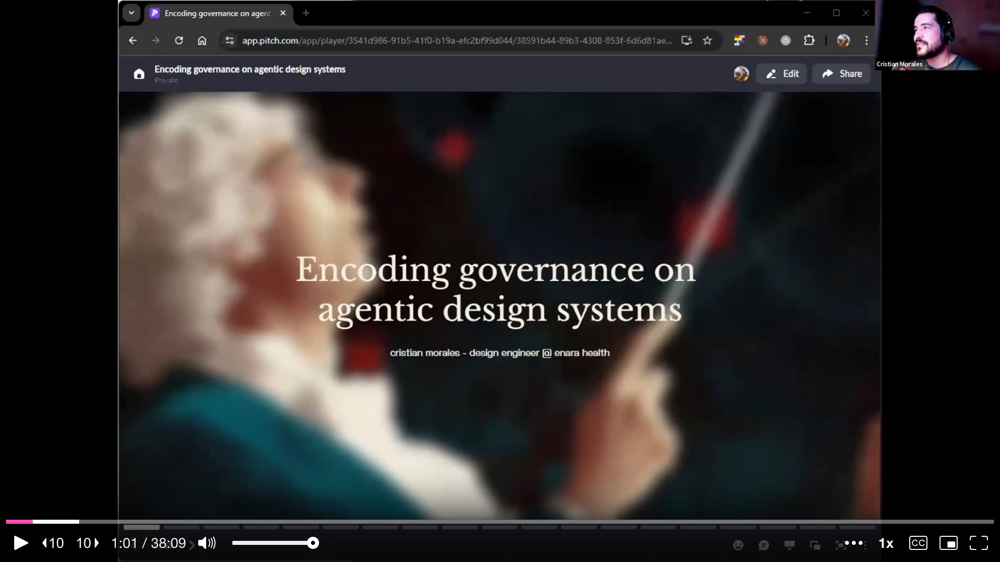

But there is a catch. **Governance has always been a luxury.** The cost of enforcing standards manually exceeds what most teams can sustain. He cites the Zeroheight Design Systems Report, released just two days before this talk: the most common design system team size is three to five people, 60% have zero token pipeline automation, and 61% feel understaffed. Design system teams simply do not scale with company size.

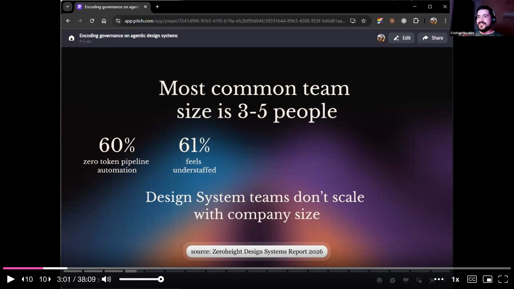

---

## The Source of Truth Problem

Different roles have different sources of truth. For designers, it might be Figma. For developers, Storybook or the codebase. For product managers, a spreadsheet. The problem, Cristian argues, is that **these multiple "truths" inevitably diverge.**

His proposal: choose the source of truth that cannot die -- and make it explicit through **code contracts**. This is not about treating existing code as its own standard of correctness. It is about using infrastructure to ensure code follows a specification. The contracts encode **normative decisions** -- what are the correct tokens, the correct component structure, the correct composition patterns -- so that enforcement becomes automatic rather than aspirational.

---

## Four Structural Layers of an Agentic Design System

Cristian introduces a four-layer architecture that forms the backbone of his approach. Each layer eliminates a specific category of AI failure, and each depends on the one below it.

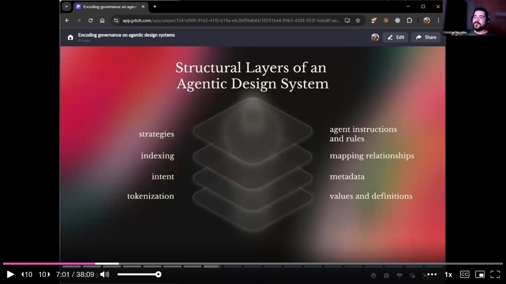

**Layer 1: Tokenization** provides values and definitions. Raw values become curated sets, eliminating the **infinite decision space** of arbitrary choices. **Layer 2: Intent** holds component metadata -- use cases, composition patterns, dos and don'ts, accessibility considerations. This eliminates **interpretation**, turning design decisions into contracts rather than prose. **Layer 3: Indexing** maps all relationships between components and tokens, giving the AI a complete map of the codebase. This eliminates **exploration** -- the AI consults the map instead of searching. **Layer 4: Strategies** contain agent instructions, rules, and skills. This eliminates **improvisation**, ensuring the agent follows an encoded methodology instead of inventing a new approach each time.

If tokens are wrong, metadata describes wrong components. If metadata is missing, the index maps to nothing. If the index is incomplete, strategies cannot operate. The layers are a dependency chain.

---

## Infrastructure and Tooling

He walks through the concrete infrastructure powering this at Enara Health. The strategy layer breaks into three parts: **instructions**, **rules**, and **skills**.

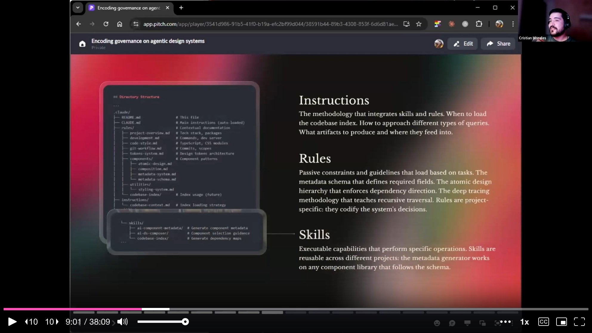

**Instructions** are the global methodology -- they define when to load the codebase index, how to approach different types of queries, and what artifacts to produce. **Rules** are passive constraints loaded based on the task at hand: memory management strategies, the atomic design hierarchy, and a "deep tracing" methodology that maps the full component tree. **Skills** are reusable capabilities that perform specific operations -- scaffolding a component, auditing tokens, generating documentation. Skills are portable across projects; rules tend to be project-specific.

---

## Consumer vs. Maintainer: Two Agent Roles

Cristian draws a critical distinction between two modes of interacting with a design system. A **consumer** -- whether human or AI -- reads documentation, understands a component, implements it, and moves forward. A **maintainer** audits the codebase structure, identifies technical debt and drift, proposes architectural improvements, and enforces contracts.

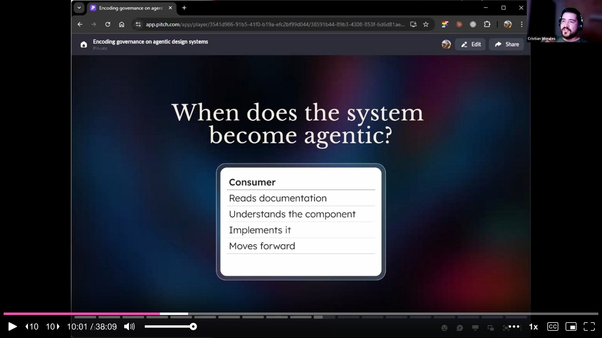

The system becomes truly **agentic** when both roles can be AI-assisted. It is not just a better-indexed component library. It is an environment where agents can autonomously maintain and enforce the standards that were encoded into the system.

---

## Layer by Layer: The Implementation

Cristian switches from slides to a FigJam board to walk through each layer in detail.

**The Tokenization Layer** starts with a W3C-spec-compliant design token JSON file as the source of truth. From there, Style Dictionary exports tokens to whatever platform the product needs, and the same tokens sync into Figma. But the real differentiator is the **token auditor skill**. This is not a simple linter that checks whether a token is being used -- it checks whether the **correct token** is being used for a given context. Elevation hierarchy, semantic color models, and typography rules are encoded as explicit constraints.

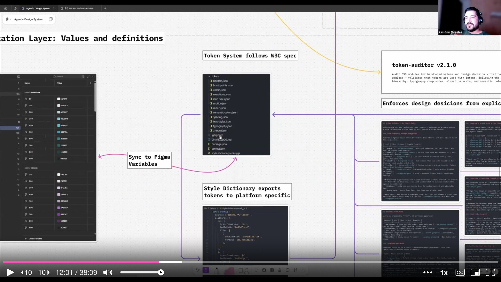

The auditor produces **schematized reports** -- every report follows the same structure, so you can compare reports over time and track whether the system is healing itself.

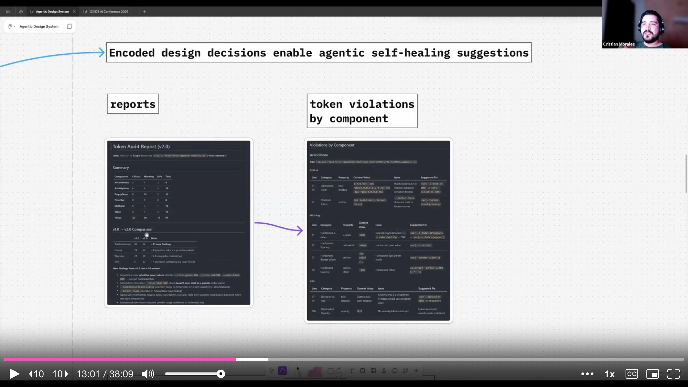

**The Intent Layer** is where component metadata lives. Cristian uses a TypeScript schema to generate metadata files for each component. TypeScript is deliberate: it gives AI a structured header it can scan quickly before drilling into use cases, composition patterns, anti-patterns, and accessibility notes -- the same way a developer scans an API reference.

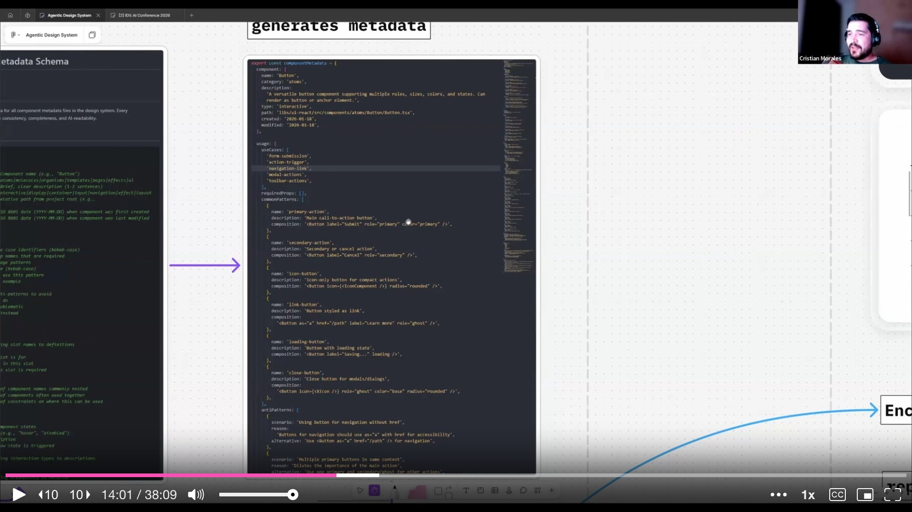

A related skill in this layer is the **scaffold component** skill. It enforces that every new component ships with five files: React component logic, a CSS module, a metadata file, unit tests, and barrel exports. This standardized structure means every component is documentation-ready from birth.

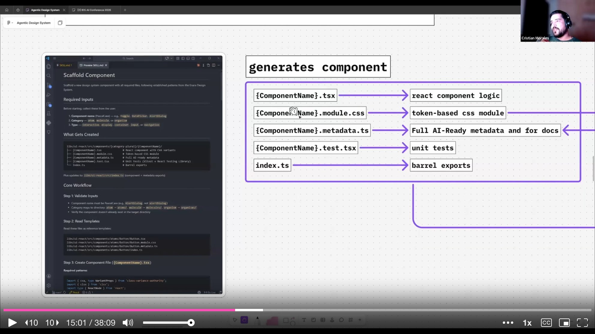

**The Indexing Layer** uses a **codebase index** skill that runs a script to generate three artifacts: an `index.toon` file mapping the entire library, a `component-usage.toon` file tracking relationships between components, and a `design-tokens.toon` file mapping component-to-token relationships. Regenerating the entire world map takes about 10 seconds after any new component is added.

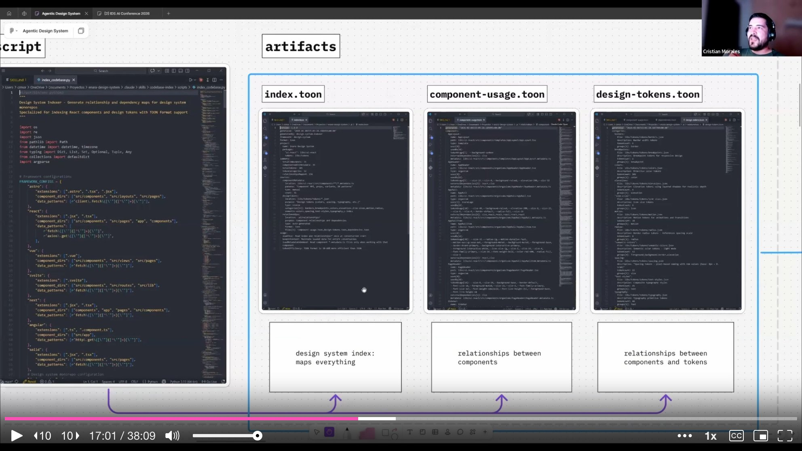

---

## Benchmarks: The Infrastructure Pays for Itself

Cristian shares benchmark data from testing his agentic infrastructure against a control group (the same system without any of the encoded layers).

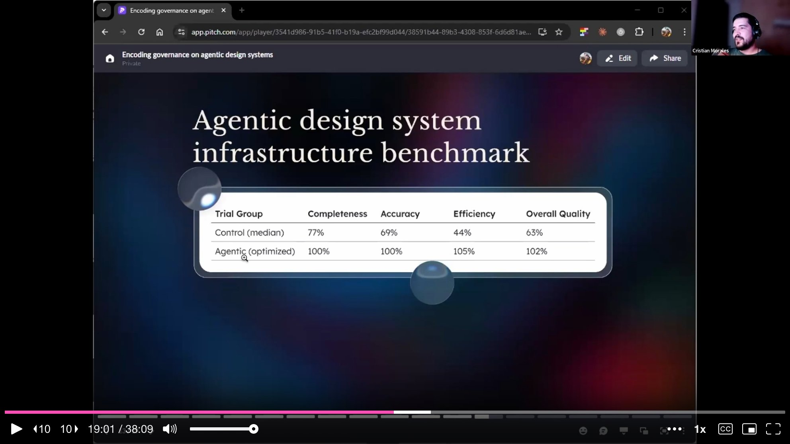

The control group achieved 77% component completeness, 69% accuracy, 44% efficiency, and 65% overall quality. The agentic setup with optimized infrastructure hit **100% completeness, 100% accuracy, 105% efficiency, and 102% overall quality**. His initial hypothesis that the infrastructure would reduce token cost turned out to be wrong -- token usage was comparable (27,211 vs. 28,566). But the **compounding savings** are where it pays off. Because the infrastructure already knows where everything is, iteration cost drops dramatically. Each subsequent task benefits from the existing map.

He gives a pointed example: a design system health report from a SaaS tool like Omlet costs around $169 per month. Running the same report through his agentic setup costs **$0.20** -- and produces a schematized, comparable output every time.

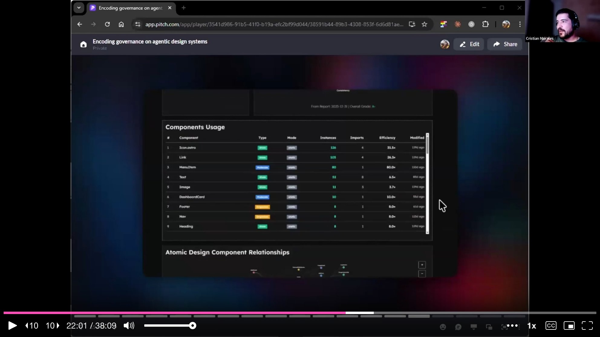

---

## Governance Becomes an Output

The entire documentation website at Enara Health is generated from the codebase. It is an Astro site that Claude built autonomously. No manual sync, no separate documentation effort. The documentation skill aggregates component logic, metadata, and design specs into a complete site.

Cristian closes the presentation portion with a reframe. Only 5% of design system teams measure ROI. But when the **outputs** of your system are component pipelines, automated documentation, self-auditing, real-time adoption reports, and a single enforceable source of truth, governance stops being a luxury. **Governance becomes an output** -- a natural byproduct of how the system is built.

As a sole designer on a team of 11 developers, he does not need to fight for a seat at the table. He brings his own chair.

---

## Q&A Highlights

**On setup time and ROI**: Cristian started building this infrastructure when Claude Code launched, roughly eight to nine months before the talk. He spent a few months designing the system in Figma, then a single weekend standing up the repo, token system, documentation website, and first six components. Two weeks later, the team had 50 components built to spec -- because the specs were encoded into the skills.

**On MCPs vs. skills**: For Enara's team, MCPs do not make sense because everyone has direct codebase access. Skills are more efficient and portable -- he can point a skill at any project. MCPs make more sense for larger teams where access control matters, or when teams need a shared managed interface to tooling they cannot directly clone.

**On Figma's role**: Figma is now slowing him down. As the sole designer, he prototypes through branches, shows components directly, and builds in code. Figma has shifted to a tool for visual flow diagrams -- taking screenshots of prototypes and connecting them in Figma to visualize user flows, rather than designing components there.

**On fixing legacy systems**: He recommends the same approach -- set up guidelines, ask Claude to audit the codebase, generate a report, and iterate from there. The key warning: if your code is not well-structured, scaling an agentic approach will just scale the problems faster.

---

## Key Insights & Takeaways

**Build four structural layers to eliminate four categories of AI failure.** Cristian's architecture stacks tokenization (eliminates arbitrary choices), intent metadata (eliminates interpretation), indexing (eliminates aimless exploration), and strategies (eliminates improvisation). Each layer depends on the one below it. If your tokens are wrong, metadata describes wrong components. If metadata is missing, the index maps to nothing. Start at the bottom and build up -- do not skip layers.

**Enforce that every new component ships with five files from birth.** Cristian's scaffold component skill requires React logic, a CSS module, a metadata file, unit tests, and barrel exports for every component. This standardized structure means every component is documentation-ready and agent-readable from day one, eliminating the common pattern of "we'll add docs later" that never happens. Encode this as a skill so the AI cannot create a component without all five pieces.

**Use schematized audit reports to track system health over time.** The token auditor does not just check whether a token is used -- it checks whether the correct token is used for a given context (elevation hierarchy, semantic color models, typography rules). Every report follows the same schema, so you can compare reports over time and track whether the system is healing. At $0.20 per health report versus $169/month for a SaaS equivalent, the economics are compelling.

**Generate your documentation site directly from the codebase.** Cristian's entire documentation website is an Astro site that Claude built autonomously by aggregating component logic, metadata, and design specs. No manual sync, no separate documentation effort. When you eliminate the gap between code and docs, documentation drift -- the silent killer of every design system -- simply stops happening.

**Governance becomes an output, not a luxury, when you encode it into infrastructure.** Only 5% of design system teams measure ROI. But when your system automatically produces component pipelines, self-auditing reports, real-time adoption data, and a single enforceable source of truth, the ROI becomes visible by default. Cristian set up his repo, token system, documentation site, and first six components in a single weekend, then had 50 components built to spec in two weeks -- because the specs were encoded into the skills.
