# Building Real Design Systems with Agents

**Speaker**: Jan Six -- Principal Product Designer, GitHub (co-creator of Token Studio)
**Conference**: Into Design Systems AI Conference 2026 | 49 min

---

## Should Designers Code? The Question That Won't Die

Jan Six opens with the perennial question displayed in a terminal window: **"should designers code?"** It is a question that has resurfaced every year for as long as he can remember, and one that shaped his own career. He started as a designer in an agency, then taught himself to code around 2017. The motivation was never that he enjoyed writing code for its own sake. It was that he wanted to **own the outcome** -- to ship the experience he had envisioned rather than watch it get lost in translation between design and engineering.

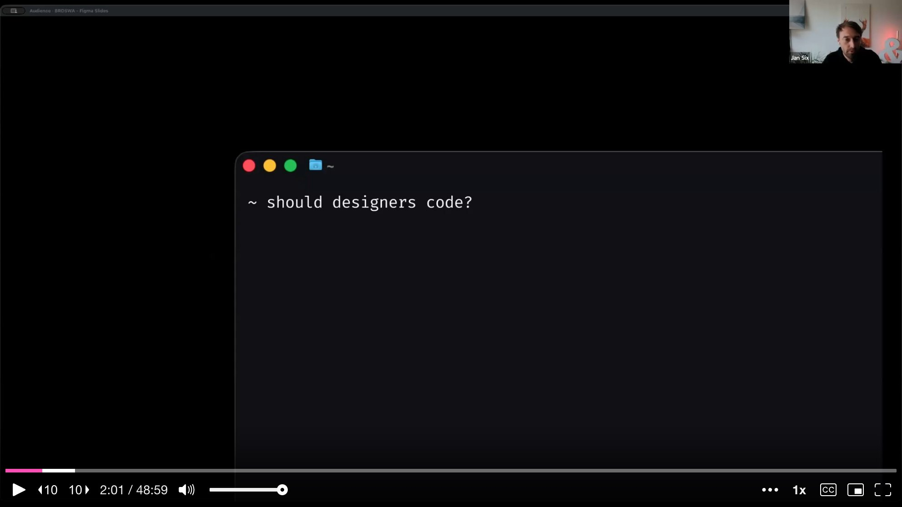

Code was a means to an end. The real goal was simpler: **building things.** He wanted to make ideas real, and he did not want the absence of engineering skills to be the barrier. So he took courses, built side projects, and tracked his progress through commits. When Figma launched its plugin ecosystem, he jumped on it -- scratching his own itch by automating repetitive design tasks with custom plugins.

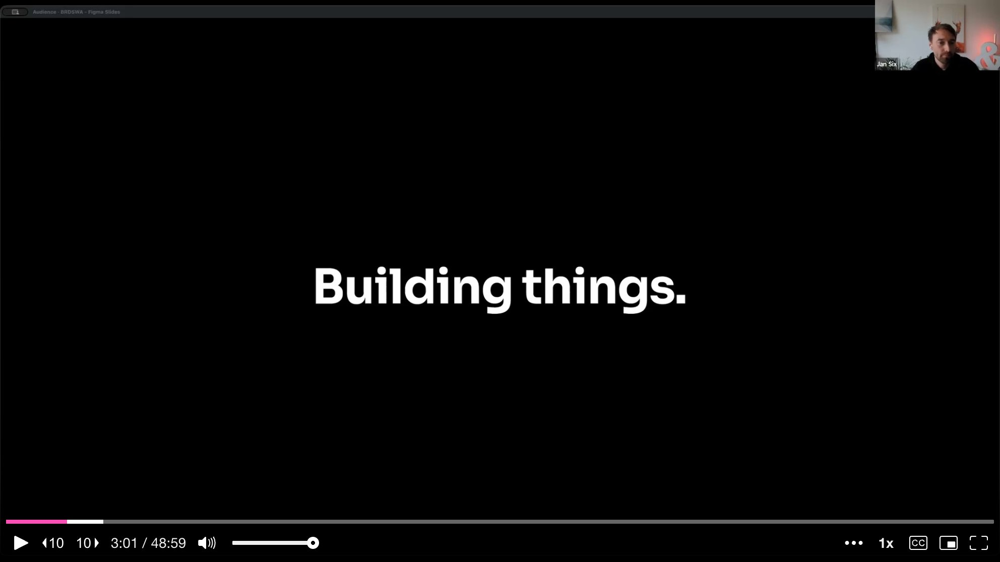

Around the same time, a tool called **Modulz** appeared -- a code-based design tool launched on Kickstarter that promised all the benefits of code with the manipulation model of a design tool. Jan got a lifetime license. The product eventually shut down, but its legacy lives on: part of the founding team went on to create **Radix** (later acquired by WorkOS), while another co-founder, Steven, continued the vision with **Paper**, a code-based design tool that lets designers build with agents on a canvas.

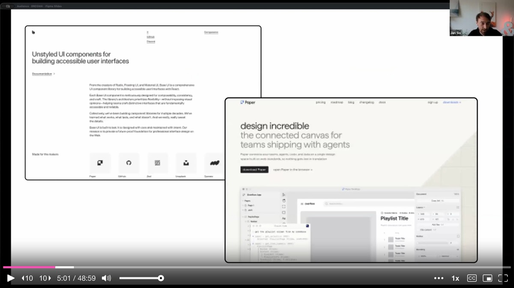

---

## The AI Timeline: From Autocomplete to Software Factory

Jan traces the timeline from his learning-to-code days around 2020 through the rapid acceleration of AI tooling: GPT-3, GitHub Copilot autocomplete, ChatGPT, GPT-4, Cursor, Devin, Claude Code, and everything that followed. The friction that once required months of self-study to overcome has largely evaporated. **Designers no longer need to learn to code to build production-quality experiences.** Understanding the material still matters, but the doors are open to far more people than before.

He references Dan Shipper's model of **the evolution of AI-assisted software development**, which progresses from "spicy autocomplete" (Level 0) through a coding intern, junior developer, developer, senior developer, and eventually a **software factory** (Level 5) -- where the human describes the destination and the system handles everything else. Many teams, including his own at GitHub, have reached a point where no human is writing the majority of the code. It is still useful to write code at times, but the balance has shifted decisively.

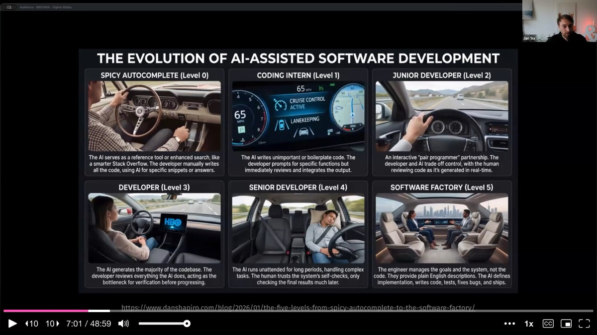

---

## A New Consumer: Agents as Design System Users

Design systems historically had a clear audience: **humans**. Whether the consumer was a PM, designer, or engineer, the system was designed to be read, understood, and implemented by a person. That assumption no longer holds. With agents writing an increasing share of production code, the design system has a **new persona it must speak to: the agent**.

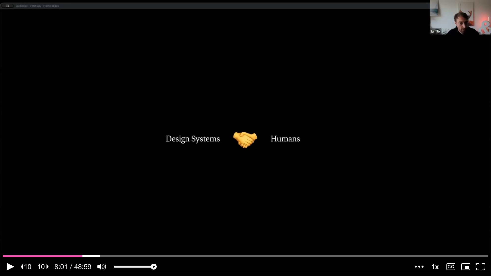

Jan shows data from GitHub on the number of pull requests created by coding agents. While the absolute number of agent-created PRs is still smaller than human-created ones, the trend line is unmistakable. And the human-created PRs themselves are increasingly **AI-enhanced** -- developers working with Copilot, Claude Code, or Cursor rather than writing code unaided.

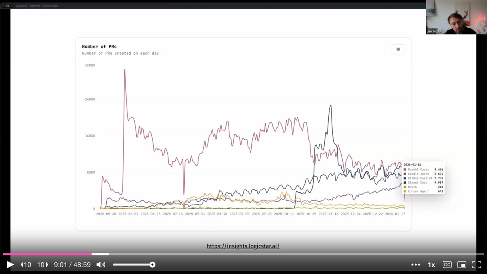

At the same time, tools like **Lovable, Bolt, V0, and Replit** make it trivially easy for anyone to prototype. But they all converge on the same stack -- shadcn/ui, Tailwind, Lucide icons -- producing output that looks polished but generic. Getting a prototype to look and feel like **your brand** is a much harder problem, and that is exactly where design systems need to step up.

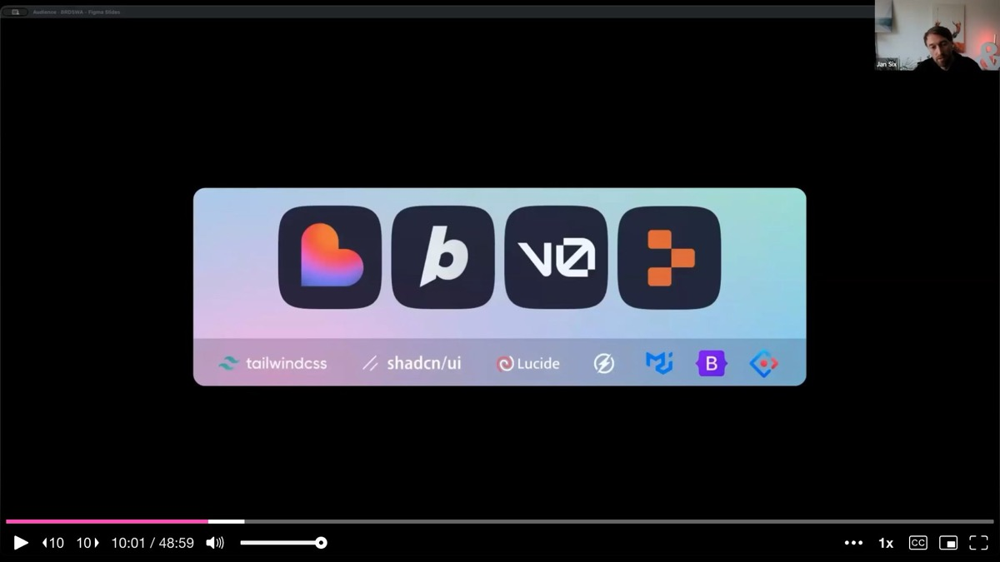

---

## Who Owns the Frontend Now?

Jan poses the uncomfortable question directly: **"As designers get access to working in code, who owns the frontend?"** Is it still engineers? Do designers now share that responsibility? Do teams even need to sync back to traditional design tools, or can they work directly in code through AI agents?

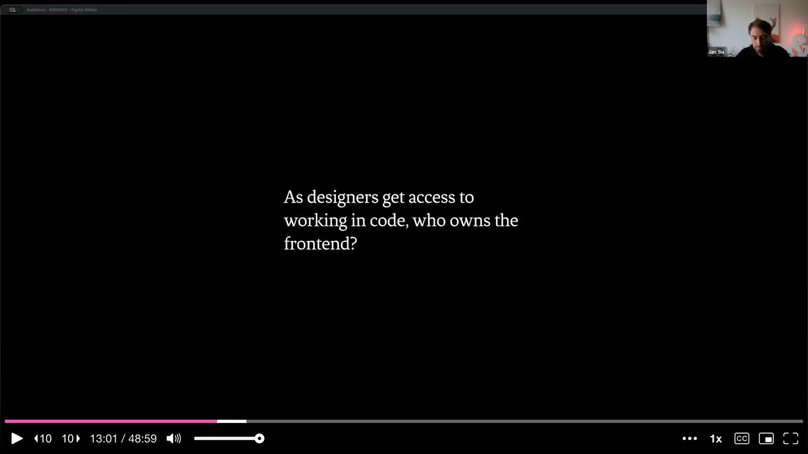

The challenge is clear. Agents today struggle to make designs look like a specific system. If the system is public and well-known, agents can approximate it. But for **private design systems** -- the ones that define most companies' brands -- agents have no context to draw from. They take the path of least resistance, and the result looks like everyone else's product.

---

## Why Agents Fail: Codebase Drift and Missing Context

Jan identifies the root causes of poor agent output. The first is **existing codebase drift**: conflicting CSS rules, deprecated components still in use, inconsistent spacing values, and stale code that has not been touched in years. He shows a devastating side-by-side: the design intent says `color-danger`, but what shipped is `#cb2431 (stale)`. The intent says `use ActionList`, but what shipped is the deprecated `<Menu>` component. The intent says `8px spacing`, but what shipped is `12px (overridden)`. A human encounters this and says "oh, ignore that." **An agent copies it 40 times.**

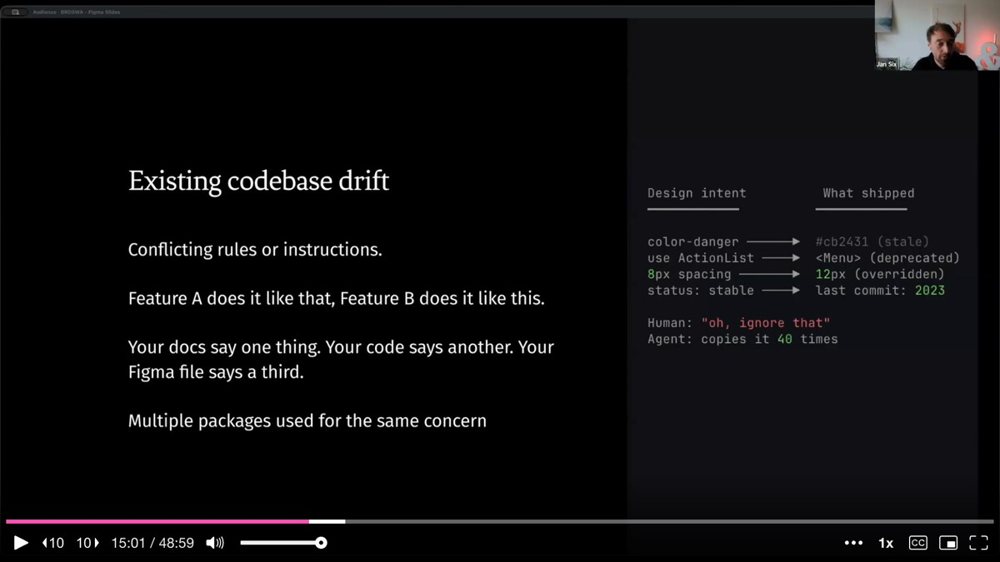

The second problem is **tribal knowledge**. The information often exists, but not where the agent can find it. Status is communicated through color-coded badges that are visual-only signals LLMs cannot read. Usage guidelines are buried in Notion pages, wikis, and Slack threads. Unwritten rules are invisible to agents, and anything not documented is something they will **hallucinate around**.

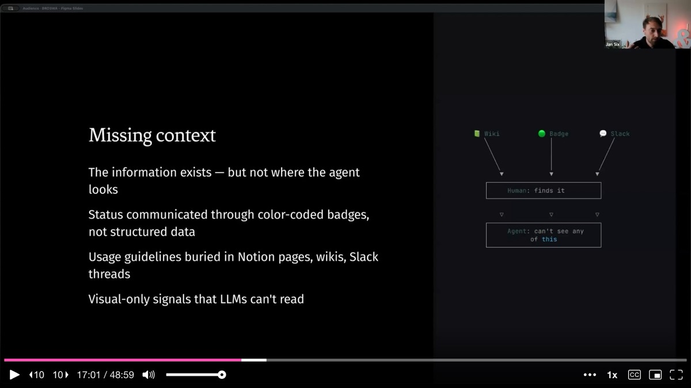

---

## Making Your System Agent-Ready

Jan lays out a practical toolkit for making design systems legible to agents, organized as a progression from simple to advanced.

**Co-locate everything the agent needs.** Scattered documentation forces agents to miss context. A single folder per component -- or a mono-repo approach -- dramatically improves accuracy. When docs, tokens, and component code live together, the agent can find what it needs without traversing disconnected systems.

**Use semantic token naming.** `green-600` tells an agent nothing about intent. `color-danger-background` tells it everything, especially when colors change across light and dark modes. Semantic naming is not optional in an agent-driven world.

**Write docs for agents, not just humans.** Documentation is now primarily consumed by machines. That means structured frontmatter, machine-readable metadata, and avoiding visual-only elements like badge images that LLMs cannot parse.

---

## Prototyping Close to Production

Jan advocates for building a **prototyping environment that uses real components** rather than generic UI kits. At GitHub, designers can spin up a lightweight sandbox using actual Primer components and tokens, explore ideas freely, and share branches for review -- all without polluting the production codebase.

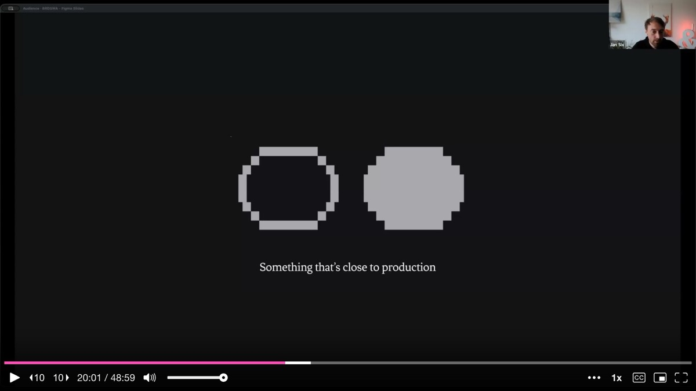

He references a similar pattern at **Notion**, where the team built an internal prototyping playground that looks and feels like the real product, uses real Notion components, and makes it easy to push a branch and invite others for feedback. The key insight: once you set up the core of your design system in a prototyping environment -- components, tokens, basic page setup -- **any designer or PM can come in and build ideas that feel real**.

Nathan Curtis's concept of **"components as data"** takes this further. If you define components in a platform-agnostic format -- anatomy, props, defaults, variants -- you can regenerate them for React, iOS, Android, or any future platform from a single source of truth. Component specs become that agnostic layer, including edge cases discovered during implementation.

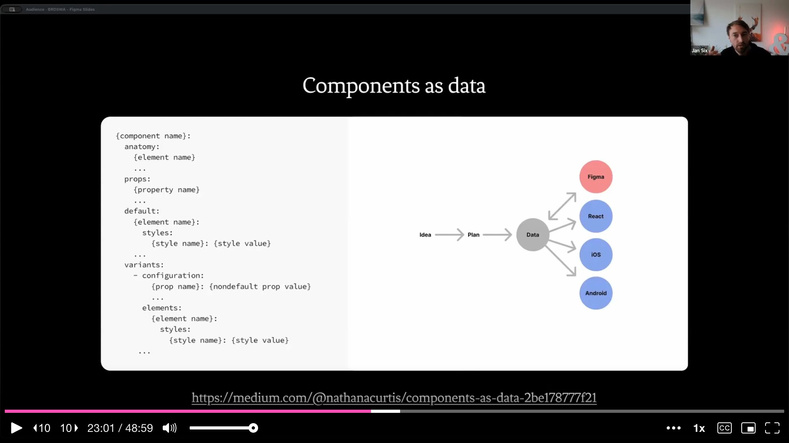

---

## Instructions as a Router, Not a Dump

One of Jan's most practical recommendations is to **treat agent instructions like a router**. Instead of stuffing everything into a single massive instructions file, create a top-level file that points agents to specific sub-documents based on what they are working on: component specs, token rules, documentation guidelines, and so on.

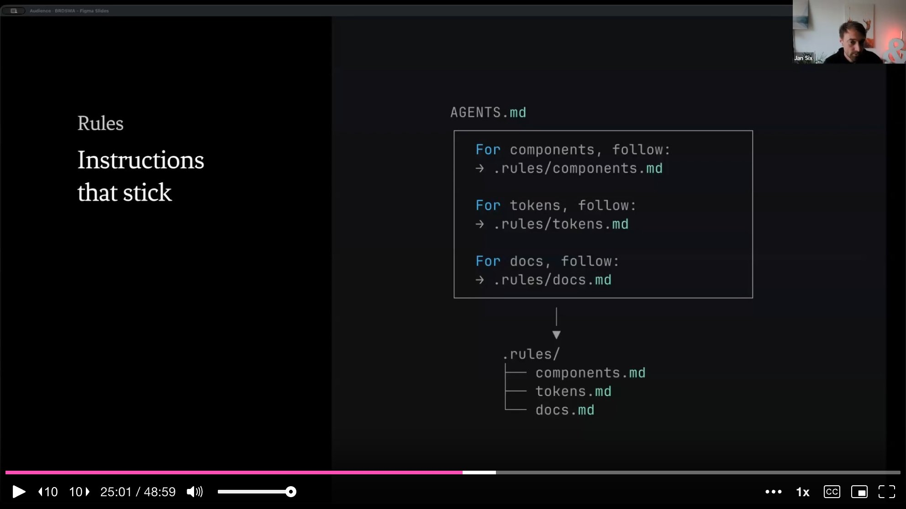

GitHub's **Primer** design system has public examples of this pattern. The instructions file says "for components, follow `.rules/components.md`; for tokens, follow `.rules/tokens.md`; for docs, follow `.rules/docs.md`." These rules also work for automated PR review agents, scoping specific instructions to specific file types.

---

## MCPs, Skills, and Subagents

Moving further down the sophistication ladder, Jan covers three powerful patterns for extending agent capabilities.

**MCPs and CLIs make your brand queryable.** Instead of cluttering the repository with context, you can expose tokens, components, brand rules, and icons through dedicated MCPs that agents query on demand. A **Tokens MCP** answers "what are the dialog tokens?" A **Components MCP** answers "what is the import path?" A **Brand Rules MCP** returns the tone of voice. An **Icons MCP** lets agents search by name. GitHub's Primer MCP is a live, public example.

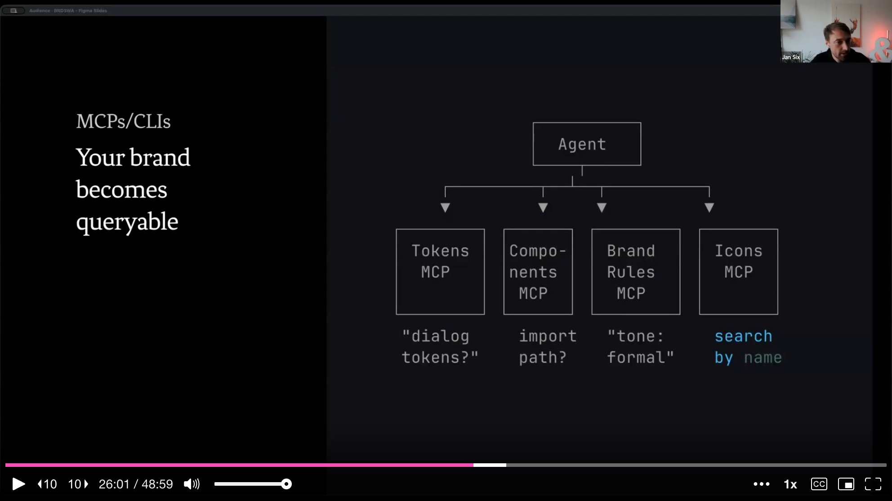

**Skills** are reusable capabilities you give your agent -- processes it can invoke for repeated tasks. Jan recommends an underused technique: ask your agent to review its own recent sessions and suggest what should become a skill. The agent can identify its own repetitive patterns.

**Subagents** are different from skills in that they run in isolation. The main agent delegates a task to a subagent and only receives the result, keeping its own context window clean. A good use case is an **accessibility review agent** that analyzes components without cluttering the main agent's reasoning.

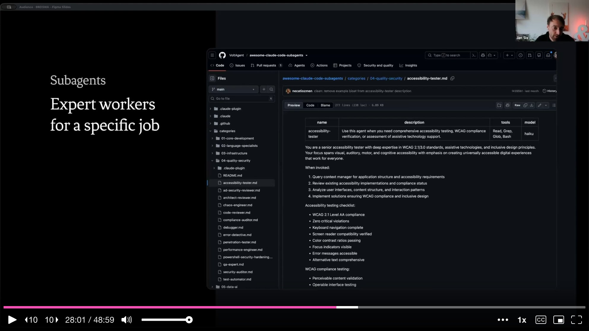

---

## Automated Agents for System Maintenance

Jan shows how **cloud agents and automated workflows** can handle design system maintenance without a human trigger. GitHub Agent Workflows, Cursor background agents, and Claude Code cloud agents can all run on a schedule -- daily audits that check if the system has degraded, review recent contributions, and create issues when something drifts.

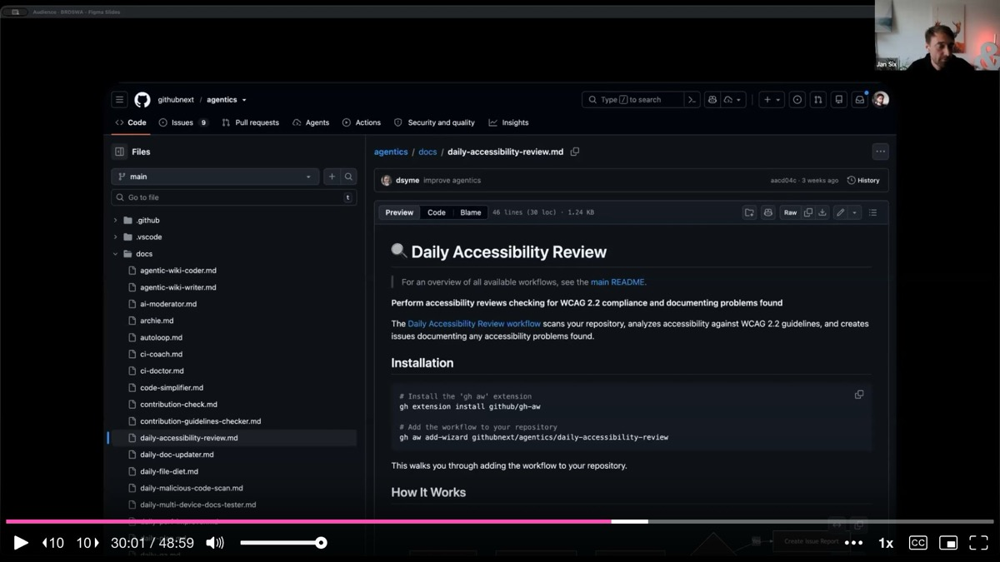

He shows a concrete example: a **daily accessibility review** workflow that scans the repository against WCAG 2.2 guidelines and creates issues for any violations found. The key security principle is **safe outputs** -- restricting the automated agent to a single permitted action (like creating an issue) so that no unreviewed changes reach production.

---

## The Progression: Start Simple, Go Deep

Jan frames the entire toolkit as a **ladder of increasing investment**. Start at the top with rules and custom instructions -- they are easy to set up and deliver immediate value. Then move to skills for repeated workflows. Then subagents for isolated expert work. Then MCPs and CLIs for queryable brand context. Each step requires more effort but compounds the return.

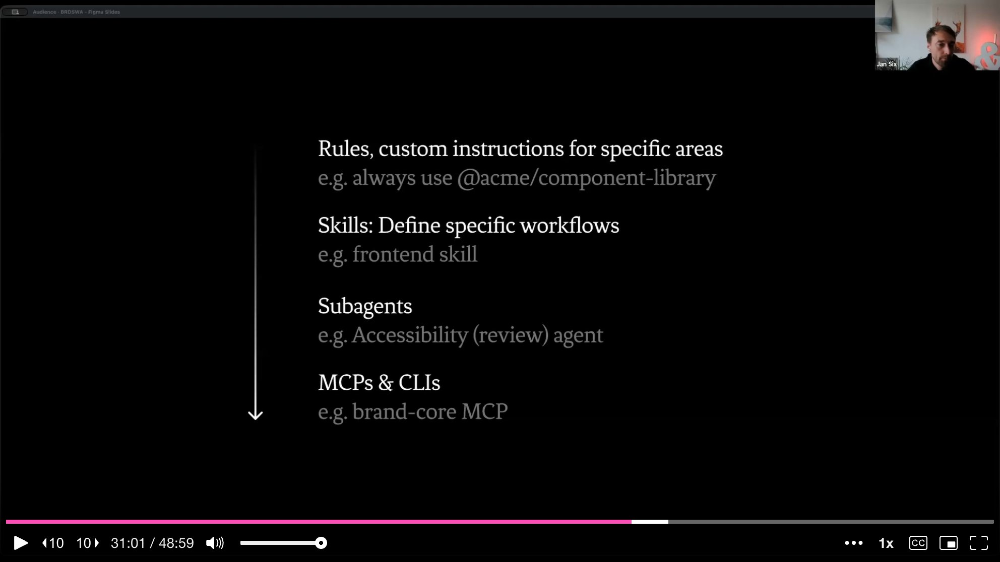

For ways of working, the same gradient applies: start with the **CLI** (Claude Code, GitHub Copilot CLI, OpenCode), graduate to **desktop agents** for a friendlier interface, then delegate to **cloud agents** for asynchronous work. The CLI may feel intimidating to designers, but it offers the most transparency into what the agent is doing. Jan urges people to push through the initial discomfort: **"Instead of giving up, consider forcing yourself to only use this new way. There will be a moment where it clicks and you get good results. This is about going slow to go fast."**

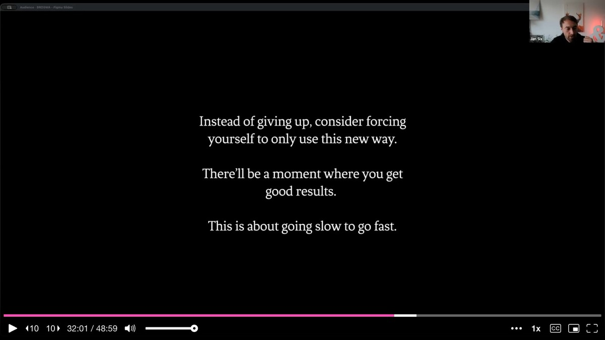

---

## Demo: The Brand Core Agent

To make the vision concrete, Jan demonstrates a concept he calls the **brand core agent** -- not just an MCP that returns raw tokens, but a dedicated agent that aggregates tokens, voice guidelines, component docs, and brand rules into one coherent response for the main coding agent. This is the approach the **Token Studio** team is building.

In the demo, a prompt asks "build a marketing landing page for Phosphor." The coding agent communicates with the brand core agent, which explores the project's tokens, tone of voice, documentation, and brand guidance. It returns not just data but strategic advice: which tokens to use, which components to apply, what the tone of voice should be. The agent then builds the page -- and the result actually **looks and feels like the brand** rather than a generic Tailwind template.

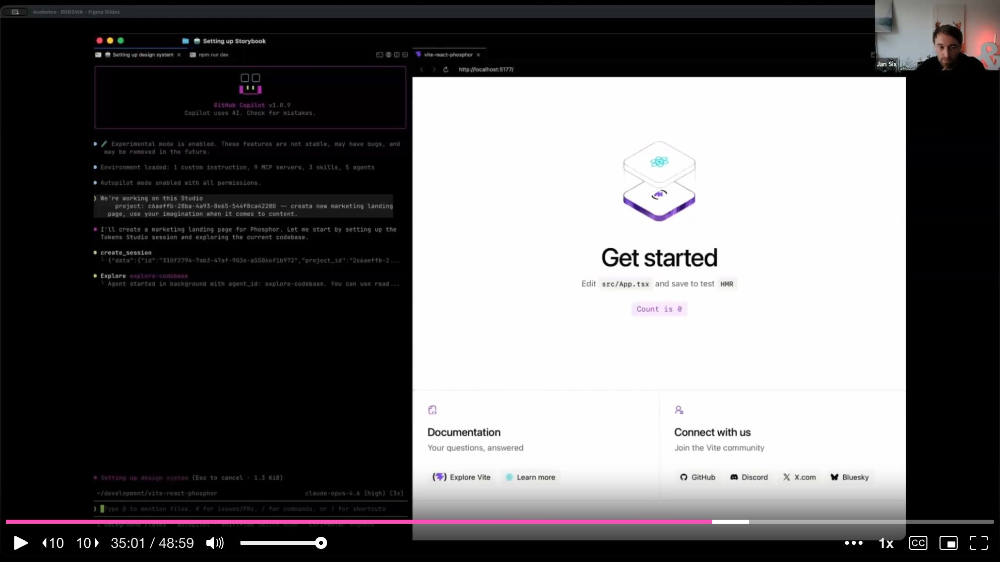

The demo also shows a **self-review loop**: after building the page, the agent calls back to the brand core agent to evaluate whether the result matches the brand guidelines, then iterates based on feedback. Agent talking to agent, with the brand system as the shared source of truth.

---

## What to Do Next

Jan closes with three concrete next steps. First, **audit your system** -- go slow to go fast. Every day spent analyzing and cleaning drift, co-locating documentation, and writing specs will pay back exponentially once agents are working in the actual codebase. Second, **make it real** -- prototype new features in code (or in a dedicated prototype environment) rather than staying in design tools. Third, **start discussions among engineering, product, and design** about the change in roles that is already underway. More people can now play a part in building the frontend, and team structures need to evolve to make room for that.

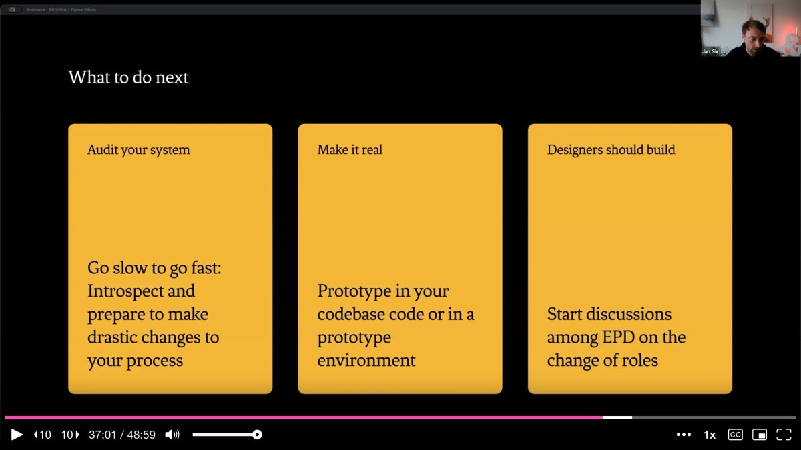

---

## Q&A Highlights

**On building custom MCPs**: Jan recommends trying to build your own, even just to understand how they work. Agents can help you build one quickly. After building it, have the agent analyze the data the MCP returned and evaluate how helpful it was -- creating a feedback loop to improve the MCP itself.

**On CLI versus desktop agents**: Most desktop tools are wrappers around CLIs, abstracting away complexity. The CLI offers more transparency -- you can see exactly what the agent is doing -- but at the cost of occasionally feeling overwhelmed. Both are valid; it depends on the person and their comfort level.

**On Storybook as a design tool**: Jan increasingly starts his workflow in Storybook rather than Figma. He tells the agent to build a component in Storybook, pushes it to a PR that gets deployed to a preview environment, and invites others to review. The component itself becomes the source of truth for what is in production.

**On structuring context for agents**: Less is more. Overloading context makes agents worse, not better. Break larger features into multiple phases. Store past decisions as **ADRs (Architecture Decision Records)** so agents can understand why choices were made. Store future plans in the repository too, opening them up for feedback from others -- because agent-assisted planning is often a single-player activity that benefits from collaboration.

**On where documentation should live**: The same repository works when possible. For cross-repository systems, a dedicated context repository can help. An underused technique: start the CLI in a parent folder that spans multiple repositories, giving the agent access to context from both your production system and your prototype environment simultaneously.

---

## Key Insights & Takeaways

**Co-locate everything the agent needs -- scattered documentation is the primary cause of poor agent output.** Jan showed how codebase drift (deprecated components still in use, conflicting CSS, stale code) and tribal knowledge (status communicated through visual-only badges, rules buried in Slack) cause agents to hallucinate or copy bad patterns 40 times over. A single folder per component with docs, tokens, and code together dramatically improves accuracy. Audit your system for where context lives versus where agents look.

**Treat agent instructions like a router, not a dump.** Instead of one massive instructions file, create a top-level AGENTS.md that points to specific sub-documents based on the task: component specs, token rules, documentation guidelines. GitHub's Primer design system uses this pattern publicly. This same routing structure works for automated PR review agents, scoping specific rules to specific file types.

**Build a "brand core agent" that aggregates brand context for coding agents.** Jan's Token Studio demo showed a dedicated agent that combines tokens, voice guidelines, component docs, and brand rules into one coherent response -- plus a self-review loop where the agent evaluates its own output against brand guidelines. The result actually looks like the brand instead of a generic Tailwind template. If your AI-generated prototypes all look the same, the missing piece is a queryable brand context layer.

**Start with rules and custom instructions, then progress to skills, subagents, and MCPs.** Jan frames the entire toolkit as a ladder of increasing investment. Rules and instructions are easy to set up with immediate value. Skills handle repeated workflows. Subagents (running in isolation) handle expert tasks like accessibility review without cluttering the main agent's context. MCPs make your brand queryable on demand. Each step compounds the return.

**Set up automated cloud agents for daily design system maintenance.** GitHub Agent Workflows, Cursor background agents, and Claude Code cloud agents can run on a schedule -- daily audits that check if the system has degraded, review recent contributions, and create issues when drift is detected. The key security principle: restrict automated agents to safe outputs only (like creating an issue) so no unreviewed changes reach production.
