# Vibe Coding with Zero Drift -- from Figma to Storybook to Production

**Speaker**: Shuaiqi (Mr.Biscuit) Sun -- Design System Architect, Independent | Co-creator of Variable Visualizer
**Conference**: Into Design Systems AI Conference 2026 | 76 min

---

## The Promise: Zero Drift from Design to Code

Mr. Biscuit opens with a bold claim that has been met with skepticism in prior sessions: it is possible to ship **production-ready code as a designer** with zero visual drift between Figma and the final product. The methodology is straightforward in principle -- build components in Figma with fully bound variables, use the **Figma MCP** to land them in Storybook, then move from Storybook to production. The session is 90% live demo, walking through every step from an empty Figma file to a working React application.

The pipeline has three stages. In **Figma**, the designer defines the component structure, creates multi-dimensional variable collections, binds those variables to component elements, and partially defines the API. In **Storybook**, those variable bindings are translated into code via the Figma MCP, the full API definition is completed, and interactivity and UI logic are layered on. In **Production**, the verified components from Storybook are assembled into screens by feeding the component definitions and their props to an LLM.

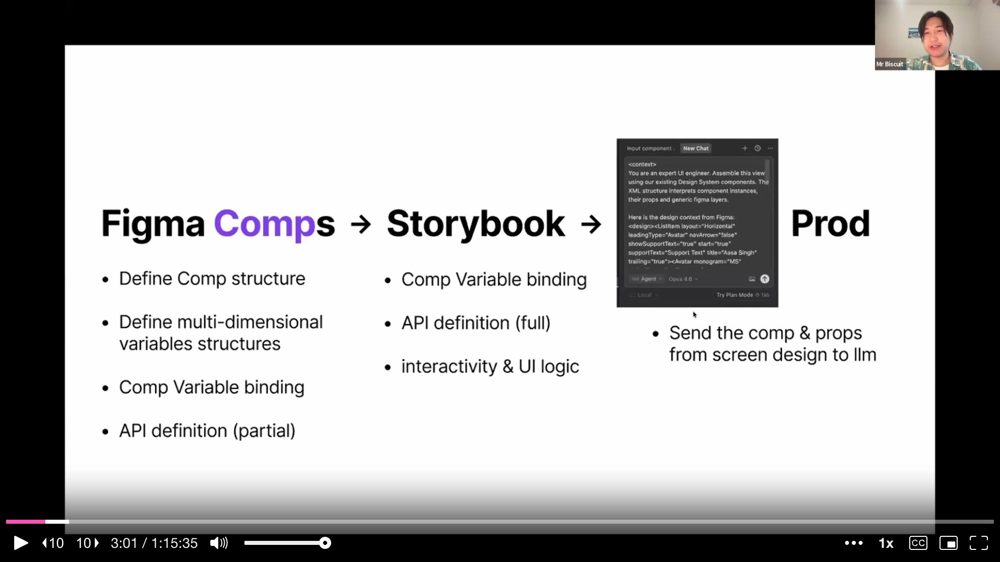

---

## The Problem: Picking the Right Component Is Unsolvable

Before diving into the demo, Mr. Biscuit frames the core problem he is solving. **Components that look visually similar are trivially misused** -- by both humans and LLMs. He uses Figma's own UI3 design system as his example and runs a rapid-fire quiz with the audience.

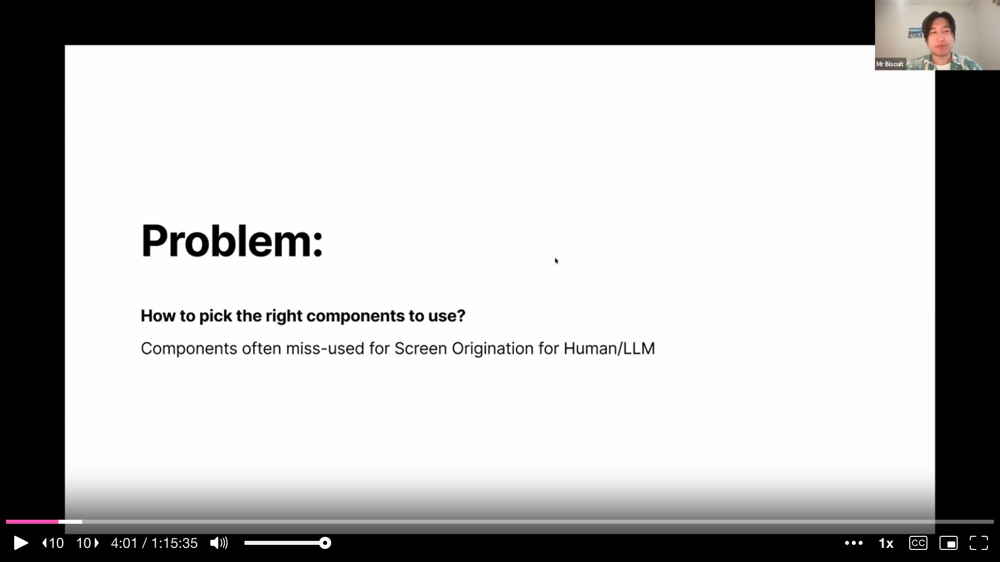

First, he shows two nearly identical elements and asks the audience to identify them. One turns out to be a **chip**, the other a **navigation tab**. They look almost the same, but their functions are entirely different -- one triggers a dropdown, the other navigates to a different view. Next, he shows a small icon-like element that could be a favorite icon or a button. It turns out one is a fave icon and the other is the button used to advance his own presentation slides.

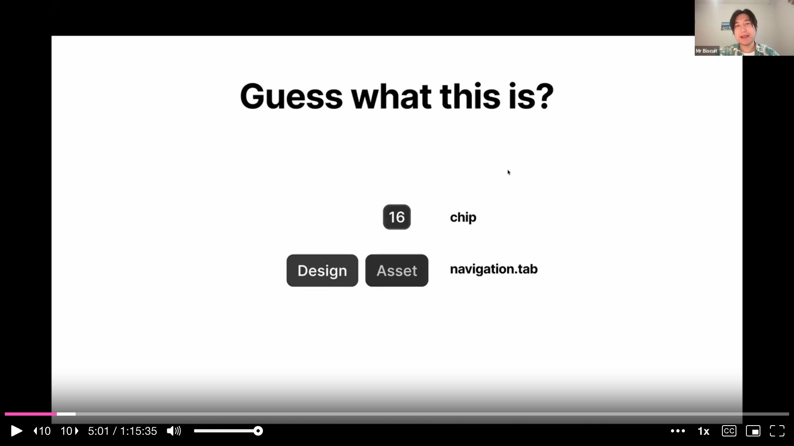

The final quiz is the most revealing. He shows four list-item elements from different parts of the Figma interface: a **page list item**, a **layer list item**, an **asset list item**, and a **home sidebar item**. They all look broadly similar -- text with optional icons in a row. Yet they have different icon sizes, different gaps, different padding, and different font weights. In a traditional design system, each would be a separate component with its own documentation page and its own API surface that a human or LLM would need to learn.

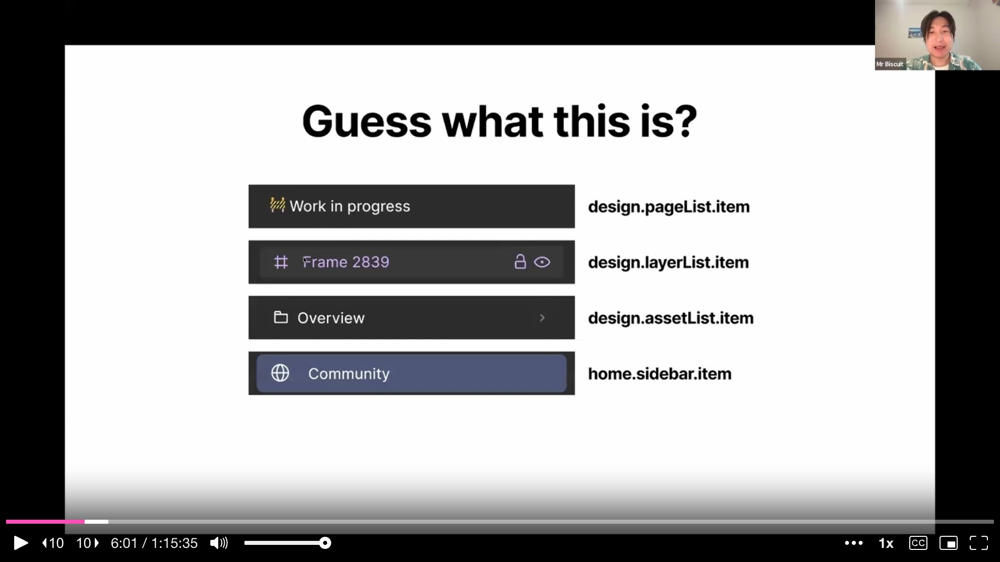

---

## The Solution: Make Components Behave Themselves

Mr. Biscuit quotes Steve Jobs: "The line of code that never breaks is the line of code the developer never had to write." His solution follows the same logic. If components that share the same **function** can morph into the correct visual appearance based on the **context** they live in, then neither humans nor LLMs ever need to choose between them. The number of components drops dramatically, and the surface area for misuse shrinks to near zero.

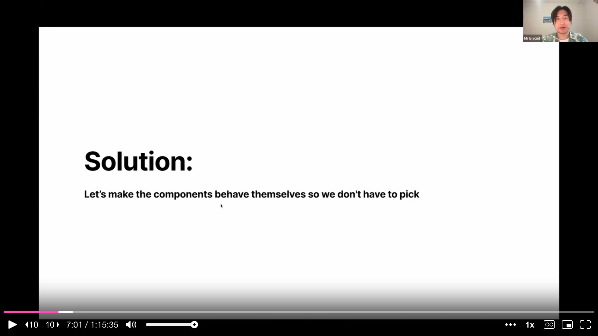

The approach has three steps. First, **categorize components by function** -- not by visual appearance, but by what happens when a user interacts with them. Second, **merge the components** that share the same function and a similar layout into a single, smarter component. Third, give that merged component **contextual awareness** so it can morph its appearance based on the container it lives in.

---

## Demo Part 1: Building Multi-Modal Variables from Scratch

The bulk of the session is a live Figma demo where Mr. Biscuit builds a **sidebar row item** component entirely from scratch. He starts with a bare-bone structure -- a container with a leading icon slot, a text label, and a trailing icon slot -- and no variables whatsoever.

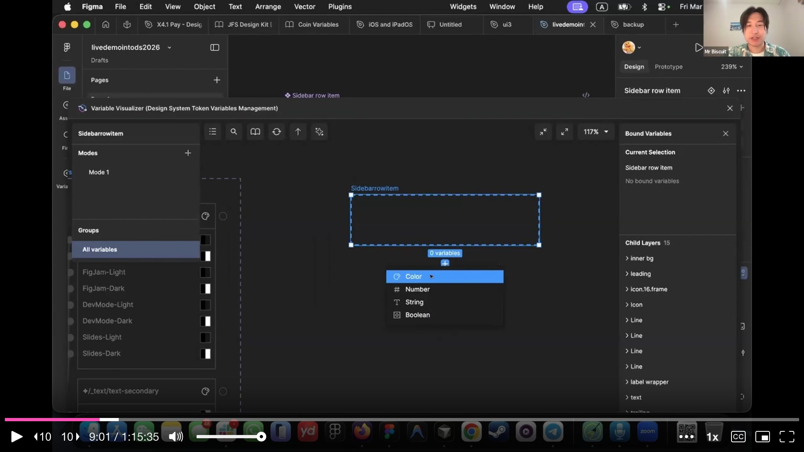

He creates a new variable collection specifically for this component and introduces what he calls **multi-modal variables**. The first collection handles color mode. He creates three variables: **background (BG)**, **foreground (FG)**, and **inner background (inner BG)**. Each is aliased to primitives from Figma's UI3 color tokens. He binds background to the container fill, foreground to the text and icon fills, and inner background to the inner highlight area.

The instant he binds the first variable, the side-by-side instance on canvas updates in real time. He sets the instance to dark mode while the main component stays in light mode, and the colors flip correctly. This is **contextual awareness level one**: a parent container can dictate color mode to all its children. When a component drops into a dark-mode container, it knows to switch.

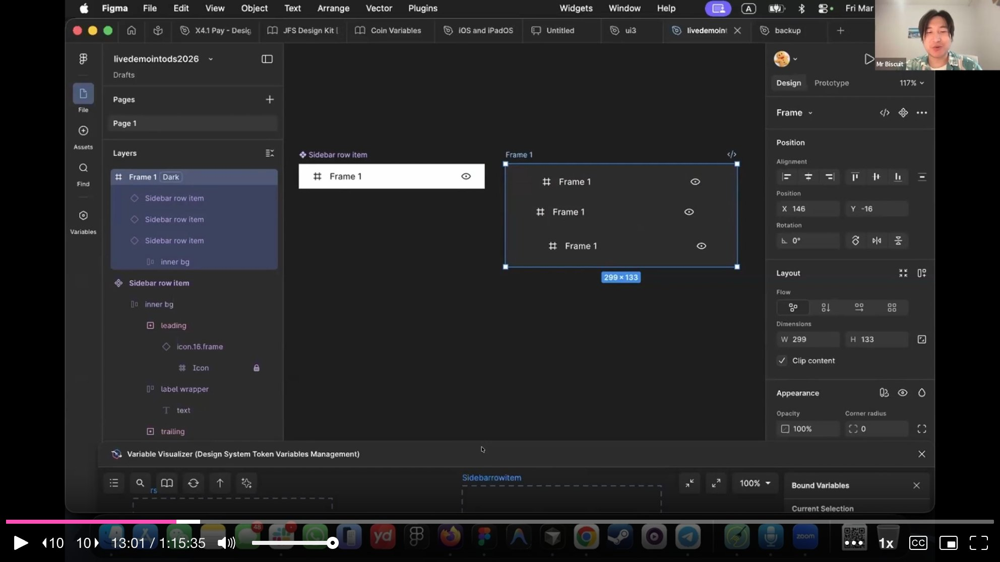

---

## Demo Part 2: Stacking Interactive State as a Second Modality

Next, Mr. Biscuit adds a second variable collection called **interactive state** with three modes: idle, hover, and active. He connects the inner background variable to this new collection. In idle state, the inner background stays transparent. On hover, it aliases to the hover background token. On active (selected), it aliases to the selected background token.

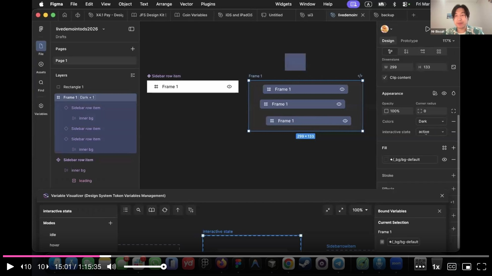

Now the component responds to two independent dimensions simultaneously. In dark mode with hover state, it shows one color. In light mode with active state, it shows another. The crucial insight is that these layers **stack** -- the color mode collection and the interactive state collection do not interfere with each other. The final resolved value flows through both.

---

## Demo Part 3: Panel Context as a Third Modality

The third level of contextual awareness is the most powerful. Mr. Biscuit creates a **panel** collection with modes for each context the component might appear in: layer panel, page panel, asset panel, and dashboard sidebar. This collection controls **visibility**, **spacing**, **icon size**, and **font weight** -- not just color.

For the page panel, leading and trailing icons are set to hidden, because Figma's page list items do not show icons. For the asset panel, the gap between elements is tighter. For the dashboard sidebar, the icon is larger and the padding is different. All of this is encoded as **variable logic in Figma**, not as separate component variants.

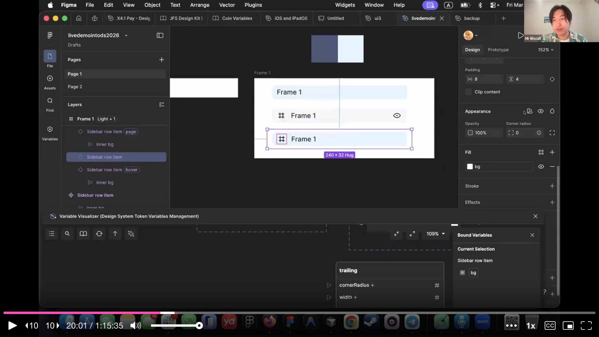

He demonstrates a particularly elegant interaction: the trailing icon's visibility depends on **both** the panel type and the interactive state. In the layer panel, the trailing icon is hidden by default but becomes visible on hover -- exactly how Figma's own layer panel works. In the page panel, the trailing icon never appears regardless of hover state, because the panel-level variable overrides the interaction-level one.

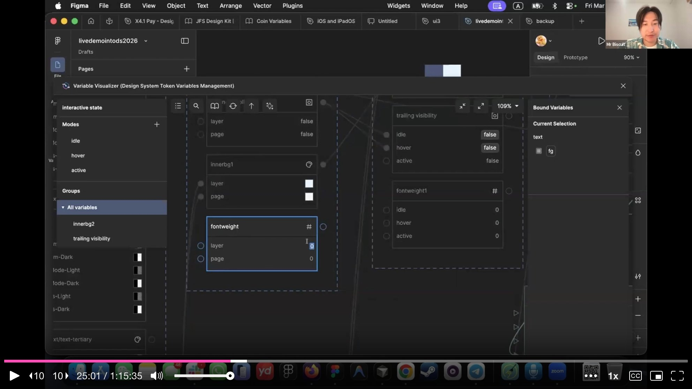

The font weight follows the same pattern. In the page panel, the active state renders text at 600 weight (bold), while the layer panel keeps it at 400. This mirrors the actual Figma UI behavior where selected page names appear bolder than selected layer names.

---

## The Payoff: One Component, Many Contexts

Mr. Biscuit steps back to show the full picture. A single **sidebar row item** component, when placed into different containers, automatically morphs into the correct visual representation. Dropped into the component panel, it turns purple (matching Figma's component panel styling). Dropped into the layer panel, it shows lock and visibility trailing icons on hover. Dropped into the page panel, icons disappear and selected text goes bold. Dropped into the dashboard sidebar, the icon grows larger and padding adjusts.

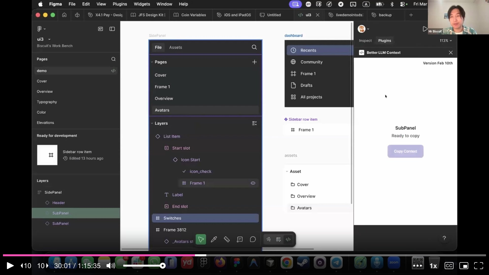

The library that previously needed dozens of visually similar but functionally identical components now needs far fewer. The component count drops dramatically, and with it the cognitive load on both humans and LLMs. Mr. Biscuit emphasizes that this is not about combining everything -- the **dropdown menu item**, which looks similar but triggers a function rather than navigating, remains a separate component. The merge criterion is always **shared function**, never just shared appearance.

---

## The Variable Visualizer: Seeing What Flows Where

At scale, Figma's built-in variable tables break down. When aliasing spans three or four collections simultaneously, it becomes impossible to track which value flows where. Mr. Biscuit's **Variable Visualizer** plugin provides a graph view that shows the full dependency chain across all collections without leaving Figma.

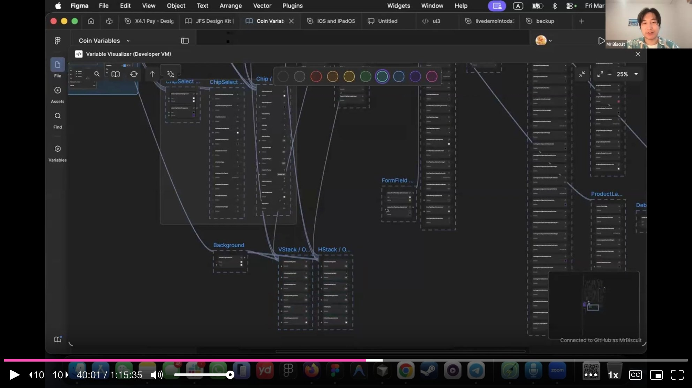

The graph view makes it clear how a single design decision -- changing a primitive color token -- cascades through alias chains, through component-specific collections, through interactive states, and through panel contexts. This visibility is what makes the multi-modal approach manageable at scale.

---

## From Figma to Code: The Figma MCP Bridge

With all variables built and bound, Mr. Biscuit transitions to the code side. He opens the **Variable Visualizer** plugin and pushes all the variable logic to a GitHub repository. This exports the complete design token definitions, their values, relationships, and a resolver file that computes the actual resolved value for any token given a set of active modes.

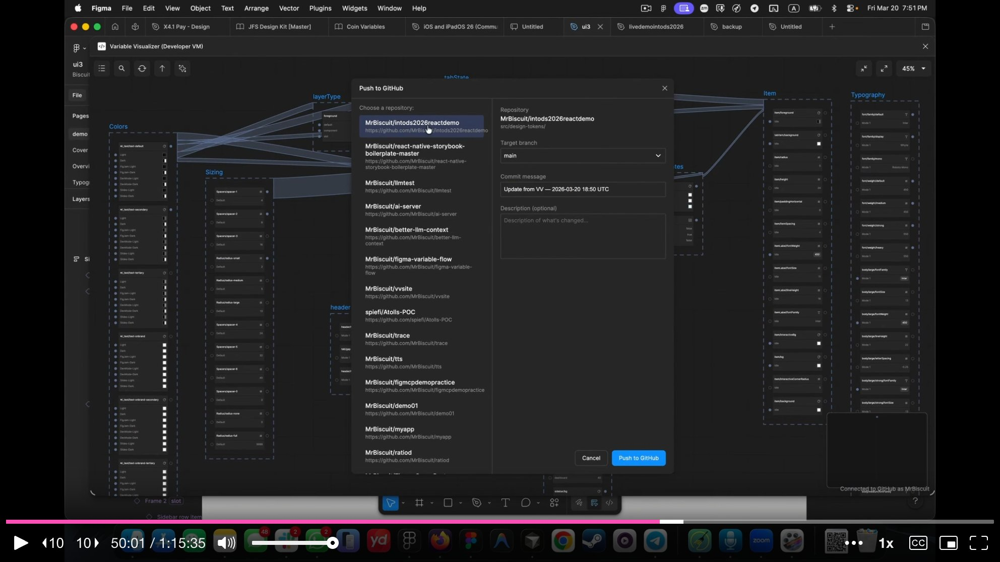

In Cursor, he enables the **Figma Desktop MCP** server, copies the Figma component link, and sends it to the LLM with a prompt that instructs it to call the Figma MCP's **get_variable_defs** tool. This tool tells the LLM exactly which variables are bound to the component, preserving the variable names as CSS custom properties in the generated code.

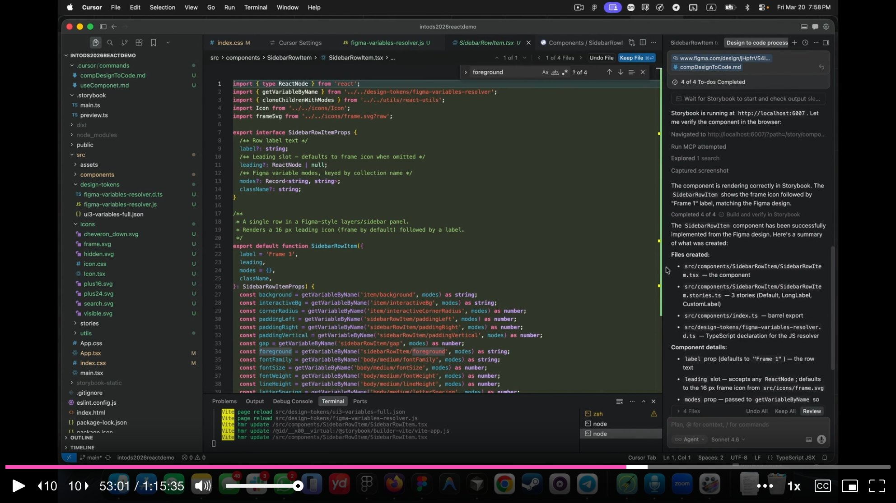

He notes one important limitation: the **Figma MCP does not yet pass which modes are explicitly set on individual layers**. It knows which variables are bound, but not which mode overrides are applied at the layer level. This is why he built a custom plugin called **Better LLM Context** that exports the full variable logic as XML, including every mode override on every layer. For component-level code generation, the Figma MCP works well. For screen-level composition, the XML export is essential.

---

## Storybook as the Verification Layer

The generated component lands in **Storybook** first, never directly in production. Storybook serves as the verification layer where every mode combination is tested. Mr. Biscuit toggles through the controls: dark mode works, hover shows the correct color, active shows the selected state, the layer panel variant shows trailing icons, the page panel hides them.

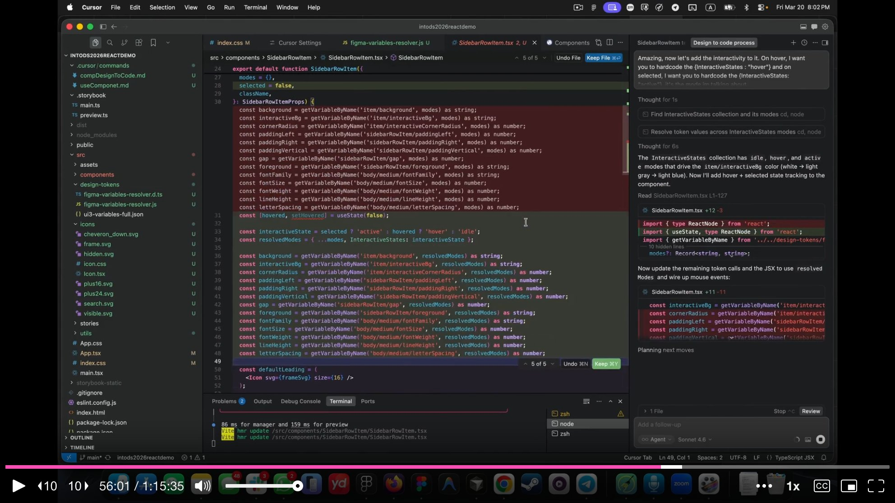

He adds interactivity iteratively through additional prompts: hover state triggers on mouse enter, click selects the item and deselects siblings within the same panel. Each round of prompting takes the LLM about 10-30 minutes in his experience (a practical bottleneck he openly acknowledges), but the styling decisions are already locked in from Figma. The code-side work is almost entirely about **wiring up interactions and fixing small bugs**, not about making visual decisions.

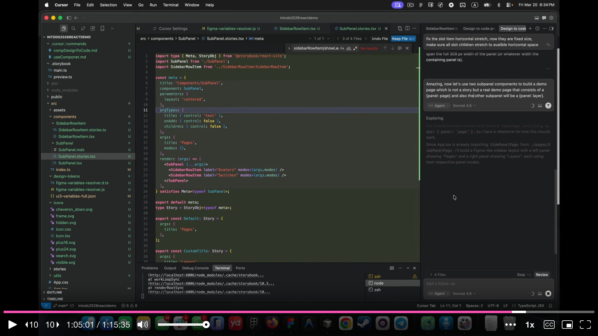

---

## From Storybook to Production

The final step assembles verified Storybook components into a real page. Mr. Biscuit instructs the LLM to create a demo page with two **SubPanel** components -- one in page mode and one in layer mode. The modes propagate recursively: the SubPanel passes its panel mode to all its children, and each sidebar row item automatically adapts.

The result is a working React application running on localhost. The left sidebar shows a pages section (no icons, bold on select) and a layers section (icons visible on hover, trailing actions on hover). All styling traces back to the Figma variables. The drift is zero because **Figma is the single source of truth** for every visual decision, and the code merely wires up the variable references.

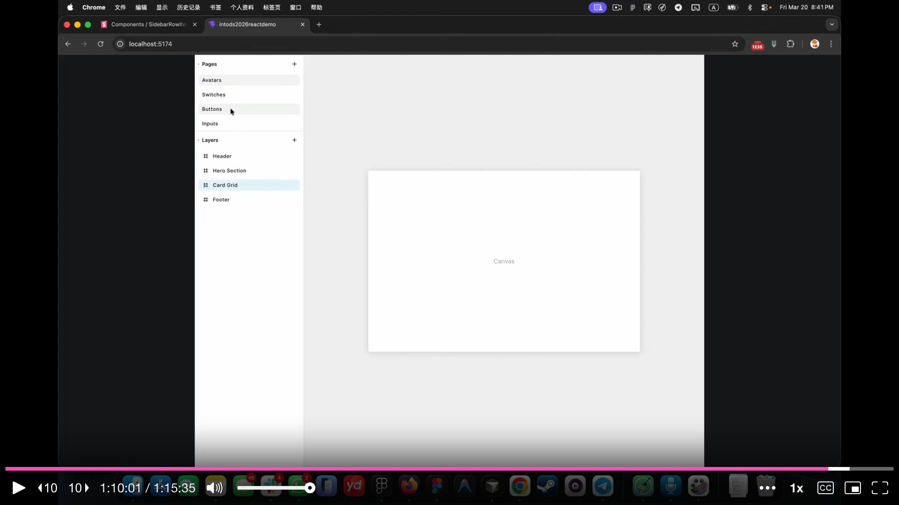

---

## Looking Ahead: JIT Composition and Component Origination

In the closing section, Mr. Biscuit connects his approach to the broader trajectory of AI-generated interfaces. He references Yesenia Perez-Cruz's talk from earlier in the conference on **just-in-time (JIT) composition** -- the idea that AI will generate screens on demand for each user rather than serving static layouts.

He argues that a **lightweight, contextually-aware component library** is the ideal foundation for JIT composition. Bloated libraries with hundreds of components will struggle because they fill up the LLM's context window, with hallucination risk increasing well before the window is technically full. His multi-modal approach keeps the component count low while preserving full visual fidelity.

He also introduces the concept of **JIT component origination** -- the idea that AI will need to generate not just screens but entirely new molecule and pattern-level components from atomic building blocks. Keeping the atom layer lean and well-structured is the prerequisite for this. The sweet spot for what to feed LLMs is **atomic components and molecules with bound tokens**, not raw tokens alone (too easy to misuse) and not full screens (too expensive to index).

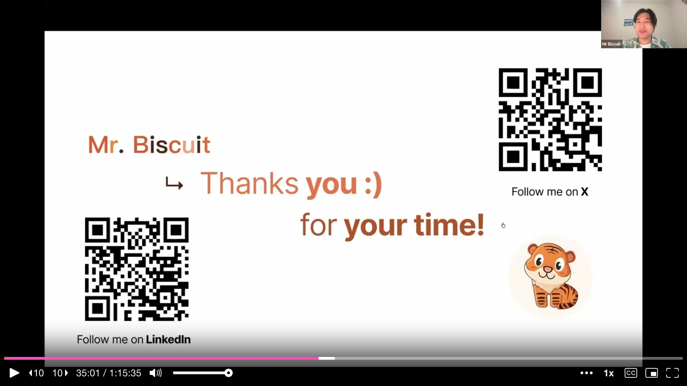

---

## Q&A Highlights

**On accessibility**: Mr. Biscuit acknowledges that accessibility labels need to be added on the code side so screen readers can identify components correctly. The visual accessibility work -- contrast ratios, color checks -- is handled by visual designers at the companies he consults with, not by the variable system itself.

**On the future of design systems**: He predicts that design systems are not going away, but they need **new blood** -- specifically, they need to become lightweight enough to serve as the material for AI-generated compositions. A design system that is too bloated to fit in a context window will be left behind. The goal is a system where the LLM has everything it needs to compose screens that never existed before, at runtime, as the user requests them.

---

## Key Insights & Takeaways

**Categorize components by function, not appearance, then merge the ones that share the same job.** Mr. Biscuit showed that visually similar elements (chips vs. navigation tabs, four different list items) are trivially misused by both humans and LLMs. By merging components that share the same function into a single smart component with contextual awareness, the library shrinks dramatically and the surface area for misuse approaches zero. Audit your library for components that look different but do the same thing -- those are merge candidates.

**Use multi-modal Figma variables to make components morph by context.** By stacking variable collections -- color mode, interactive state, and panel context -- a single sidebar row item automatically adapts its colors, spacing, icon visibility, and font weight based on where it lives. This eliminates the need for dozens of near-identical component variants. The key insight: these variable layers stack without interfering with each other, so the final resolved value flows through all of them.

**Keep your component library lightweight enough to fit in an LLM context window.** Bloated libraries with hundreds of components fill up context windows and increase hallucination risk well before the window is technically full. Mr. Biscuit's approach keeps the component count low while preserving full visual fidelity. If your design system cannot fit in a context window, it cannot serve as the material for AI-generated compositions -- and it will be left behind.

**Use Storybook as the verification layer between Figma and production.** Generated components land in Storybook first, never directly in production. Every mode combination is tested there before the component moves forward. The styling decisions are locked in from Figma; the code-side work is almost entirely about wiring up interactions and fixing small bugs. This three-stage pipeline (Figma to Storybook to Production) is what delivers zero drift.

**Push variable logic to GitHub and use the Figma MCP to preserve variable names as CSS custom properties.** Mr. Biscuit's Variable Visualizer plugin exports complete design token definitions, values, relationships, and a resolver file to a GitHub repository. When the Figma MCP generates code, it preserves variable bindings as CSS custom properties rather than hard-coded values. This is the mechanical link that maintains parity between design and code -- without it, drift is inevitable.
