# Machine-Readable Design Systems for MCP and LLMs

**Speaker**: Diana Wolosin -- Sr. Design System Designer, Indeed
**Conference**: Into Design Systems AI Conference 2026 | 46 min

---

## The Starting Question: What Does It Take to Build for AI?

Diana Wolosin opens with a simple but far-reaching premise. At Indeed -- the world's number one job site, serving hundreds of designers and developers across its job-seeker and employer platforms -- AI exploration was emerging everywhere. Teams were experimenting with **AI-assisted prototyping**, AI-powered personas, and design-to-code workflows. The company had invested in tools like Cursor, Gemini, and Anthropic, and given teams the autonomy to experiment. The design system team saw the opportunity: if everyone was going to build with AI, the design system needed to be ready to serve them.

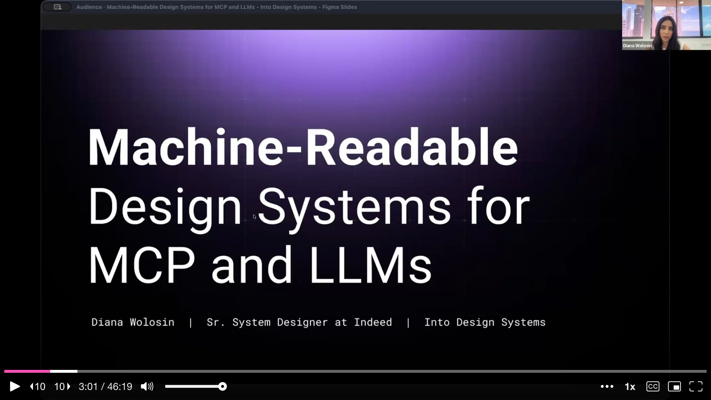

That realization sent Diana down a rabbit hole. She made a big pot of coffee and started researching. There were barely any resources on the subject. Nobody was really talking about how to make design systems work for AI. She found a few pioneers -- Romina, TJ Pitre, Yesenia Perez-Cruz -- and had many late-night conversations with ChatGPT, Claude, and Gemini. Through all of it, she arrived at something fundamental: **AI is a new user of your design system.** And just like human users, this new user needs the knowledge delivered in a format it can actually understand.

That format has a specific term: **machine-readable**. It means codifying design system knowledge into structured data -- metadata, JSON, explicit constraints -- so an LLM can parse it, reason over it, and use it programmatically. But how? Diana is a designer, not a developer. Technical infrastructure is not her domain. The answer, it turned out, was to start experimenting with AI itself.

---

## The Breakthrough: From Spreadsheet to Structured Metadata

Diana's first breakthrough was surprisingly low-tech: a **Google Spreadsheet**. She took the design system documentation and broke it down into rows and columns, establishing a schema that could be turned into a JSON snippet per component. Designers could then copy-paste these JSON snippets into AI tools to generate prototypes using Indeed's components. But they had to copy one component, one token, and one pattern at a time -- not exactly enterprise-grade.

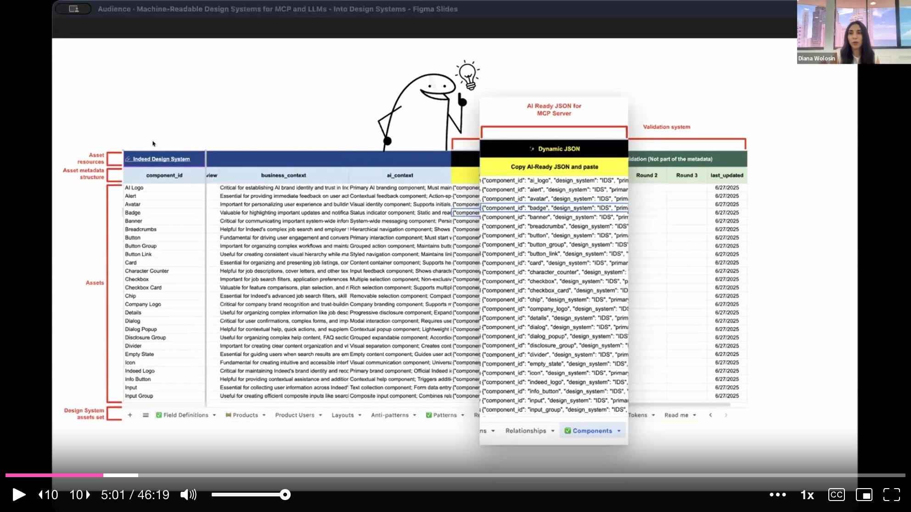

She thought she had cracked the code. But Indeed's design technology team was already building a far more sophisticated AI prototyping solution, and the spreadsheet was not dynamic, not scalable, and -- most importantly -- not easy to integrate with an agent or an MCP server. The spreadsheet was a valid mechanism for proving the concept, but at least it confirmed one crucial insight: **the format matters.** The format you feed to an LLM directly impacts its reasoning and its output.

---

## How MCP Works: The Librarian Analogy

Before diving into the experiments, Diana walks the audience through **how Model Context Protocol actually works**. A human sends a prompt from the context window. The LLM receives it and selects keywords to compile into a query. That query gets sent to the MCP server. Inside the MCP, **Retrieval-Augmented Generation (RAG) acts like a librarian** -- it goes to the vector database and searches for semantic similarities between the query and the stored metadata. The vector database returns a specific set of results, which flow back through the MCP to the LLM. The LLM then reasons over those results and, in a tool like Cursor, prototypes experiences.

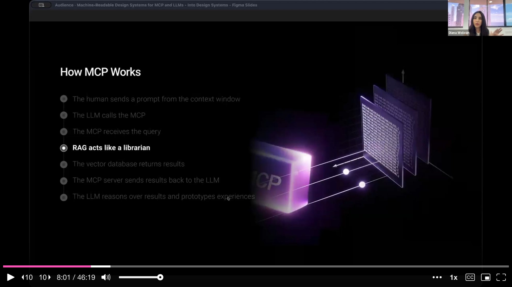

The fundamental question, Diana argues, is not whether to use an MCP -- it is **what is the best way to add your design system knowledge into the vector database**. Some people suggest simply connecting existing documentation and calling it a day. But the reality is that this new AI user needs structured, machine-readable metadata, not documentation written for humans. Instead of guessing, Diana built a benchmark.

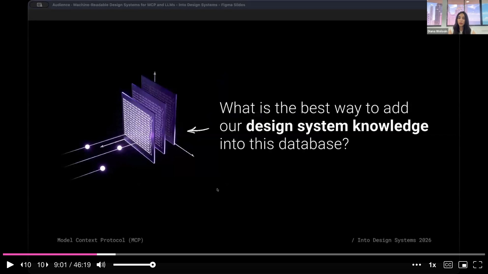

---

## Demo 1: Transforming Human Docs into Structured Metadata

Diana switches to a live demo in Cursor with Claude Sonnet 4.5. She shows Indeed's design system repository, where all component documentation is stored in **MDX** -- a flavor of Markdown that renders beautifully for websites and HTML. The button component, for instance, has separate MDX files for accessibility, design, development, content, and localization. This documentation feeds the **Lunchbox Design System** website, where product teams come to "pack their lunchbox."

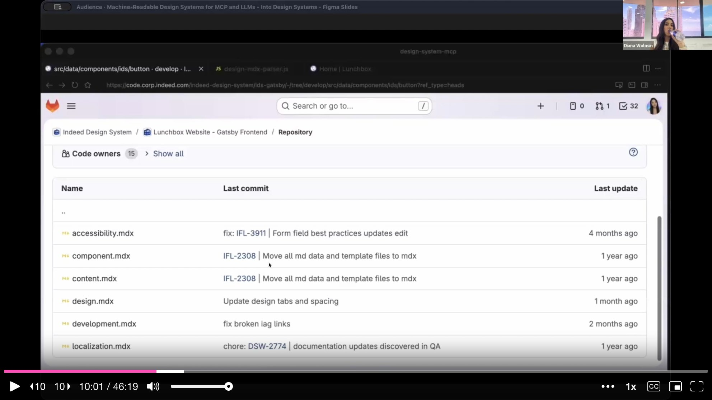

The challenge is distributing this same knowledge to LLMs. Diana shows how Cursor helped her create a set of **JavaScript parsers** -- one for each knowledge domain (accessibility, development, localization, design). Each parser creates a JSON object, and a consolidation script merges them all into a single JSON file per component. The hard part was that human-written documentation is inconsistent and full of edge cases, but after many prompts and rounds of back-and-forth with Cursor, she covered every edge case across Indeed's 77 components.

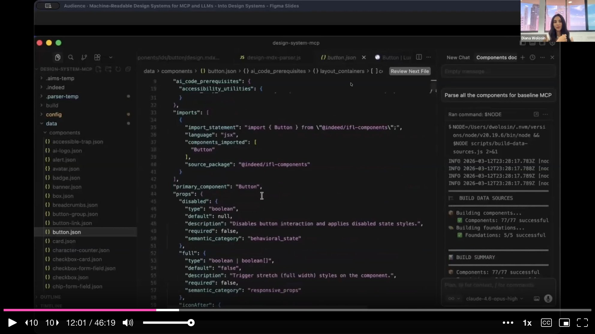

The result is a structured JSON object that contains the full component API in a way an LLM can reason over and build with -- component identity, prop definitions, variants, sizes, states, accessibility utilities, import statements, and usage guidelines.

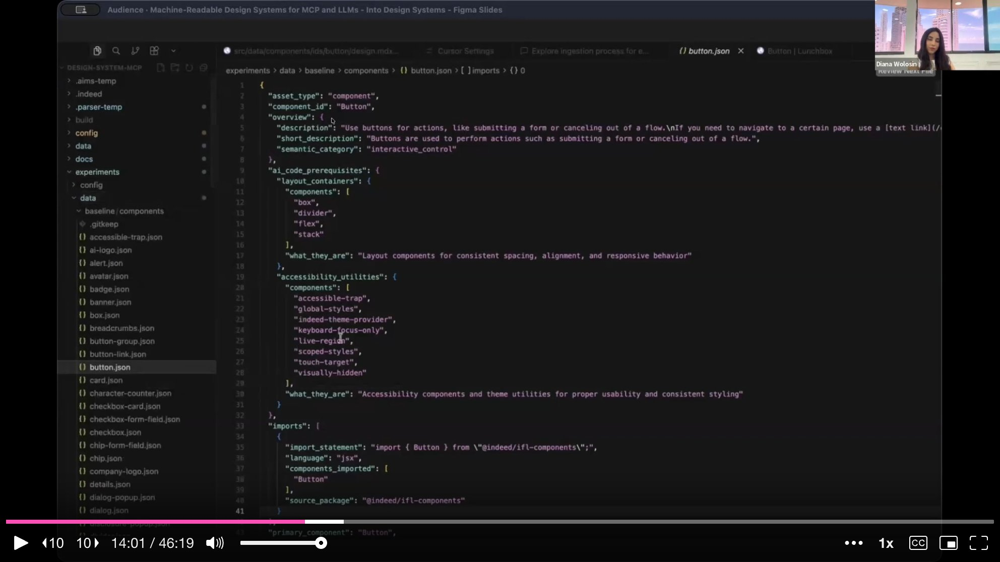

---

## Demo 2: MCP Ingestion and Configurations

In the second demo, Diana reveals the engine room. Her developer partner, **Pierre Tony Rucker**, built the infrastructure that made it possible to duplicate the MCP server seven times, creating eight total MCP configurations for testing. Inside the MCP server sits an ingestion folder containing a **chunker, a filter, and an indexer** for each experiment.

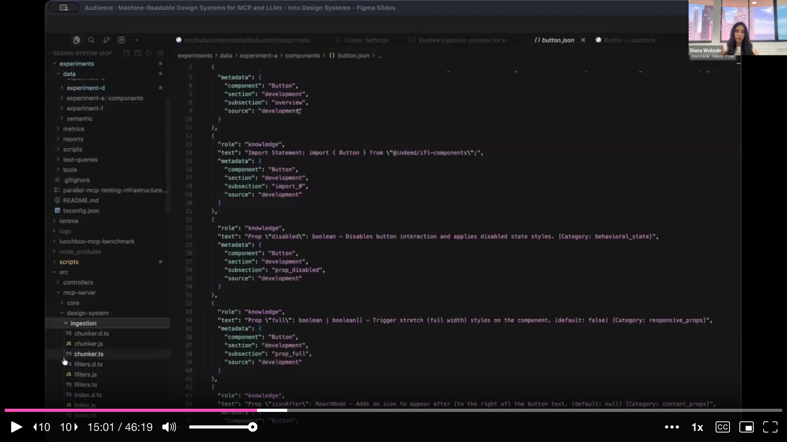

She walks through the three-step ingestion process. First, the metadata gets **ingested**. Then it goes through **chunking** -- breaking the data into sharp, well-defined chunks so the vector similarity search returns the most relevant context. Finally, the chunks get **indexed** into the vector database. The indexing step transforms the documentation into numeric vectors. When RAG hits the MCP looking for metadata about a button, it comes to these vectors, finds semantic similarity, and returns the matching metadata.

Diana ran this process for all eight MCP configurations, each using a different metadata format: the original MDX, plain Markdown, a hybrid of Markdown plus JSON, multiple JSON variations (pre-chunked, domain-separated, deterministic), and even **TSON** -- a token-oriented object notation format created specifically for AI consumption.

---

## Demo 3: The Benchmark -- 1,056 Prompts Across 8 Configurations

The benchmark itself is a piece of vibe-coded engineering. Diana built an MCP quality benchmark tool that tests multiple configurations head-to-head, measuring the balance between **LLM comprehension and token efficiency**. She designed 22 prompts across different query categories -- props, complex queries, code snippets, and simple lookups -- and ran each prompt three times per configuration, measuring both input (what the MCP returns) and output (what the LLM does with it). That adds up to **1,056 total prompts**.

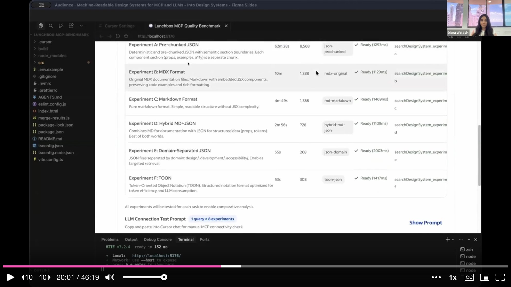

The benchmark measures two dimensions. **Token efficiency** captures what the MCP returns to the LLM: how many tokens, how relevant, how much query coverage. **LLM accuracy** captures what happens after the LLM reasons over those results: coverage of correct answers, hallucination count, and prop-form accuracy. Cursor also helped Diana create the formulas, purification logic, and metrics under the hood.

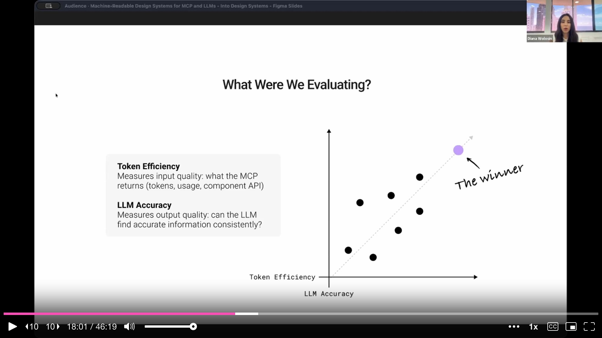

---

## The Findings: Five Data-Driven Lessons

**Finding 1: The MCP is deterministic; the LLM is stochastic.** Running the same query against an MCP returns the same result every time. But when the LLM receives those same results and reasons over them, it produces a different response every time. Same input, different output.

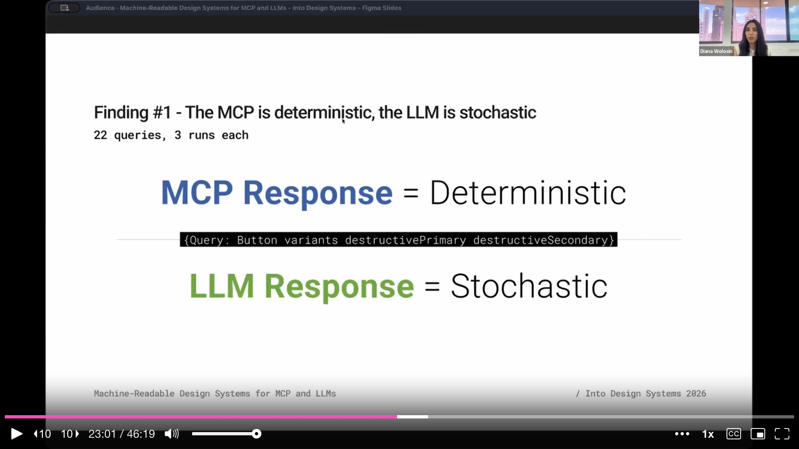

**Finding 2: Structured data mitigates AI uncertainty.** Even though the LLM responds differently each time, some MCP configurations produced far more consistent responses than others. The hybrid Markdown-plus-JSON format showed the most variation -- completely unreliable. JSON showed the most consistency across three runs. Structured data reduces the randomness of LLM responses.

**Finding 3: LLM accuracy is superior with structured data.** When every LLM response was verified against the actual documentation, JSON matched the highest. Structured metadata produced the most accurate responses compared to the real design system knowledge.

**Finding 4: Structured data produces superior token efficiency.** The hybrid MCP burned around 30,000 tokens per set of queries. JSON achieved the same or better accuracy with **80% fewer tokens**. Structured data is not just more accurate -- it is dramatically more efficient.

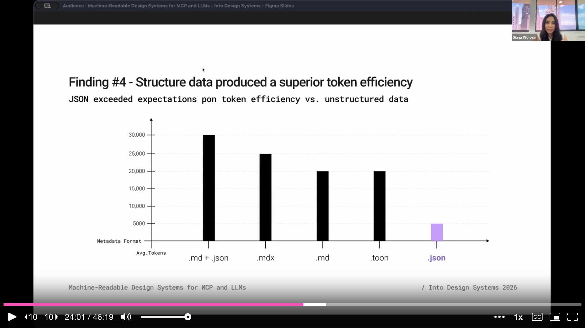

**Finding 5: Structure saves money at scale.** Scaling to 1,000 queries per month across hundreds of users, MDX-based documentation would cost roughly $125 per month ($1,500 per year), while JSON would cost just $25 per month ($300 per year). Same design system, same components, five times cheaper.

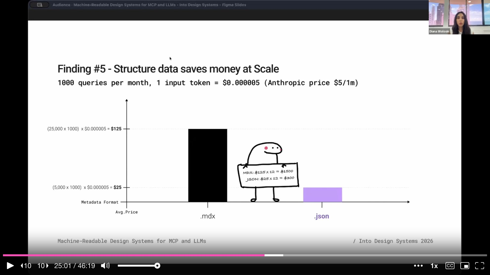

The winner is clear: **JSON**. It functions like a contract -- explicit keys, explicit values, explicit boundaries, no ambiguity. JSON tells the LLM exactly what it sees and how to use it.

---

## The Real-World Test: 4,389 AI-Generated Prototypes

Indeed launched the MCP with JSON in August 2025. From August to December, they ran a pilot on an internal AI prototyping tool powered by the design system MCP. The results were staggering: **4,389 prototypes** generated using React, design system components, and Indeed's visual language. Not just engineers -- product managers, researchers, and content designers were creating prototypes too. None of them used Figma or hand-written CSS.

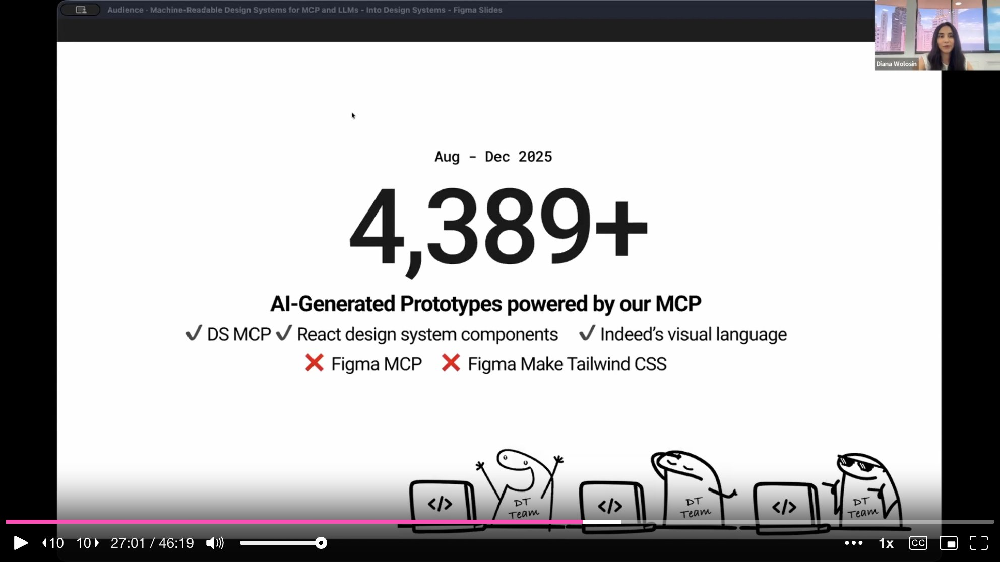

But not everything was perfect. A design system compliance audit -- led by designer Keith Weston, who reviewed a sample of those thousands of prototypes -- uncovered **multiple infractions**. The LLM was placing H2 headings in a smaller size than body text. It was overlapping text with broken spacing. It invented a color palette that the design system team had never seen. It was skipping color tokens for graphs, using emojis instead of icons, and misusing the tag component entirely. The components worked, but the **foundations were breaking**.

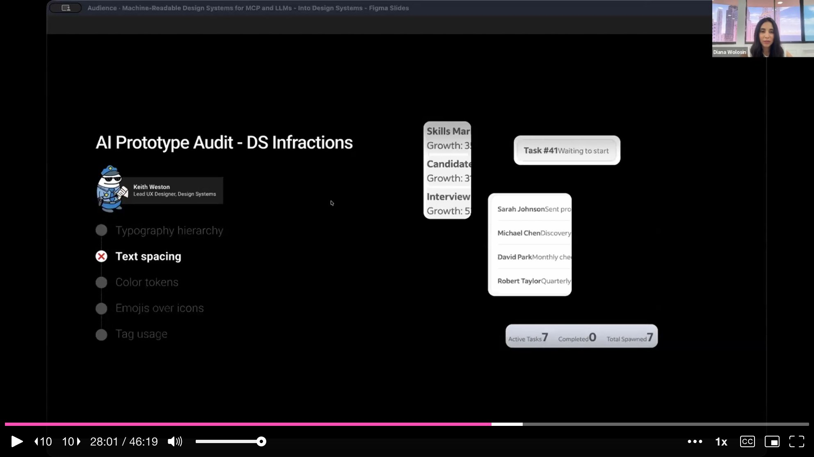

---

## The MCP Has Blind Spots: Why Foundations Need to Be Always-Present

The root cause was architectural. The MCP is **on-demand** -- it only returns data about what the prompt asks for. If the prompt says "build me a card," the MCP returns information about the card component and a button. It completely ignores spacing, typography, and color because that foundational knowledge, even though it exists in the vector database, was never called for in the prompt. The LLM fills the gap with its own assumptions, and those assumptions are often wrong.

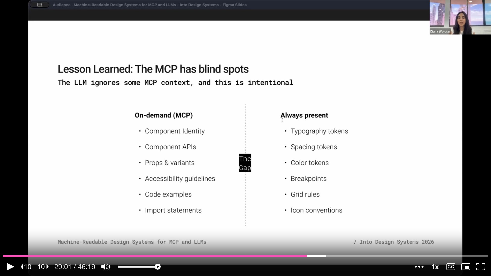

Foundational knowledge like spacing tokens, color tokens, typography rules, breakpoints, grid rules, and icon conventions needs to be **always present** in the context, not delivered on demand. This insight led Indeed to adopt a concept Diana calls a **design system plugin** -- a layered package of knowledge that can be plugged into any agent.

---

## Progressive Disclosure: The Load Strategy for AI Context

A machine-readable design system is not just an MCP. It is **multiple layers of context working together**, following a principle from artificial intelligence called **progressive disclosure**. The most critical knowledge is always present; the rest appears when the context calls for it.

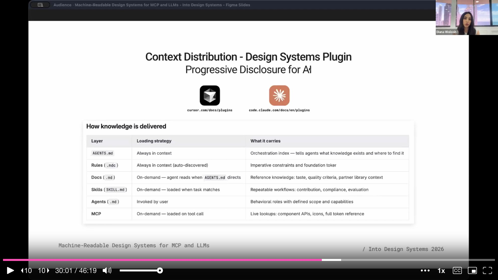

Diana breaks down the layers. **Rules files** (always in context) serve as the safety net -- spacing, color, typography constraints that are impossible for the LLM to skip. The **MCP** is the on-demand retrieval layer, serving component APIs, props, variants, and code examples when prompted. **AGENT.md** is the orchestration layer -- it tells agents what knowledge exists and where to find it. Together, rules, MCP, and AGENT.md form a **plugin**, which is the convention that Cursor and Claude Code are currently adopting. Beyond these, skills, docs, and agents themselves add further layers of context that load progressively as needed.

---

## Q&A Highlights

**On MDX vs. JSON for human documentation**: Diana would love to go pure JSON and have the website pull from it directly -- as some speakers at the conference demonstrated -- but Indeed's design system is mature and large. Ripping out MDX is not feasible. The parsers bridge the gap by transforming MDX into JSON automatically.

**On keeping the MCP fresh**: Tony Rucker built a **CI/CD pipeline** triggered on every documentation commit. When maintainers update the MDX, the pipeline runs the parsers, regenerates the JSON, and re-ingests it into the MCP. The metadata users receive is always current.

**On token budgets**: AI tool providers are not enforcing hard token limits today, but that will change. Diana advises teams to start measuring input and output tokens per MCP query now, so they are not caught off guard when pricing tightens.

**On getting started as a designer**: Diana's advice is direct -- sit down in front of Cursor and say "I want to create an MCP, show me how to do it." She learned by doing. The three-month benchmarking effort (November 2025 to January 2026) was entirely vibe-coded. No engineering background is required to get started.

**On stakeholder buy-in**: Diana organically grew into this role by investigating early, writing articles on Medium, and reaching out to pioneers in the space. Her advice: frame AI as a new user of the design system, and the urgency becomes self-evident.

---

## Key Insights & Takeaways

**JSON is the clear winner for feeding design system knowledge to LLMs.** Diana's benchmark across 1,056 prompts and 8 MCP configurations showed that JSON achieved the highest LLM accuracy, the most consistent responses across repeated runs, and used 80% fewer tokens than hybrid Markdown-plus-JSON formats. At scale (1,000 queries/month), JSON costs $300/year versus $1,500/year for MDX. If you are building an MCP, invest in structured JSON metadata -- it functions like a contract with explicit keys, values, and boundaries.

**The MCP has blind spots -- foundational knowledge must be always-present, not on-demand.** Indeed's 4,389 AI-generated prototypes revealed that the LLM was inventing color palettes, misusing typography, and skipping spacing tokens because the MCP only returned data about what the prompt explicitly asked for. Spacing, color, typography, and grid rules need to be in the context every time, not just when requested. Use rules files as an always-present safety net alongside your on-demand MCP.

**Build parsers to transform human documentation into structured metadata automatically.** Diana created JavaScript parsers for each knowledge domain (accessibility, development, localization, design) that convert MDX documentation into JSON. A CI/CD pipeline triggers on every documentation commit to regenerate the JSON and re-ingest it into the MCP. This approach lets you keep your human-readable docs while maintaining a parallel machine-readable layer that stays automatically in sync.

**Benchmark your MCP configurations before committing to one.** Diana ran 22 prompts across 8 different metadata formats, measuring both token efficiency (what the MCP returns) and LLM accuracy (what the LLM does with it). The hybrid Markdown-plus-JSON format -- which many teams might default to -- was the least reliable. Without benchmarking, you would never know. Build a repeatable test suite for your MCP and run it whenever you change the metadata format.

**Use progressive disclosure for AI context -- layer rules, MCP, and AGENT.md together.** A machine-readable design system is not just an MCP. Rules files (always in context) serve as the safety net. The MCP is the on-demand retrieval layer for component APIs and code examples. AGENT.md is the orchestration layer telling agents what knowledge exists and where to find it. Together they form a "design system plugin" -- the convention that Cursor and Claude Code are currently adopting.
