# From Falling for Markdown to Solving Real Problems with Scripts

**Laura Fehre** -- Designer Advocate, Figma | Into Design Systems AI Conference 2026 | 49 min

---

## The Ambitious Plan

Laura Fehre opens with a confession. In her day job at Figma, customers constantly ask the same question: **Figma Make supports React, but what about SwiftUI? What about Bootstrap?** She decided to find out for herself. Having learned SwiftUI during her time at HelloFresh, she picked Apple's Notes app as a target and mapped out an ambitious pipeline: turn the Human Interface Guidelines into an npm package, create markdown guideline files, map HIG components to the base training data of large language models, redesign the UI in Figma, prompt the interactions in Figma Make, use an MCP server, have Claude write a conversion script, and magically turn React into Swift.

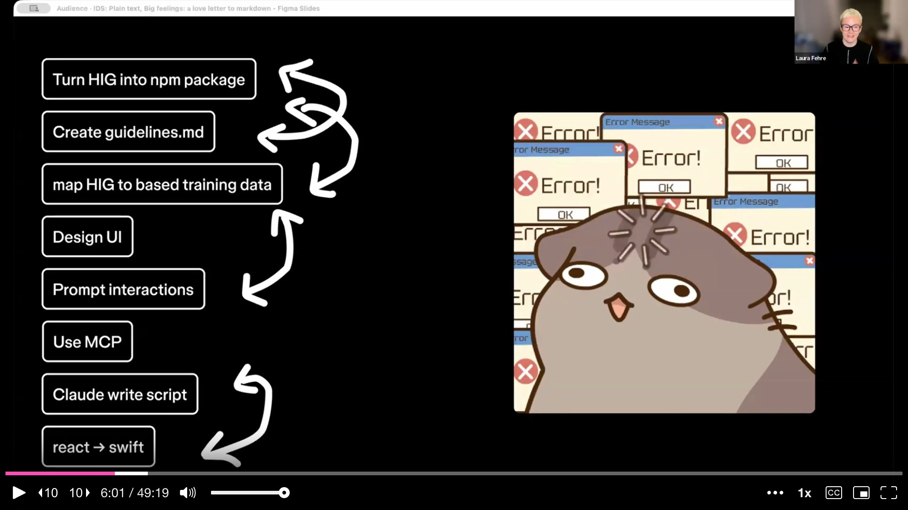

The plan looked tidy on paper. In practice, each step introduced compounding errors. Inconsistent naming in Figma files led to broken code. The React-to-SwiftUI conversion got close but fell apart on fine details like SF Symbols, icon mapping, and the native feel of iOS. Laura's takeaway was blunt: **the tool chain is powerful, but many steps still require human judgment** -- and messy inputs produce messy outputs, no matter how capable the AI.

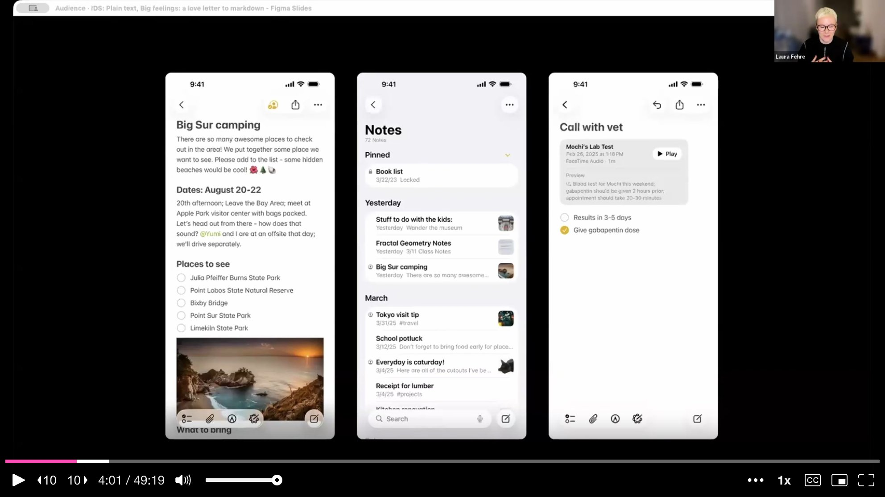

---

## Design Still Matters

Before diving into the AI-heavy material, Laura pauses to anchor the talk in something she cares about deeply. The last twenty years of her career have been spent **fighting against silos** -- getting designers, engineers, and product managers to collaborate in shared spaces. But when everyone retreats to their local machine and their personal AI agent, those silos return. Working with Cursor or Claude Code in isolation recreates exactly the fragmentation that design systems spent years tearing down.

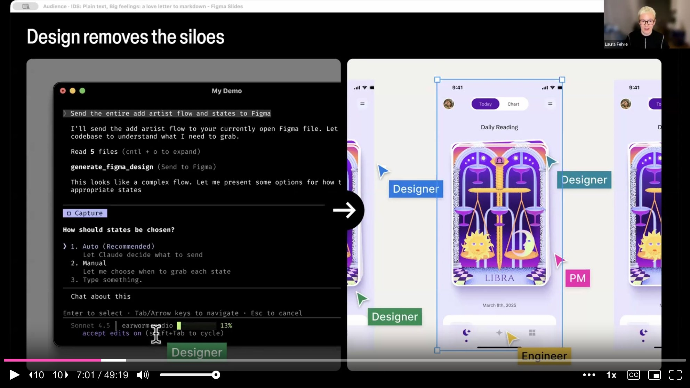

She also warns against **tunnel vision**. Sitting in front of an agent, prompting yes-no-yes-no on a single screen, is a narrow way to work. Mixing tools and approaches -- paper prototypes, Figma canvases, code editors, AI agents -- produces richer outcomes. And there are things Laura simply does not want AI to do. Choosing a button color, for instance, involves emotion and instinct. She prefers the color wheel. **Designing has something to do with emotions**, she says, and a prompt box cannot replicate that feeling.

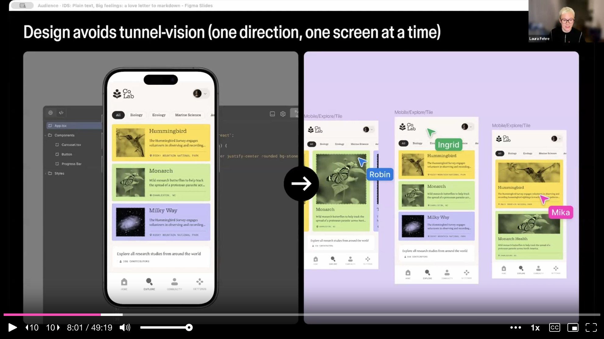

---

## A Love Letter to Plain Text

The heart of the talk is a personal narrative about markdown. For five years, Laura's partner has insisted there is only one right way to write things down: **markdown**. He would say things like "plain text is freedom." She never bought it. She is a designer. She likes her thoughts with a little bit of typography.

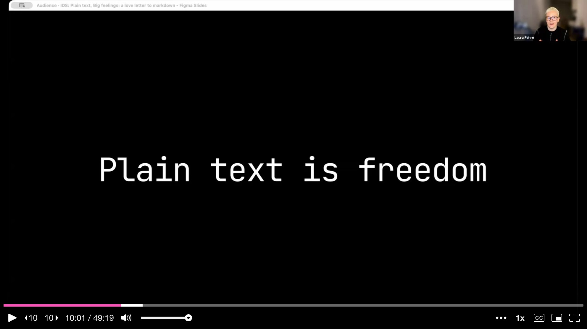

Then AI changed what she values. When your collaborator is a machine, vibes stop working. The winks do not translate. But **structure does**. That is when it clicked. Markdown is not about formatting -- it is about **communication**. It is about making intent visible and building something that both humans and machines can agree on. In very simple terms, markdown is just plain text with a signing set of symbols that tells words how to behave. It is not sparkly, it does not ship vibes, and it definitely does not try to be cute.

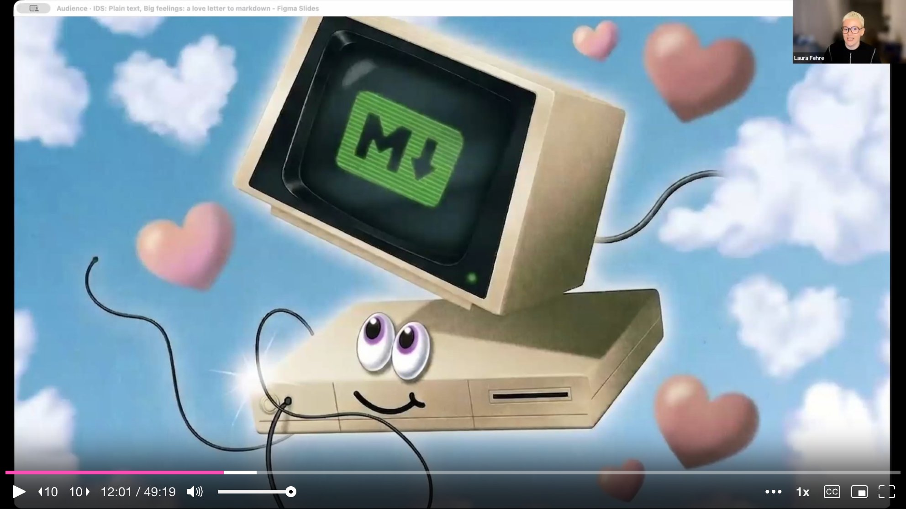

---

## A Brief History of Structured Text

Laura takes the audience through a quick genealogy. **HTML** gave the web its bones -- headlines meant something, paragraphs meant something, links were relationships. **YAML** made configurations readable and let systems interpret what they were meant to be. Then in 2004, **markdown** arrived with a radically simple philosophy: a markdown document should read like a normal text document even before it is rendered. Formatting should feel like light choreography, not intense custom changes.

That philosophy is why markdown took off so heavily. It matched what people were already doing in emails and message boards -- asterisks for emphasis, dashes for lists, plain brackets for links. It solved a 2004 problem for the web, and the world quietly built enormous infrastructure on top of it.

---

## Documentation Has Two Audiences Now

For a very long time, design system documentation had one primary audience: **humans** -- mostly tired, skimming for answers, scrolling through documentation boards. Then a second audience moved in: **machines** that read, interpret, and act. AI does not get the gist. It does not infer intent from tone the way a teammate does. It works best when information is clear, structured, explicit, modular, and predictable.

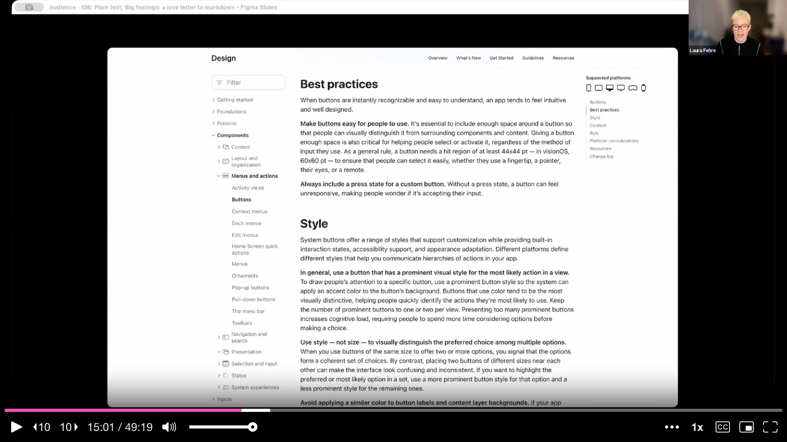

This is the shift Laura keeps returning to: **documentation is not just explanation anymore -- it is instruction**. It is closer to choreography, or a cooking recipe. There is a difference between "you know what I mean" and "here is what I need, here is what I do not, and here is what done looks like." For everyone who has worked in design systems and struggled with the policing dynamic, markdown can help. It turns good-luck-and-have-fun prompts into repeatable outcomes without turning the creative process into a policy document.

---

## Structuring Markdown for AI Consumption

Laura shares a concrete file structure for guideline documentation. The key principle: **split your markdown across multiple smaller files** rather than cramming everything into one. A single monolithic document overstretches the context window of an AI agent and leads to mistakes. Smaller files enable the agent to recall details accurately.

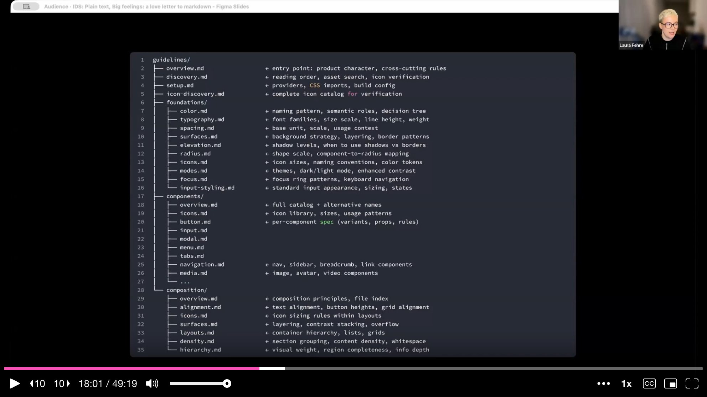

The structure she recommends breaks documentation into clear categories: an overview file with product character and cross-cutting rules, a setup file for providers and CSS imports, foundation files for color, spacing, typography, shadows, and layout, component files with a full catalog and alternative names, and composition files for patterns like text alignment, button heights, grid alignment, layering, and content stacking.

---

## Live Demo: From Guidelines to Figma Make

Laura switches to a live demo, showing two approaches to creating markdown guideline files. The first is simple: take an existing design system's online documentation -- she uses Material Design as an example -- fetch the URL, and ask Cursor to create a **machine-readable document** based on those guidelines. The AI generates a structured markdown file for the button component with all its variants, states, and usage rules.

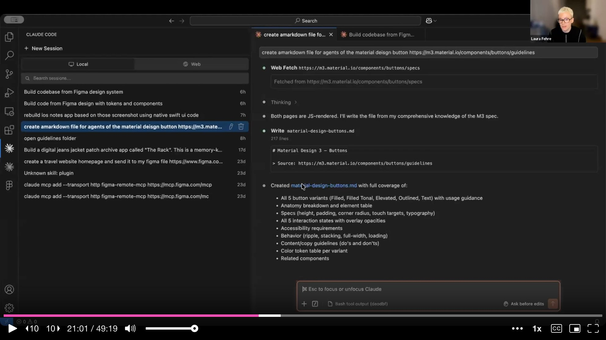

The second approach is faster for teams that already have a design system in code: point an agent at the repository and ask it to generate documentation from the existing codebase. Laura also recommends **Obsidian** as a companion tool for building a mental model of the design system. Its linked-note graph mirrors how language models connect concepts, making it a natural way to structure and navigate component relationships.

She then demonstrates how to load these guidelines into **Figma Make**. Rather than starting with a prompt, she switches to the code editor tab and navigates to the guidelines section. The key technique: you can drag and drop an entire folder of markdown files into Figma Make's code editor without consuming any prompt credits. This loads all component documentation, compositions, foundations, and mapping files into the environment at once.

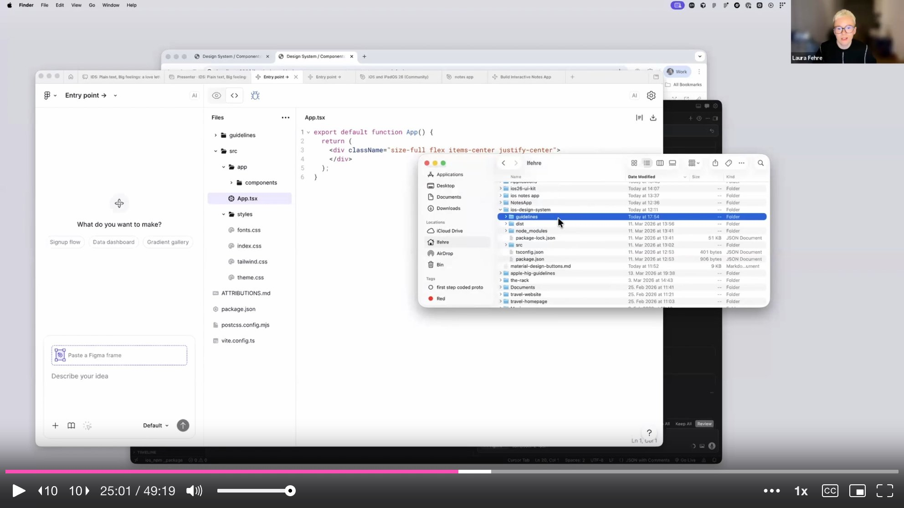

---

## Building the NPM Package

With guidelines in place, Laura turns to creating the actual component library as an npm package. She pulls components from the iOS community file in Figma onto a single page and feeds the Figma link into Cursor's planning mode, asking it to build a React-based npm package compatible with Figma Make.

The first attempt produces inconsistent code -- a direct consequence of the **messy Figma file** she started with. She restructures the source file, tries again, and gets better results. She builds a Storybook from the components to validate them visually, showing typography, shadows, materials, and the infamous liquid glass effect from iOS -- which, she notes, is a real pain to implement.

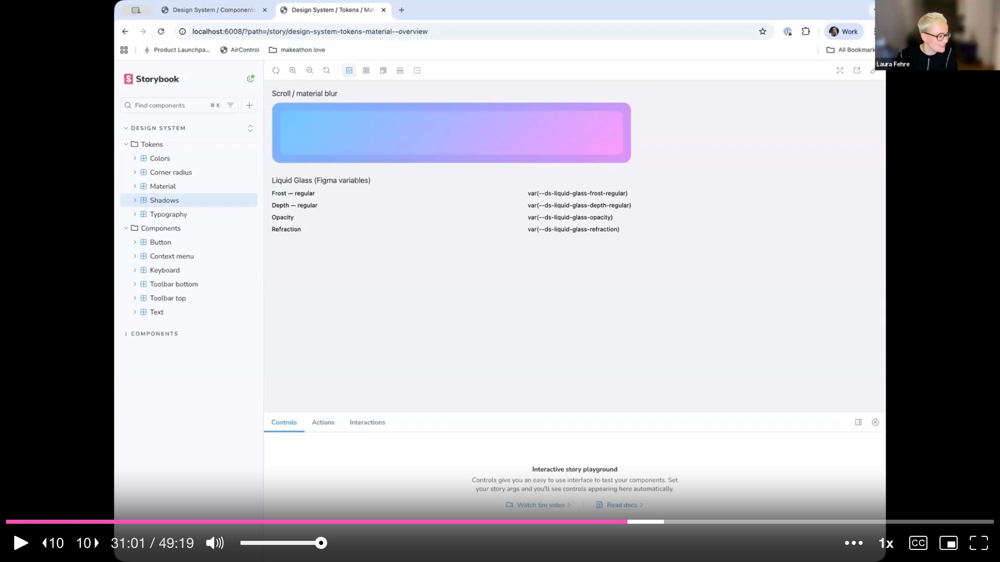

The Figma Make prototype of the Notes app gets close. The search works, notes are clickable, content is editable. But it is **not quite Apple**. Icons do not map correctly because SF Symbols work differently from standard icon sets. The native feel is off in subtle ways. Laura's honest assessment: the quality bar she wants has not been reached yet, but the experiment continues.

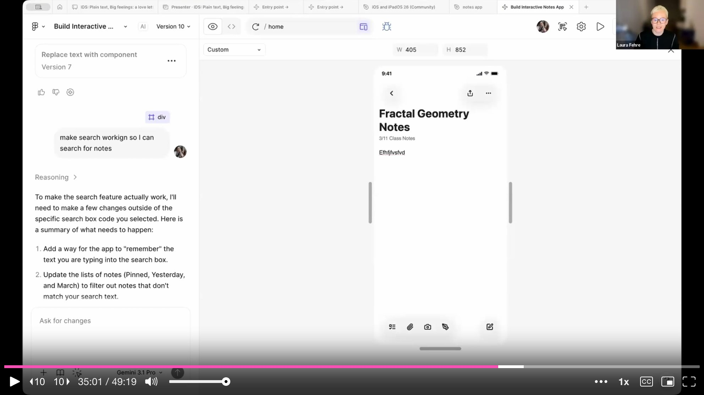

---

## Techniques for Better Guidelines

Laura shares several cross-cutting techniques that make guidelines significantly more effective for AI consumption.

**Usage frequency** is the first. When documenting spacing tokens, she annotates each value with a percentage indicating how often it should be used. For example, 8px at 42% as the default choice, 16px at 15% for section padding, 4px at 13% for base unit and tight gaps. A note at the bottom states that roughly 90% of spacing is 16px or smaller. This **frequency data** tells the AI not just what tokens exist but when and how often to apply them.

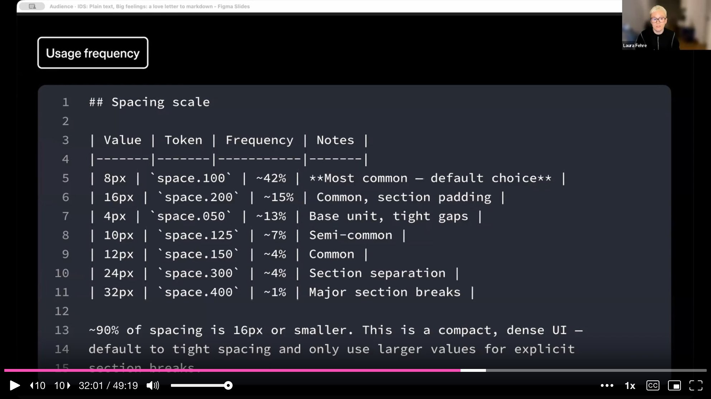

**Alternative names** solve a common mapping problem. If your component has an unusual internal name, the AI will not match it to user intent. Laura's example: the Atlassian team's "Lawson" component -- nobody outside the team knows what that is. By adding alternative names in the markdown documentation, you map internal vocabulary to common terminology the model already understands.

**Curation** is equally critical. Agents perform worst when given too many options. Narrowing the variants you expose reduces token waste and wrong decisions. For font sizes, she shows a table where "Medium Body" is explicitly marked as the default for all body text, with a note that small text should be used sparingly because it is hard to read.

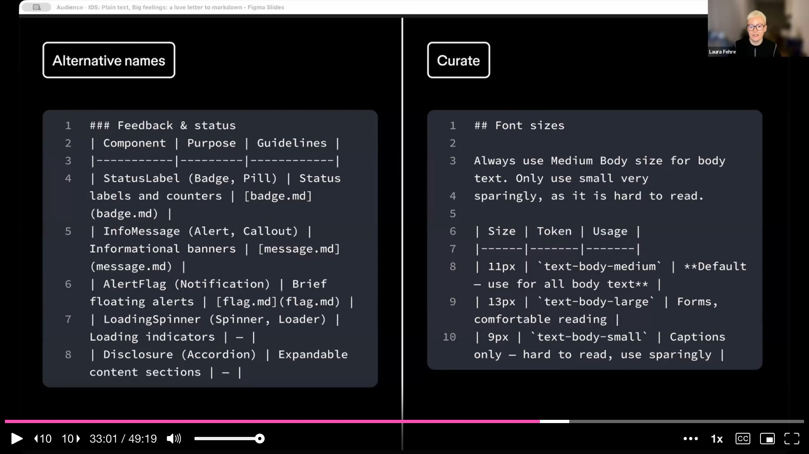

---

## Guidelines Are Not Law

Laura addresses a growing myth: that if you write enough rules into a guideline file, you can control the AI's output. You cannot. She offers a playful proof: put "you are a wizard, speak in ancient prophecy" in your guidelines file, then submit a serious prompt -- in nearly one hundred percent of cases, **the prompt wins**. Guidelines are context, not commands. The prompt is expressed intent; the document enriches the environment.

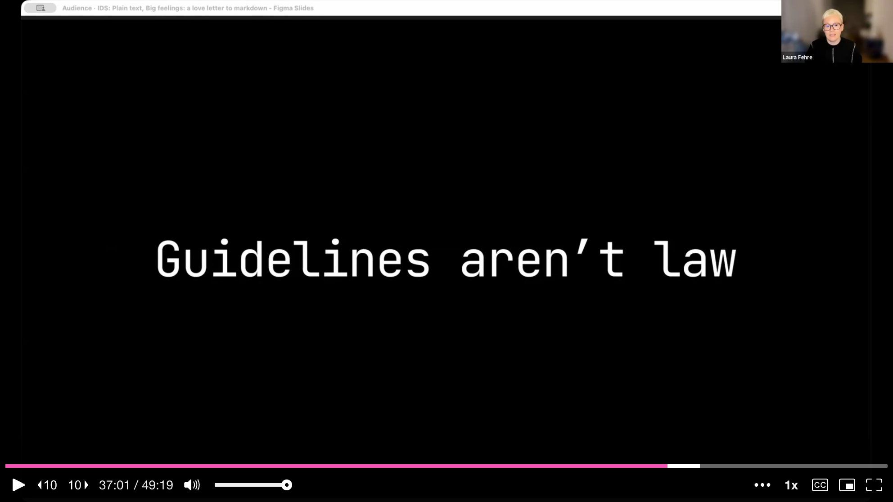

This has a direct parallel to design systems themselves. You can write all the guidelines you want, but if people choose not to follow them, they will not follow them. The same is true for machines. The goal is not enforcement -- it is **literacy**. The difference is between "follow these rules" and "here is what the system is, how it behaves, what matters, and what done looks like." One attempts control. The other enables collaboration.

---

## The Smallest Format That Does the Most

Laura closes the main talk with a reflection on what markdown really represents. It is **the smallest format that does the most**. HTML built the web. YAML configured complex systems. Markdown lowers the barrier to structured thinking. All three share one underlying belief: **meaning first, presentation second**. Structure makes collaboration possible.

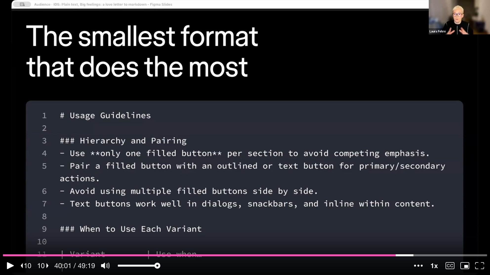

The real love story, she says, is not about markdown specifically and not about AI specifically. It is about **the quiet discipline of making your work legible** -- plain text, clear intent, shared language. Most teams already have the knowledge they need. It is scattered across Figma files, Notion pages, code repositories, and documentation boards. The opportunity is not to reinvent everything but to **enrich what already exists**. When context is structured, it compounds. When it is not, every new tool just adds noise.

---

## Q&A Highlights

**On source of truth**: Laura is emphatic that **code is always the source of truth**. What reaches the end user's hands is what is valid. Design system documentation should trace back to the repository, not just Figma. Tools like TJ's MCP and Nathan Curtis's metadata enrichment plugin help bridge the gap by rebuilding or syncing design system assets between code and Figma.

**On guidelines vs. skills in Figma Make**: Guidelines load every time you submit a prompt because the AI reads through all the documents. Skills are loaded only once. By structuring important guidelines as skills, you can save loading time and credits while still injecting the context that matters.

**On not losing the designer's instinct**: Laura returns to her opening theme. AI can automate pipelines -- component updates, token propagation, documentation generation. But **problem-solving should not be outsourced**. During her experiment, she hit a wall and went back to her Figma canvas to design by hand. With that design as input, the AI-generated output improved dramatically. The lesson: start with design, not with prompts.

---

## Key Insights & Takeaways

**Split your markdown documentation across multiple smaller files, not one monolith.** A single large document overstretches the AI's context window and leads to mistakes. Laura recommends separate files for overview, setup, foundations (color, spacing, typography), component catalog, and composition patterns. This structure lets the agent recall details accurately because it loads only what it needs for a given task.

**Annotate tokens with usage frequency to guide AI decisions.** When documenting spacing tokens, Laura adds percentages: 8px at 42% as the default, 16px at 15% for section padding, 4px at 13% for tight gaps, with a note that 90% of spacing is 16px or smaller. This frequency data tells the AI not just what tokens exist but how often each should appear. Without it, the AI distributes values arbitrarily. Apply the same technique to typography, color, and any token with a "most common" use case.

**Add alternative names to components so AI can match internal vocabulary to common terminology.** If your component has an unusual internal name (Laura's example: Atlassian's "Lawson"), the AI cannot connect it to user intent. By listing alternative names in the markdown metadata, you bridge the gap between your internal naming and the terms the model already understands. This is a quick win that dramatically improves component selection accuracy.

**Guidelines are context, not commands -- the prompt always wins.** Laura demonstrated that putting "you are a wizard, speak in ancient prophecy" in a guidelines file gets overridden by a serious prompt nearly every time. Guidelines enrich the environment; they do not enforce behavior. This parallels how design systems work with humans: you can write all the rules you want, but if people choose not to follow them, they will not. Aim for literacy, not control.

**Start with design, not with prompts -- problem-solving should not be outsourced.** Laura hit a wall during her HIG-to-SwiftUI experiment and went back to Figma to design by hand. With that design as input, the AI output improved dramatically. Mixing tools and approaches -- paper prototypes, Figma canvases, code editors, AI agents -- produces richer outcomes than sitting in front of an agent prompting yes-no-yes-no on a single screen. Do not let the prompt box replace your design instinct.
