# Ship It! Vibe Coding Your First Figma Plugin

**Davy Fung** -- Design System Designer, Atlassian Design System (formerly Meta) | Into Design Systems AI Conference 2026 | 50 min

---

## The Promise: Every Designer Can Build Plugins Now

Davy Fung opens with a simple, empowering thesis: **every design system maintainer can build their own Figma plugins today**, even without a traditional engineering background. With an AI agent and basic prompting skills, the repetitive tasks that eat into a designer's day can be automated in minutes rather than weeks.

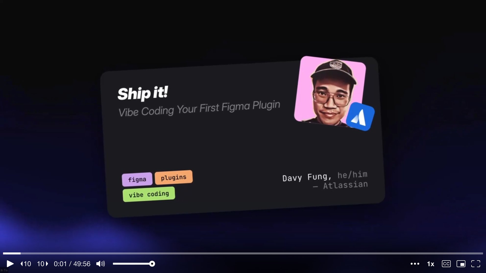

The talk is structured as a hands-on workshop. By the end, attendees should walk away knowing what setup they need, what types of tasks the **Figma Plugin API** can automate, how to write prompts that produce reliable results, and how to actually build and sideload a working plugin. Davy shares a GitHub repo with all the prompts so people can follow along at their own pace.

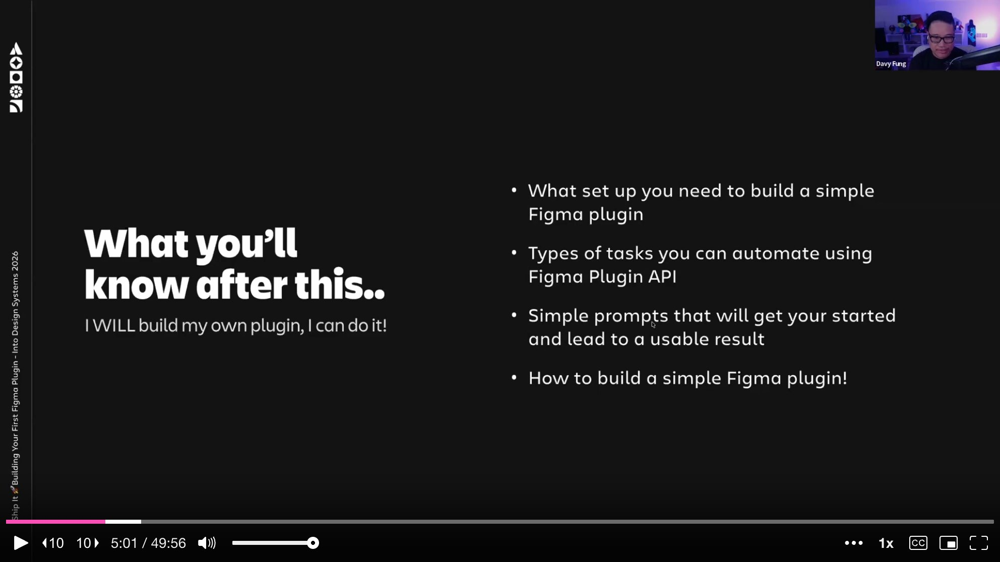

---

## Plugins Davy Has Built: Starting With Curiosity

Before diving into the how, Davy showcases three plugins he built at Atlassian to prove what is possible. The biggest one is his **token drift detection plugin**. It plugs into Atlassian's design token packages and uses the Figma Plugin API to compare what tokens exist in code versus what is actually applied in Figma files. Mismatches get flagged automatically. He built it in roughly a week while onboarding onto the team.

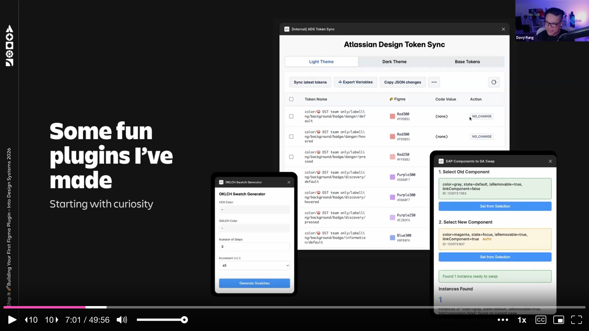

The second plugin handles **component migration** -- swapping legacy components for new early-access-program components while preserving overrides. The third is a personal experiment: an **OKLCH color ramp generator** that takes a single color, plots it on the lightness scale, and generates a full ramp up and down.

His first "aha moment" plugin, though, was a simpler one: the **Awesome Bulk Metadata Importer**. During an icon migration at Atlassian, he needed to bulk-add descriptions, keywords, and legacy name mappings to hundreds of icon components. The old icon "trashcan" had been renamed to "container with lid" -- without the legacy name in the metadata, nobody could find it by searching. His plugin takes a CSV or JSON, maps it to components, and batches all the descriptions in about two minutes. What would have been days of manual work became a trivial automated task.

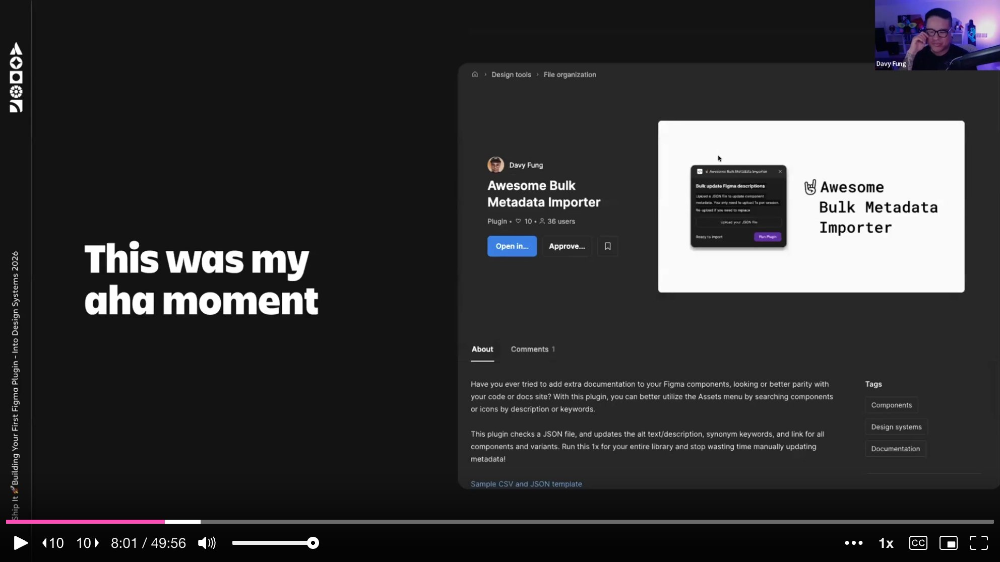

---

## The Anatomy of a Figma Plugin: Three Files

Davy demystifies what a plugin actually is. There are only **three files** to understand, and one of them is optional.

**manifest.json** is the plugin's ID card. It holds the name, points to the code file, points to the optional UI file, and declares any permissions. **code.js** is where the magic happens -- it runs inside Figma's canvas sandbox and can read and modify everything on the canvas. It also receives messages from the UI. **ui.html** is optional and provides the visual interface: buttons, text fields, dropdowns, styled with CSS. It communicates back and forth with code.js via message passing.

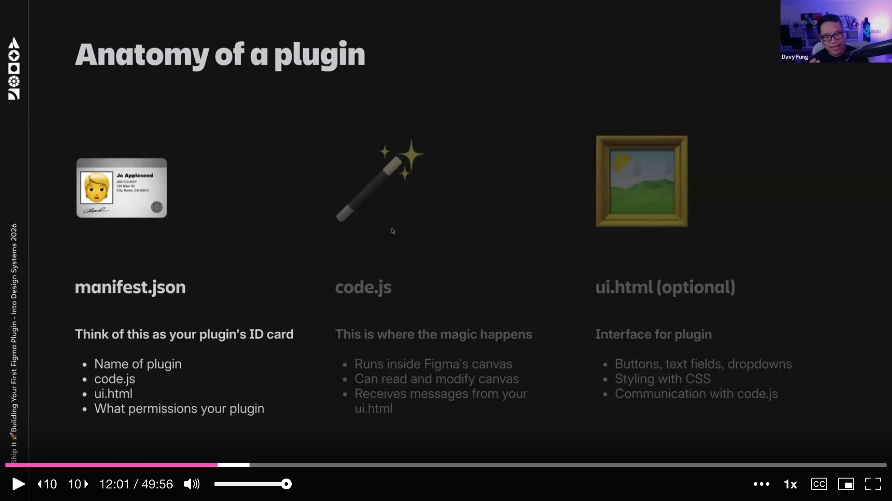

The flow is straightforward. You open the plugin in Figma, the manifest instructs what to load, code.js starts running in the background, and if a UI exists, it displays the interface. The UI sends messages to code.js, code.js does the work on the canvas, and it can send messages back to the UI. If there is no UI, the plugin simply executes its task and shows a notification.

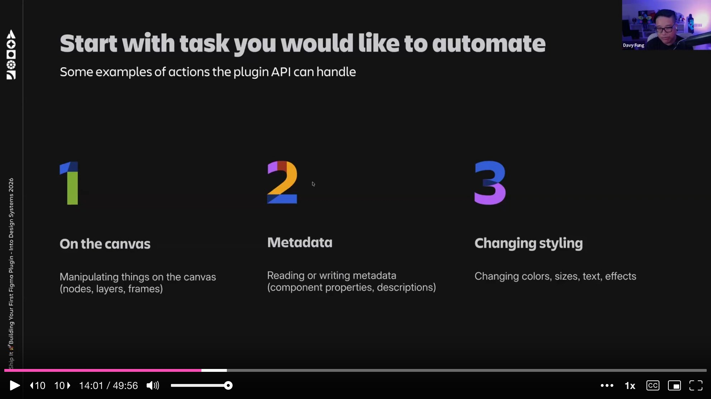

---

## What You Can Automate: Three Categories of Tasks

Davy breaks down the **types of tasks** the plugin API can handle into three categories. First, **canvas manipulation** -- working with nodes, layers, and frames directly. Renaming layers, sorting frames, deleting hidden layers, distributing elements with exact spacing. Second, **metadata** -- reading or writing component properties, descriptions, and annotations. This is where bulk operations like his metadata importer shine. Third, **styling changes** -- modifying colors, sizes, text properties, effects, and applying tokens.

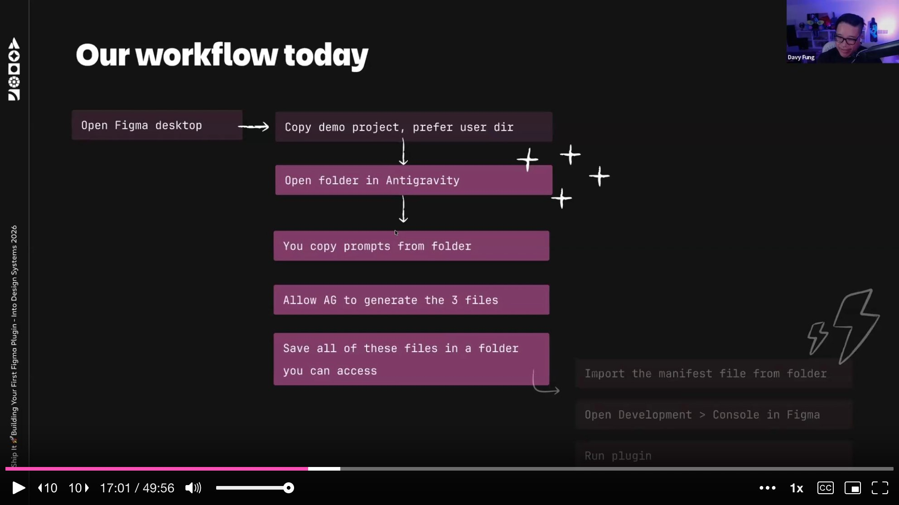

He is upfront about **limitations**. Plugins operate within the current file only -- they cannot reach into external libraries. They must be manually initiated; there is no way to have them run automatically in the background. These constraints matter when architecting what a plugin should do versus what belongs in a CI/CD pipeline.

---

## The Tools: Figma Desktop and a Code Editor With AI

The setup is minimal. You need **Figma Desktop** (not the browser version) because the desktop app's development settings let you sideload plugins locally without publishing them. This creates a safe sandbox for iteration. And you need a **code editor with an AI agent** -- Cursor, Windsurf, or in Davy's case, **Antigravity**, a VS Code fork from Google that gives access to Claude, Codex, and Gemini on generous free tiers.

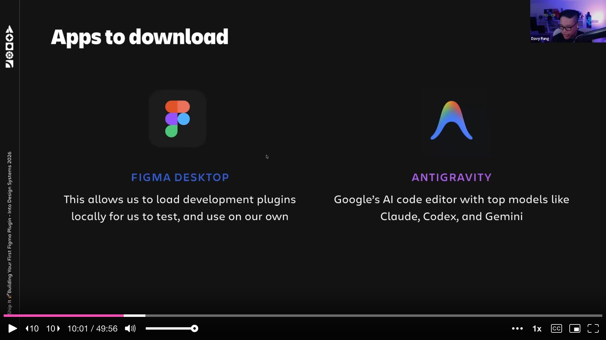

The workflow Davy lays out is deliberate: open Figma Desktop, open your project folder in the code editor, copy a prompt from the shared repo, let the AI agent generate the three files, save them, import the manifest into Figma's development settings, and run the plugin. The whole cycle from idea to working plugin takes minutes.

---

## The Prompt Structure: Define the Task, Not Just the Goal

Davy emphasizes that **prompt structure matters more than prompt length**. He walks through a template that consistently produces reliable plugin code. The structure has five parts: what kind of plugin to build (headless or with UI, and if UI, what dimensions), the main goal, what the user should see, how it should work (which layers to target, what order of operations), what edge cases to avoid, and what success notification to show.

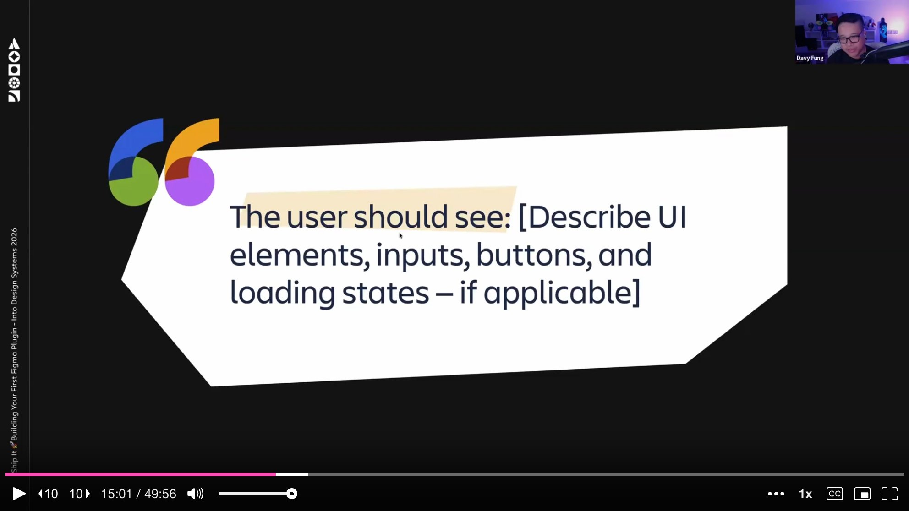

A key tip: **use AI to improve your prompt before running it**. Davy recommends pasting your initial prompt into Claude or Gemini and asking for improvements first. This catches missing constraints, ambiguous language, and edge cases before they cost tokens and debugging time. He keeps refined prompts as markdown files alongside his projects -- a form of pseudo-skill that can be reused and iterated on.

---

## Live Demo 1: Headless Plugin -- Rename Frames by Text

The first live demo builds a **headless plugin** (no UI) that renames frames based on their largest text layer. The prompt is specific: look at each selected frame on the current page, find the text layer with the biggest font size, break ties by layer order (top wins), skip frames with no text or text layers with mixed font sizes, rename each frame to match the text content, and show a notification like "Renamed 3 frames." If nothing is selected, close with a message asking the user to select at least one frame.

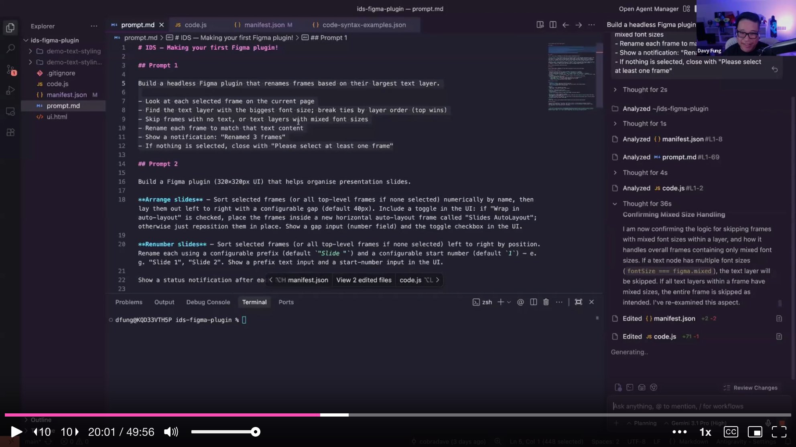

Davy pastes the prompt into Antigravity's agent chat, lets Gemini generate the manifest.json and code.js, saves the files, switches to Figma, and imports the manifest from the development settings. He selects 18 slide frames and runs the plugin. **"Renamed 18 frames."** It works. Each slide frame is now named after its largest heading text, making the layer panel instantly navigable. The use case is practical: when sharing presentation decks, named frames export with meaningful filenames instead of "Frame 20000."

---

## Live Demo 2: UI Plugin -- Presentation Organizer

The second demo is more ambitious: a **plugin with a UI** that helps organize presentation slides. The prompt specifies a 320x320 pixel interface. The plugin should sort selected frames numerically by name and lay them out left to right with a configurable gap (default 40 pixels). A toggle wraps them in an auto layout frame. A separate "renumber" function sorts frames by position and renames them with a configurable prefix and start number.

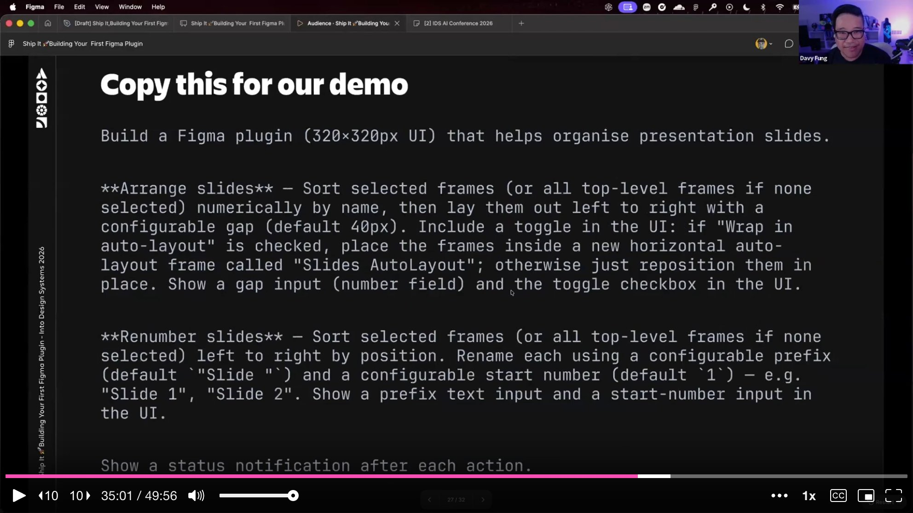

This time the AI goes into planning mode first, which Davy did not want -- he already did the planning work in his prompt. He stops it and tells it to just execute. When the plugin finally generates, it produces a proper interface with input fields and buttons. But the first run reveals a classic **AI literalism problem**: when Davy asks it to "make something two times bigger," it literally doubles the numeric size values. The result is technically correct but not what he intended. "AI takes you literally, not intentionally," he observes. Vague language produces technically correct but wrong results.

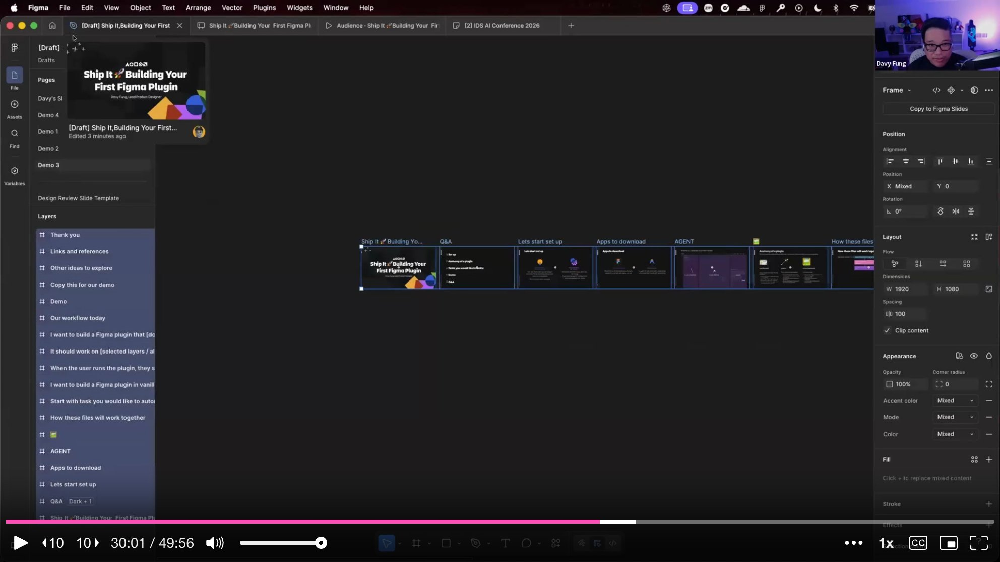

After some back-and-forth iteration, the plugin works: sorting slides, renumbering them with prefixes, and wrapping them in auto layout. The demo is deliberately imperfect -- Davy wants to show that **the iteration loop is the real workflow**, not getting it right on the first try.

---

## Headless vs. UI: A Scope Decision

During the Q&A, Davy explains how he decides between **headless and UI plugins**. If the plugin is just for himself and does one thing, headless is fine -- all he needs is a success notification. If others will use it, or if it requires inputs like configurable prefixes or gap sizes, a UI makes sense. His manager Zach pushed him on this: if the tooling is primarily for your own project, keep it simple. The UI becomes valuable when you want to build on it, add features, or share it with the team.

---

## Publishing, Maintenance, and the Cost of Community

Davy shares a candid warning about publishing plugins to the Figma Community. Once a plugin is public, **you own it forever**. Users file requests and expect maintenance. His simple metadata importer still generates LinkedIn messages from strangers asking for features, months after he stopped actively developing it. He has to retrace his old code, figure out what has changed in the Figma API since he built it, and decide whether to invest more time.

For internal plugins, the story is different. At Atlassian, he stores them in a shared repo called "design system tools" where teammates can fork and contribute. For personal plugins, he creates quick Loom videos to demonstrate what is possible and spark inspiration on the team -- a lightweight way to share without taking on maintenance burden.

---

## The Next Evolution: REST API and Pipelines

Davy closes by pointing toward what comes after plugins. Once you are comfortable with the Figma Plugin API, the natural next step is **token automation at the CI/CD level** -- GitHub Actions, Bitbucket Pipelines, and the Figma REST API. During a Christmas break project, he figured out how to do token syncing at the pipeline level, making the automation persistent rather than requiring manual plugin runs.

He also highlights the power of combining Figma plugins with tools like **Atlassian's Rovo MCP**, which gives read-write access to Confluence and Jira from the terminal. As he builds plugins, he simultaneously has AI write documentation pages and create Confluence articles explaining how the plugin works -- solving the "we vibe-coded it but nobody understands it" problem before it starts.

---

## Key Takeaways

The talk's core message is one of empowerment. Figma plugins are not mysterious engineering artifacts -- they are **three files, a structured prompt, and an AI agent**. Design system maintainers who spend hours on repetitive canvas tasks can reclaim that time by building simple, focused automation. Start with a task you do manually too often, write a clear prompt with defined inputs, edge cases, and success criteria, let the AI generate the code, sideload it in Figma Desktop, and iterate. The barrier between "designer who uses tools" and "designer who builds tools" has never been thinner.

---

## Key Insights & Takeaways

**A Figma plugin is just three files -- manifest.json, code.js, and an optional ui.html.** Davy stripped away the mystique by showing that plugins are structurally simple. The manifest is an ID card, code.js runs in Figma's sandbox to manipulate the canvas, and ui.html provides an optional interface. With a structured prompt and an AI agent, you can generate all three files in minutes. If you have been avoiding plugin development because it felt too technical, this is your entry point.

**Use AI to improve your prompt before running it.** Davy's most practical tip: paste your initial prompt into Claude or Gemini and ask for improvements first. This catches missing constraints, ambiguous language, and edge cases before they cost tokens and debugging time. Keep refined prompts as markdown files alongside your projects -- they become reusable pseudo-skills that improve with each iteration.

**Build a token drift detection plugin to catch Figma-to-code mismatches automatically.** Davy's most impactful plugin at Atlassian compares tokens in code versus what is applied in Figma files and flags mismatches. He built it in roughly a week while onboarding. If your team struggles with token drift, this is a high-value first plugin project -- it turns an invisible problem into a visible one.

**Start headless, add a UI only when others need to use it.** If a plugin is just for you and does one thing, skip the UI entirely -- a notification message is enough. Add a UI when the plugin needs configurable inputs or when you want to share it with the team. This decision framework keeps your first plugin simple and shippable, rather than over-engineered from the start.

**Be cautious about publishing to the Figma Community -- you own it forever.** Once a plugin is public, users file requests and expect maintenance indefinitely. Davy still gets LinkedIn messages about a simple metadata importer he stopped developing months ago. For internal plugins, use a shared repo where teammates can fork and contribute. For external sharing, consider Loom demos to spark inspiration without taking on maintenance burden.
