# Designers Who Ship: Building a Real Plugin in 48 Hours with AI

**Speakers**: Christoph Hellmuth -- Lead Product Designer, Design Systems, NordVPN | Raquel Pereira -- Lead UX Designer, Design System, Nokia | Casandra Sandu -- Design System Specialist, Trackunit
**Conference**: Into Design Systems AI Conference 2026 | 53 min

---

## The Challenge: Ten Strangers, One Weekend, Zero Plugin Experience

The Into Design Systems online hackathon brought together 150 designers for a weekend of vibe coding with AI. Among them, a team of ten designers who had never met before -- scattered across Portugal, Denmark, Germany, and beyond -- won first place by building a fully functional Figma plugin called **Swap Wizard**. None of them had ever built a Figma plugin before.

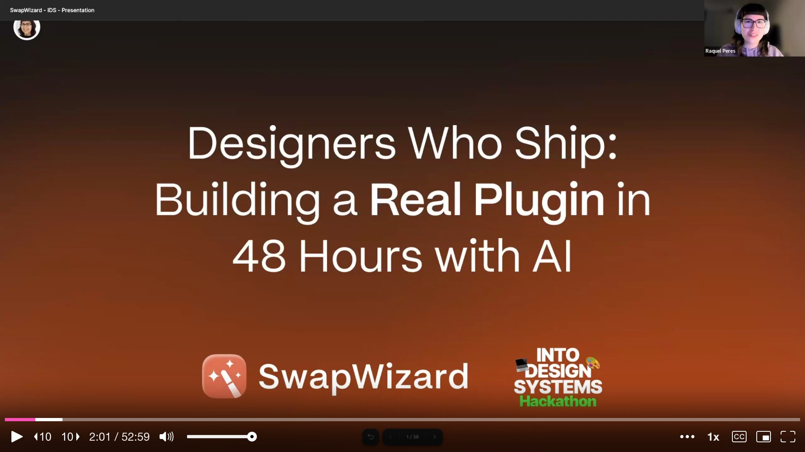

Raquel, Cassandra, and Christoph take the stage to share not just what they built, but the process and principles that got them there. Their talk is part testimonial, part beginner's guide -- a practical look at what happens when designers stop waiting for engineers and start shipping code themselves.

---

## The Problem: Library Swapping Breaks When Names Don't Match

The team identified a pain point that every design system practitioner knows well. **Figma's built-in library swap only works when component names match exactly.** The moment a name changes -- because a new design system uses different naming conventions, or because components have been detached and modified -- the swap fails, and designers are stuck replacing components one by one, manually.

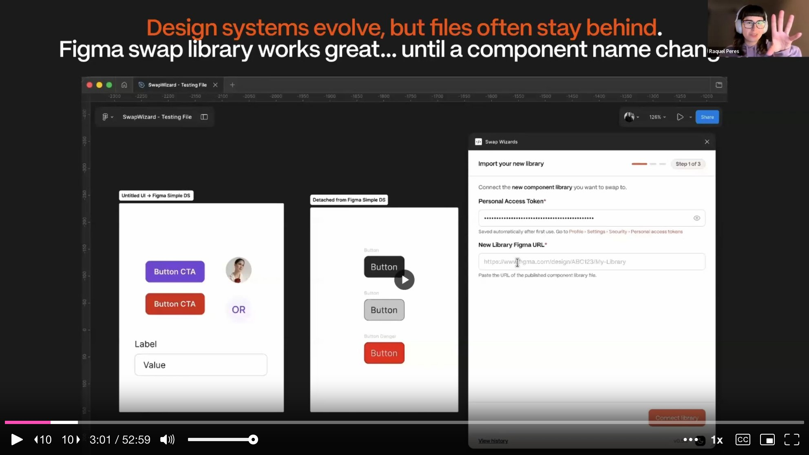

Swap Wizard solves this by using **AI-powered matching** to suggest the best swap candidates even when names don't align. The plugin scans a selection or an entire page, fetches the target library, runs AI matching against component properties, and presents the designer with editable suggestions. The user reviews each match, can override suggestions at the component or variant level, sees a before-and-after preview, and then executes the swap in one click. A bonus discovery during development: the plugin could also **reattach detached components** by reading hidden metadata in the Figma API that remembers what a frame used to be.

---

## Plan Before You Prompt

With a 48-hour deadline and AI tools at their fingertips, the natural instinct is to open Cursor immediately and start prompting. The team deliberately resisted that urge. They spent the first few hours without writing a single line of code, instead defining their **product scope** with surgical precision.

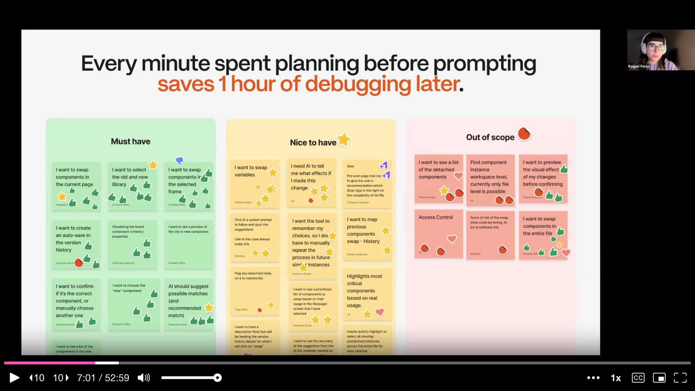

Every feature the team could imagine was sorted into three buckets: **must-have, nice-to-have, and out of scope**. If it wasn't a must-have, it could wait. This exercise, simple as it sounds, became the single most important decision of the hackathon. Every minute spent planning before prompting saved an hour of debugging later -- a mantra the team repeated throughout the talk.

---

## Research First, Prompt Second

Before writing any prompts, the team mapped out the **technical sequence** their plugin needed to follow: scan components, fetch the new library via the REST API, run AI matching, let the user review and confirm mappings, create a safety snapshot, execute the swap, and audit the result.

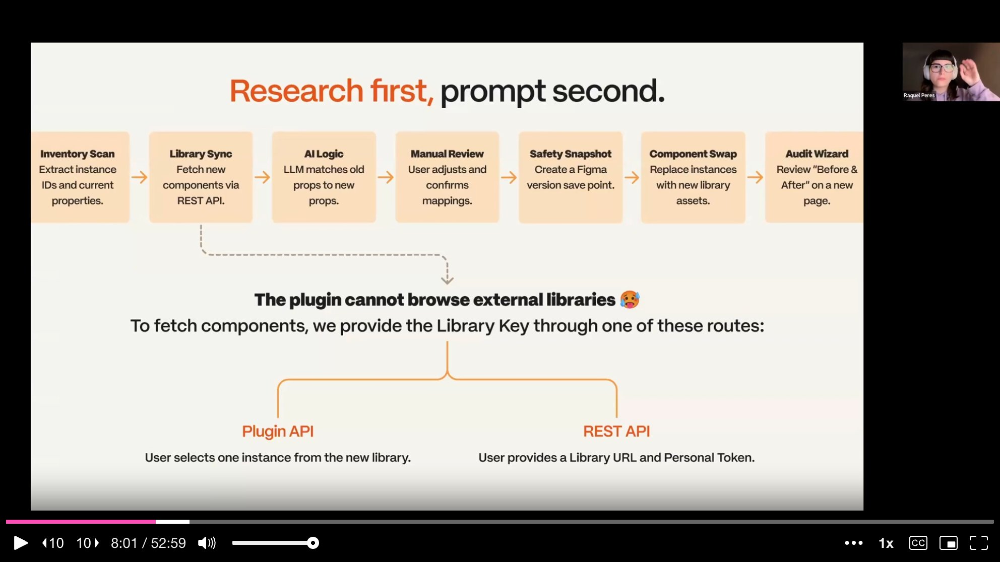

During this research phase, they hit a **critical constraint**: the Figma Plugin API does not allow browsing external libraries from inside a plugin. Had they discovered this after hours of prompting, it would have been catastrophic. Instead, they found it early and designed two workarounds -- letting the user either select a component from the new library as a reference point, or provide a library URL and personal access token directly. This discovery alone justified the entire planning phase.

---

## The Three Ingredients of a Good Prompt

Raquel distills the team's prompting philosophy into three ingredients: **clarity, context, and constraints**. Clarity means being specific about what you want. Context means giving the AI your tech stack, goals, and project background. Constraints means telling it what platform you're targeting, what patterns to follow, and what to avoid. If any one of these is missing, the AI guesses -- and guessing costs time and money.

The team demonstrated this with a side-by-side comparison. A **vague prompt** forced the AI to read more files, reason longer, and produce a longer response -- costing roughly nine dollars over two minutes with low precision. A **well-structured prompt** with the right model cost almost nothing, responded in seconds, and was far more accurate. The vague prompt was **500 times more expensive** than the clear one.

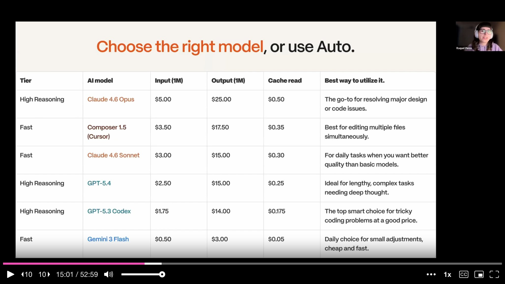

The team also emphasized that **the most expensive model does not automatically produce the best results**. Fast models excel at quick edits and everyday tasks, while high-reasoning models are better reserved for deep analysis and complex problem solving. Cursor's auto mode, which selects the right model for each task automatically, saved them from having to make this decision constantly.

---

## The Vibe Flow: A Disciplined Loop

Rather than treating AI-assisted coding as a free-for-all, the team established a disciplined workflow they call **the vibe flow**: add features step by step, one at a time. Start a new session for each new feature. Roll back immediately if something breaks. Test after every addition.

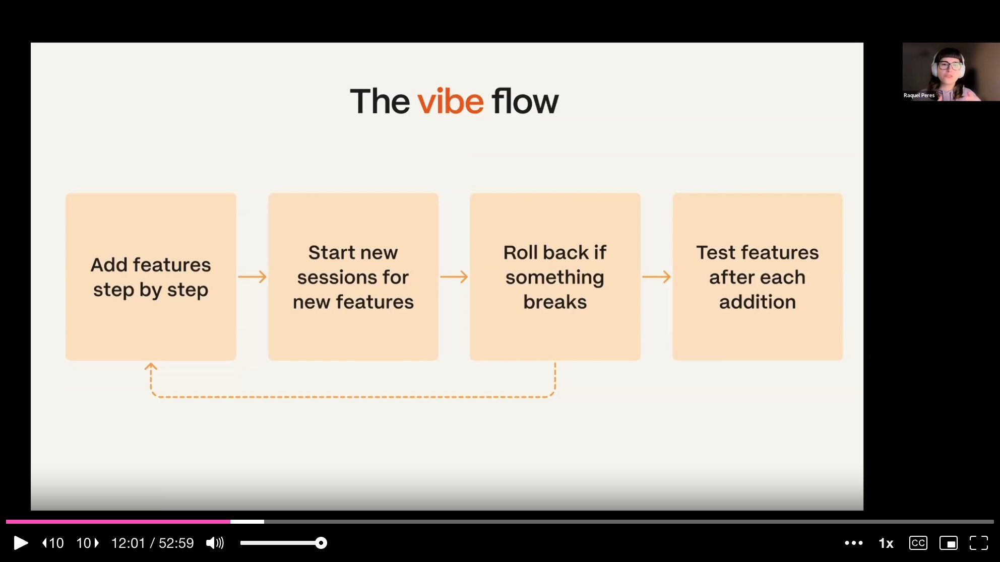

This loop sounds simple, but each step addresses a real failure mode. **Mixing features in the same context window** balloons token usage and degrades output quality. Failing to commit working code before each agent session means catastrophic failures take hours to recover from instead of seconds. Skipping tests after each addition means bugs compound invisibly until the whole system is tangled.

Raquel also introduced a meta-prompting technique: **use one AI to write prompts for another**. If you're unsure how to structure a prompt, ask Claude or Gemini to write a comprehensive prompt with best practices, then feed that polished prompt into Cursor. The team found this particularly effective for generating well-structured prompts that considered accessibility, API design, and maintainability from the start.

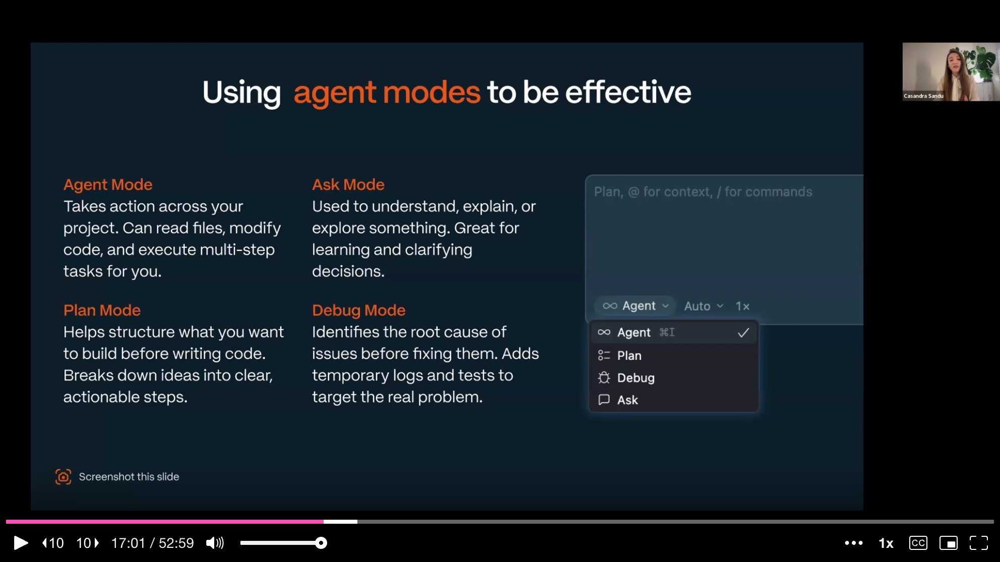

---

## Cursor Modes in Practice

Cassandra walks through how the team used **Cursor's four modes** in practice, each for a distinct purpose. **Plan mode** was the starting point -- structuring ideas and breaking them into actionable steps before any code was written. Cassandra's initial prompt was deliberately simple: "I want to build a Figma plugin that can swap libraries of components." Plan mode asked clarifying questions, then generated a clear, reviewable plan.

From there, the team switched to **agent mode** for building, going back and forth with simple, precise prompts. They weren't trying to get everything perfect from the start. The goal was a working prototype -- no proper framework, no ideal structure, just something functional that could be tested immediately in Figma by importing the manifest file.

**Ask mode** served as a learning tool. When the team found the `detachedInfo` property in the Figma API documentation, they used ask mode to understand what it meant and whether it could be leveraged for their reattachment feature. The AI tools weren't just code generators -- they were **powerful learning partners** helping designers build real technical knowledge, prompt by prompt.

---

## Async Collaboration at Scale

With ten people across multiple time zones, the team needed infrastructure that could handle truly asynchronous work. **GitHub** served as the code hub, with **28 pull requests merged in under 48 hours**, each reviewed before going into main. Slack handled communication, with bugs shared via video recordings and categorized by severity. Figma held the UI designs, test files, and the running plugin itself.

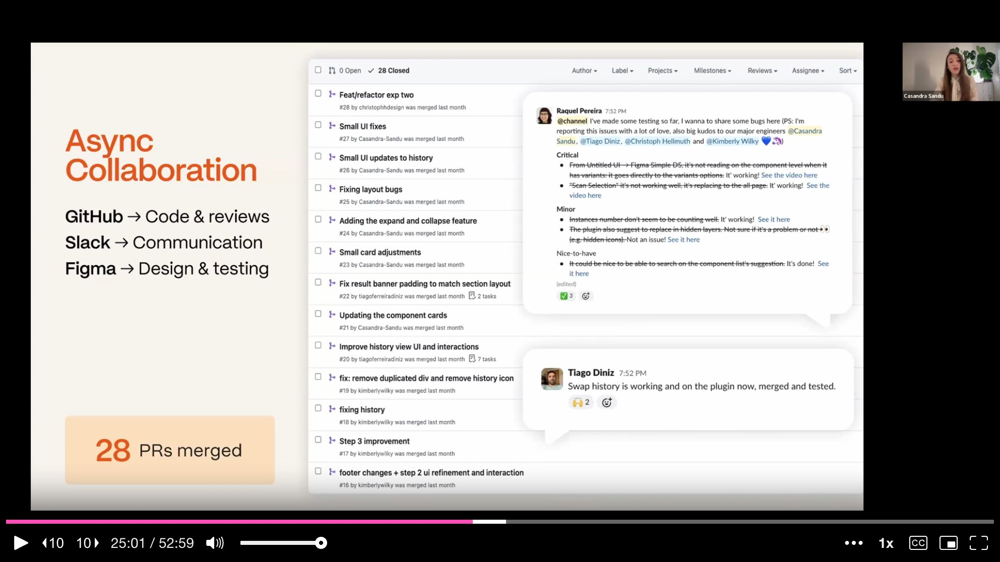

The team emphasizes that this structure matters even for solo builders. Tracking changes, documenting decisions, and keeping things organized creates a **safe space to experiment and fail**. When you know you can always roll back to a working state, you take bolder creative risks -- and that's where the best ideas come from.

---

## Vibe Debugging: When Things Break

Christoph tackles the part of AI-assisted development that rarely gets discussed in tutorials: **what happens when things break**. And they will break. The familiar spiral starts optimistically -- polite prompts, quick results -- and degrades into frustration as bugs compound and the AI introduces new problems while trying to fix old ones.

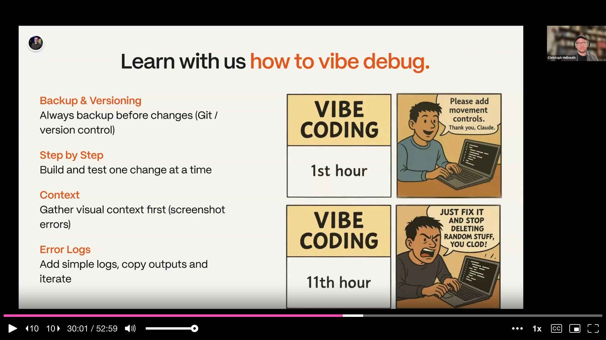

The team's approach to **vibe debugging** has four principles. First, **always commit working code before making changes** -- version control is your safety net. Second, **build and test one change at a time** so bugs don't compound across features. Third, **gather visual context first** -- a screenshot of the broken state gives the AI far more to work with than a vague description. Fourth, **use error logs** -- tell the AI to add instrumentation before guessing at fixes, then copy the actual error output back into the prompt.

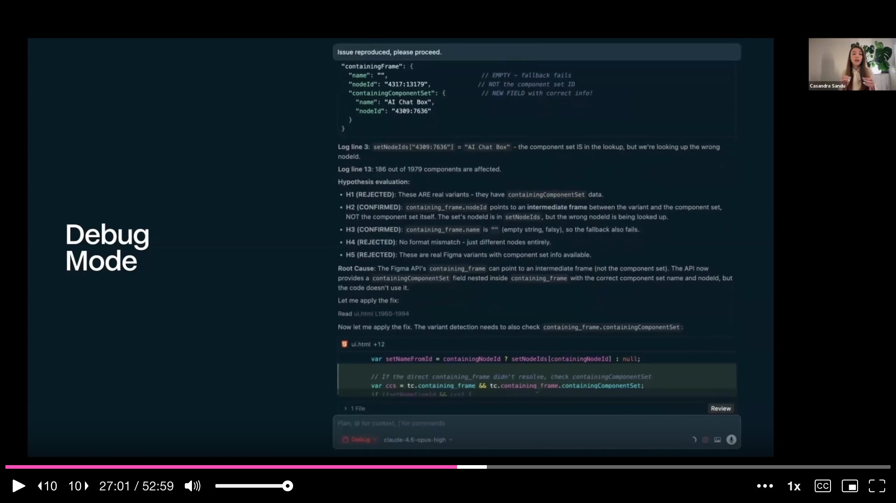

Cassandra demonstrated this with a real bug from the hackathon. Some components in their dropdown weren't displaying correctly -- properties were shown flat instead of grouped under component names. Instead of guessing, she switched to **debug mode**, provided a single screenshot of the broken state, and let the AI generate hypotheses, add temporary logs, gather evidence, and identify the root cause. The bug was resolved in one pass rather than through an expensive trial-and-error loop.

---

## Agent Skills: From Generalist to Specialist

Christoph introduces **AI skills** as the mechanism that transforms a general-purpose agent into a domain expert. A skill is a structured, repeatable capability with three components: a **trigger** that defines when it should activate, **instructions** that provide step-by-step guidance, and **tools** that include reusable code snippets so the AI doesn't regenerate boilerplate each session.

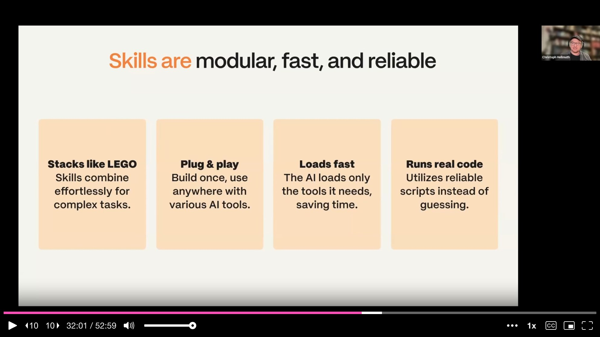

For the hackathon, the team used a **Figma Plugin Developer skill** that gave Cursor deep knowledge of plugin development architecture, the Figma API, REST API patterns, sandbox architecture, and UI best practices. Instead of burning tokens re-teaching the agent these fundamentals in every session, the skill loaded instantly and made every subsequent prompt more precise.

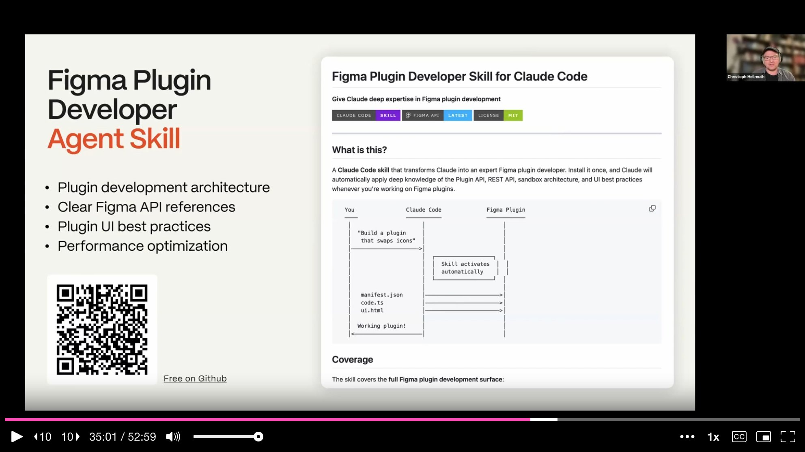

Christoph also sounds a security warning: skills are powerful, but they execute code. A malicious skill could introduce prompt injection, expose API keys, or modify your git history. The team recommends **reading every skill before installing it** and running the skill file through an AI security check as a basic precaution.

---

## The Great Refactor and the Road to Launch

After 48 hours of building, the team had a working prototype -- but also **4,000 lines of code** in a single file with no clear architecture. Christoph is candid about this: shipping a working prototype and then cleaning up separately is a valid strategy. The refactor is where the plugin becomes maintainable, and it happened after the hackathon using Claude to restructure the codebase.

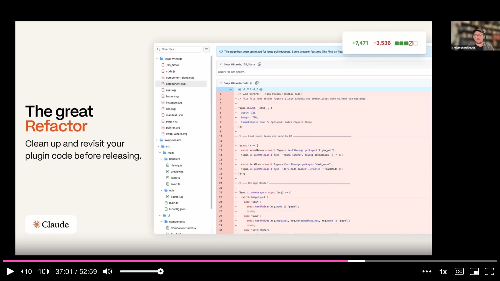

For marketing, the team discovered a clever shortcut. The plugin's existing **CSS and HTML styling** already constituted a de facto brand guide. They fed these files into Lovable along with a meta-prompted marketing brief, and had a polished **landing page in under an hour** -- complete with newsletter signup -- requiring no design work from scratch. The plugin's visual identity simply carried over.

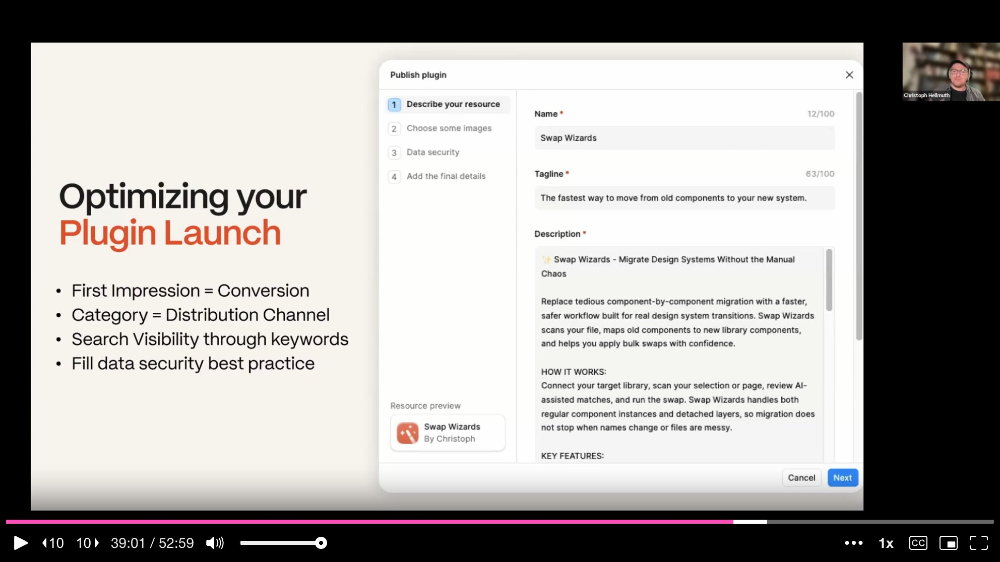

For the Figma community listing, the team optimized for discoverability: choosing the right category, including relevant keywords, and completing the data security section -- critical for enterprise users who need plugin approval before they can even install it.

---

## Six Takeaways for Designers Who Want to Ship

Christoph closes with six principles that apply whether you're building a Figma plugin, a web app, or any other tool with AI assistance. **Plan before you prompt** -- every minute of planning saves an hour of debugging. **Use the right modes** -- plan mode for thinking, agent mode for building, ask mode for learning, debug mode for fixing. **Test early and often** -- the earlier you catch a bug, the easier it is to fix. **Reuse your existing code for marketing** -- your plugin CSS is your brand guide. **Use agent modes effectively** -- choose the best fitting mode for each goal. **Explore agent skills** -- transform your general AI into a specialized expert.

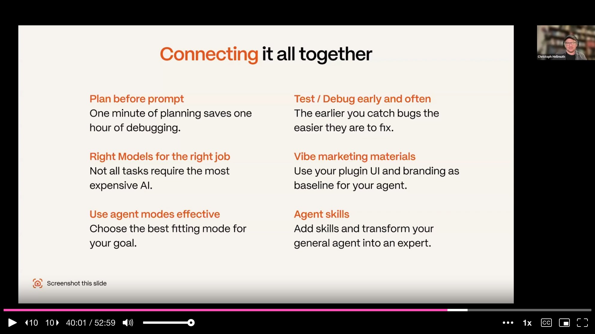

The specific tools will change, but the workflow stays the same. And the most important takeaway may be the simplest: **none of these ten designers had ever built a Figma plugin before.** If that's where you are now, this talk is proof that the barrier has fallen.

---

## Q&A Highlights

**On detached components**: The Figma API retains metadata about what a detached frame used to be. Swap Wizard reads this hidden `detachedInfo` property to suggest correct reattachment targets. Content may be lost if it doesn't match the new component's structure, but the original component identity is preserved.

**On UI design process**: The team combined AI-generated UI variations with manual Figma design work. Some colleagues focused on branding and UI in Figma while others built the functional prototype in Cursor, then the visual polish was applied to the working plugin.

**On the hackathon experience**: Raquel credits the team's success to humility and honest communication from the start. Everyone found their natural role without stepping on each other, communicated extensively on Discord, and treated the weekend like a small agile team. The magic ingredient was not technical skill but team dynamics and planning discipline.

---

## Key Insights & Takeaways

**Every minute of planning saves an hour of debugging.** The team deliberately spent their first hours without writing a single line of code, instead sorting every feature into must-have, nice-to-have, and out of scope. During technical research, they discovered that the Figma Plugin API cannot browse external libraries -- a constraint that would have been catastrophic to find after hours of coding. If you are about to vibe-code something, resist the urge to open Cursor immediately and map the technical constraints first.

**A well-structured prompt can be 500 times cheaper than a vague one.** The team's side-by-side comparison showed that a vague prompt forced the AI to read more files, reason longer, and produce less precise output at dramatically higher cost. The three ingredients: clarity (be specific), context (tech stack, goals, project background), and constraints (platform, patterns to follow, what to avoid). If any one is missing, the AI guesses -- and guessing costs time and money.

**Use the "vibe flow" discipline: one feature per session, commit before each change, test after every addition.** Mixing features in the same context window balloons token usage and degrades output quality. Failing to commit working code before each agent session means catastrophic failures take hours to recover from. The team merged 28 PRs in under 48 hours using this loop, and it is equally valuable for solo builders.

**Use debug mode with screenshots instead of guessing at fixes.** When components were not displaying correctly, the team switched to debug mode, provided a single screenshot of the broken state, and let the AI generate hypotheses, add temporary logs, gather evidence, and identify the root cause in one pass. This visual-first debugging approach is dramatically more efficient than the trial-and-error spiral that AI-assisted coding typically devolves into.

**Transform a general-purpose agent into a specialist using skills with triggers, instructions, and reusable code.** The team used a Figma Plugin Developer skill that gave Cursor deep knowledge of plugin architecture, the Figma API, and UI best practices. Instead of burning tokens re-teaching fundamentals in every session, the skill loaded instantly and made every subsequent prompt more precise. Build skills for your team's most repeated workflows -- the upfront investment pays back in every session.
