# AI Without the Chaos: Context-Based Design Systems to the Rescue

**Speakers**: Brad Frost -- Design System Consultant, Brad Frost Web | Ian Frost -- Frontend Architect and Consultant, Brad Frost Web | TJ Pitre -- Founder & CEO, Southleft
**Conference**: Into Design Systems AI Conference 2026 | 78 min

---

## Setting the Stage: Why We Are Here

Brad Frost opens the closing session of the conference by zooming all the way out. He shows a photograph of Earth and reminds the audience that human beings are a social species, hard-wired to connect, communicate, and advance. Every major technological paradigm -- from the first tools to the first web server to the billions of glowing rectangles we carry in our pockets -- exists to serve those innate drives.

The web, Brad argues, is one of the **most noble technological paradigms** humanity has produced: open, collaborative, empowering. And the people who build design systems sit at the intersection of that openness and the newest paradigm -- **generative AI**. The generative power of AI coupled with the thoughtful guardrails of design systems creates what Brad calls a "beautiful opportunity." But harnessing it requires more than enthusiasm; it requires structure, context, and tools that keep the chaos at bay.

---

## Three Lenses for AI and Design Systems

Before diving into demos, the trio frames the entire talk around **three use cases** for how AI and design systems work together. The first lens is using AI to **make design systems better** -- pointing AI at design system assets to lint, audit, and catch drift. The second lens is using AI and design systems together to **build better digital products** -- generation with context. The third, and most speculative, is using the combination to **build the future of user experience** itself -- new interaction paradigms that were previously impossible.

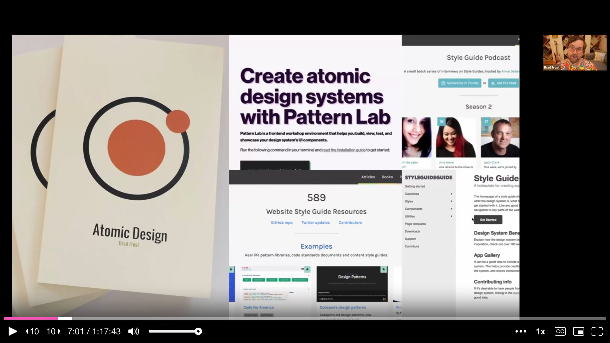

These three lenses serve as the backbone of a new course the team is building at **aianddesign.systems**, a living, breathing curriculum for navigating the AI-meets-design-systems moment.

---

## The Check Engine Light Problem

TJ Pitre introduces a metaphor that anchors the first half of the talk: the **check engine light**. Most organizations have a design system that mostly works. The car is running. But the check engine light has been on for a while, and nobody knows whether the gas cap is open or the alternator is about to die. Drift accumulates silently -- in tokens, components, metadata, layer names -- until something breaks expensively.

On the development side, TJ notes, there are **endless quality gates**: linters, unit tests, regression tests, end-to-end tests with Playwright, pull request reviews, CI pipelines. Code cannot make it to production without passing through multiple checkpoints. On the design side? Almost nothing. The tedious, under-the-hood stuff that catches drift before it drifts too far simply does not exist in most design workflows. That gap is where **FigmaLint** was born.

---

## FigmaLint: Automated Design Quality Gates

TJ built **FigmaLint** out of necessity. As an agency, Southleft regularly inherits Figma files from partner design teams before the development handoff. Those files often look beautiful on the surface but are riddled with problems underneath: buttons that are not actually components, hard-coded values instead of tokens, missing metadata, generic layer names like "Frame 47."

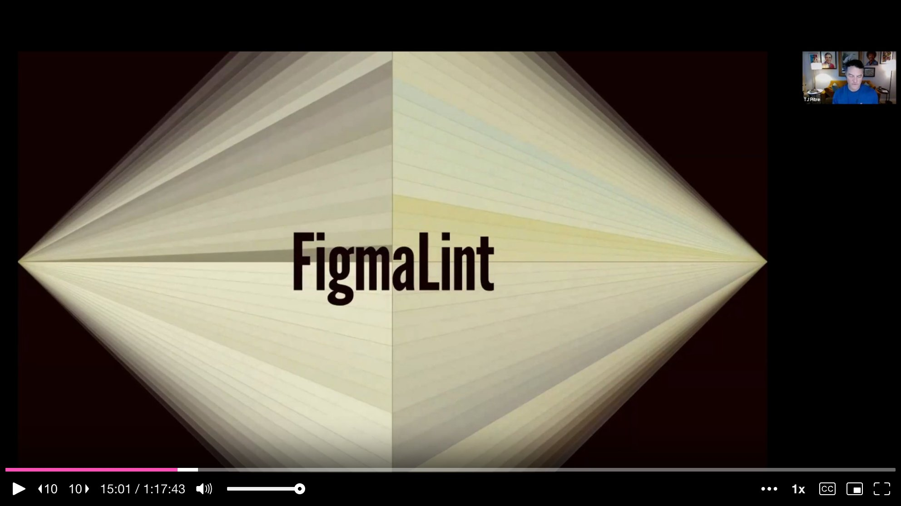

The plugin runs a **two-part analysis**. The first part is deterministic: it crawls through every component in a selection, checks properties, metadata, token usage, layer names, and interactive states against a set of rules. The second part is AI-powered: it runs the component through a **Design Systems Assistant MCP** that contains the major public design systems -- Polaris, Spectrum, Lightning, Carbon -- and pattern-matches against best practices.

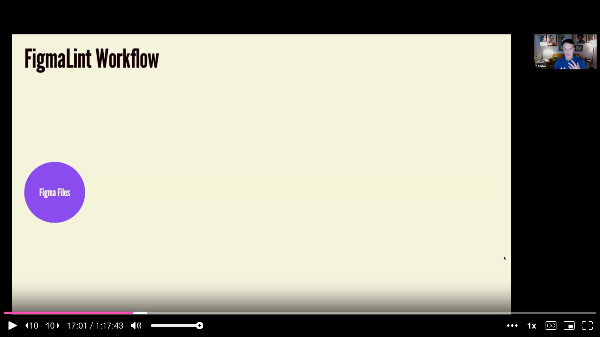

In the live demo, TJ selects a button component set that looks polished on the surface. FigmaLint gives it a score of **26 out of 100**. The breakdown is brutal: only 18 of 69 expected tokens are used, leaving 51 hard-coded values. There are 40 generic layer names. The component description field is empty. Touch targets and focus states pass, but the overall state is not ready for development.

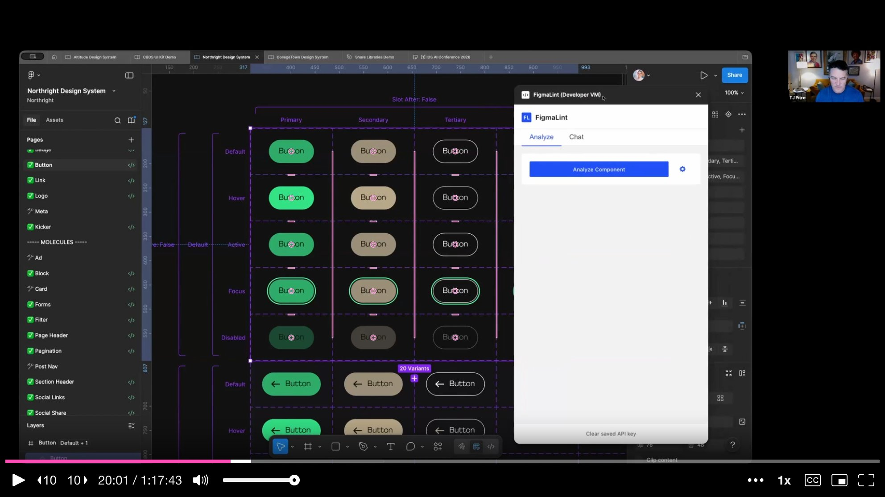

The AI interpretation section tells the designer what the component looks like from the perspective of an AI that needs to translate it into code: what reads well, what is confusing, and what would need to be added before the component is **AI-ready** or **MCP-ready**. It also pulls description suggestions from the best-practices library, though TJ stresses that the human part -- writing the actual purpose and intent -- is irreplaceable.

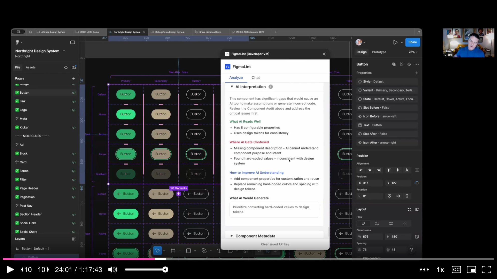

TJ then demonstrates the **fix-all** workflow. Instead of manually correcting each issue, he batch-fixes all 40 generic layer names, all 51 hard-coded token values, and adds the component description. He re-runs the analysis. The score jumps to **100 out of 100**. FigmaLint is not just an analysis tool -- it is a tool that **catches drift before it drifts too far** and automates the fixes.

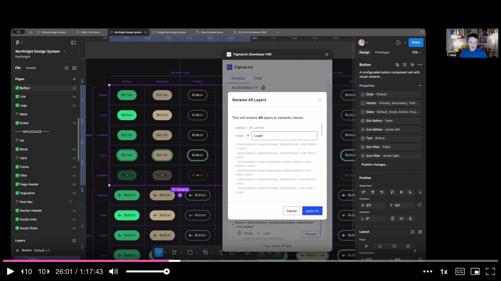

---

## Design-to-Code Parity Checks

TJ then introduces a deeper capability of **Figma Console MCP**: running a **code parity check** between a Figma component and its coded counterpart. The idea is straightforward -- pick a component in Figma, pick the same component in code, and measure exactly how far one has drifted from the other.

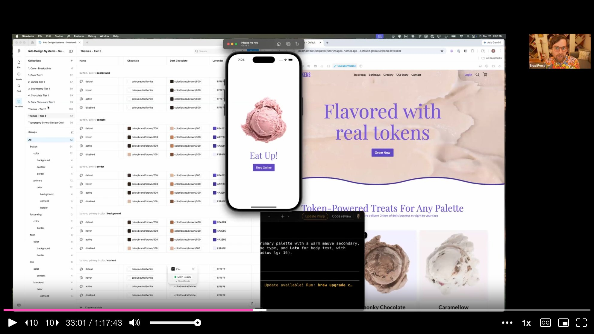

The critical insight is that the **canonical source of truth is flexible**. Sometimes design leads; sometimes code leads. What matters is knowing which direction to sync and having tooling to measure the gap. After a parity check, the tool offers multiple action paths: leave a **Figma comment** for the designer, file a **GitHub issue** for the developer, or just tell the AI to fix it directly. The right action depends on your role and your team's workflow.

TJ emphasizes that these tools are meant to **foster communication, not replace it**. He shares the mental image of Spider-Man holding the two halves of the Staten Island ferry together -- that is what Figma Console MCP is trying to do between design and engineering.

---

## Connected Ecosystems: The Lavender Theme Demo

Ian Frost takes over to demonstrate the **connected product ecosystem** that becomes possible when design tokens, Figma, Storybook, and application code are properly wired together. The demo starts with a course project -- an ice cream shop application -- running simultaneously in Figma, Storybook, and a React Native app.

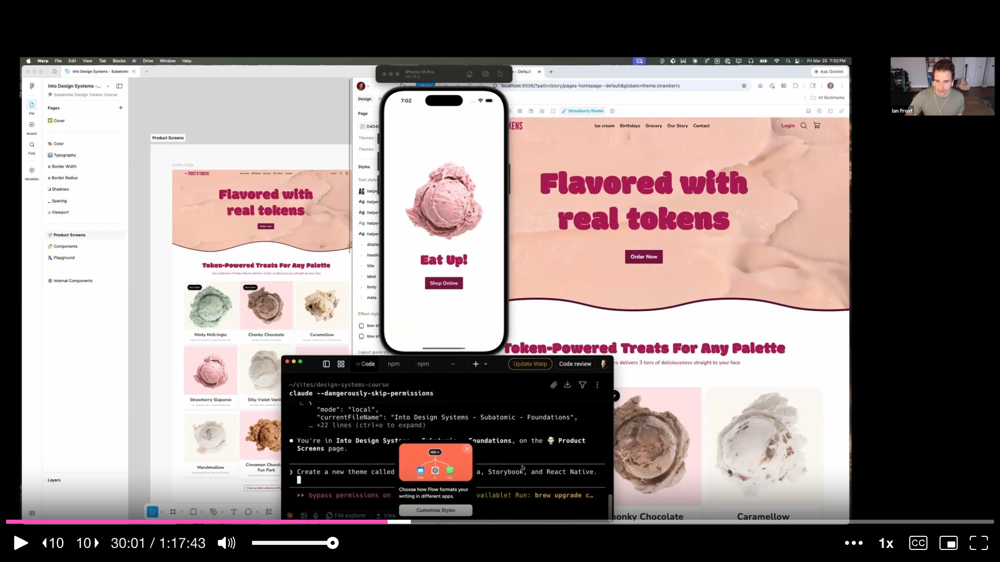

The audience suggests "lavender" as a new ice cream flavor theme. Ian types a single prompt into Claude Code: **"Create a new theme called lavender within Figma, Storybook, and React Native."** The AI picks fonts, generates a color palette, builds a new design token theme in code, and pushes lavender variables into the Figma file -- all in a matter of minutes.

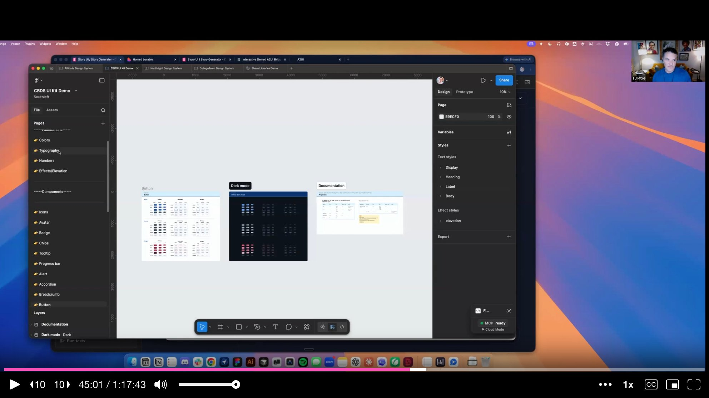

Brad jumps in to contextualize what just happened. For years, rolling out an additional theme -- dark mode, a rebrand, a seasonal variant -- has been a **multi-million dollar affair** at large organizations. It required manually updating every variable in Figma, changing JSON tokens in code, coordinating across teams. What they just demonstrated is the ability to snap your fingers and roll out a new mode across an entire connected product ecosystem, because the **schemas and systems are already in place**.

---

## Cross-Library Component Pulling

TJ returns to demonstrate another capability of Figma Console MCP: **pulling components from multiple shared libraries** onto a single canvas. He prompts the tool to grab the button component from four different published Figma libraries, place them on a shared page, and label each one by source.

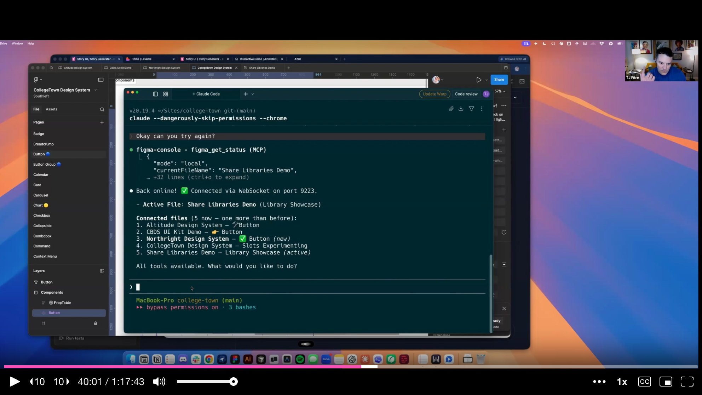

The tool navigates between files, searches each library, pulls the correct component instance, and drops them side by side with labels. When TJ clicks each button on the resulting canvas, the properties panel shows the correct source library and all inherited properties. This capability matters enormously for enterprise teams managing **parent themes and child themes** with shared components that need to stay aligned across multiple systems.

---

## Story UI: AI-Powered Storybook Generation

The final tool demo is **Story UI**, a Storybook panel that uses AI to generate component stories on demand. TJ explains its origin in a classic agency problem: **estimation**. When estimating the cost of building a design system, foundational components are predictable. But composed structures -- recipes, layouts, pages -- have potentially infinite variations. A search page at zero results, with faceted filters, with pagination, without pagination, with a million results. If you charge per variation, scope can blow.

Story UI solves this by leveraging the **context-based design system** workflow. Because every component in Storybook already has rich context -- purpose, constraints, usage rules, properties -- the AI can generate correct variations without hallucinating. TJ asks it to show all variations of a button component. Within seconds, it generates stories for every variant: filled, light, outline, subtle, default, gradient, transparent, white. Then sizes, colors, icon combinations, icon-only variants, states, full-width options, radius variants, button groups, and a complete inventory showcase.

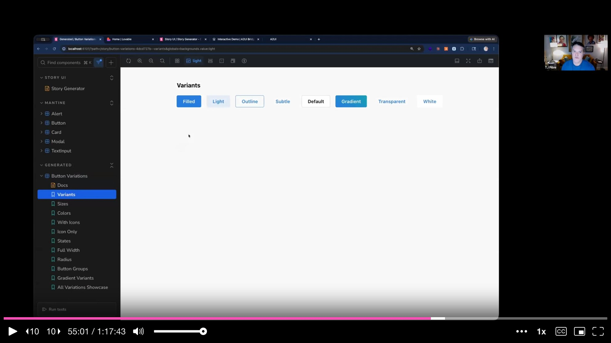

He then pushes further: "Create a basic card component for a lifestyle publication about surfing on the West Coast." Story UI does not just compose components mechanically -- it **infers intent** from the description, choosing teal and coastal blue colors, selecting appropriate imagery, and generating multiple layout options including an inset variant.

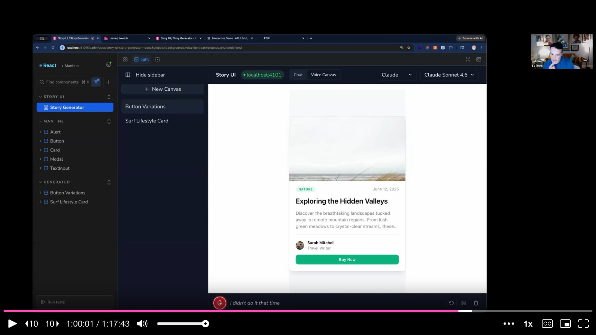

The most striking part is the **voice input** capability. TJ switches to speech-to-text and verbally instructs the tool to generate a card for a home for sale in New Orleans, then iteratively refines it by speaking commands to move elements and change button text. The tool processes the voice input, generates new stories, and updates the canvas in real time.

---

## The Future: No More Linear Processes

Brad returns to make the philosophical point that ties all the demos together. There is no right way of doing anything anymore. The linear progression -- from jQuery to React, from Sketch to Figma, from one process to the next -- is over. Everything is up in the air simultaneously.

He demonstrates this by **live-restyling the Into Design Systems conference website** using voice commands and their design token system. He scrapes Romina's talk transcript and asks the AI to generate a visual based on it -- a half hour of work done while building the presentation itself. He builds a Chrome plugin that replaces the styling of any website with his own design system. He nukes the visual clutter on Amazon to show only what matters. All of it is powered by design tokens, all of it is immediate, all of it was previously inconceivable.

The audience is not just watching someone use AI efficiently -- they are watching the **process itself dissolve**. Brad makes the point that the presentation they are watching was itself built live, with the AI generating slides as the speakers progressed. Even Keynote has been rebuilt.

---

## What Is All This For?

Brad zooms out one final time. He puts a single question on screen: **"What's all this for?"**

He speaks directly to the discomfort many practitioners feel watching AI produce in two minutes what takes them two weeks. The characters you type, the rectangles you draw -- those are not your value. Quoting Jared Spool, Brad reminds the audience that **design is the rendering of intent**. The question is not how fast we can render, but what we intend to build.

The tools, the JSON files, the MCPs, the markdown contracts, the flow charts -- all of it is plumbing. The question that matters is whether we use this plumbing to build things that make the world better. Design systems practitioners, Brad argues, are uniquely positioned to answer that question well. They are systems people who care about quality, who put infrastructure in place so that everyone benefits, who are wired for cooperation rather than self-preservation.

---

## Tying Your Shoes and Looking Up

Brad closes with a final metaphor. For the last decade, design systems practitioners have been **tying their shoes** -- heads down, meticulously making sure the left shoe matches the right, that tokens align, that components are consistent. It is time to finish tying those shoes, look up, and figure out where to go. There are big problems to solve, and the tools are finally powerful enough to tackle them.

The web community, Brad says, represents one of the **high water marks of human cooperation** -- a global network of people who share freely, contribute to open source, and model what it looks like to collaborate across borders and disciplines. In the words of conference organizer Sill: "Let's fucking go."

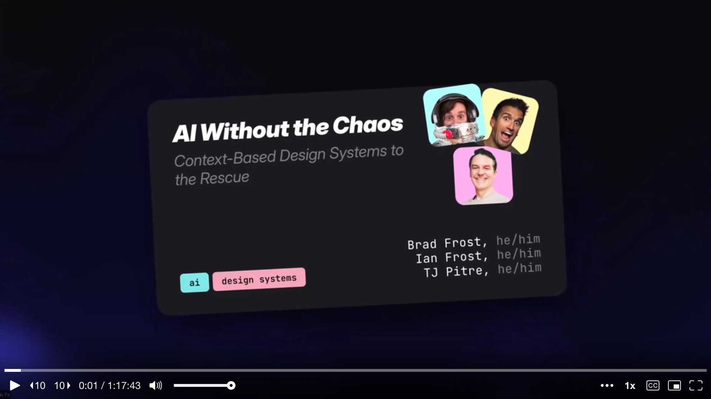

---

## Key Insights & Takeaways

**Use FigmaLint to catch design drift before it reaches development.** TJ's plugin runs a two-part analysis -- deterministic checks (tokens, metadata, layer names, interactive states) plus AI-powered pattern-matching against best-practice libraries. A polished-looking button scored 26/100 due to 51 hard-coded values and 40 generic layer names. After batch-fixing, it scored 100/100. If your design files look good on the surface but lack proper token bindings and metadata, you are shipping drift to every downstream consumer. Establish quality gates on the design side comparable to what already exists in code.

**Wire design tokens across Figma, Storybook, and application code to enable instant theming.** Ian demonstrated creating a "lavender" theme across the entire connected ecosystem with a single prompt. What used to be a multi-million dollar affair -- manually updating every variable in Figma, changing JSON tokens in code, coordinating across teams -- becomes a snap of the fingers when schemas and token systems are properly connected. If rolling out a new theme or dark mode is still a months-long project for your team, the bottleneck is your token infrastructure.

**Run design-to-code parity checks to measure exactly how far your system has drifted.** TJ's Figma Console MCP compares a Figma component with its coded counterpart and produces a scored report. The canonical source of truth can be flexible -- sometimes design leads, sometimes code leads -- but knowing which direction to sync and having tooling to measure the gap is what prevents silent divergence. After a parity check, the tool offers multiple action paths: Figma comment, GitHub issue, or direct AI fix.

**Use AI to generate component story variations on demand rather than hand-writing them.** Story UI leverages the rich context already present in Storybook components to generate correct variations without hallucinating -- every variant, size, color, icon combination, and state. This solves the agency estimation problem where composed structures have potentially infinite variations. Feed the AI your component context and let it generate the inventory; then curate what matters.

**Stop tying your shoes and look up -- the tools are powerful enough to tackle real problems now.** Brad's closing metaphor captures the moment: design systems practitioners have spent a decade making sure the left shoe matches the right. The consistency infrastructure is mature. The question now is what you do with that foundation. Design systems plus AI is not about making tokens propagate faster -- it is about directing that power toward experiences that genuinely help people.
